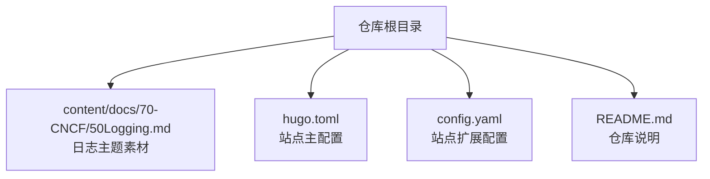
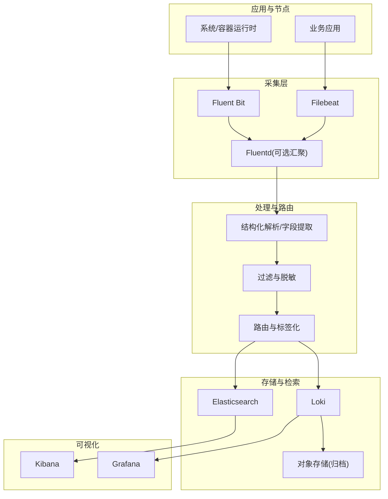
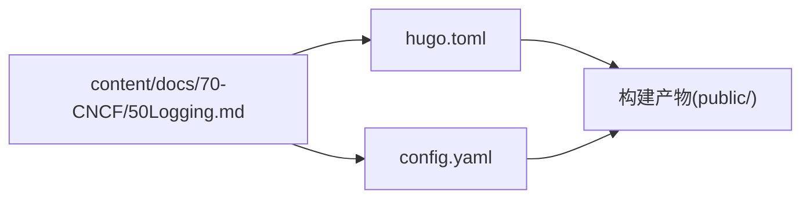

# 日志收集系统

<cite>
**本文引用的文件**   
- [README.md](file://README.md)
- [config.yaml](file://config.yaml)
- [hugo.toml](file://hugo.toml)
- [content/docs/70-CNCF/50Logging.md](file://content/docs/70-CNCF/50Logging.md)
</cite>

## 目录
1. [简介](#简介)
2. [项目结构](#项目结构)
3. [核心组件](#核心组件)
4. [架构总览](#架构总览)
5. [详细组件分析](#详细组件分析)
6. [依赖关系分析](#依赖关系分析)
7. [性能考虑](#性能考虑)
8. [故障排查指南](#故障排查指南)
9. [结论](#结论)
10. [附录](#附录)

## 简介
本技术指南面向构建企业级日志收集系统的工程师与运维人员，围绕Fluentd、Loki、ELK Stack等主流方案，系统性阐述采集架构设计、轻量采集器部署策略、结构化处理与路由规则、索引与查询、集群与分片、存储生命周期与安全合规等关键主题。文档以“从概念到落地”的方式组织内容，帮助读者快速建立完整知识框架并指导工程实践。

## 项目结构
仓库为基于Hugo的静态站点源码，包含文档内容与站点配置。与日志主题相关的原始素材位于 content/docs/70-CNCF/50Logging.md；站点构建与国际化配置位于 hugo.toml 与 config.yaml；仓库说明位于 README.md。

**图表来源**
- [content/docs/70-CNCF/50Logging.md](file://content/docs/70-CNCF/50Logging.md)
- [hugo.toml](file://hugo.toml)
- [config.yaml](file://config.yaml)
- [README.md](file://README.md)

**章节来源**
- [README.md](file://README.md)
- [config.yaml](file://config.yaml)
- [hugo.toml](file://hugo.toml)
- [content/docs/70-CNCF/50Logging.md](file://content/docs/70-CNCF/50Logging.md)

## 核心组件
本节概述日志体系中的关键角色与职责，便于后续深入展开：
- 采集层：Filebeat、Fluent Bit、Fluentd（可作汇聚/转发）
- 处理层：字段提取、结构化解析、过滤与路由
- 存储层：Elasticsearch（ES）、Loki（对象存储+TSDB）
- 检索与可视化：Kibana、Grafana
- 安全与治理：访问控制、审计、数据脱敏、保留策略

[本节为概念性概述，不直接分析具体文件]

## 架构总览
下图展示典型的多栈日志架构：端侧采集器将日志统一汇聚至中间层，再按策略分发至不同后端（ES或Loki），并通过可视化平台进行检索与分析。

[本图为概念性架构图，未映射到具体源文件，故不提供图表来源]

## 详细组件分析

### Fluentd 生态与定位
- 适用场景：复杂ETL、插件生态丰富、跨语言适配能力强
- 优势：插件体系完善、社区活跃、支持多种输入输出
- 注意：资源占用相对更高，适合汇聚层或边缘聚合节点

[本节为通用知识，不直接分析具体文件]

### Loki 索引机制、查询语法与成本优化
- 索引机制：Loki采用流式索引（Stream Labels）而非全文倒排，降低存储与查询成本
- 查询语法：使用LogQL，支持向量式聚合、时间窗口、正则匹配与多指标关联
- 成本优化要点：
  - 精简标签维度，避免高基数字段作为标签
  - 合理设置压缩与分块大小，平衡查询延迟与存储开销
  - 冷热分层：热数据驻留SSD，冷数据下沉对象存储
  - 查询裁剪：限定时间范围与标签选择集，减少扫描面

[本节为通用知识，不直接分析具体文件]

### ELK Stack 集群部署、分片策略与性能调优
- 集群部署：协调节点、数据节点、主节点分离；网络分区与脑裂防护
- 分片策略：按时间滚动索引、合理设置主副分片数、避免过度分片
- 性能调优：
  - JVM堆与GC参数调优
  - 写入路径I/O优化（独立磁盘、预分配）
  - 查询缓存与刷新间隔权衡
  - 副本与一致性级别按需调整

[本节为通用知识，不直接分析具体文件]

### 轻量采集器部署策略（Filebeat、Fluent Bit）
- Filebeat：
  - 适合读取本地文件与容器stdout，低内存占用
  - 建议DaemonSet部署，结合命名空间与节点亲和
  - 输出直连ES或通过Fluentd中转
- Fluent Bit：
  - 极致轻量，适合边车模式或资源受限环境
  - 内置多输出与过滤器，适合边缘预处理
  - 与Loki集成良好，支持高效压缩与批处理

[本节为通用知识，不直接分析具体文件]

### 结构化处理、字段提取、过滤与路由
- 结构化处理：JSON优先；非结构化日志通过正则/多行合并/分隔符解析
- 字段提取：抽取服务名、主机、Pod、容器、TraceID等关键维度
- 过滤与脱敏：丢弃噪声日志、屏蔽敏感信息（如手机号、身份证）
- 路由规则：按环境、团队、重要性分级，分流至不同后端或保留策略

[本节为通用知识，不直接分析具体文件]

### 存储生命周期管理、冷热分离与归档
- 生命周期：定义热/温/冷阶段，自动迁移与删除
- 冷热分离：热数据用于在线检索，冷数据用于合规与审计
- 归档策略：按日/周/月滚动，压缩后落盘对象存储，保留期遵循合规要求

[本节为通用知识，不直接分析具体文件]

### 安全合规、访问控制与审计
- 传输加密：TLS端到端加密（采集器→汇聚→存储）
- 身份认证：基于证书/令牌的身份校验
- 访问控制：RBAC最小权限原则，按租户隔离
- 审计与合规：操作审计、数据访问审计、留存策略与脱敏

[本节为通用知识，不直接分析具体文件]

## 依赖关系分析
从仓库视角看，日志主题素材与站点配置相互独立，素材由Hugo在构建时渲染为页面。

**图表来源**
- [content/docs/70-CNCF/50Logging.md](file://content/docs/70-CNCF/50Logging.md)
- [hugo.toml](file://hugo.toml)
- [config.yaml](file://config.yaml)

**章节来源**
- [content/docs/70-CNCF/50Logging.md](file://content/docs/70-CNCF/50Logging.md)
- [hugo.toml](file://hugo.toml)
- [config.yaml](file://config.yaml)

## 性能考虑
- 采集端：批量发送、压缩、去重、限流与背压
- 汇聚端：水平扩展、连接池、缓冲队列与持久化
- 存储端：分片与副本均衡、热点规避、索引优化
- 查询端：缓存命中、查询裁剪、分页与游标

[本节为通用指导，不直接分析具体文件]

## 故障排查指南
- 采集丢日志：检查文件句柄、轮转、权限与路径匹配
- 解析失败：核对正则与字段映射，增加容错与默认值
- 路由异常：验证标签与条件表达式，确认目标集群可达
- 存储拥塞：观察分片分布、写入速率与GC停顿，必要时扩容或降采样
- 查询缓慢：缩小时间窗、减少高基数字段、启用缓存

[本节为通用指导，不直接分析具体文件]

## 结论
构建高性能、可扩展且安全的日志系统需要统筹采集、处理、存储与检索全链路。根据业务规模与成本约束选择合适的技术栈（Fluentd/Loki/ELK），配合严格的治理策略（结构化、脱敏、保留与审计），可在保障可观测性的同时实现总体拥有成本的最优化。

[本节为总结性内容，不直接分析具体文件]

## 附录
- 术语速查：
  - Stream Labels：Loki的流式索引键集合
  - LogQL：Loki的查询语言
  - DaemonSet：Kubernetes中每节点一个实例的工作负载类型
  - 分片/副本：ES索引的水平拆分与冗余复制
- 参考素材：
  - 日志主题素材：[content/docs/70-CNCF/50Logging.md](file://content/docs/70-CNCF/50Logging.md)
  - 站点配置：[hugo.toml](file://hugo.toml)、[config.yaml](file://config.yaml)
  - 仓库说明：[README.md](file://README.md)