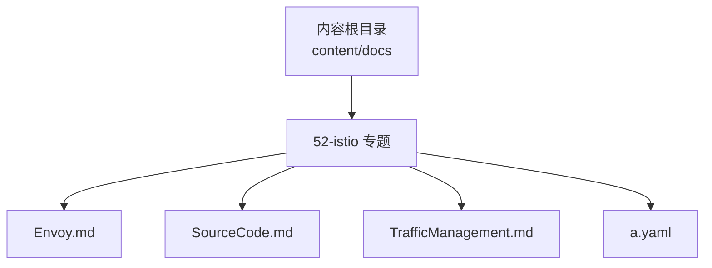
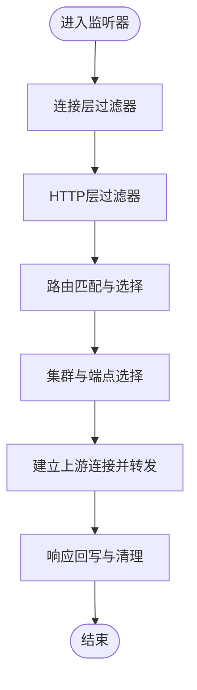
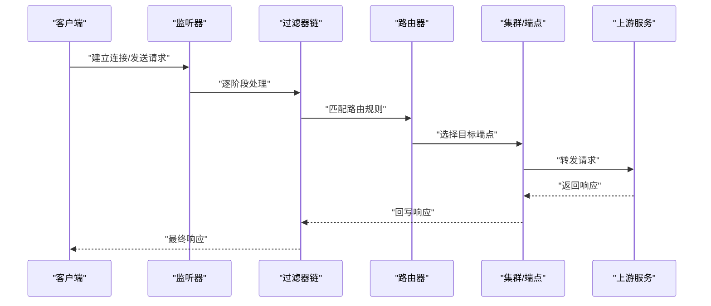
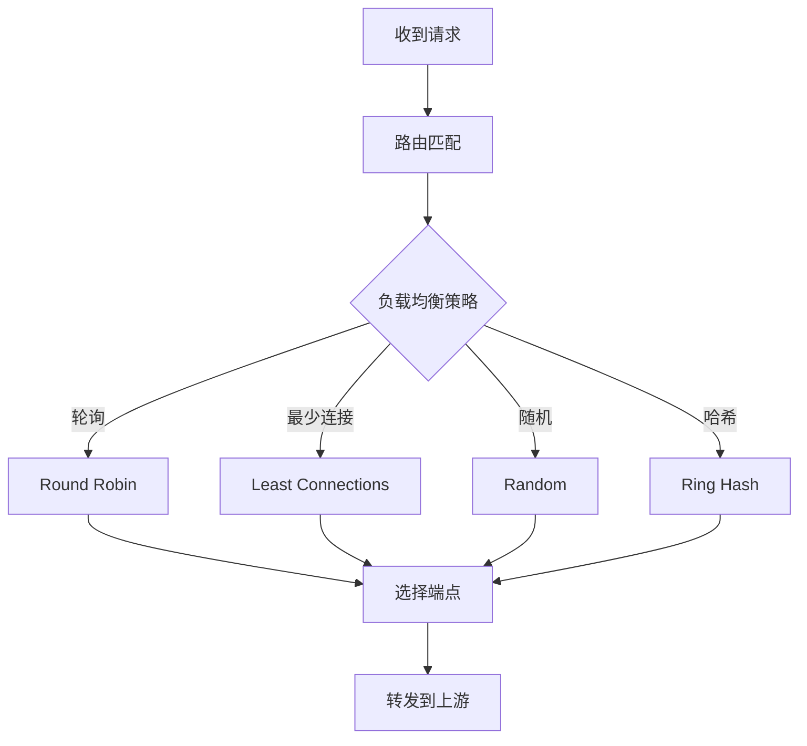
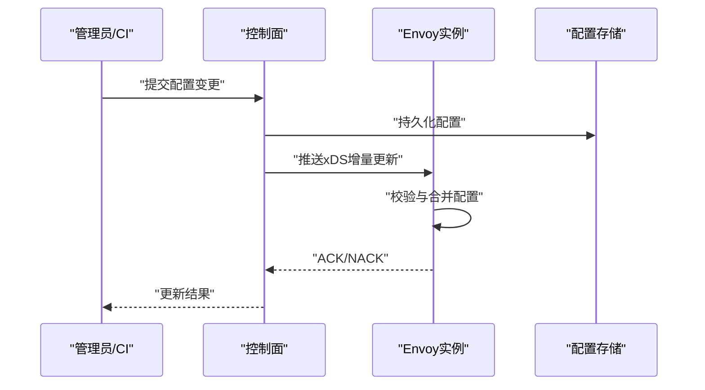
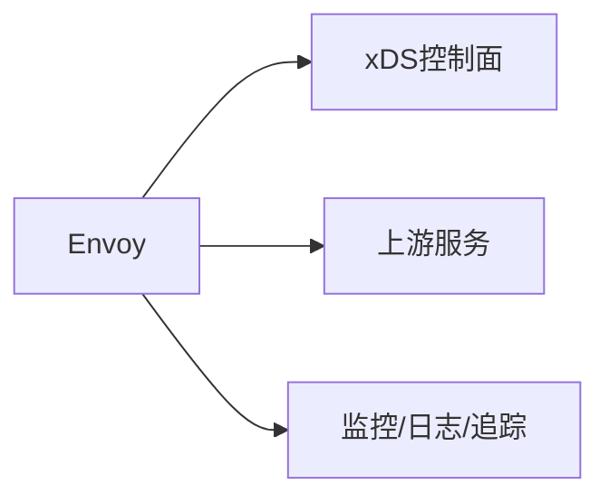

# Envoy代理深入解析

<cite>
**本文引用的文件**   
- [Envoy.md](file://content/docs/52-istio/Envoy.md)
- [SourceCode.md](file://content/docs/52-istio/SourceCode.md)
- [TrafficManagement.md](file://content/docs/52-istio/TrafficManagement.md)
- [a.yaml](file://content/docs/52-istio/a.yaml)
</cite>

## 目录
1. [简介](#简介)
2. [项目结构](#项目结构)
3. [核心组件](#核心组件)
4. [架构总览](#架构总览)
5. [详细组件分析](#详细组件分析)
6. [依赖关系分析](#依赖关系分析)
7. [性能考量](#性能考量)
8. [故障诊断指南](#故障诊断指南)
9. [结论](#结论)
10. [附录](#附录)

## 简介
本技术文档围绕Istio数据面核心组件Envoy进行深入解析，涵盖其架构设计、插件机制与过滤器链处理流程；系统梳理HTTP/TCP/UDP流量路径、连接管理、请求路由与负载均衡算法；阐述配置模型与动态更新机制；并提供性能调优参数与监控指标解读、实际部署案例与故障诊断方法，帮助开发者全面理解服务网格的数据面实现。

## 项目结构
仓库中与Envoy/Istio相关的资料主要位于内容目录的“52-istio”子目录下，包含：
- 概念与原理说明（如Envoy概述）
- 源码结构与关键入口定位
- 流量管理与控制面交互要点
- 示例配置文件（用于演示或参考）



**图表来源** 
- [Envoy.md](file://content/docs/52-istio/Envoy.md)
- [SourceCode.md](file://content/docs/52-istio/SourceCode.md)
- [TrafficManagement.md](file://content/docs/52-istio/TrafficManagement.md)
- [a.yaml](file://content/docs/52-istio/a.yaml)

**章节来源**
- [Envoy.md](file://content/docs/52-istio/Envoy.md)
- [SourceCode.md](file://content/docs/52-istio/SourceCode.md)
- [TrafficManagement.md](file://content/docs/52-istio/TrafficManagement.md)
- [a.yaml](file://content/docs/52-istio/a.yaml)

## 核心组件
本节聚焦于Envoy在Istio数据面中的关键角色与能力边界，包括：
- 高性能网络代理内核：事件驱动、单线程多路复用、零拷贝优化
- 过滤器链（Filter Chain）：按阶段装配的可插拔处理逻辑
- 监听器与路由：基于监听器（Listener）与虚拟主机（VirtualHost）的匹配与转发
- 集群与端点：服务发现、健康检查、负载均衡策略
- 统计与可观测性：内置指标导出、日志与追踪集成

上述能力在相关文档中均有系统性描述，便于读者从概念到落地逐步掌握。

**章节来源**
- [Envoy.md](file://content/docs/52-istio/Envoy.md)
- [TrafficManagement.md](file://content/docs/52-istio/TrafficManagement.md)

## 架构总览
下图展示Istio数据面中Envoy的典型位置与交互关系：Sidecar Envoy作为应用旁路代理，接收并处理进出Pod的流量，与控制面（如xDS）保持通信以获取动态配置，并将遥测数据上报至监控系统。

```mermaid
graph TB
subgraph "应用Pod"
App["业务应用进程"]
Sidecar["Sidecar Envoy"]
end
Control["控制面xDS等"]
Metrics["监控/日志/追踪系统"]
Upstream["上游服务/外部依赖"]
App < --> Sidecar
Sidecar < --> Control
Sidecar < --> Upstream
Sidecar --> Metrics
```

[此图为概念性架构图，不直接映射具体源文件，故无图表来源]

## 详细组件分析

### 过滤器链与处理阶段
Envoy通过过滤器链对请求进行分阶段处理，典型阶段包括：
- 连接层：TLS握手、访问控制、连接池管理
- HTTP层：路由匹配、头部修改、重试与熔断、鉴权与审计
- TCP/UDP层：透传、协议识别、简单ACL与限流

过滤器链的执行顺序由配置决定，形成“先入后出”的处理管道。



**章节来源**
- [Envoy.md](file://content/docs/52-istio/Envoy.md)
- [TrafficManagement.md](file://content/docs/52-istio/TrafficManagement.md)

### HTTP/TCP/UDP流量处理路径
- HTTP路径：监听器→HTTP过滤器链→路由→集群→上游服务
- TCP路径：监听器→TCP过滤器链→集群→上游服务
- UDP路径：监听器→UDP过滤器链→集群→上游服务

不同协议的差异主要体现在过滤器链内容与路由语义上，但整体遵循“监听器→过滤器→集群→上游”的统一抽象。



**章节来源**
- [TrafficManagement.md](file://content/docs/52-istio/TrafficManagement.md)

### 连接管理与生命周期
- 连接复用：HTTP/1.1、HTTP/2、gRPC等协议支持连接池与复用
- 超时与重试：全局与局部超时、重试预算与退避策略
- 健康检查：主动健康检查与被动失败探测，结合熔断与隔离
- 优雅关闭： draining 状态下的新连接拒绝与存量连接收尾

这些机制共同保障高可用与弹性伸缩。

**章节来源**
- [Envoy.md](file://content/docs/52-istio/Envoy.md)
- [TrafficManagement.md](file://content/docs/52-istio/TrafficManagement.md)

### 请求路由与负载均衡
- 路由：基于域名、路径、头部的匹配与权重分配
- 负载均衡：轮询、最少连接、随机、一致性哈希、区域感知等策略
- 故障域：拓扑感知、就近优先、跨区容灾
- 灰度发布：基于权重、镜像流量、A/B测试



**章节来源**
- [TrafficManagement.md](file://content/docs/52-istio/TrafficManagement.md)

### 配置模型与动态更新
- 静态配置：启动时加载的基础配置（监听器、集群、过滤器等）
- 动态配置：通过xDS接口（CDSC/LDSC/RDS/CDS/EDS）实时下发
- 热更新：在不重启进程的情况下完成配置变更
- 版本与回滚：配置版本化、校验与回滚策略



**章节来源**
- [SourceCode.md](file://content/docs/52-istio/SourceCode.md)
- [TrafficManagement.md](file://content/docs/52-istio/TrafficManagement.md)

### 插件机制与扩展点
- 内建过滤器：大量开箱即用的HTTP/TCP过滤器
- 自定义过滤器：通过C++/Wasm扩展点注入业务逻辑
- 运行时配置：部分行为可通过运行时键值动态调整
- 统计钩子：在关键路径埋点，输出结构化指标

**章节来源**
- [Envoy.md](file://content/docs/52-istio/Envoy.md)
- [SourceCode.md](file://content/docs/52-istio/SourceCode.md)

### 示例配置参考
仓库中包含一个示例配置文件，可用于对照理解监听器、路由、集群等基础结构的组织方式。建议在实际使用中结合控制面下发的动态配置进行验证与调试。

**章节来源**
- [a.yaml](file://content/docs/52-istio/a.yaml)

## 依赖关系分析
Envoy在Istio数据面中的依赖关系主要包括：
- 与控制面的xDS通信：用于动态获取监听器、路由、集群与端点信息
- 与上游服务的网络连接：基于连接池与负载均衡策略
- 与监控系统的对接：指标、日志、追踪数据的采集与上报



[此图为概念性依赖图，不直接映射具体源文件，故无图表来源]

**章节来源**
- [TrafficManagement.md](file://content/docs/52-istio/TrafficManagement.md)

## 性能考量
- I/O模型：单线程事件循环、零拷贝、内存池减少GC压力
- 连接复用：合理设置最大并发与连接池大小，避免过度创建
- 超时与重试：根据SLA设定合理的超时与重试预算，防止雪崩
- 缓存与压缩：按需启用响应缓存与压缩，权衡CPU与带宽
- 指标采样：在高QPS场景下采用采样与聚合，降低上报开销

[本节为通用性能指导，不直接分析具体文件]

## 故障诊断指南
- 查看运行状态：使用管理端口与工具查询监听器、路由、集群与端点状态
- 过滤链调试：开启详细日志，定位过滤器执行顺序与异常分支
- 路由问题排查：核对域名、路径、头部匹配规则与权重配置
- 连接与超时：检查连接池、健康检查、超时与重试策略是否合理
- 指标与追踪：结合Prometheus/Grafana与分布式追踪链路，快速定位瓶颈

**章节来源**
- [Envoy.md](file://content/docs/52-istio/Envoy.md)
- [TrafficManagement.md](file://content/docs/52-istio/TrafficManagement.md)

## 结论
Envoy作为Istio数据面的核心，以其高性能、可扩展与强一致性的配置模型，为服务网格提供了稳定可靠的流量治理能力。通过理解其架构、过滤器链、路由与负载均衡机制，并结合动态配置与监控手段，开发者可以在复杂生产环境中实现精细化流量管控与高效排障。

[本节为总结性内容，不直接分析具体文件]

## 附录
- 术语速查：监听器、过滤器链、路由、集群、端点、xDS、Sidecar
- 实践建议：从小规模灰度开始，逐步扩大范围；配合自动化测试与回归验证
- 参考资料：仓库中“52-istio”目录下的各篇文档可作为进一步学习的起点

[本节为补充信息，不直接分析具体文件]