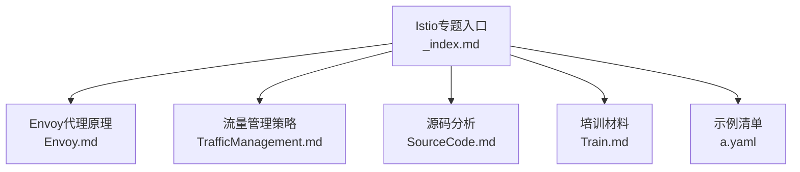
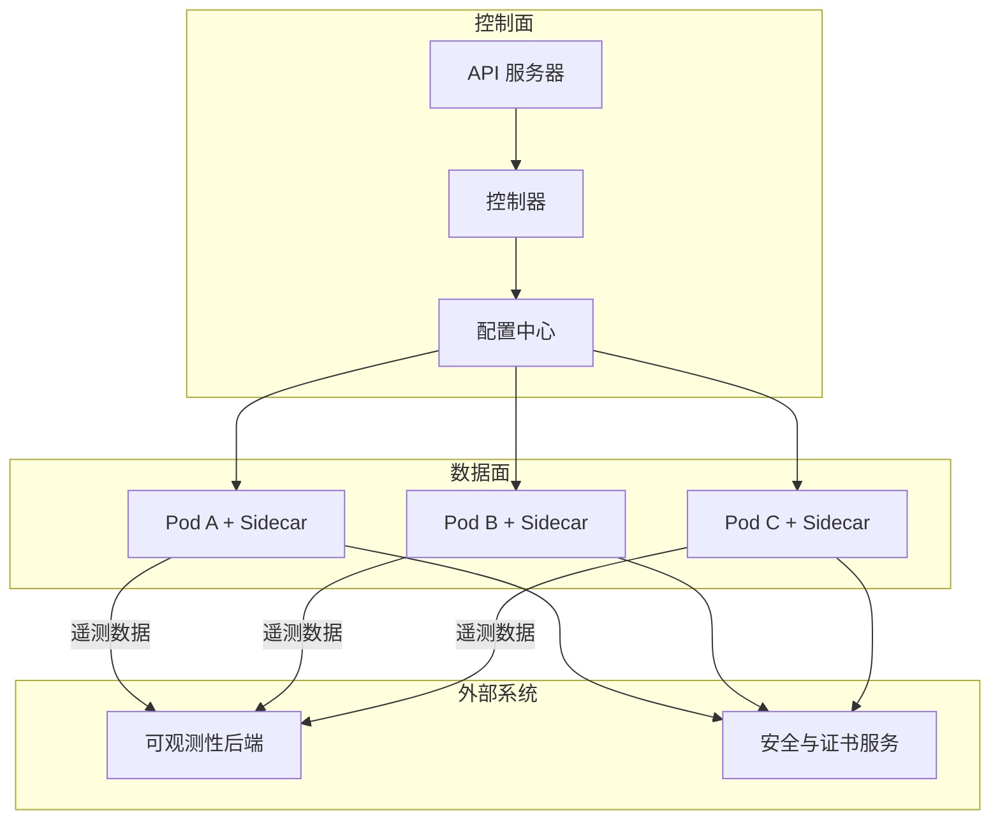
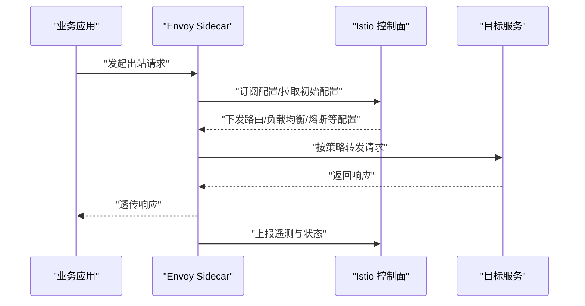
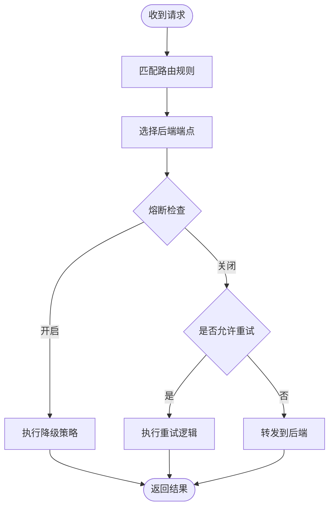
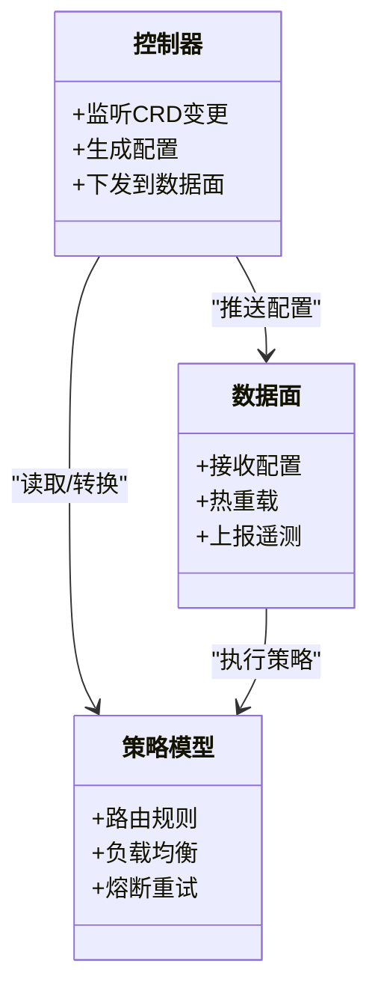
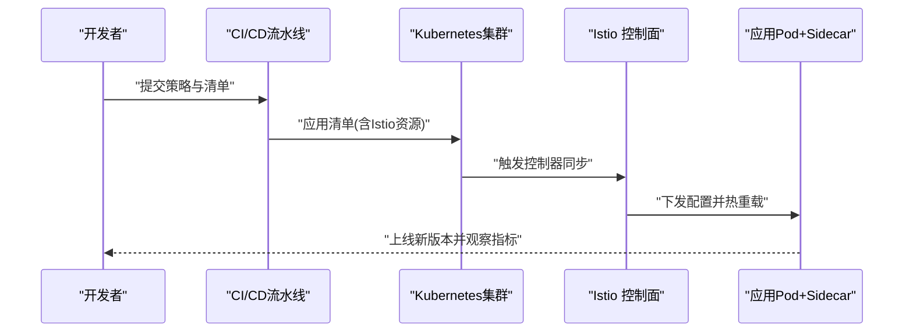
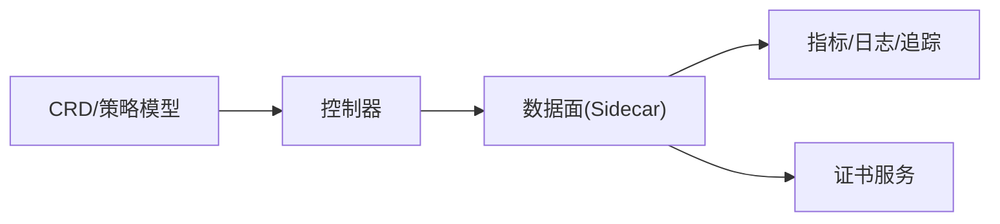

# Istio服务网格

<cite>
**本文引用的文件**   
- [content/docs/52-istio/_index.md](file://content/docs/52-istio/_index.md)
- [content/docs/52-istio/Envoy.md](file://content/docs/52-istio/Envoy.md)
- [content/docs/52-istio/TrafficManagement.md](file://content/docs/52-istio/TrafficManagement.md)
- [content/docs/52-istio/SourceCode.md](file://content/docs/52-istio/SourceCode.md)
- [content/docs/52-istio/Train.md](file://content/docs/52-istio/Train.md)
- [content/docs/52-istio/a.yaml](file://content/docs/52-istio/a.yaml)
</cite>

## 目录
1. [简介](#简介)
2. [项目结构](#项目结构)
3. [核心组件](#核心组件)
4. [架构总览](#架构总览)
5. [详细组件分析](#详细组件分析)
6. [依赖关系分析](#依赖关系分析)
7. [性能考虑](#性能考虑)
8. [故障诊断指南](#故障诊断指南)
9. [结论](#结论)
10. [附录](#附录)

## 简介
本章节面向希望系统掌握Istio服务网格的读者，围绕数据面与控制面、流量管理策略、源码结构与实战案例展开。文档基于仓库中Istio专题内容整理，旨在帮助开发者理解服务网格的核心概念与实现机制，并在生产环境中进行部署、调优与排障。

## 项目结构
仓库采用Hugo静态站点组织文档，Istio相关内容位于 content/docs/52-istio 目录下，包含概览、Envoy原理、流量管理、源码分析与培训材料等页面，并附带一个示例清单文件用于演示资源编排。

**图表来源** 
- [content/docs/52-istio/_index.md](file://content/docs/52-istio/_index.md)
- [content/docs/52-istio/Envoy.md](file://content/docs/52-istio/Envoy.md)
- [content/docs/52-istio/TrafficManagement.md](file://content/docs/52-istio/TrafficManagement.md)
- [content/docs/52-istio/SourceCode.md](file://content/docs/52-istio/SourceCode.md)
- [content/docs/52-istio/Train.md](file://content/docs/52-istio/Train.md)
- [content/docs/52-istio/a.yaml](file://content/docs/52-istio/a.yaml)

**章节来源**
- [content/docs/52-istio/_index.md](file://content/docs/52-istio/_index.md)

## 核心组件
本节从控制面与数据面两个维度梳理Istio的关键组件及其职责：
- 控制面
  - 负责配置下发、状态收集、策略决策与全局视图维护。
  - 通过API对象定义期望状态，由控制器持续收敛至实际状态。
- 数据面
  - 以Sidecar形式注入到业务Pod，透明拦截进出流量，执行路由、负载均衡、熔断、重试、限流、可观测性采集与安全传输等能力。
- 关键交互
  - 控制面将策略转换为数据面可执行的配置，并通过gRPC通道推送给各数据面实例。
  - 数据面周期性上报运行时指标与状态，供控制面聚合展示与告警。

**章节来源**
- [content/docs/52-istio/_index.md](file://content/docs/52-istio/_index.md)

## 架构总览
下图展示了Istio在Kubernetes环境中的典型部署形态：控制面组件集中部署，数据面以Sidecar方式随应用Pod运行，二者通过标准协议交互，形成声明式治理体系。

[此图为概念性架构图，不直接映射具体源文件，故不提供图表来源]

## 详细组件分析

### Envoy代理工作原理
- 角色定位
  - 作为数据面的核心转发引擎，承担L4/L7流量处理、策略执行与遥测采集。
- 生命周期
  - 启动后向控制面建立连接，拉取初始配置；后续接收增量更新，热重载生效。
- 关键能力
  - 请求路由、负载均衡、熔断降级、重试、超时、限流、灰度发布、TLS终止与双向认证、访问日志与指标上报。
- 与Istio集成
  - 通过Istio提供的CRD与控制器生成Envoy配置，确保声明式策略一致落地。

**图表来源** 
- [content/docs/52-istio/Envoy.md](file://content/docs/52-istio/Envoy.md)

**章节来源**
- [content/docs/52-istio/Envoy.md](file://content/docs/52-istio/Envoy.md)

### 流量管理策略
- 请求路由
  - 基于域名、路径、Header、权重等进行精细化分流，支持A/B测试与金丝雀发布。
- 负载均衡
  - 提供多种算法（如随机、轮询、最少连接、一致性哈希），可按服务版本或标签选择端点。
- 熔断与降级
  - 依据错误率、延迟阈值、连接数等指标自动熔断，结合默认回退策略保障可用性。
- 重试与超时
  - 针对瞬时失败场景配置重试次数与退避策略，设置合理的超时边界避免雪崩。
- 高级特性
  - 流量镜像、速率限制、跨域策略、对外暴露与入站流量治理。

**图表来源** 
- [content/docs/52-istio/TrafficManagement.md](file://content/docs/52-istio/TrafficManagement.md)

**章节来源**
- [content/docs/52-istio/TrafficManagement.md](file://content/docs/52-istio/TrafficManagement.md)

### 源码分析要点
- 代码组织
  - 控制面与数据面各自模块清晰，遵循插件化与可扩展设计。
- 关键流程
  - CRD定义与控制器循环、配置生成与分发、数据面热更新与回滚。
- 扩展点
  - 自定义过滤器、策略插件、适配器接口，便于与企业现有系统集成。
- 调试与验证
  - 提供丰富的日志、指标与可视化界面，辅助问题定位与回归验证。

**图表来源** 
- [content/docs/52-istio/SourceCode.md](file://content/docs/52-istio/SourceCode.md)

**章节来源**
- [content/docs/52-istio/SourceCode.md](file://content/docs/52-istio/SourceCode.md)

### 培训材料与实战案例
- 微服务治理
  - 统一流量治理、版本演进与灰度发布实践。
- 可观测性
  - 指标、日志、链路追踪三位一体，构建端到端可观测体系。
- 安全认证
  - mTLS、身份绑定、权限最小化与密钥轮换策略。
- 演练步骤
  - 从安装、注入Sidecar、配置路由到压测与监控的全流程演练。

**图表来源** 
- [content/docs/52-istio/Train.md](file://content/docs/52-istio/Train.md)
- [content/docs/52-istio/a.yaml](file://content/docs/52-istio/a.yaml)

**章节来源**
- [content/docs/52-istio/Train.md](file://content/docs/52-istio/Train.md)
- [content/docs/52-istio/a.yaml](file://content/docs/52-istio/a.yaml)

## 依赖关系分析
- 组件耦合
  - 控制面对CRD与API对象强依赖，数据面对配置格式与协议有明确契约。
- 外部依赖
  - 与可观测性后端、证书服务、注册中心等存在集成点。
- 潜在风险
  - 配置风暴、热重载失败、证书过期、指标丢失等需纳入运维基线。

**图表来源** 
- [content/docs/52-istio/SourceCode.md](file://content/docs/52-istio/SourceCode.md)
- [content/docs/52-istio/Envoy.md](file://content/docs/52-istio/Envoy.md)

**章节来源**
- [content/docs/52-istio/SourceCode.md](file://content/docs/52-istio/SourceCode.md)
- [content/docs/52-istio/Envoy.md](file://content/docs/52-istio/Envoy.md)

## 性能考虑
- 资源规划
  - 合理分配CPU与内存配额，关注Sidecar与业务容器的资源隔离。
- 配置优化
  - 精简路由规则、减少不必要的过滤器链，降低转发时延。
- 缓存与复用
  - 利用连接池、HTTP/2多路复用提升吞吐。
- 监控与压测
  - 建立容量基线与SLO，定期压测验证扩容与降级策略有效性。

[本节为通用指导，不直接分析具体文件]

## 故障诊断指南
- 常见问题
  - Sidecar未注入、配置未生效、mTLS握手失败、路由命中异常、指标缺失。
- 排查步骤
  - 确认Pod注解与命名空间注入策略；查看控制面日志与事件；校验CRD语法与引用；使用工具抓取数据面配置快照与统计信息。
- 恢复建议
  - 回滚配置、重启Sidecar、修复证书与网络策略、逐步放量验证。

**章节来源**
- [content/docs/52-istio/Envoy.md](file://content/docs/52-istio/Envoy.md)
- [content/docs/52-istio/TrafficManagement.md](file://content/docs/52-istio/TrafficManagement.md)

## 结论
Istio通过声明式控制面与高性能数据面协同，为微服务提供了统一的流量治理、可观测性与安全能力。结合本文档的架构解析、源码要点与实战演练，团队可在生产环境中稳步落地服务网格，持续提升系统的稳定性与可维护性。

[本节为总结性内容，不直接分析具体文件]

## 附录
- 示例清单
  - 参考 a.yaml 了解典型Istio资源的编排方式与字段组合。
- 延伸阅读
  - 结合 Envoy.md 与 TrafficManagement.md 深入理解数据面行为与策略表达。
  - 通过 SourceCode.md 与 Train.md 推进源码级理解与工程化落地。

**章节来源**
- [content/docs/52-istio/a.yaml](file://content/docs/52-istio/a.yaml)
- [content/docs/52-istio/Envoy.md](file://content/docs/52-istio/Envoy.md)
- [content/docs/52-istio/TrafficManagement.md](file://content/docs/52-istio/TrafficManagement.md)
- [content/docs/52-istio/SourceCode.md](file://content/docs/52-istio/SourceCode.md)
- [content/docs/52-istio/Train.md](file://content/docs/52-istio/Train.md)