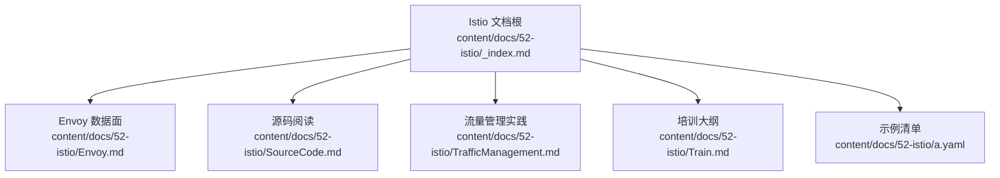
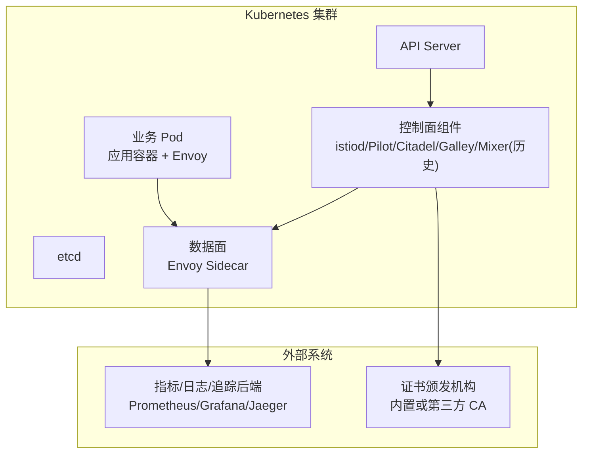
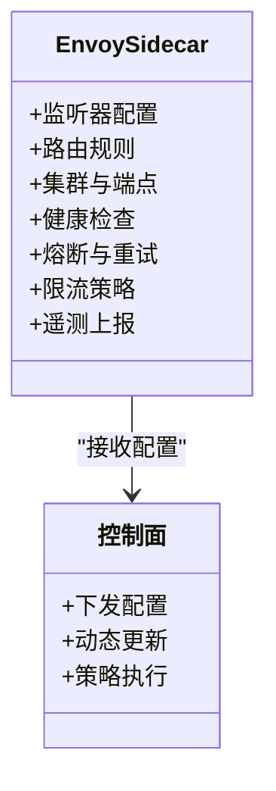
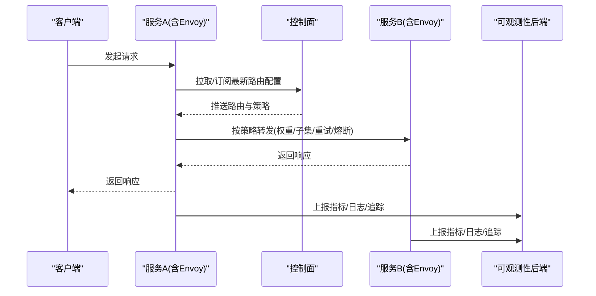
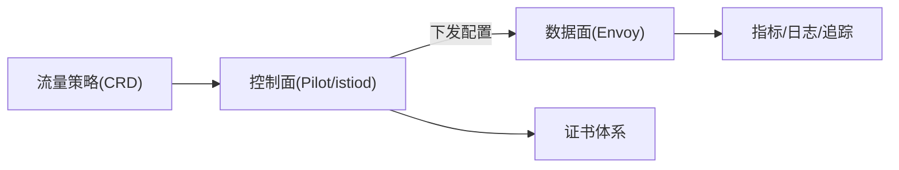

# 培训与实战指南

<cite>
**本文引用的文件**   
- [content/docs/52-istio/_index.md](file://content/docs/52-istio/_index.md)
- [content/docs/52-istio/Envoy.md](file://content/docs/52-istio/Envoy.md)
- [content/docs/52-istio/SourceCode.md](file://content/docs/52-istio/SourceCode.md)
- [content/docs/52-istio/TrafficManagement.md](file://content/docs/52-istio/TrafficManagement.md)
- [content/docs/52-istio/Train.md](file://content/docs/52-istio/Train.md)
- [content/docs/52-istio/a.yaml](file://content/docs/52-istio/a.yaml)
</cite>

## 目录
1. [简介](#简介)
2. [项目结构](#项目结构)
3. [核心组件](#核心组件)
4. [架构总览](#架构总览)
5. [详细组件分析](#详细组件分析)
6. [依赖关系分析](#依赖关系分析)
7. [性能考虑](#性能考虑)
8. [故障排除指南](#故障排除指南)
9. [结论](#结论)
10. [附录](#附录)

## 简介
本指南面向希望系统掌握 Istio 服务网格的开发者与运维工程师，提供从入门到精通的学习路径。内容覆盖安装部署、基础概念、核心功能实践（微服务通信、安全认证、可观测性、流量治理）、企业级部署案例与最佳实践，并配套循序渐进的实验环境与练习，帮助不同层次的读者快速上手与深入应用。

## 项目结构
仓库采用 Hugo Book 文档站点组织方式，Istio 相关内容集中在 content/docs/52-istio 目录下，包含：
- 概览入口：_index.md
- Envoy 数据面详解：Envoy.md
- 源码阅读指引：SourceCode.md
- 流量管理实践：TrafficManagement.md
- 培训大纲与学习路径：Train.md
- 示例清单：a.yaml

**图表来源** 
- [content/docs/52-istio/_index.md](file://content/docs/52-istio/_index.md)
- [content/docs/52-istio/Envoy.md](file://content/docs/52-istio/Envoy.md)
- [content/docs/52-istio/SourceCode.md](file://content/docs/52-istio/SourceCode.md)
- [content/docs/52-istio/TrafficManagement.md](file://content/docs/52-istio/TrafficManagement.md)
- [content/docs/52-istio/Train.md](file://content/docs/52-istio/Train.md)
- [content/docs/52-istio/a.yaml](file://content/docs/52-istio/a.yaml)

**章节来源**
- [content/docs/52-istio/_index.md](file://content/docs/52-istio/_index.md)
- [content/docs/52-istio/Envoy.md](file://content/docs/52-istio/Envoy.md)
- [content/docs/52-istio/SourceCode.md](file://content/docs/52-istio/SourceCode.md)
- [content/docs/52-istio/TrafficManagement.md](file://content/docs/52-istio/TrafficManagement.md)
- [content/docs/52-istio/Train.md](file://content/docs/52-istio/Train.md)
- [content/docs/52-istio/a.yaml](file://content/docs/52-istio/a.yaml)

## 核心组件
围绕 Istio 的关键能力，建议按以下模块组织学习与实验：
- 控制面与数据面
  - 控制面：Pilot、Citadel、Galley、Mixer（历史版本）或现代控制面组件（如 istiod）
  - 数据面：Envoy Sidecar 代理
- 核心能力域
  - 微服务通信：服务发现、负载均衡、重试、超时、熔断、连接池
  - 安全认证：mTLS、证书轮换、访问控制
  - 可观测性：指标、日志、分布式追踪
  - 流量治理：路由、灰度发布、A/B 测试、金丝雀、故障注入、限流
- 工程化与企业级
  - 多集群/多租户
  - 策略与合规
  - 容量规划与弹性伸缩
  - 升级与回滚策略

**章节来源**
- [content/docs/52-istio/Envoy.md](file://content/docs/52-istio/Envoy.md)
- [content/docs/52-istio/TrafficManagement.md](file://content/docs/52-istio/TrafficManagement.md)
- [content/docs/52-istio/SourceCode.md](file://content/docs/52-istio/SourceCode.md)

## 架构总览
下图展示 Istio 在 Kubernetes 中的典型部署形态与控制面/数据面交互关系。

**图表来源**
- [content/docs/52-istio/Envoy.md](file://content/docs/52-istio/Envoy.md)
- [content/docs/52-istio/TrafficManagement.md](file://content/docs/52-istio/TrafficManagement.md)
- [content/docs/52-istio/SourceCode.md](file://content/docs/52-istio/SourceCode.md)

## 详细组件分析

### 组件一：Envoy 数据面
- 职责
  - 作为 Sidecar 代理承载 L4/L7 流量处理
  - 实现负载均衡、重试、熔断、超时、连接池等通用能力
  - 采集遥测数据并上报
- 关键配置对象
  - Listener、Route、Cluster、Endpoint、HealthCheck、CircuitBreaker、RetryPolicy、Timeout、RateLimit
- 性能要点
  - 连接复用、HTTP/2、gRPC 透传
  - 资源限制与 CPU/内存配额
  - 热更新与零停机重启
- 排障要点
  - 查看 Envoy 统计与访问日志
  - 验证监听器与路由匹配
  - 检查健康检查与端点状态

**图表来源**
- [content/docs/52-istio/Envoy.md](file://content/docs/52-istio/Envoy.md)

**章节来源**
- [content/docs/52-istio/Envoy.md](file://content/docs/52-istio/Envoy.md)

### 组件二：流量管理
- 场景
  - 基于权重/子集的路由
  - 灰度发布与金丝雀
  - 故障注入与混沌演练
  - 速率限制与拥塞控制
- 关键流程
  - 客户端请求进入 Sidecar
  - 根据 VirtualService/DestinationRule 进行匹配与转发
  - 执行重试、超时、熔断、限流等策略
  - 记录遥测数据并上报

**图表来源**
- [content/docs/52-istio/TrafficManagement.md](file://content/docs/52-istio/TrafficManagement.md)

**章节来源**
- [content/docs/52-istio/TrafficManagement.md](file://content/docs/52-istio/TrafficManagement.md)

### 组件三：源码阅读与实践
- 目标
  - 理解控制面如何生成与下发配置
  - 掌握数据面配置模型与运行时行为
  - 定位问题与优化性能
- 建议路径
  - 先读高层设计与接口定义
  - 再聚焦关键路径（配置同步、事件驱动、缓存）
  - 结合最小可复现用例进行断点调试
- 产出
  - 源码笔记与流程图
  - 针对特定问题的补丁或优化建议

**章节来源**
- [content/docs/52-istio/SourceCode.md](file://content/docs/52-istio/SourceCode.md)

### 组件四：培训大纲与学习计划
- 阶段划分
  - 入门：环境准备、概念认知、第一个 ServiceMesh 应用
  - 进阶：安全、可观测性、高级流量治理
  - 专家：源码阅读、性能调优、企业级落地
- 实验设计
  - 每章配套一个可运行的实验
  - 提供预期结果与验证方法
  - 常见问题与排错步骤
- 评估方式
  - 小测验与实操考核
  - 项目式作业（灰度发布、全链路加密、可观测性看板）

**章节来源**
- [content/docs/52-istio/Train.md](file://content/docs/52-istio/Train.md)

### 组件五：示例清单与清单化交付
- 用途
  - 统一收集各章节所需的 YAML 清单
  - 便于一键部署与回归验证
- 建议结构
  - Namespace、Service、Deployment、VirtualService、DestinationRule、Gateway、Secret 等
  - 按场景分文件，命名清晰，注释完整

**章节来源**
- [content/docs/52-istio/a.yaml](file://content/docs/52-istio/a.yaml)

## 依赖关系分析
- 模块内聚与耦合
  - Envoy 数据面相对独立，主要依赖控制面下发的配置
  - 流量管理逻辑集中在控制面，通过 CRD 声明式配置
  - 可观测性与外部系统解耦，通过标准协议对接
- 外部依赖
  - 证书体系（内置或第三方 CA）
  - 指标/日志/追踪后端（Prometheus/Grafana/Jaeger 等）
- 风险点
  - 控制面单点与扩容
  - 数据面资源占用与网络栈开销
  - 配置变更引发的滚动生效与回滚

**图表来源**
- [content/docs/52-istio/Envoy.md](file://content/docs/52-istio/Envoy.md)
- [content/docs/52-istio/TrafficManagement.md](file://content/docs/52-istio/TrafficManagement.md)
- [content/docs/52-istio/SourceCode.md](file://content/docs/52-istio/SourceCode.md)

**章节来源**
- [content/docs/52-istio/Envoy.md](file://content/docs/52-istio/Envoy.md)
- [content/docs/52-istio/TrafficManagement.md](file://content/docs/52-istio/TrafficManagement.md)
- [content/docs/52-istio/SourceCode.md](file://content/docs/52-istio/SourceCode.md)

## 性能考虑
- 资源规划
  - 为 Sidecar 设置合理的 CPU/内存请求与限制
  - 控制面组件水平扩展与副本数规划
- 网络与协议
  - 启用 HTTP/2 与连接复用
  - 合理设置超时与重试次数，避免雪崩
- 可观测性采样
  - 对高吞吐服务降低采样率
  - 使用聚合与降采样减少存储压力
- 升级与回滚
  - 灰度升级控制面与数据面
  - 保留回滚窗口与快照

[本节为通用指导，不直接分析具体文件]

## 故障排除指南
- 常见症状
  - 服务间调用失败或延迟升高
  - mTLS 握手失败或证书过期
  - 路由不生效或权重异常
  - 指标缺失或追踪断链
- 排查步骤
  - 确认 Sidecar 已注入且运行正常
  - 检查控制面日志与配置下发状态
  - 验证 CRD 配置语法与匹配顺序
  - 查看 Envoy 统计与访问日志
  - 核对证书有效期与信任链
- 工具与命令
  - 使用 kubectl 查看 Pod/Service/CRD 状态
  - 抓取 Sidecar 日志与统计端口信息
  - 通过浏览器或 CLI 访问网关入口验证

**章节来源**
- [content/docs/52-istio/Envoy.md](file://content/docs/52-istio/Envoy.md)
- [content/docs/52-istio/TrafficManagement.md](file://content/docs/52-istio/TrafficManagement.md)

## 结论
通过“概念—实践—源码—企业级”的分层学习路径，配合丰富的实验与清单化交付，读者可以逐步掌握 Istio 的核心能力与工程化落地方法。建议在团队中建立标准化模板与最佳实践库，持续沉淀经验并反哺培训材料。

[本节为总结性内容，不直接分析具体文件]

## 附录
- 推荐前置知识
  - Kubernetes 基础（Pod/Service/Ingress/Gateway）
  - 网络与协议（TCP/UDP、HTTP/HTTPS、gRPC）
  - 可观测性基础（指标、日志、追踪）
- 参考资源
  - Istio 官方文档与博客
  - 社区案例与白皮书
  - 开源生态（Prometheus、Grafana、Jaeger、Cert-manager 等）

[本节为补充信息，不直接分析具体文件]