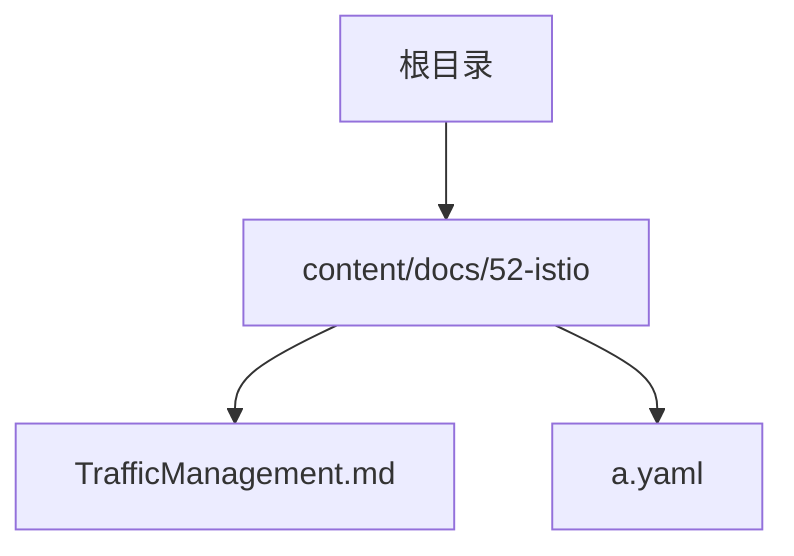
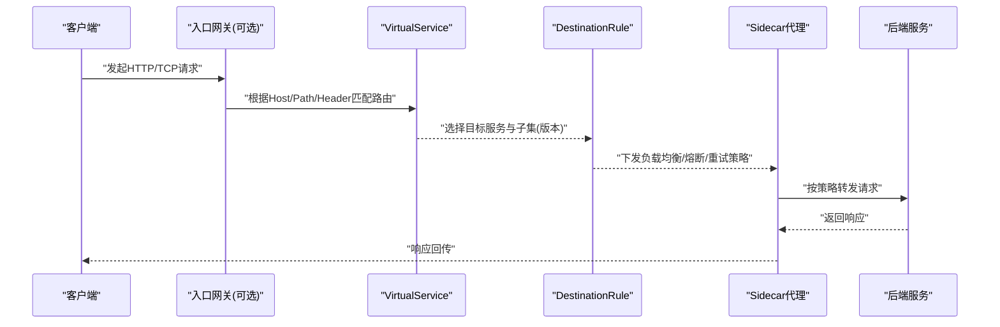
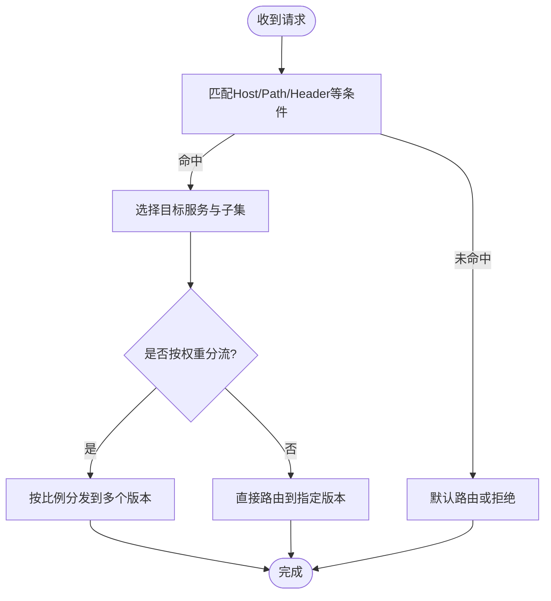
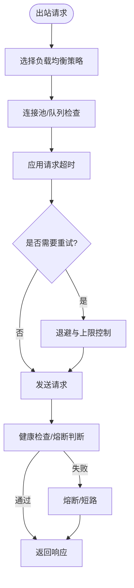
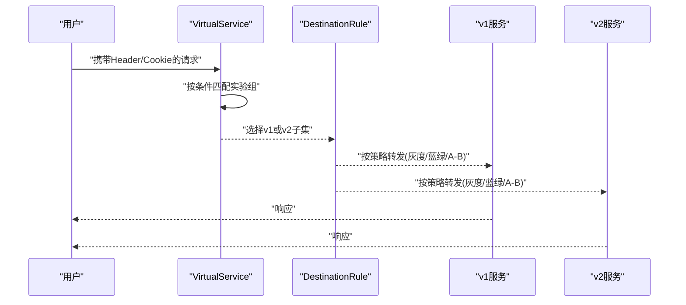
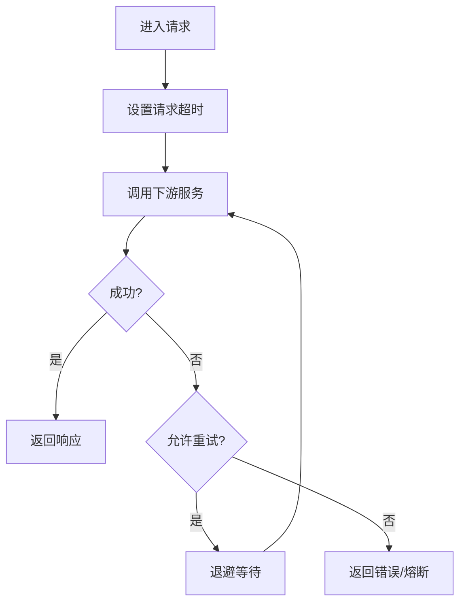

# 流量管理策略

<cite>
**本文引用的文件**   
- [TrafficManagement.md](file://content/docs/52-istio/TrafficManagement.md)
- [a.yaml](file://content/docs/52-istio/a.yaml)
</cite>

## 目录
1. [简介](#简介)
2. [项目结构](#项目结构)
3. [核心组件](#核心组件)
4. [架构总览](#架构总览)
5. [详细组件分析](#详细组件分析)
6. [依赖关系分析](#依赖关系分析)
7. [性能考量](#性能考量)
8. [故障排查指南](#故障排查指南)
9. [结论](#结论)
10. [附录](#附录)

## 简介
本技术文档围绕Istio服务网格的流量治理能力，聚焦VirtualService与DestinationRule两大资源对象，系统阐述请求路由、负载均衡、熔断降级、灰度发布、蓝绿部署、A/B测试、重试与超时等高级特性。文档提供基于仓库中现有示例的配置参考路径与实践建议，帮助读者快速落地并优化生产环境中的流量治理方案。

## 项目结构
本项目为Hugo静态站点，Istio相关内容位于content/docs/52-istio目录下，其中：
- TrafficManagement.md：流量管理主题文章，包含概念说明与配置示例引用
- a.yaml：示例YAML清单（如VirtualService/DestinationRule等）

图表来源
- [TrafficManagement.md](file://content/docs/52-istio/TrafficManagement.md)
- [a.yaml](file://content/docs/52-istio/a.yaml)

章节来源
- [TrafficManagement.md](file://content/docs/52-istio/TrafficManagement.md)
- [a.yaml](file://content/docs/52-istio/a.yaml)

## 核心组件
本节从“声明式配置”的角度梳理Istio流量治理的关键资源及其职责：
- VirtualService：定义HTTP/TCP/TLS流量的匹配规则与路由目标，支持按Header、URI、方法、权重等进行精细分流
- DestinationRule：定义目标服务的负载均衡策略、连接池、健康检查、熔断与重试等出站侧行为

在仓库中，相关示例与用法可参考：
- 概念与示例入口：[TrafficManagement.md](file://content/docs/52-istio/TrafficManagement.md)
- YAML清单示例：[a.yaml](file://content/docs/52-istio/a.yaml)

章节来源
- [TrafficManagement.md](file://content/docs/52-istio/TrafficManagement.md)
- [a.yaml](file://content/docs/52-istio/a.yaml)

## 架构总览
Istio通过Sidecar代理拦截服务间流量，依据控制面下发的VirtualService与DestinationRule实现动态流量治理。下图展示典型请求在网格中的处理流程：

图表来源
- [TrafficManagement.md](file://content/docs/52-istio/TrafficManagement.md)
- [a.yaml](file://content/docs/52-istio/a.yaml)

## 详细组件分析

### VirtualService：请求路由与分流
- 功能要点
  - 按域名、路径、方法、Header、Cookie等条件进行匹配
  - 将匹配到的请求路由至一个或多个目标服务，并可设置权重以实现灰度/AB测试
  - 支持重写、重定向、镜像流量等高级能力
- 常见场景
  - 灰度发布：将少量流量切到新版本的子集
  - A/B测试：按用户特征或Header分流到不同实验组
  - 蓝绿部署：将全部流量从旧版本切换到新版本
- 配置参考
  - 示例清单路径：[a.yaml](file://content/docs/52-istio/a.yaml)
  - 概念与用法说明：[TrafficManagement.md](file://content/docs/52-istio/TrafficManagement.md)

图表来源
- [TrafficManagement.md](file://content/docs/52-istio/TrafficManagement.md)
- [a.yaml](file://content/docs/52-istio/a.yaml)

章节来源
- [TrafficManagement.md](file://content/docs/52-istio/TrafficManagement.md)
- [a.yaml](file://content/docs/52-istio/a.yaml)

### DestinationRule：负载均衡、熔断与重试
- 功能要点
  - 负载均衡策略：随机、轮询、最少连接、一致性哈希等
  - 连接池与超时：最大连接数、队列长度、请求超时
  - 熔断与健康检查：基于错误率、延迟阈值触发熔断；TCP/HTTP健康检查
  - 重试与超时传播：对上游失败的重试次数、退避策略；透传超时上下文
- 常见场景
  - 保护下游：在高错误率或高延迟时自动熔断
  - 提升稳定性：合理重试幂等接口，避免雪崩
  - 精细化控制：按服务子集差异化策略
- 配置参考
  - 示例清单路径：[a.yaml](file://content/docs/52-istio/a.yaml)
  - 概念与用法说明：[TrafficManagement.md](file://content/docs/52-istio/TrafficManagement.md)

图表来源
- [TrafficManagement.md](file://content/docs/52-istio/TrafficManagement.md)
- [a.yaml](file://content/docs/52-istio/a.yaml)

章节来源
- [TrafficManagement.md](file://content/docs/52-istio/TrafficManagement.md)
- [a.yaml](file://content/docs/52-istio/a.yaml)

### 灰度发布、蓝绿部署与A/B测试
- 灰度发布
  - 使用VirtualService按权重将少量流量导向新版本子集，逐步放量
  - 结合DestinationRule为新版本子集配置更严格的熔断与重试策略
- 蓝绿部署
  - 通过切换VirtualService的目标子集，将全部流量从旧版本迁移至新版本
  - 配合健康检查与熔断，确保平滑切换
- A/B测试
  - 基于Header或Cookie将特定用户群体路由到实验版本
  - 结合指标观测评估实验效果

配置参考
- 示例清单路径：[a.yaml](file://content/docs/52-istio/a.yaml)
- 概念与用法说明：[TrafficManagement.md](file://content/docs/52-istio/TrafficManagement.md)

图表来源
- [TrafficManagement.md](file://content/docs/52-istio/TrafficManagement.md)
- [a.yaml](file://content/docs/52-istio/a.yaml)

章节来源
- [TrafficManagement.md](file://content/docs/52-istio/TrafficManagement.md)
- [a.yaml](file://content/docs/52-istio/a.yaml)

### 重试、超时与超时传播
- 重试
  - 针对幂等接口启用重试，设置最大重试次数与退避策略
  - 注意避免非幂等接口的重复执行风险
- 超时
  - 为每个请求设置合理的超时时间，防止长尾拖垮整体吞吐
- 超时传播
  - 在跨服务调用链中透传超时上下文，确保端到端SLA可控

配置参考
- 示例清单路径：[a.yaml](file://content/docs/52-istio/a.yaml)
- 概念与用法说明：[TrafficManagement.md](file://content/docs/52-istio/TrafficManagement.md)

图表来源
- [TrafficManagement.md](file://content/docs/52-istio/TrafficManagement.md)
- [a.yaml](file://content/docs/52-istio/a.yaml)

章节来源
- [TrafficManagement.md](file://content/docs/52-istio/TrafficManagement.md)
- [a.yaml](file://content/docs/52-istio/a.yaml)

## 依赖关系分析
VirtualService与DestinationRule共同决定流量如何被路由与治理。二者通过服务名与子集名称建立关联，形成“路由→策略”的依赖链。

图表来源
- [TrafficManagement.md](file://content/docs/52-istio/TrafficManagement.md)
- [a.yaml](file://content/docs/52-istio/a.yaml)

章节来源
- [TrafficManagement.md](file://content/docs/52-istio/TrafficManagement.md)
- [a.yaml](file://content/docs/52-istio/a.yaml)

## 性能考量
- 合理设置超时与重试，避免级联放大
- 使用最少连接或一致性哈希降低热点与抖动
- 开启熔断以保护脆弱下游，缩短故障恢复时间
- 在灰度阶段逐步放量，结合监控指标动态调整权重
- 利用连接池参数限制并发，防止资源耗尽

## 故障排查指南
- 确认VirtualService匹配条件是否正确（Host/Path/Header）
- 检查DestinationRule的策略是否与目标子集一致
- 观察重试与熔断指标，定位异常比例与延迟峰值
- 验证超时设置是否过短导致误判失败
- 对比灰度前后的关键业务指标，评估变更影响

## 结论
通过VirtualService与DestinationRule的组合，Istio提供了强大的流量治理能力。结合灰度、蓝绿、A/B测试以及重试、超时、熔断等机制，可在保障稳定性的前提下实现安全高效的发布与演进。建议在变更过程中持续观测与调优，逐步完善策略以达到最佳的业务体验与系统韧性。

## 附录
- 示例清单路径：[a.yaml](file://content/docs/52-istio/a.yaml)
- 概念与用法说明：[TrafficManagement.md](file://content/docs/52-istio/TrafficManagement.md)