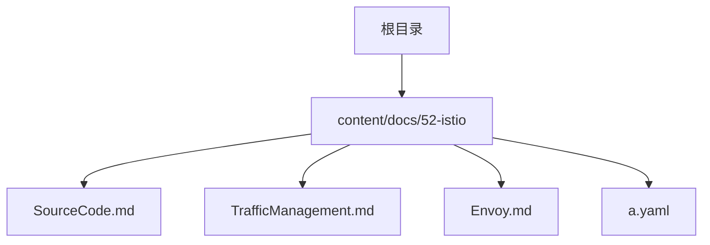
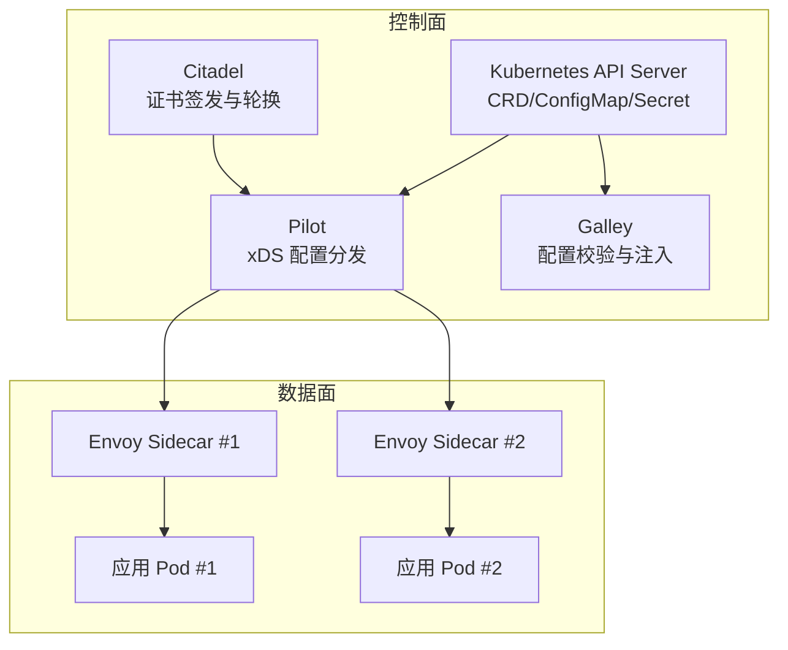
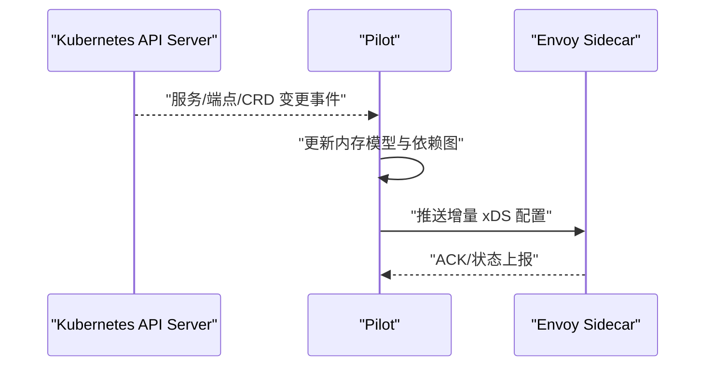
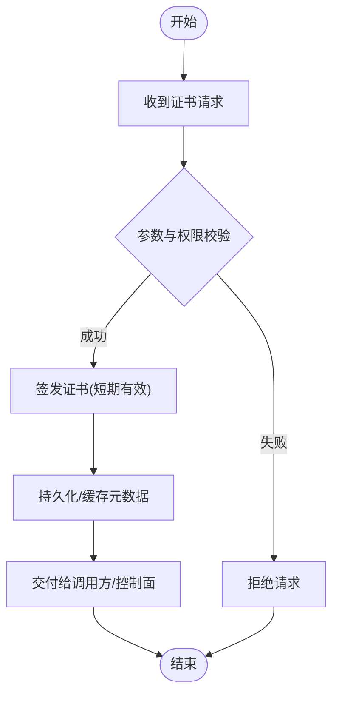
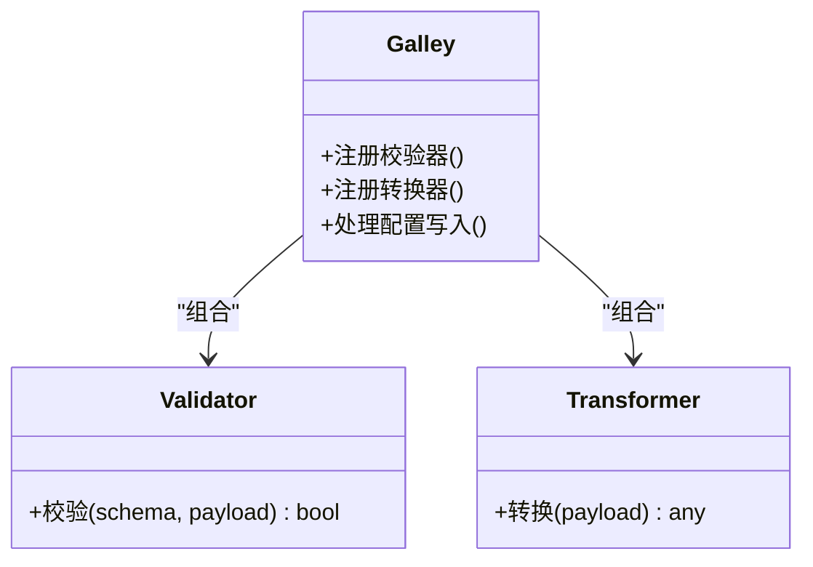
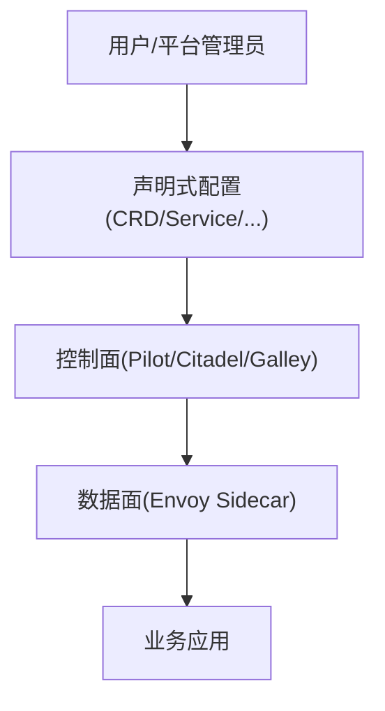
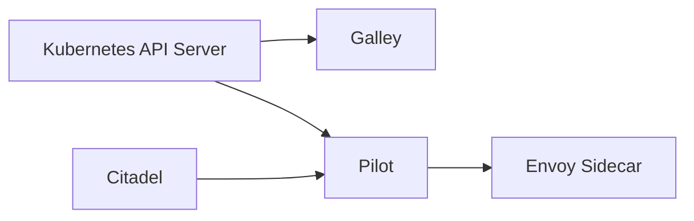

# 源码分析与架构

<cite>
**本文引用的文件**   
- [content/docs/52-istio/SourceCode.md](file://content/docs/52-istio/SourceCode.md)
- [content/docs/52-istio/TrafficManagement.md](file://content/docs/52-istio/TrafficManagement.md)
- [content/docs/52-istio/Envoy.md](file://content/docs/52-istio/Envoy.md)
- [content/docs/52-istio/a.yaml](file://content/docs/52-istio/a.yaml)
</cite>

## 目录
1. [简介](#简介)
2. [项目结构](#项目结构)
3. [核心组件](#核心组件)
4. [架构总览](#架构总览)
5. [详细组件分析](#详细组件分析)
6. [依赖分析](#依赖分析)
7. [性能考量](#性能考量)
8. [故障排查指南](#故障排查指南)
9. [结论](#结论)
10. [附录](#附录)

## 简介
本文件面向希望深入理解 Istio 控制面实现与二次开发的工程师，聚焦以下目标：
- 解析 Pilot、Citadel、Galley 等关键组件的设计模式与内部机制
- 解释服务发现、配置分发、证书管理的内部流程
- 介绍 Istio API 设计理念与 CRD 扩展机制
- 提供代码级架构图与关键流程图
- 给出二次开发指南与贡献最佳实践

说明：当前仓库为文档站点（Hugo），不包含 Istio 源码。因此本节与后续“架构总览”“详细组件分析”等为概念性内容，不直接映射到具体源码文件；仅在涉及本仓库内已有 Istio 文档时标注来源。

## 项目结构
该仓库采用 Hugo Book 主题组织文档，Istio 相关内容位于 content/docs/52-istio 目录下，包含源码概览、流量管理、Envoy 集成等页面。

图表来源
- [content/docs/52-istio/SourceCode.md](file://content/docs/52-istio/SourceCode.md)
- [content/docs/52-istio/TrafficManagement.md](file://content/docs/52-istio/TrafficManagement.md)
- [content/docs/52-istio/Envoy.md](file://content/docs/52-istio/Envoy.md)
- [content/docs/52-istio/a.yaml](file://content/docs/52-istio/a.yaml)

章节来源
- [content/docs/52-istio/SourceCode.md](file://content/docs/52-istio/SourceCode.md)
- [content/docs/52-istio/TrafficManagement.md](file://content/docs/52-istio/TrafficManagement.md)
- [content/docs/52-istio/Envoy.md](file://content/docs/52-istio/Envoy.md)
- [content/docs/52-istio/a.yaml](file://content/docs/52-istio/a.yaml)

## 核心组件
- Pilot（控制面）
  - 职责：聚合多源配置（Kubernetes CRD、ConfigMap、Secret 等），维护内存模型，向数据面 Envoy 推送 xDS 配置
  - 设计要点：事件驱动、增量推送、版本化与一致性保证
- Citadel（安全与证书）
  - 职责：签发与轮换工作负载证书，提供 mTLS 信任根与中间 CA
  - 设计要点：证书生命周期管理、密钥安全存储、跨命名空间信任域
- Galley（配置校验与注入）
  - 职责：对自定义资源进行 schema 校验、转换与注入逻辑编排
  - 设计要点：插件化校验器、Webhook 集成、配置流水线

说明：以上为概念性概述，用于帮助读者建立整体认知。

## 架构总览
下图展示控制面与数据面的典型交互关系，以及各组件的职责边界。

图表来源
- [content/docs/52-istio/SourceCode.md](file://content/docs/52-istio/SourceCode.md)
- [content/docs/52-istio/TrafficManagement.md](file://content/docs/52-istio/TrafficManagement.md)
- [content/docs/52-istio/Envoy.md](file://content/docs/52-istio/Envoy.md)

## 详细组件分析

### Pilot 组件分析
- 角色定位
  - 作为控制面中枢，负责将声明式配置转换为 Envoy 可消费的 xDS 配置并高效推送
- 关键流程
  - 监听 Kubernetes 事件（Service、Endpoint、CRD 变更）
  - 构建并维护内存中的服务拓扑与策略模型
  - 计算差异并增量推送至连接的 Envoy 实例
- 设计模式
  - 事件驱动与观察者模式：通过事件总线解耦采集与处理
  - 发布-订阅：按服务/命名空间维度订阅配置变更
  - 版本化与幂等：基于版本号确保客户端一致性与重放安全

图表来源
- [content/docs/52-istio/SourceCode.md](file://content/docs/52-istio/SourceCode.md)
- [content/docs/52-istio/TrafficManagement.md](file://content/docs/52-istio/TrafficManagement.md)

章节来源
- [content/docs/52-istio/SourceCode.md](file://content/docs/52-istio/SourceCode.md)
- [content/docs/52-istio/TrafficManagement.md](file://content/docs/52-istio/TrafficManagement.md)

### Citadel 组件分析
- 角色定位
  - 负责集群内工作负载的证书签发、轮换与信任根管理，支撑双向 TLS
- 关键流程
  - 接收来自工作负载或控制面的证书请求
  - 使用根/中间 CA 签发短期有效证书
  - 配合控制面将证书信息注入或下发给数据面
- 设计模式
  - 安全边界与最小权限：仅暴露必要接口
  - 异步签发与重试：保障高可用与容错
  - 可插拔后端：支持不同密钥存储与签名算法

图表来源
- [content/docs/52-istio/SourceCode.md](file://content/docs/52-istio/SourceCode.md)

章节来源
- [content/docs/52-istio/SourceCode.md](file://content/docs/52-istio/SourceCode.md)

### Galley 组件分析
- 角色定位
  - 提供配置资源的 schema 校验、转换与注入能力，提升配置正确性与一致性
- 关键流程
  - 注册校验器与转换器
  - 在配置写入前拦截并进行验证/转换
  - 将标准化后的配置转发给下游（如 Pilot）
- 设计模式
  - 插件化：以插件形式扩展校验与转换逻辑
  - 流水线：将校验、转换、注入串联为可组合的处理链

图表来源
- [content/docs/52-istio/SourceCode.md](file://content/docs/52-istio/SourceCode.md)

章节来源
- [content/docs/52-istio/SourceCode.md](file://content/docs/52-istio/SourceCode.md)

### 概念性总览
下图从概念层面总结控制面与数据面的协作关系，便于快速建立全局视角。

[本图为概念性示意，无需源码对应]

## 依赖分析
- 组件耦合
  - Pilot 强依赖 Kubernetes API 与内存模型，弱依赖 Citadel 提供的证书信息
  - Galley 与 Kubernetes API Server 紧密集成，输出标准化配置供下游消费
  - Citadel 独立运行，通过安全通道与控制面交互
- 外部依赖
  - Kubernetes API Server（CRD、ConfigMap、Secret）
  - gRPC/xDS 协议（Pilot 与 Envoy 通信）
  - 证书体系（CA/中间 CA/工作负载证书）

图表来源
- [content/docs/52-istio/SourceCode.md](file://content/docs/52-istio/SourceCode.md)
- [content/docs/52-istio/TrafficManagement.md](file://content/docs/52-istio/TrafficManagement.md)
- [content/docs/52-istio/Envoy.md](file://content/docs/52-istio/Envoy.md)

章节来源
- [content/docs/52-istio/SourceCode.md](file://content/docs/52-istio/SourceCode.md)
- [content/docs/52-istio/TrafficManagement.md](file://content/docs/52-istio/TrafficManagement.md)
- [content/docs/52-istio/Envoy.md](file://content/docs/52-istio/Envoy.md)

## 性能考量
- 增量推送与去抖：减少不必要的配置重推，降低数据面抖动
- 内存模型优化：按需加载与分区，避免单节点内存膨胀
- 连接复用与流控：gRPC 长连接与背压，防止雪崩
- 证书轮换策略：短有效期与平滑过渡，降低安全风险与重启成本
- 校验与转换批量化：Galley 侧合并处理，降低 API Server 压力

[本节为通用指导，不直接分析具体文件]

## 故障排查指南
- 配置未生效
  - 检查 Galley 校验是否通过，确认 CRD 定义与值是否符合 schema
  - 查看 Pilot 日志中是否有错误事件或模型重建记录
- 证书问题
  - 确认 Citadel 健康状态与 CA 可用性
  - 检查工作负载证书是否过期或未被正确注入
- 数据面异常
  - 观察 Envoy 的 xDS 同步状态与 ACK 情况
  - 核对路由规则与服务发现结果是否与预期一致

章节来源
- [content/docs/52-istio/SourceCode.md](file://content/docs/52-istio/SourceCode.md)
- [content/docs/52-istio/TrafficManagement.md](file://content/docs/52-istio/TrafficManagement.md)
- [content/docs/52-istio/Envoy.md](file://content/docs/52-istio/Envoy.md)

## 结论
通过对 Pilot、Citadel、Galley 的职责划分与交互关系的梳理，可以清晰把握 Istio 控制面的核心机制：以声明式配置为中心，借助 Galley 保障质量、Pilot 完成分发、Citadel 提供安全基座。结合增量推送、版本化与插件化设计，系统在高可用与可扩展性之间取得良好平衡。对于二次开发，建议优先从 Galley 插件与 Pilot 的内存模型入手，逐步深入到 xDS 协议与数据面联动。

[本节为总结性内容，不直接分析具体文件]

## 附录
- 示例清单
  - 本仓库包含 Istio 相关示例与参考材料，可用于对照理解控制面与数据面的配置形态与行为特征。
- 二次开发与贡献建议
  - 明确需求与影响范围，遵循现有组件边界与接口约定
  - 增加单元测试与端到端用例，覆盖正常路径与异常分支
  - 完善日志与指标，便于线上定位与容量规划
  - 提交 PR 前进行本地验证与回归测试，确保兼容性

章节来源
- [content/docs/52-istio/a.yaml](file://content/docs/52-istio/a.yaml)