# Kubernetes生态系统

<cite>
**本文引用的文件**   
- [README.md](file://README.md)
- [config.yaml](file://config.yaml)
- [content/docs/51-k8s/_index.md](file://content/docs/51-k8s/_index.md)
- [content/docs/51-k8s/020-Codes.md](file://content/docs/51-k8s/020-Codes.md)
- [content/docs/51-k8s/021-Codes/_index.md](file://content/docs/51-k8s/021-Codes/_index.md)
- [content/docs/51-k8s/021-Codes/09-Scheduler-Doc.md](file://content/docs/51-k8s/021-Codes/09-Scheduler-Doc.md)
- [content/docs/51-k8s/021-Codes/10-Scheduler.md](file://content/docs/51-k8s/021-Codes/10-Scheduler.md)
- [content/docs/51-k8s/021-Codes/11-Score.md](file://content/docs/51-k8s/021-Codes/11-Score.md)
- [content/docs/51-k8s/021-Codes/19-Descheduler.md](file://content/docs/51-k8s/021-Codes/19-Descheduler.md)
- [content/docs/51-k8s/050-CRI.md](file://content/docs/51-k8s/050-CRI.md)
- [content/docs/51-k8s/060-CSI.md](file://content/docs/51-k8s/060-CSI.md)
- [content/docs/51-k8s/070-CNI.md](file://content/docs/51-k8s/070-CNI.md)
- [content/docs/51-k8s/071-CNI-eBPF.md](file://content/docs/51-k8s/071-CNI-eBPF.md)
- [content/docs/51-k8s/080-Security.md](file://content/docs/51-k8s/080-Security.md)
- [content/docs/51-k8s/101-Install.md](file://content/docs/51-k8s/101-Install.md)
- [content/docs/51-k8s/103-Podman.md](file://content/docs/51-k8s/103-Podman.md)
- [content/docs/51-k8s/104-docker.md](file://content/docs/51-k8s/104-docker.md)
- [content/docs/51-k8s/201-Certifications/_index.md](file://content/docs/51-k8s/201-Certifications/_index.md)
- [content/docs/51-k8s/201-Certifications/CKA.md](file://content/docs/51-k8s/201-Certifications/CKA.md)
- [content/docs/51-k8s/201-Certifications/CKS.md](file://content/docs/51-k8s/201-Certifications/CKS.md)
- [content/docs/51-k8s/201-Certifications/CCA.md](file://content/docs/51-k8s/201-Certifications/CCA.md)
- [content/docs/51-k8s/201-Certifications/CAPA.md](file://content/docs/51-k8s/201-Certifications/CAPA.md)
- [content/docs/51-k8s/201-Certifications/ICA.md](file://content/docs/51-k8s/201-Certifications/ICA.md)
- [content/docs/51-k8s/201-Certifications/PCA.md](file://content/docs/51-k8s/201-Certifications/PCA.md)
- [content/docs/51-k8s/201-Certifications/question.md](file://content/docs/51-k8s/201-Certifications/question.md)
- [content/docs/51-k8s/90-DevSecOps/_index.md](file://content/docs/51-k8s/90-DevSecOps/_index.md)
- [content/docs/51-k8s/90-DevSecOps/50-Knative.md](file://content/docs/51-k8s/90-DevSecOps/50-Knative.md)
- [content/docs/51-k8s/90-DevSecOps/51-Tekton.md](file://content/docs/51-k8s/90-DevSecOps/51-Tekton.md)
- [content/docs/51-k8s/90-DevSecOps/52-Argo.md](file://content/docs/51-k8s/90-DevSecOps/52-Argo.md)
- [content/docs/51-k8s/90-DevSecOps/80-Kubeflow.md](file://content/docs/51-k8s/90-DevSecOps/80-Kubeflow.md)
- [content/docs/50-linux/50-BPF.md](file://content/docs/50-linux/50-BPF.md)
</cite>

## 更新摘要
**所做更改**   
- 新增源码分析章节，涵盖调度器、评分算法和反调度器等核心组件
- 扩展专业认证准备内容，包括CKA、CKS、CCA等权威认证指南
- 完善DevSecOps生态工具链，集成Knative、Tekton、Argo、Kubeflow等现代云原生技术栈
- 增强整体知识体系结构，形成从源码到认证的完整学习路径

## 目录
1. [简介](#简介)
2. [项目结构](#项目结构)
3. [核心组件](#核心组件)
4. [架构总览](#架构总览)
5. [源码深度分析](#源码深度分析)
6. [详细组件分析](#详细组件分析)
7. [专业认证准备](#专业认证准备)
8. [DevSecOps生态工具链](#devsecops生态工具链)
9. [依赖关系分析](#依赖关系分析)
10. [性能考量](#性能考量)
11. [故障排除指南](#故障排除指南)
12. [结论](#结论)
13. [附录](#附录)

## 简介
本仓库以Hugo静态站点形式组织，围绕Kubernetes生态展开系统性技术文档，重点覆盖容器运行时接口(CRI)、存储插件接口(CSI)、网络插件接口(CNI)，并深入探讨CNI网络模型与eBPF在容器网络中的应用。同时提供镜像构建、Podman与Docker差异对比、安全最佳实践（含RBAC与网络安全策略）、安装部署指南与运维排障方法，帮助开发者与运维人员掌握云原生应用开发与运维技能。

**更新** 新增源码深度分析章节，涵盖调度器核心实现、评分算法机制和反调度器工作原理；扩展专业认证准备内容，提供CKA、CKS等权威认证的系统性学习路径；完善DevSecOps生态工具链，集成Knative、Tekton、Argo、Kubeflow等现代云原生技术栈。

## 项目结构
仓库采用"内容即代码"的文档工程化方式：
- content/docs/51-k8s：Kubernetes主题文档，包含源码分析、CRI、CSI、CNI、eBPF、安全、安装、认证等完整章节
- content/docs/50-linux：Linux底层能力，包括BPF专题
- config.yaml/hugo.toml：站点配置与主题参数
- README.md：项目说明与导航入口

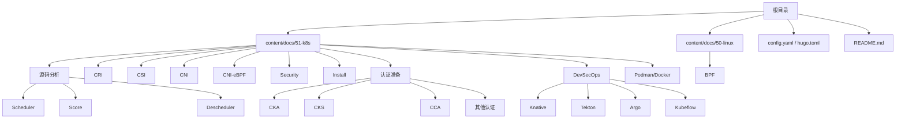

图表来源
- [README.md](file://README.md)
- [config.yaml](file://config.yaml)
- [content/docs/51-k8s/_index.md](file://content/docs/51-k8s/_index.md)

章节来源
- [README.md](file://README.md)
- [config.yaml](file://config.yaml)
- [content/docs/51-k8s/_index.md](file://content/docs/51-k8s/_index.md)

## 核心组件
本节聚焦Kubernetes三大扩展接口与相关生态：
- CRI：容器运行时抽象，解耦kubelet与具体运行时实现
- CSI：存储抽象，统一卷生命周期管理
- CNI：网络抽象，为Pod分配网络并实现跨节点通信
- eBPF：内核态可编程机制，用于高性能网络观测与数据面加速
- 安全：RBAC、NetworkPolicy、镜像与运行加固
- 安装与运维：集群搭建、常见问题定位与优化建议
- 源码分析：调度器核心实现、评分算法和反调度器工作机制
- 专业认证：CKA、CKS等权威认证的系统性准备指南
- DevSecOps：Knative、Tekton、Argo、Kubeflow等现代云原生工具链

**更新** 新增源码分析、专业认证和DevSecOps生态三个重要组成部分，形成完整的Kubernetes知识体系。

章节来源
- [content/docs/51-k8s/020-Codes.md](file://content/docs/51-k8s/020-Codes.md)
- [content/docs/51-k8s/021-Codes/_index.md](file://content/docs/51-k8s/021-Codes/_index.md)
- [content/docs/51-k8s/050-CRI.md](file://content/docs/51-k8s/050-CRI.md)
- [content/docs/51-k8s/060-CSI.md](file://content/docs/51-k8s/060-CSI.md)
- [content/docs/51-k8s/070-CNI.md](file://content/docs/51-k8s/070-CNI.md)
- [content/docs/51-k8s/071-CNI-eBPF.md](file://content/docs/51-k8s/071-CNI-eBPF.md)
- [content/docs/51-k8s/080-Security.md](file://content/docs/51-k8s/080-Security.md)
- [content/docs/51-k8s/101-Install.md](file://content/docs/51-k8s/101-Install.md)
- [content/docs/51-k8s/103-Podman.md](file://content/docs/51-k8s/103-Podman.md)
- [content/docs/51-k8s/104-docker.md](file://content/docs/51-k8s/104-docker.md)
- [content/docs/51-k8s/201-Certifications/_index.md](file://content/docs/51-k8s/201-Certifications/_index.md)
- [content/docs/51-k8s/90-DevSecOps/_index.md](file://content/docs/51-k8s/90-DevSecOps/_index.md)
- [content/docs/50-linux/50-BPF.md](file://content/docs/50-linux/50-BPF.md)

## 架构总览
下图展示Kubernetes控制面与数据面关键组件及与CRI/CSI/CNI/eBPF的交互关系。

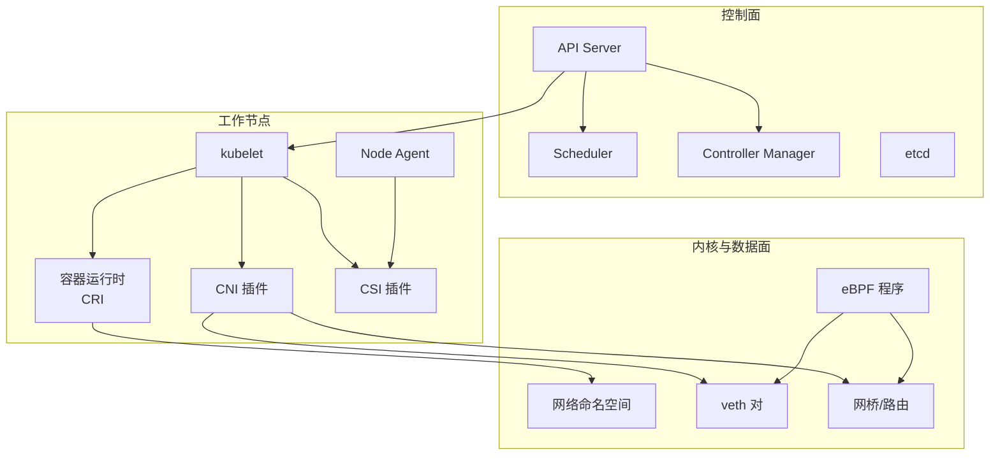

图表来源
- [content/docs/51-k8s/050-CRI.md](file://content/docs/51-k8s/050-CRI.md)
- [content/docs/51-k8s/060-CSI.md](file://content/docs/51-k8s/060-CSI.md)
- [content/docs/51-k8s/070-CNI.md](file://content/docs/51-k8s/070-CNI.md)
- [content/docs/51-k8s/071-CNI-eBPF.md](file://content/docs/51-k8s/071-CNI-eBPF.md)
- [content/docs/50-linux/50-BPF.md](file://content/docs/50-linux/50-BPF.md)

## 源码深度分析

### 调度器核心实现（Scheduler）
调度器是Kubernetes的核心组件之一，负责将Pod分配到合适的节点上。其核心工作流程包括：
- **过滤阶段（Filtering）**：根据节点资源、亲和性规则、污点容忍等条件筛选候选节点
- **评分阶段（Scoring）**：对候选节点进行打分，选择最优节点
- **绑定阶段（Binding）**：将Pod绑定到选定的节点

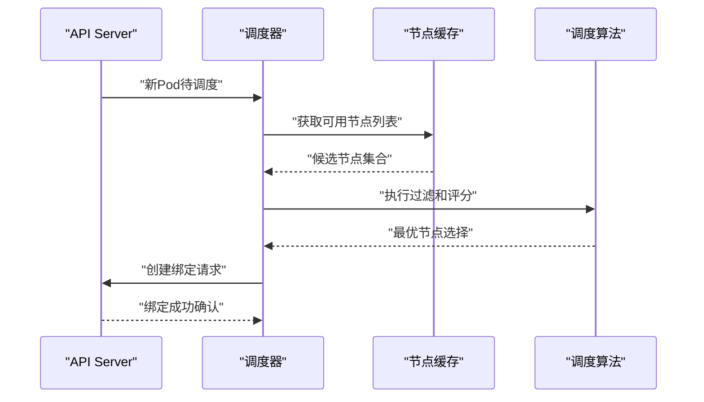

图表来源
- [content/docs/51-k8s/021-Codes/10-Scheduler.md](file://content/docs/51-k8s/021-Codes/10-Scheduler.md)

章节来源
- [content/docs/51-k8s/021-Codes/10-Scheduler.md](file://content/docs/51-k8s/021-Codes/10-Scheduler.md)
- [content/docs/51-k8s/021-Codes/09-Scheduler-Doc.md](file://content/docs/51-k8s/021-Codes/09-Scheduler-Doc.md)

### 评分算法机制（Score）
评分算法是调度器的核心决策机制，通过多维度评估节点质量：
- **资源评分**：基于CPU、内存等资源剩余情况
- **拓扑感知**：考虑节点间网络延迟和数据本地性
- **自定义评分**：支持插件化扩展，满足特定业务需求

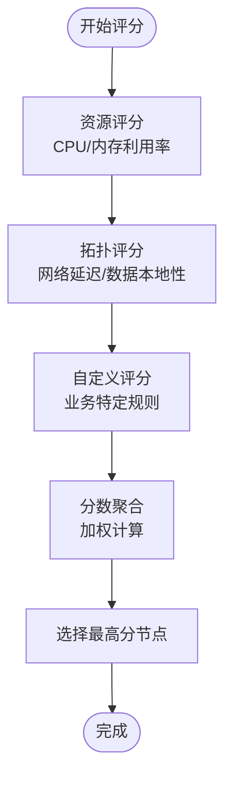

图表来源
- [content/docs/51-k8s/021-Codes/11-Score.md](file://content/docs/51-k8s/021-Codes/11-Score.md)

章节来源
- [content/docs/51-k8s/021-Codes/11-Score.md](file://content/docs/51-k8s/021-Codes/11-Score.md)

### 反调度器工作原理（Descheduler）
反调度器用于优化集群中的Pod分布，解决负载不均衡问题：
- **驱逐策略**：识别需要重新调度的Pod
- **再调度流程**：触发Pod的重新调度过程
- **效果评估**：监控集群状态改善情况

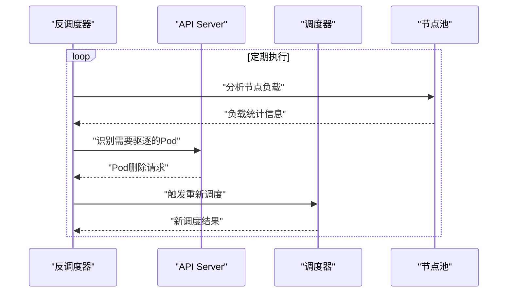

图表来源
- [content/docs/51-k8s/021-Codes/19-Descheduler.md](file://content/docs/51-k8s/021-Codes/19-Descheduler.md)

章节来源
- [content/docs/51-k8s/021-Codes/19-Descheduler.md](file://content/docs/51-k8s/021-Codes/19-Descheduler.md)

## 详细组件分析

### CRI（容器运行时接口）
- 目标与边界：定义kubelet与容器运行时之间的gRPC接口，屏蔽不同运行时实现差异
- 关键职责：拉取镜像、创建/启动/停止容器、执行命令、资源隔离、日志收集
- 典型实现：containerd、CRI-O；Docker通过dockershim历史兼容（已弃用）
- 与kubelet协作：kubelet调用CRI接口完成Pod生命周期管理

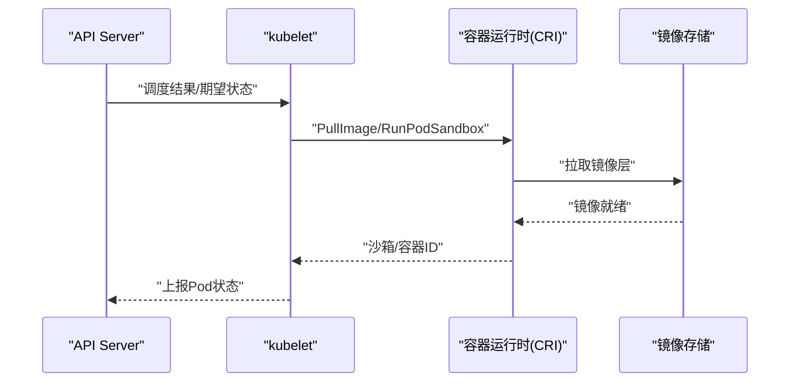

图表来源
- [content/docs/51-k8s/050-CRI.md](file://content/docs/51-k8s/050-CRI.md)

章节来源
- [content/docs/51-k8s/050-CRI.md](file://content/docs/51-k8s/050-CRI.md)

### CSI（容器存储接口）
- 设计动机：将存储系统与Kubernetes解耦，统一卷的生命周期管理
- 角色划分：CSI Driver（服务端）、Node/Controller/Attacher等Sidecar（客户端）
- 生命周期：CreateVolume/Attach/Stage/Publish/GetCapacity/Probe/Unpublish/Unmount/DeleteVolume
- 与Kubernetes集成：通过StorageClass、PV/PVC声明式绑定

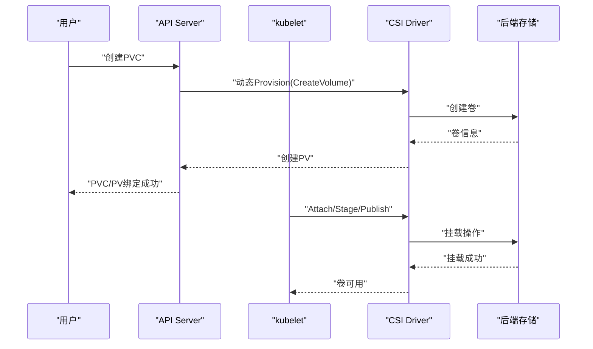

图表来源
- [content/docs/51-k8s/060-CSI.md](file://content/docs/51-k8s/060-CSI.md)

章节来源
- [content/docs/51-k8s/060-CSI.md](file://content/docs/51-k8s/060-CSI.md)

### CNI（容器网络接口）
- 设计目标：为Pod分配IP并提供跨节点连通性，屏蔽底层网络实现差异
- 关键流程：AddNetwork/DelNetwork/ListNetworks/CheckNetworks
- 常见实现：Flannel、Calico、Cilium等
- 数据面路径：veth对+网桥/路由；Overlay隧道或BGP；NAT/策略控制

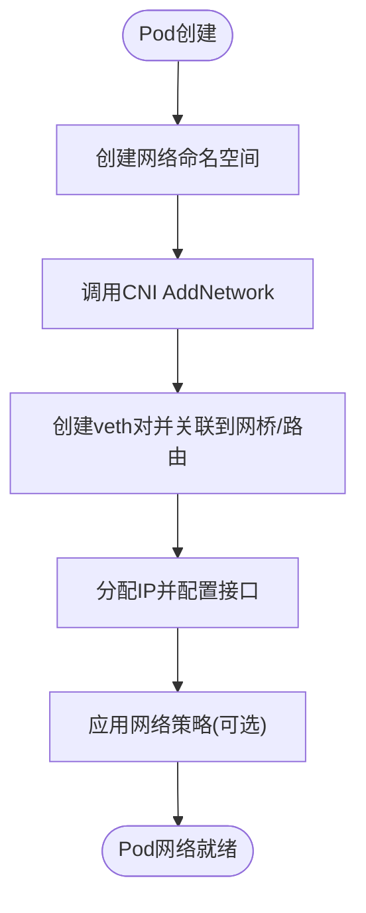

图表来源
- [content/docs/51-k8s/070-CNI.md](file://content/docs/51-k8s/070-CNI.md)

章节来源
- [content/docs/51-k8s/070-CNI.md](file://content/docs/51-k8s/070-CNI.md)

### CNI + eBPF（高性能网络与可观测性）
- eBPF价值：在内核态安全地注入程序，实现低开销的数据包处理、监控与策略执行
- 典型用法：XDP/eBPF加速转发、TC钩子进行QoS/限速、kprobe/uprobe采集指标
- 与CNI结合：CNI负责配置，eBPF作为数据面加速与观测增强

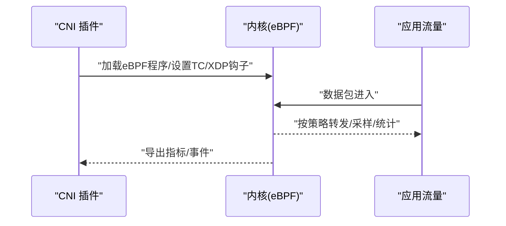

图表来源
- [content/docs/51-k8s/071-CNI-eBPF.md](file://content/docs/51-k8s/071-CNI-eBPF.md)
- [content/docs/50-linux/50-BPF.md](file://content/docs/50-linux/50-BPF.md)

章节来源
- [content/docs/51-k8s/071-CNI-eBPF.md](file://content/docs/51-k8s/071-CNI-eBPF.md)
- [content/docs/50-linux/50-BPF.md](file://content/docs/50-linux/50-BPF.md)

### 安全与权限控制（RBAC与网络安全策略）
- RBAC：基于角色的访问控制，最小权限原则，精细到资源/动词/命名空间
- NetworkPolicy：默认拒绝/白名单放行，限制Pod间与外部访问
- 镜像与运行加固：只读根文件系统、非root运行、Seccomp/AppArmor、镜像签名与扫描

图表来源
- [content/docs/51-k8s/080-Security.md](file://content/docs/51-k8s/080-Security.md)

章节来源
- [content/docs/51-k8s/080-Security.md](file://content/docs/51-k8s/080-Security.md)

### 镜像构建与容器工具（Podman vs Docker）
- 镜像构建：多阶段构建、缓存优化、SBOM与签名
- Podman：无守护进程、Rootless友好、与OCI兼容
- Docker：守护进程模式、生态完善、历史广泛使用
- 选择建议：开发体验、安全模型、CI/CD集成与团队习惯

章节来源
- [content/docs/51-k8s/103-Podman.md](file://content/docs/51-k8s/103-Podman.md)
- [content/docs/51-k8s/104-docker.md](file://content/docs/51-k8s/104-docker.md)

### 安装与部署指南
- 环境准备：内核版本、系统依赖、网络规划
- 安装方式：二进制/kubeadm/发行版托管
- 验证步骤：节点就绪、CoreDNS、网络连通、存储可用性
- 升级与回滚：滚动更新、备份etcd、灰度发布

章节来源
- [content/docs/51-k8s/101-Install.md](file://content/docs/51-k8s/101-Install.md)

## 专业认证准备

### CKA（Certified Kubernetes Administrator）
CKA是Kubernetes管理员认证，主要考察集群管理能力：
- **集群架构与管理**：控制平面组件、节点管理、集群升级
- **工作负载与编排**：Deployment、StatefulSet、DaemonSet等控制器
- **服务与网络**：Service、Ingress、网络策略配置
- **存储**：PersistentVolume、StorageClass、卷快照
- **故障排查**：日志收集、性能调优、问题诊断

**备考策略**：
- 官方文档精读与实践操作并重
- 模拟环境搭建与实验练习
- 时间管理与操作熟练度训练

章节来源
- [content/docs/51-k8s/201-Certifications/CKA.md](file://content/docs/51-k8s/201-Certifications/CKA.md)

### CKS（Certified Kubernetes Security Specialist）
CKS专注于Kubernetes安全专家认证：
- **集群安全**：API Server加固、etcd加密、审计日志
- **系统安全**：节点安全、容器运行时安全、镜像安全
- **供应链安全**：镜像签名、漏洞扫描、合规检查
- **运行时安全**：网络策略、Pod安全策略、RBAC精细化控制

**安全最佳实践**：
- 遵循最小权限原则
- 实施纵深防御策略
- 建立持续安全监控

章节来源
- [content/docs/51-k8s/201-Certifications/CKS.md](file://content/docs/51-k8s/201-Certifications/CKS.md)

### CCA（Certified Kubernetes Application Developer）
CCA面向应用开发者，关注应用设计与部署：
- **应用部署**：ConfigMap、Secret、环境变量配置
- **服务发现**：Service类型选择、负载均衡策略
- **配置管理**：热重载、配置中心集成
- **监控与日志**：健康检查、指标暴露、日志收集

章节来源
- [content/docs/51-k8s/201-Certifications/CCA.md](file://content/docs/51-k8s/201-Certifications/CCA.md)

### 其他专业认证
- **CAPA**：Cloud Provider API认证，专注云平台集成
- **ICA**：Infrastructure Certification，基础设施认证
- **PCA**：Platform Certification，平台架构认证

章节来源
- [content/docs/51-k8s/201-Certifications/CAPA.md](file://content/docs/51-k8s/201-Certifications/CAPA.md)
- [content/docs/51-k8s/201-Certifications/ICA.md](file://content/docs/51-k8s/201-Certifications/ICA.md)
- [content/docs/51-k8s/201-Certifications/PCA.md](file://content/docs/51-k8s/201-Certifications/PCA.md)

### 认证题库与实战练习
提供丰富的练习题和实战场景，帮助考生巩固知识点：
- 选择题库：涵盖各认证领域的核心概念
- 实操题目：模拟真实考试环境的动手练习
- 错题解析：详细解答与知识点回顾

章节来源
- [content/docs/51-k8s/201-Certifications/question.md](file://content/docs/51-k8s/201-Certifications/question.md)

## DevSecOps生态工具链

### Knative：Serverless应用框架
Knative基于Kubernetes构建Serverless平台：
- **Eventing**：事件驱动架构，支持多种事件源
- **Serving**：自动扩缩容的服务部署
- **Build**：容器镜像构建流水线

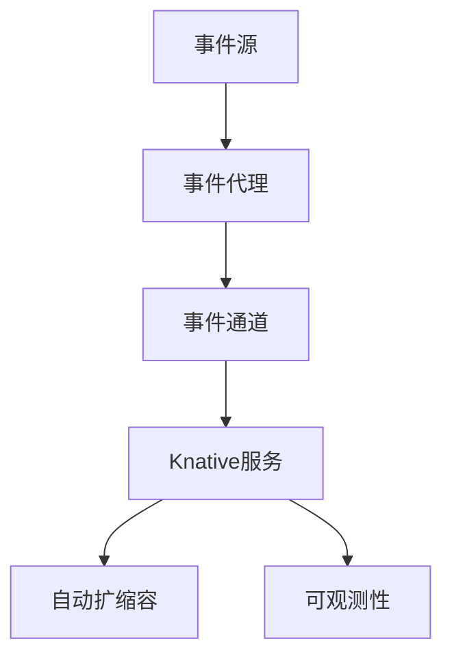

章节来源
- [content/docs/51-k8s/90-DevSecOps/50-Knative.md](file://content/docs/51-k8s/90-DevSecOps/50-Knative.md)

### Tekton：云原生CI/CD管道
Tekton提供声明式的CI/CD管道定义：
- **Pipeline**：复杂构建流水线的编排
- **Task**：可重用的任务单元
- **Trigger**：事件驱动的管道触发
- **Dashboard**：可视化管道管理界面

章节来源
- [content/docs/51-k8s/90-DevSecOps/51-Tekton.md](file://content/docs/51-k8s/90-DevSecOps/51-Tekton.md)

### Argo：工作流与GitOps平台
Argo提供完整的工作流管理和GitOps解决方案：
- **Argo Workflows**：容器化的工作流引擎
- **Argo CD**：GitOps持续交付平台
- **Argo Events**：事件驱动自动化
- **Argo Rollouts**：渐进式发布策略

章节来源
- [content/docs/51-k8s/90-DevSecOps/52-Argo.md](file://content/docs/51-k8s/90-DevSecOps/52-Argo.md)

### Kubeflow：机器学习平台
Kubeflow将机器学习工作负载迁移到Kubernetes：
- **Notebooks**：交互式开发环境
- **Training**：分布式模型训练
- **Serving**：模型服务化部署
- **Pipeline**：机器学习流水线编排

章节来源
- [content/docs/51-k8s/90-DevSecOps/80-Kubeflow.md](file://content/docs/51-k8s/90-DevSecOps/80-Kubeflow.md)

## 依赖关系分析
- 组件耦合：kubelet强依赖CRI/CSI/CNI；控制面通过API Server协调各组件
- 外部依赖：镜像仓库、存储后端、网络基础设施
- 潜在风险：单点故障（API Server/etcd）、网络拥塞、存储I/O瓶颈
- 调度依赖：调度器依赖节点缓存、评分算法和绑定机制
- 认证依赖：各认证之间形成递进的学习路径和能力验证体系

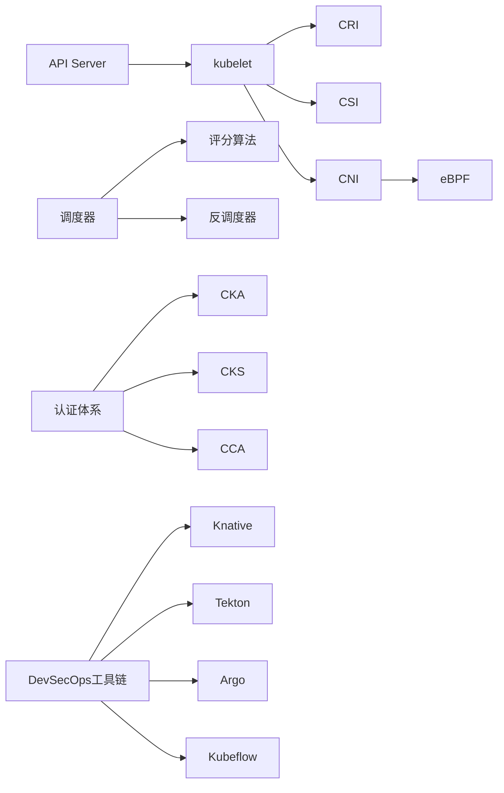

图表来源
- [content/docs/51-k8s/050-CRI.md](file://content/docs/51-k8s/050-CRI.md)
- [content/docs/51-k8s/060-CSI.md](file://content/docs/51-k8s/060-CSI.md)
- [content/docs/51-k8s/070-CNI.md](file://content/docs/51-k8s/070-CNI.md)
- [content/docs/51-k8s/071-CNI-eBPF.md](file://content/docs/51-k8s/071-CNI-eBPF.md)
- [content/docs/51-k8s/021-Codes/10-Scheduler.md](file://content/docs/51-k8s/021-Codes/10-Scheduler.md)
- [content/docs/51-k8s/201-Certifications/_index.md](file://content/docs/51-k8s/201-Certifications/_index.md)
- [content/docs/51-k8s/90-DevSecOps/_index.md](file://content/docs/51-k8s/90-DevSecOps/_index.md)

章节来源
- [content/docs/51-k8s/050-CRI.md](file://content/docs/51-k8s/050-CRI.md)
- [content/docs/51-k8s/060-CSI.md](file://content/docs/51-k8s/060-CSI.md)
- [content/docs/51-k8s/070-CNI.md](file://content/docs/51-k8s/070-CNI.md)
- [content/docs/51-k8s/071-CNI-eBPF.md](file://content/docs/51-k8s/071-CNI-eBPF.md)
- [content/docs/51-k8s/021-Codes/10-Scheduler.md](file://content/docs/51-k8s/021-Codes/10-Scheduler.md)
- [content/docs/51-k8s/201-Certifications/_index.md](file://content/docs/51-k8s/201-Certifications/_index.md)
- [content/docs/51-k8s/90-DevSecOps/_index.md](file://content/docs/51-k8s/90-DevSecOps/_index.md)

## 性能考量
- 网络：优先选择eBPF方案降低转发开销；合理划分CIDR与MTU；避免过度NAT
- 存储：选择合适的CSI驱动与介质；关注IOPS与延迟；启用快照与克隆按需
- 运行时：精简镜像层；合理设置资源请求/限制；避免频繁重启
- 调度：利用拓扑感知与亲和/反亲和；避免热点节点；优化评分算法权重
- 反调度：定期分析集群负载分布；智能驱逐策略；平衡资源利用率
- 认证准备：理论与实践结合；模拟环境演练；时间管理技巧

**更新** 新增调度器性能优化、反调度策略和认证准备效率提升等相关考量。

## 故障排除指南
- 网络问题：检查CNI日志、Pod IP分配、网桥/路由表、iptables/nftables规则
- 存储问题：确认CSI Driver健康、PV/PVC绑定状态、后端存储可达性与配额
- 运行时问题：查看CRI日志、镜像拉取失败原因、容器OOM/崩溃重启
- 安全策略：校验RBAC权限、NetworkPolicy是否误拦截、证书与Token有效性
- 调度问题：分析调度器日志、节点资源状态、亲和性规则冲突
- 反调度问题：检查驱逐策略配置、节点负载分布、再调度成功率
- 认证考试：熟悉考试环境、掌握常用命令、理解错误提示含义

**更新** 新增调度器故障排除、反调度问题诊断和认证考试技巧相关内容。

章节来源
- [content/docs/51-k8s/070-CNI.md](file://content/docs/51-k8s/070-CNI.md)
- [content/docs/51-k8s/060-CSI.md](file://content/docs/51-k8s/060-CSI.md)
- [content/docs/51-k8s/050-CRI.md](file://content/docs/51-k8s/050-CRI.md)
- [content/docs/51-k8s/080-Security.md](file://content/docs/51-k8s/080-Security.md)
- [content/docs/51-k8s/021-Codes/10-Scheduler.md](file://content/docs/51-k8s/021-Codes/10-Scheduler.md)
- [content/docs/51-k8s/021-Codes/19-Descheduler.md](file://content/docs/51-k8s/021-Codes/19-Descheduler.md)
- [content/docs/51-k8s/201-Certifications/question.md](file://content/docs/51-k8s/201-Certifications/question.md)

## 结论
通过CRI/CSI/CNI三大扩展接口，Kubernetes实现了容器、存储与网络的松耦合与高可扩展性。结合eBPF可在数据面获得更高性能与更强可观测性。配合完善的RBAC与网络安全策略，以及规范的镜像构建与部署流程，能够显著提升云原生应用的可靠性与可维护性。

**更新** 新增源码深度分析揭示了调度器核心机制，专业认证体系提供了系统化能力验证路径，DevSecOps工具链完善了现代云原生开发运维生态。这些补充内容形成了从底层原理到上层应用、从技术实现到能力认证的完整知识体系，为Kubernetes学习者提供了全面的技术指导。

## 附录
- 术语速查：CRI/CSI/CNI/eBPF/RBAC/NetworkPolicy/Scheduler/Descheduler
- 参考链接：官方文档、社区博客与案例集
- 实战清单：从安装到上线的端到端检查项
- 认证路线图：从入门到专家的能力成长路径
- DevSecOps工具矩阵：各工具特性对比与选型建议

**更新** 新增认证路线图和DevSecOps工具矩阵等实用参考资料。