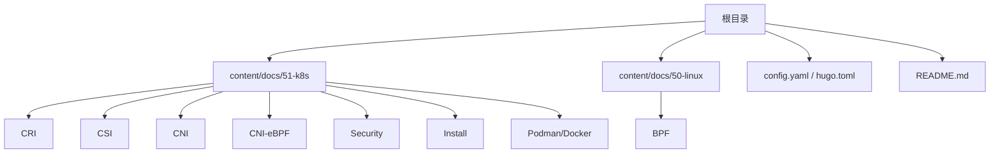
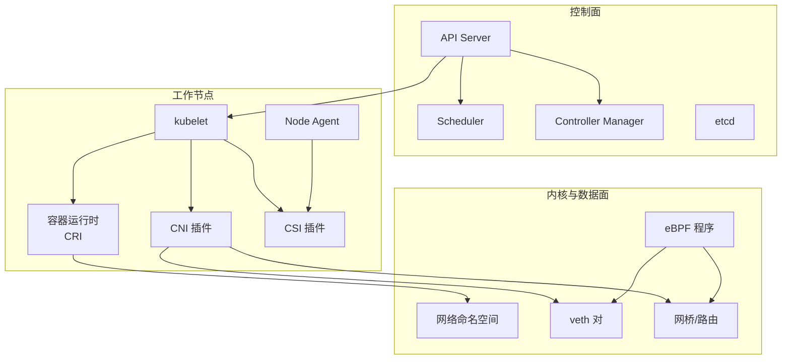
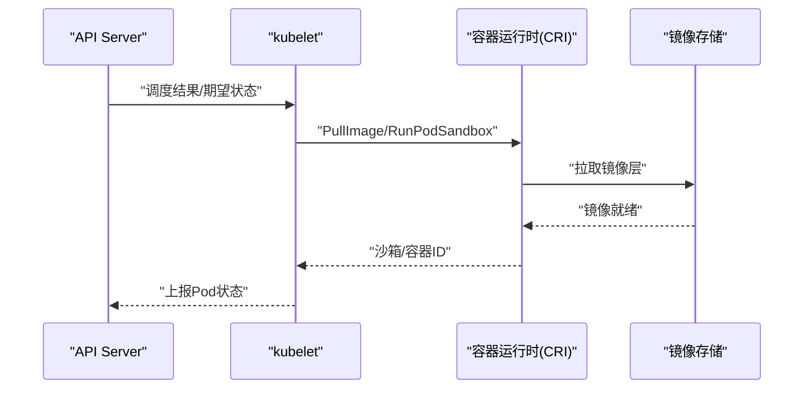
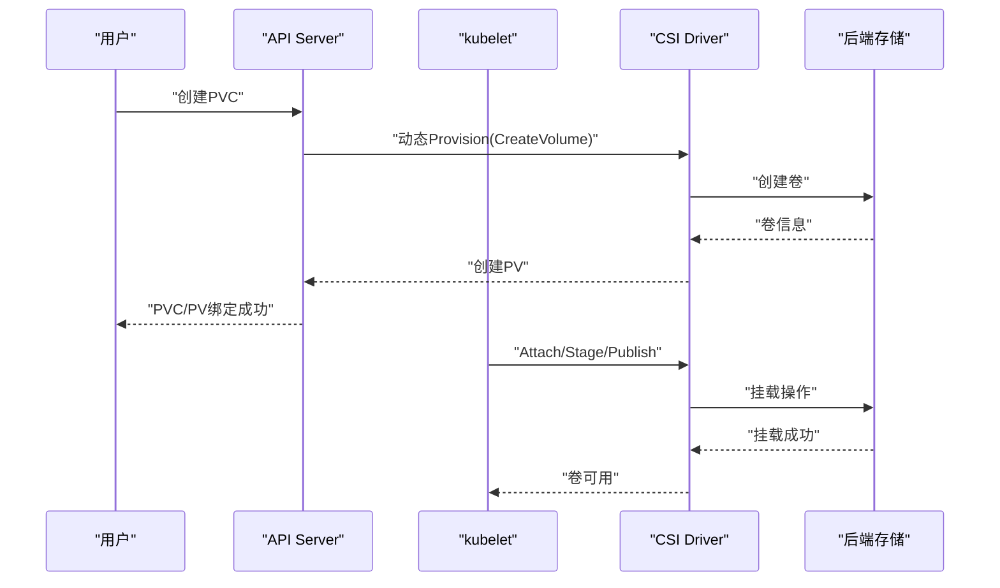
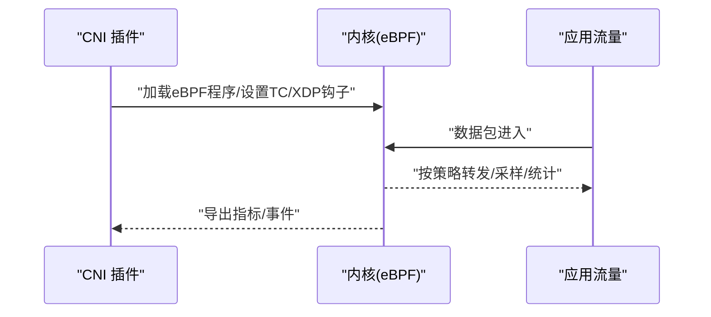
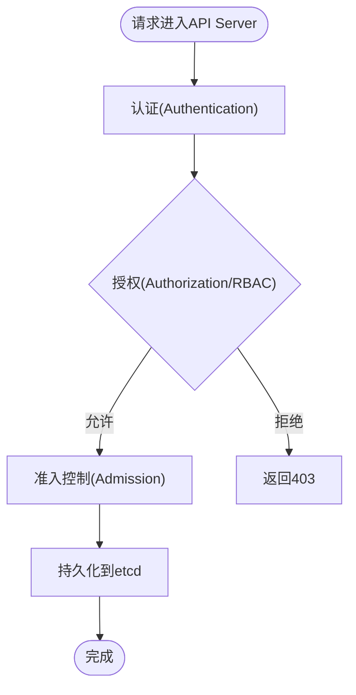
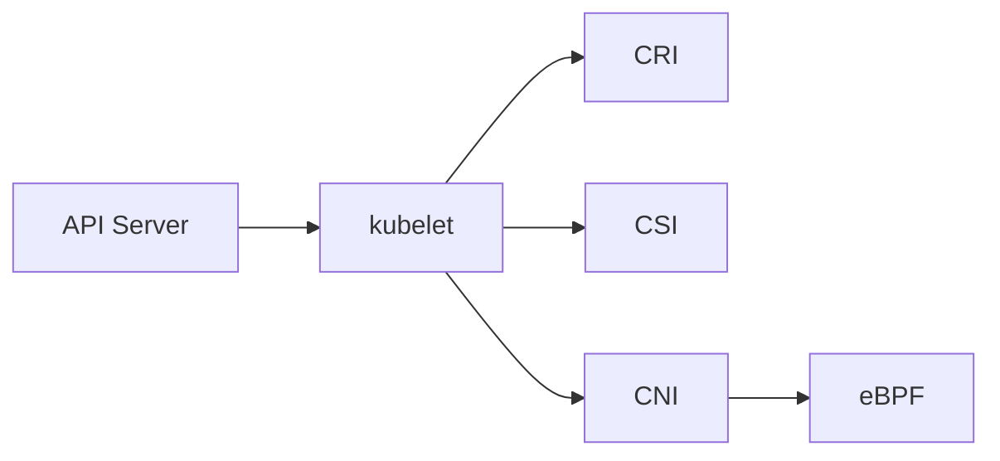

# Kubernetes生态系统

<cite>
**本文引用的文件**   
- [README.md](file://README.md)
- [config.yaml](file://config.yaml)
- [hugo.toml](file://hugo.toml)
- [content/docs/51-k8s/_index.md](file://content/docs/51-k8s/_index.md)
- [content/docs/51-k8s/050-CRI.md](file://content/docs/51-k8s/050-CRI.md)
- [content/docs/51-k8s/060-CSI.md](file://content/docs/51-k8s/060-CSI.md)
- [content/docs/51-k8s/070-CNI.md](file://content/docs/51-k8s/070-CNI.md)
- [content/docs/51-k8s/071-CNI-eBPF.md](file://content/docs/51-k8s/071-CNI-eBPF.md)
- [content/docs/51-k8s/080-Security.md](file://content/docs/51-k8s/080-Security.md)
- [content/docs/51-k8s/101-Install.md](file://content/docs/51-k8s/101-Install.md)
- [content/docs/51-k8s/103-Podman.md](file://content/docs/51-k8s/103-Podman.md)
- [content/docs/51-k8s/104-docker.md](file://content/docs/51-k8s/104-docker.md)
- [content/docs/50-linux/50-BPF.md](file://content/docs/50-linux/50-BPF.md)
</cite>

## 目录
1. [简介](#简介)
2. [项目结构](#项目结构)
3. [核心组件](#核心组件)
4. [架构总览](#架构总览)
5. [详细组件分析](#详细组件分析)
6. [依赖关系分析](#依赖关系分析)
7. [性能考量](#性能考量)
8. [故障排除指南](#故障排除指南)
9. [结论](#结论)
10. [附录](#附录)

## 简介
本仓库以Hugo静态站点形式组织，围绕Kubernetes生态展开系统性技术文档，重点覆盖容器运行时接口(CRI)、存储插件接口(CSI)、网络插件接口(CNI)，并深入探讨CNI网络模型与eBPF在容器网络中的应用。同时提供镜像构建、Podman与Docker差异对比、安全最佳实践（含RBAC与网络安全策略）、安装部署指南与运维排障方法，帮助开发者与运维人员掌握云原生应用开发与运维技能。

## 项目结构
仓库采用“内容即代码”的文档工程化方式：
- content/docs/51-k8s：Kubernetes主题文档，包含CRI、CSI、CNI、eBPF、安全、安装等章节
- content/docs/50-linux：Linux底层能力，包括BPF专题
- config.yaml/hugo.toml：站点配置与主题参数
- README.md：项目说明与导航入口

图表来源
- [README.md](file://README.md)
- [config.yaml](file://config.yaml)
- [hugo.toml](file://hugo.toml)
- [content/docs/51-k8s/_index.md](file://content/docs/51-k8s/_index.md)

章节来源
- [README.md](file://README.md)
- [config.yaml](file://config.yaml)
- [hugo.toml](file://hugo.toml)
- [content/docs/51-k8s/_index.md](file://content/docs/51-k8s/_index.md)

## 核心组件
本节聚焦Kubernetes三大扩展接口与相关生态：
- CRI：容器运行时抽象，解耦kubelet与具体运行时实现
- CSI：存储抽象，统一卷生命周期管理
- CNI：网络抽象，为Pod分配网络并实现跨节点通信
- eBPF：内核态可编程机制，用于高性能网络观测与数据面加速
- 安全：RBAC、NetworkPolicy、镜像与运行加固
- 安装与运维：集群搭建、常见问题定位与优化建议

章节来源
- [content/docs/51-k8s/050-CRI.md](file://content/docs/51-k8s/050-CRI.md)
- [content/docs/51-k8s/060-CSI.md](file://content/docs/51-k8s/060-CSI.md)
- [content/docs/51-k8s/070-CNI.md](file://content/docs/51-k8s/070-CNI.md)
- [content/docs/51-k8s/071-CNI-eBPF.md](file://content/docs/51-k8s/071-CNI-eBPF.md)
- [content/docs/51-k8s/080-Security.md](file://content/docs/51-k8s/080-Security.md)
- [content/docs/51-k8s/101-Install.md](file://content/docs/51-k8s/101-Install.md)
- [content/docs/51-k8s/103-Podman.md](file://content/docs/51-k8s/103-Podman.md)
- [content/docs/51-k8s/104-docker.md](file://content/docs/51-k8s/104-docker.md)
- [content/docs/50-linux/50-BPF.md](file://content/docs/50-linux/50-BPF.md)

## 架构总览
下图展示Kubernetes控制面与数据面关键组件及与CRI/CSI/CNI/eBPF的交互关系。

图表来源
- [content/docs/51-k8s/050-CRI.md](file://content/docs/51-k8s/050-CRI.md)
- [content/docs/51-k8s/060-CSI.md](file://content/docs/51-k8s/060-CSI.md)
- [content/docs/51-k8s/070-CNI.md](file://content/docs/51-k8s/070-CNI.md)
- [content/docs/51-k8s/071-CNI-eBPF.md](file://content/docs/51-k8s/071-CNI-eBPF.md)
- [content/docs/50-linux/50-BPF.md](file://content/docs/50-linux/50-BPF.md)

## 详细组件分析

### CRI（容器运行时接口）
- 目标与边界：定义kubelet与容器运行时之间的gRPC接口，屏蔽不同运行时实现差异
- 关键职责：拉取镜像、创建/启动/停止容器、执行命令、资源隔离、日志收集
- 典型实现：containerd、CRI-O；Docker通过dockershim历史兼容（已弃用）
- 与kubelet协作：kubelet调用CRI接口完成Pod生命周期管理

图表来源
- [content/docs/51-k8s/050-CRI.md](file://content/docs/51-k8s/050-CRI.md)

章节来源
- [content/docs/51-k8s/050-CRI.md](file://content/docs/51-k8s/050-CRI.md)

### CSI（容器存储接口）
- 设计动机：将存储系统与Kubernetes解耦，统一卷的生命周期管理
- 角色划分：CSI Driver（服务端）、Node/Controller/Attacher等Sidecar（客户端）
- 生命周期：CreateVolume/Attach/Stage/Publish/GetCapacity/Probe/Unpublish/Unmount/DeleteVolume
- 与Kubernetes集成：通过StorageClass、PV/PVC声明式绑定

图表来源
- [content/docs/51-k8s/060-CSI.md](file://content/docs/51-k8s/060-CSI.md)

章节来源
- [content/docs/51-k8s/060-CSI.md](file://content/docs/51-k8s/060-CSI.md)

### CNI（容器网络接口）
- 设计目标：为Pod分配IP并提供跨节点连通性，屏蔽底层网络实现差异
- 关键流程：AddNetwork/DelNetwork/ListNetworks/CheckNetworks
- 常见实现：Flannel、Calico、Cilium等
- 数据面路径：veth对+网桥/路由；Overlay隧道或BGP；NAT/策略控制

图表来源
- [content/docs/51-k8s/070-CNI.md](file://content/docs/51-k8s/070-CNI.md)

章节来源
- [content/docs/51-k8s/070-CNI.md](file://content/docs/51-k8s/070-CNI.md)

### CNI + eBPF（高性能网络与可观测性）
- eBPF价值：在内核态安全地注入程序，实现低开销的数据包处理、监控与策略执行
- 典型用法：XDP/eBPF加速转发、TC钩子进行QoS/限速、kprobe/uprobe采集指标
- 与CNI结合：CNI负责配置，eBPF作为数据面加速与观测增强

图表来源
- [content/docs/51-k8s/071-CNI-eBPF.md](file://content/docs/51-k8s/071-CNI-eBPF.md)
- [content/docs/50-linux/50-BPF.md](file://content/docs/50-linux/50-BPF.md)

章节来源
- [content/docs/51-k8s/071-CNI-eBPF.md](file://content/docs/51-k8s/071-CNI-eBPF.md)
- [content/docs/50-linux/50-BPF.md](file://content/docs/50-linux/50-BPF.md)

### 安全与权限控制（RBAC与网络安全策略）
- RBAC：基于角色的访问控制，最小权限原则，精细到资源/动词/命名空间
- NetworkPolicy：默认拒绝/白名单放行，限制Pod间与外部访问
- 镜像与运行加固：只读根文件系统、非root运行、Seccomp/AppArmor、镜像签名与扫描

图表来源
- [content/docs/51-k8s/080-Security.md](file://content/docs/51-k8s/080-Security.md)

章节来源
- [content/docs/51-k8s/080-Security.md](file://content/docs/51-k8s/080-Security.md)

### 镜像构建与容器工具（Podman vs Docker）
- 镜像构建：多阶段构建、缓存优化、SBOM与签名
- Podman：无守护进程、Rootless友好、与OCI兼容
- Docker：守护进程模式、生态完善、历史广泛使用
- 选择建议：开发体验、安全模型、CI/CD集成与团队习惯

章节来源
- [content/docs/51-k8s/103-Podman.md](file://content/docs/51-k8s/103-Podman.md)
- [content/docs/51-k8s/104-docker.md](file://content/docs/51-k8s/104-docker.md)

### 安装与部署指南
- 环境准备：内核版本、系统依赖、网络规划
- 安装方式：二进制/kubeadm/发行版托管
- 验证步骤：节点就绪、CoreDNS、网络连通、存储可用性
- 升级与回滚：滚动更新、备份etcd、灰度发布

章节来源
- [content/docs/51-k8s/101-Install.md](file://content/docs/51-k8s/101-Install.md)

## 依赖关系分析
- 组件耦合：kubelet强依赖CRI/CSI/CNI；控制面通过API Server协调各组件
- 外部依赖：镜像仓库、存储后端、网络基础设施
- 潜在风险：单点故障（API Server/etcd）、网络拥塞、存储I/O瓶颈

图表来源
- [content/docs/51-k8s/050-CRI.md](file://content/docs/51-k8s/050-CRI.md)
- [content/docs/51-k8s/060-CSI.md](file://content/docs/51-k8s/060-CSI.md)
- [content/docs/51-k8s/070-CNI.md](file://content/docs/51-k8s/070-CNI.md)
- [content/docs/51-k8s/071-CNI-eBPF.md](file://content/docs/51-k8s/071-CNI-eBPF.md)

章节来源
- [content/docs/51-k8s/050-CRI.md](file://content/docs/51-k8s/050-CRI.md)
- [content/docs/51-k8s/060-CSI.md](file://content/docs/51-k8s/060-CSI.md)
- [content/docs/51-k8s/070-CNI.md](file://content/docs/51-k8s/070-CNI.md)
- [content/docs/51-k8s/071-CNI-eBPF.md](file://content/docs/51-k8s/071-CNI-eBPF.md)

## 性能考量
- 网络：优先选择eBPF方案降低转发开销；合理划分CIDR与MTU；避免过度NAT
- 存储：选择合适的CSI驱动与介质；关注IOPS与延迟；启用快照与克隆按需
- 运行时：精简镜像层；合理设置资源请求/限制；避免频繁重启
- 调度：利用拓扑感知与亲和/反亲和；避免热点节点

[本节为通用指导，不直接分析具体文件]

## 故障排除指南
- 网络问题：检查CNI日志、Pod IP分配、网桥/路由表、iptables/nftables规则
- 存储问题：确认CSI Driver健康、PV/PVC绑定状态、后端存储可达性与配额
- 运行时问题：查看CRI日志、镜像拉取失败原因、容器OOM/崩溃重启
- 安全策略：校验RBAC权限、NetworkPolicy是否误拦截、证书与Token有效性

章节来源
- [content/docs/51-k8s/070-CNI.md](file://content/docs/51-k8s/070-CNI.md)
- [content/docs/51-k8s/060-CSI.md](file://content/docs/51-k8s/060-CSI.md)
- [content/docs/51-k8s/050-CRI.md](file://content/docs/51-k8s/050-CRI.md)
- [content/docs/51-k8s/080-Security.md](file://content/docs/51-k8s/080-Security.md)

## 结论
通过CRI/CSI/CNI三大扩展接口，Kubernetes实现了容器、存储与网络的松耦合与高可扩展性。结合eBPF可在数据面获得更高性能与更强可观测性。配合完善的RBAC与网络安全策略，以及规范的镜像构建与部署流程，能够显著提升云原生应用的可靠性与可维护性。

[本节为总结性内容，不直接分析具体文件]

## 附录
- 术语速查：CRI/CSI/CNI/eBPF/RBAC/NetworkPolicy
- 参考链接：官方文档、社区博客与案例集
- 实战清单：从安装到上线的端到端检查项

[本节为补充信息，不直接分析具体文件]