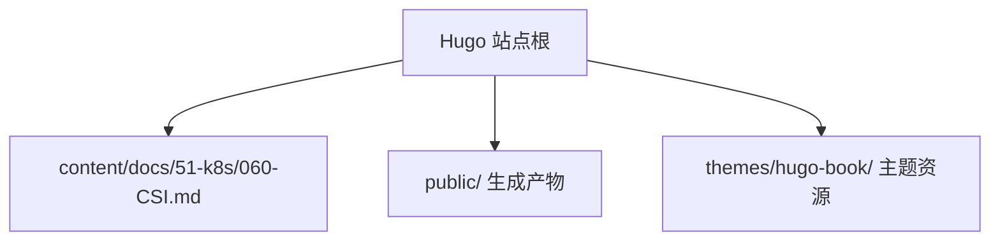
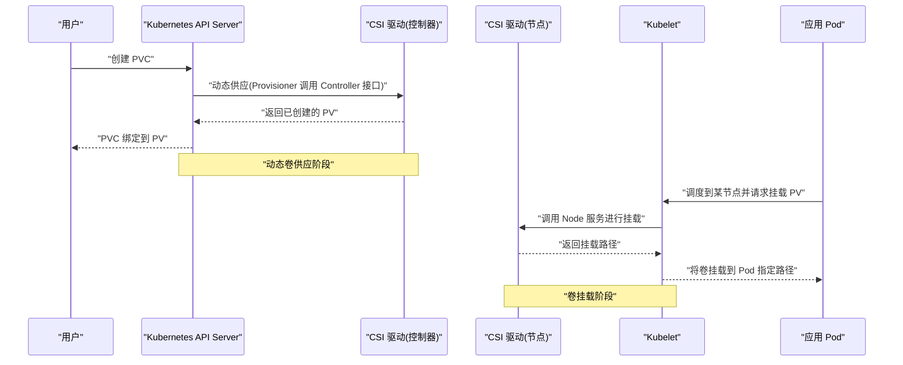
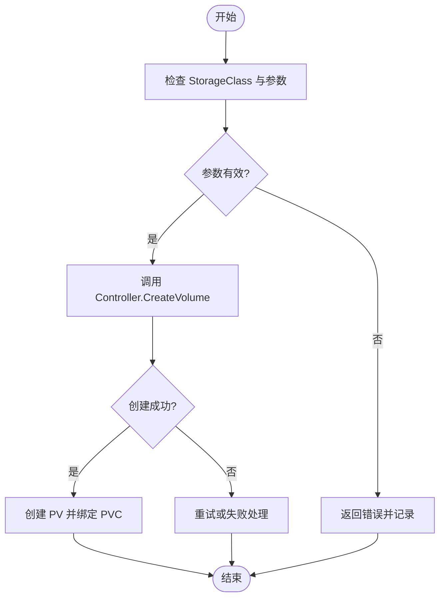
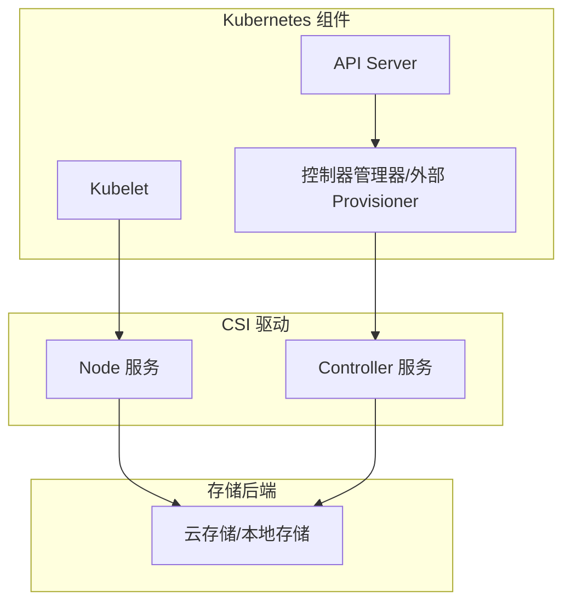

# 存储插件接口(CSI)

<cite>
**本文引用的文件**   
- [060-CSI.md](file://content/docs/51-k8s/060-CSI.md)
</cite>

## 目录
1. [简介](#简介)
2. [项目结构](#项目结构)
3. [核心组件](#核心组件)
4. [架构总览](#架构总览)
5. [详细组件分析](#详细组件分析)
6. [依赖关系分析](#依赖关系分析)
7. [性能考量](#性能考量)
8. [故障诊断指南](#故障诊断指南)
9. [结论](#结论)
10. [附录](#附录)

## 简介
本章节面向希望在 Kubernetes 中构建可扩展云原生存储解决方案的开发者，系统性阐述容器存储接口（CSI）的设计理念和架构模型。内容涵盖 Node 服务、Controller 服务与 Provisioner 的职责分工；PersistentVolume（PV）、PersistentVolumeClaim（PVC）与 StorageClass 的关系与使用方式；主流云存储提供商 CSI 驱动的实现要点（如 AWS EBS、Azure Disk、NFS）；自定义 CSI 驱动的开发指南与最佳实践；动态卷供应、快照、克隆等高级功能的实现原理；以及完整的部署配置示例与故障诊断方法。

## 项目结构
仓库为 Hugo 静态站点，文档以 Markdown 形式组织。与 CSI 相关的技术文档位于 content/docs/51-k8s/060-CSI.md，该文件是本文档的主要参考来源。

[本节未直接分析具体代码文件]

## 核心组件
CSI 将存储抽象为可插拔的插件，通过 gRPC 暴露标准接口，使 Kubernetes 能够以统一的方式对接不同后端存储系统。核心职责划分如下：
- Node 服务：负责在节点上执行卷的挂载、卸载、格式化、扩展等操作，确保 Pod 能访问本地或远程块/文件存储。
- Controller 服务：负责跨节点的卷生命周期管理，包括创建、删除、扩容、拓扑约束、权限控制等。
- Provisioner：作为控制器侧的“供应器”，根据 PVC 和 StorageClass 动态创建 PV，并调用 CSI Controller 接口完成底层资源的分配。

上述职责在 CSI 规范中通过明确的 RPC 定义进行约束，确保不同厂商驱动具备一致的集成体验。

**章节来源**
- [060-CSI.md](file://content/docs/51-k8s/060-CSI.md)

## 架构总览
下图展示了 Kubernetes 与 CSI 驱动的交互关系，以及 Node、Controller、Provisioner 三者在动态卷供应流程中的协作。

**图表来源**
- [060-CSI.md](file://content/docs/51-k8s/060-CSI.md)

## 详细组件分析

### Node 服务
- 职责边界
  - 卷的挂载与卸载：提供 GetCapabilities、NodePublishVolume、NodeUnpublishVolume 等能力。
  - 卷信息上报：NodeGetInfo 用于向控制器报告节点拓扑与能力。
  - 卷扩展：NodeExpandVolume 支持在线扩容（取决于驱动实现）。
- 关键设计点
  - 幂等性：多次调用应保证一致结果。
  - 错误语义：区分临时错误与永久错误，便于重试与回滚。
  - 并发安全：同一卷在同一节点上的并发操作需加锁保护。
- 典型问题
  - 挂载失败：检查设备是否可用、权限是否正确、内核模块是否加载。
  - 卸载卡住：存在进程占用或文件系统忙，需要清理句柄。

**章节来源**
- [060-CSI.md](file://content/docs/51-k8s/060-CSI.md)

### Controller 服务
- 职责边界
  - 卷生命周期：CreateVolume、DeleteVolume、ValidateVolumeCapabilities。
  - 卷属性与拓扑：GetCapacity、ListVolumes、ControllerGetCapabilities、ControllerGetVolume。
  - 高级特性：ControllerExpandVolume、ControllerPublishVolume/UnpublishVolume、Snapshot、Clone 等。
- 关键设计点
  - 一致性视图：维护全局卷状态，避免重复创建与竞态。
  - 配额与限制：结合 StorageClass 参数实施配额、IOPS、带宽等策略。
  - 容错与重试：对网络抖动、后端限流进行退避与重试。
- 典型问题
  - 创建超时：后端 API 限流或配额不足，需调整参数或扩容。
  - 拓扑不匹配：节点标签与驱动拓扑要求不一致导致无法调度。

**章节来源**
- [060-CSI.md](file://content/docs/51-k8s/060-CSI.md)

### Provisioner（动态供应器）
- 职责边界
  - 监听 PVC 事件，根据 StorageClass 参数调用 CSI Controller 接口创建卷。
  - 将底层卷元数据写入 PV 对象，完成 PVC 与 PV 的绑定。
- 关键设计点
  - 参数映射：StorageClass.parameters 到 CSI CreateVolumeParameters 的转换。
  - 命名与标识：确保 PV 名称唯一且可追溯。
  - 回滚与清理：创建失败时清理中间状态，避免孤儿资源。
- 典型问题
  - 供应失败：参数校验错误或后端不可用，需检查日志与事件。
  - 绑定异常：PVC 与 PV 容量、访问模式、拓扑不匹配。

**章节来源**
- [060-CSI.md](file://content/docs/51-k8s/060-CSI.md)

### PV、PVC 与 StorageClass 的关系与使用
- 关系说明
  - StorageClass：描述存储类别与供应策略（动态/静态），包含参数、回收策略、允许快照等。
  - PV：表示集群中的实际存储资源，由动态或管理员创建。
  - PVC：用户的存储申请，声明容量、访问模式、选择策略（selector/storageClassName）。
- 使用方式
  - 动态供应：PVC 指定 storageClassName，Provisioner 自动创建 PV。
  - 静态供应：管理员预先创建 PV，PVC 通过 selector 或 name 绑定。
  - 多副本与共享：根据访问模式（ReadWriteOnce、ReadOnlyMany、ReadWriteMany）选择合适驱动。
- 常见陷阱
  - 容量不足：PVC 大于后端可用容量或配额限制。
  - 拓扑不满足：节点区域/可用区与卷所在区域不一致。
  - 回收策略不当：Delete 可能误删数据，Retain 需人工清理。

**章节来源**
- [060-CSI.md](file://content/docs/51-k8s/060-CSI.md)

### 主流云存储 CSI 驱动要点
- AWS EBS
  - 特点：块存储，高可靠，支持加密、快照、克隆、多副本（跨 AZ 需额外配置）。
  - 关键点：实例与卷的拓扑约束、IOPS/吞吐等级、加密密钥管理。
- Azure Disk
  - 特点：块存储，支持托管磁盘、快照、克隆、增量复制。
  - 关键点：磁盘类型（Premium/LRS/ZRS）、区域与可用性域、快照保留策略。
- NFS
  - 特点：文件存储，适合共享读/写场景，注意并发与一致性模型。
  - 关键点：服务端导出路径、权限映射、客户端挂载选项（硬/软挂载、超时）。
- 通用建议
  - 明确访问模式与拓扑需求，选择合适的驱动与参数。
  - 启用监控与告警，关注 I/O 延迟、吞吐、错误率。
  - 定期演练备份与恢复流程，验证快照与克隆的有效性。

**章节来源**
- [060-CSI.md](file://content/docs/51-k8s/060-CSI.md)

### 自定义 CSI 驱动开发指南与最佳实践
- 开发步骤
  - 定义能力：实现 GetCapabilities，声明支持的 RPC 与卷属性。
  - 实现 Node 服务：处理挂载、卸载、扩展、健康检查。
  - 实现 Controller 服务：处理创建、删除、发布、快照、克隆等。
  - 编写 Provisioner：将 StorageClass 参数映射到 CSI 请求。
  - 打包与部署：以 DaemonSet（Node）+ Deployment（Controller）形式部署。
- 最佳实践
  - 幂等性与重试：所有 RPC 尽量幂等，合理设置超时与退避。
  - 错误分类：区分可重试与不可重试错误，记录详细上下文。
  - 资源清理：失败路径确保中间资源被清理，避免泄漏。
  - 可观测性：输出结构化日志、指标与事件，便于排障。
  - 安全与合规：最小权限原则，敏感信息通过 Secret 注入。
- 测试与验收
  - 单元测试：覆盖关键逻辑分支与边界条件。
  - 集成测试：在真实或模拟环境中验证端到端流程。
  - 压力测试：评估高并发与大规模卷场景下的稳定性。

**章节来源**
- [060-CSI.md](file://content/docs/51-k8s/060-CSI.md)

### 高级功能：动态卷供应、快照、克隆
- 动态卷供应
  - 流程：PVC -> Provisioner -> Controller.CreateVolume -> PV 创建 -> PVC 绑定。
  - 要点：StorageClass 参数映射、拓扑约束、容量与访问模式校验。
- 快照
  - 流程：创建 VolumeSnapshot -> Controller.CreateSnapshot -> 持久化快照元数据。
  - 要点：快照一致性、增量快照、跨区域复制、保留策略。
- 克隆
  - 流程：基于快照或源卷创建新卷 -> Controller.CreateVolumeFromSnapshot/Source。
  - 要点：克隆一致性、性能影响、空间复用与去重。

**图表来源**
- [060-CSI.md](file://content/docs/51-k8s/060-CSI.md)

**章节来源**
- [060-CSI.md](file://content/docs/51-k8s/060-CSI.md)

## 依赖关系分析
CSI 驱动与 Kubernetes 组件之间的依赖关系如下：
- Kubelet 依赖 Node 服务进行卷挂载。
- 控制器管理器（或外部 Provisioner）依赖 Controller 服务进行卷生命周期管理。
- StorageClass 与 CSI Driver 通过注解与参数建立关联。
- 快照与克隆依赖于 CSI Snapshotter 与相关 CRD（如 VolumeSnapshot、VolumeSnapshotContent、VolumeSnapshotClass）。

**图表来源**
- [060-CSI.md](file://content/docs/51-k8s/060-CSI.md)

**章节来源**
- [060-CSI.md](file://content/docs/51-k8s/060-CSI.md)

## 性能考量
- I/O 路径优化
  - 减少不必要的格式化与重建，利用缓存与预取。
  - 合理设置挂载选项（如 noatime、discard）以降低开销。
- 并发与限流
  - 对后端 API 进行限流与退避，避免雪崩。
  - 节点侧并发挂载需控制上限，防止资源争用。
- 监控与告警
  - 采集关键指标：IOPS、吞吐、延迟、错误率、队列长度。
  - 设置阈值告警，快速定位瓶颈。
- 容量与配额
  - 结合 StorageClass 实施配额与分级存储策略。
  - 定期清理无用快照与卷，释放空间。

[本节提供一般性指导，无需特定文件引用]

## 故障诊断指南
- 常见问题定位
  - 动态供应失败：检查 Provisioner 日志、CSI Controller 日志、API 事件。
  - 挂载失败：查看 Kubelet 与 Node 服务日志，确认设备与权限。
  - 快照/克隆失败：验证快照源有效性、权限与后端能力。
- 诊断工具
  - kubectl describe 查看 PVC/PV/事件详情。
  - 查看 Pod 与 DaemonSet 日志，定位驱动内部错误。
  - 使用 csi-node-driver-registrar 与 csi-provisioner 的健康检查。
- 修复建议
  - 修正 StorageClass 参数与拓扑标签。
  - 清理僵尸挂载与残留资源。
  - 升级驱动版本以获取修复与增强。

**章节来源**
- [060-CSI.md](file://content/docs/51-k8s/060-CSI.md)

## 结论
CSI 为 Kubernetes 提供了统一的存储抽象与扩展机制。通过 Node、Controller、Provisioner 的职责分离，结合 PV/PVC/StorageClass 的资源模型，开发者可以灵活对接各类存储后端，并实现动态供应、快照、克隆等高级能力。遵循幂等、可观测、安全与性能优化的最佳实践，有助于构建稳定可靠的云原生存储解决方案。

[本节为总结性内容，无需特定文件引用]

## 附录
- 术语表
  - CSI：容器存储接口
  - PV：持久卷
  - PVC：持久卷声明
  - StorageClass：存储类
  - Provisioner：动态供应器
  - Snapshot：快照
  - Clone：克隆
- 参考链接
  - CSI 规范与官方文档
  - 各云厂商 CSI 驱动文档与最佳实践

[本节为补充信息，无需特定文件引用]