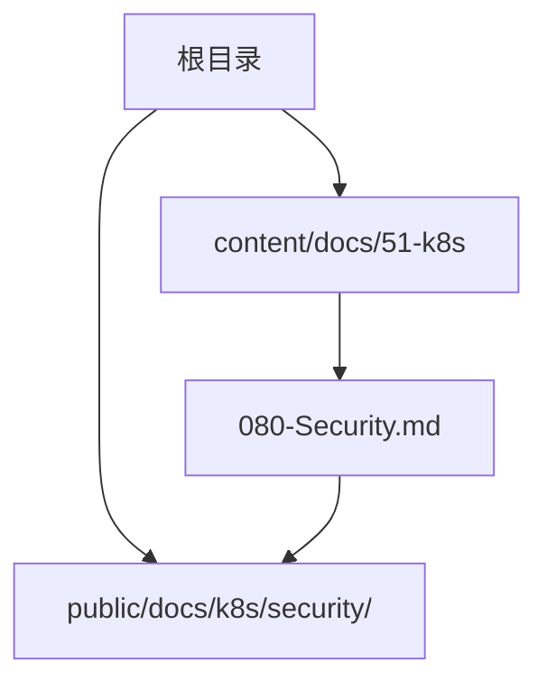
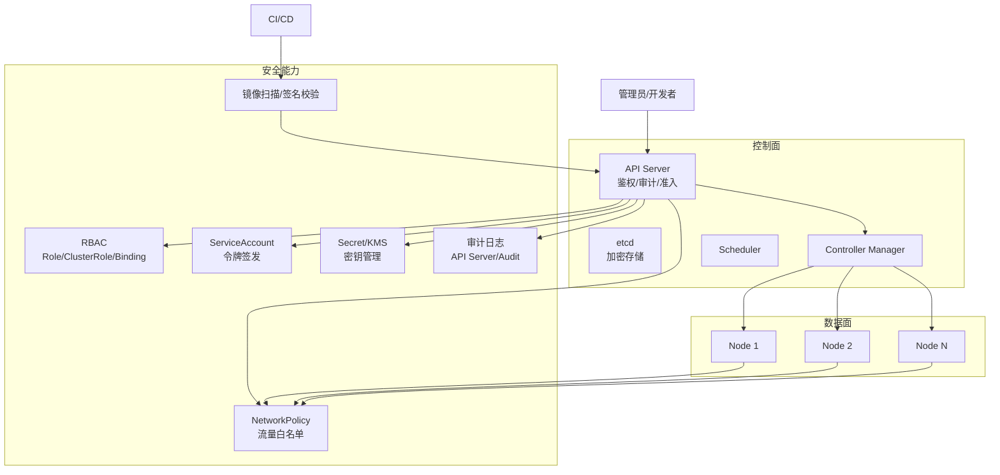
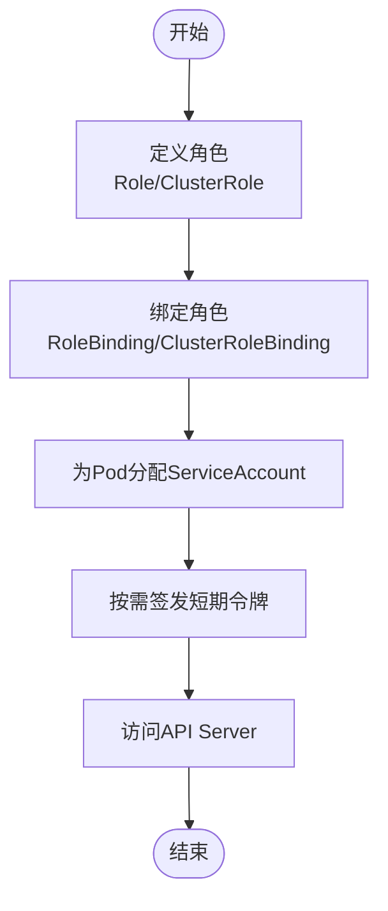
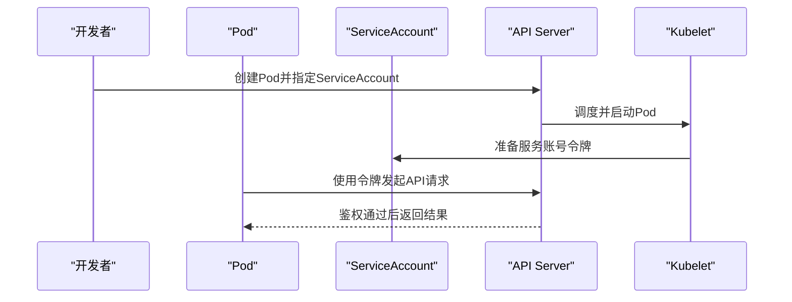
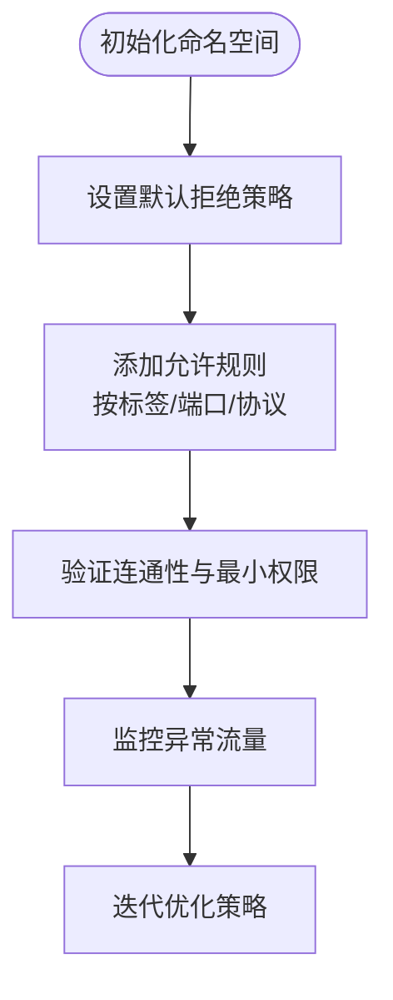
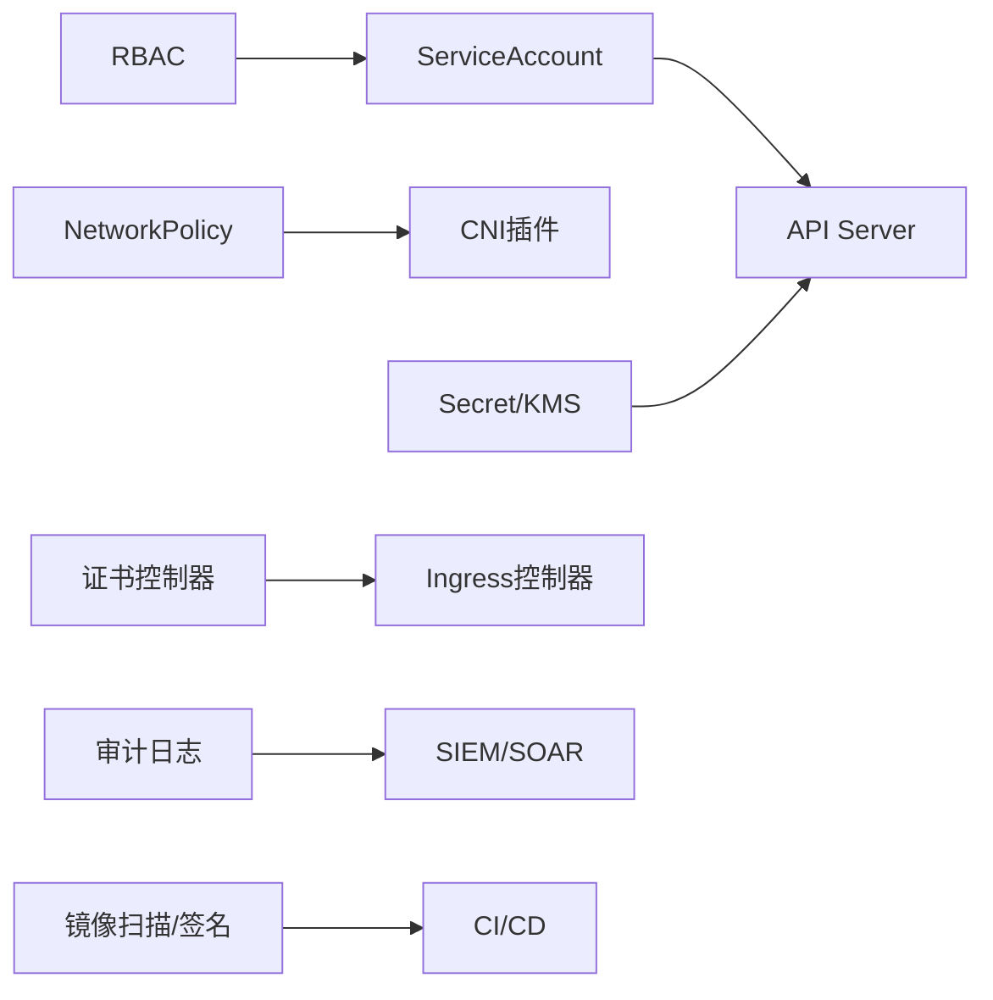

# 安全与权限控制

<cite>
**本文引用的文件**   
- [content/docs/51-k8s/080-Security.md](file://content/docs/51-k8s/080-Security.md)
</cite>

## 目录
1. [简介](#简介)
2. [项目结构](#项目结构)
3. [核心组件](#核心组件)
4. [架构总览](#架构总览)
5. [详细组件分析](#详细组件分析)
6. [依赖关系分析](#依赖关系分析)
7. [性能考虑](#性能考虑)
8. [故障排查指南](#故障排查指南)
9. [结论](#结论)
10. [附录](#附录)

## 简介
本技术文档面向Kubernetes安全与权限控制，围绕RBAC模型、ServiceAccount身份与令牌认证、网络安全策略（NetworkPolicy）、Secret与证书管理、容器镜像安全扫描与签名验证、安全上下文配置、审计日志分析与威胁检测等主题，提供系统化、可落地的最佳实践与实现方案。文档旨在帮助开发者在云原生环境中构建具备最小权限、纵深防御与可观测性的安全基线。

## 项目结构
仓库采用Hugo静态站点组织内容，与安全相关的知识集中在k8s专题下的“Security”页面中。该页面作为统一入口，聚合了Kubernetes安全相关的关键知识点与实践建议，便于读者快速定位并深入学习。

图表来源
- [content/docs/51-k8s/080-Security.md](file://content/docs/51-k8s/080-Security.md)

章节来源
- [content/docs/51-k8s/080-Security.md](file://content/docs/51-k8s/080-Security.md)

## 核心组件
本节聚焦Kubernetes安全体系中的关键能力与对象，结合仓库中的安全知识要点，给出概念性说明与落地建议：
- RBAC（基于角色的访问控制）：通过Role/ClusterRole定义权限集合，通过RoleBinding/ClusterRoleBinding将角色绑定到用户、组或ServiceAccount，遵循最小权限原则。
- ServiceAccount与令牌认证：为Pod分配专用ServiceAccount，限制其访问API Server的权限范围；结合TokenRequest API按需签发短生命周期令牌，降低泄露风险。
- 网络安全策略（NetworkPolicy）：以命名空间为单位，使用eBPF/CNI插件实现入站/出站流量白名单，隔离多租户与敏感工作负载。
- Secret与证书管理：集中管理敏感数据，结合外部密钥管理服务（如KMS、Vault）进行加密存储与动态轮换；使用Ingress/TLS控制器自动化证书颁发与续期。
- 容器镜像安全：在CI/CD流水线集成漏洞扫描与镜像签名校验，阻断不合规镜像进入集群。
- 安全上下文（SecurityContext）：限制容器运行权限（非root、只读根文件系统、禁用特权模式等），配合Pod级别的安全策略强化隔离。
- 审计与威胁检测：开启API Server审计日志，采集Kubelet、CNI、CSI等组件日志，结合SIEM/SOAR平台进行告警与响应。

章节来源
- [content/docs/51-k8s/080-Security.md](file://content/docs/51-k8s/080-Security.md)

## 架构总览
下图展示了一个典型的安全加固后的Kubernetes集群架构，涵盖身份与授权、网络隔离、机密管理与安全观测等关键面。

图表来源
- [content/docs/51-k8s/080-Security.md](file://content/docs/51-k8s/080-Security.md)

## 详细组件分析

### RBAC模型与权限边界
- 角色与绑定：
  - Role/ClusterRole用于声明对资源的读写操作集合；RoleBinding/ClusterRoleBinding将角色授予主体（User/Group/ServiceAccount）。
  - 建议按命名空间划分职责，优先使用Role+RoleBinding，仅在跨命名空间场景使用ClusterRole+ClusterRoleBinding。
- 最小权限与职责分离：
  - 为每个应用或服务创建独立ServiceAccount，避免共享默认SA。
  - 仅授予必要资源与动词，避免通配符与高敏资源（如Secret、Node、ClusterRole）滥用。
- 动态令牌与短期凭证：
  - 使用TokenRequest API为Pod签发短生命周期令牌，减少长期凭据泄露风险。
  - 结合OIDC与外部身份源，实现细粒度授权与审计追踪。

图表来源
- [content/docs/51-k8s/080-Security.md](file://content/docs/51-k8s/080-Security.md)

章节来源
- [content/docs/51-k8s/080-Security.md](file://content/docs/51-k8s/080-Security.md)

### ServiceAccount与令牌认证流程
- 身份标识：
  - 每个Pod运行于特定ServiceAccount下，自动挂载服务账号令牌至卷或环境变量。
- 令牌生命周期：
  - 支持自动轮转与短期令牌，结合API Server的令牌签发机制，提升安全性。
- 权限约束：
  - 通过RBAC严格限制ServiceAccount可访问的资源与操作，避免越权。

图表来源
- [content/docs/51-k8s/080-Security.md](file://content/docs/51-k8s/080-Security.md)

章节来源
- [content/docs/51-k8s/080-Security.md](file://content/docs/51-k8s/080-Security.md)

### 网络安全策略（NetworkPolicy）与流量控制
- 策略设计：
  - 以命名空间为边界，定义入站/出站规则，默认拒绝所有流量，再按需放行。
  - 结合标签选择器精准匹配Pod与服务，避免过度开放。
- 实施要点：
  - 确保CNI插件支持NetworkPolicy。
  - 定期审查策略有效性，清理冗余规则。
  - 对关键服务启用双向TLS与零信任访问。

图表来源
- [content/docs/51-k8s/080-Security.md](file://content/docs/51-k8s/080-Security.md)

章节来源
- [content/docs/51-k8s/080-Security.md](file://content/docs/51-k8s/080-Security.md)

### Secret管理、证书颁发与密钥轮换
- Secret管理：
  - 使用Secret对象集中存放敏感信息，避免硬编码与明文存储。
  - 结合外部密钥管理服务（KMS/Vault）进行加密与动态注入。
- 证书管理：
  - 使用Ingress控制器与证书管理器（如cert-manager）自动化TLS证书申请与续期。
  - 定期轮换证书与私钥，缩短有效期。
- 最佳实践：
  - 限制Secret访问权限，仅允许必要ServiceAccount读取。
  - 启用etcd静态加密与传输加密，保障机密数据全链路安全。

章节来源
- [content/docs/51-k8s/080-Security.md](file://content/docs/51-k8s/080-Security.md)

### 容器安全扫描、镜像签名与安全上下文
- 镜像安全：
  - 在CI/CD阶段集成漏洞扫描工具，阻断高危漏洞镜像。
  - 启用镜像签名与校验（如Cosign/Notary），确保镜像来源可信。
- 安全上下文（SecurityContext）：
  - 禁止特权模式，限制capabilities，启用只读根文件系统。
  - 以非root用户运行容器，减少攻击面。
- 运行时防护：
  - 结合PodSecurityAdmission或OPA Gatekeeper强制安全基线。
  - 启用seccomp与AppArmor，增强内核调用过滤。

章节来源
- [content/docs/51-k8s/080-Security.md](file://content/docs/51-k8s/080-Security.md)

### 安全审计日志分析与威胁检测
- 审计策略：
  - 配置API Server审计策略，记录关键操作与敏感资源访问。
  - 将审计日志输出至集中式日志系统（如ELK/Loki），并进行持久化存储。
- 威胁检测：
  - 基于规则与机器学习识别异常行为（如频繁失败登录、越权尝试）。
  - 联动SOAR平台实现自动化响应（封禁IP、吊销令牌、隔离Pod）。
- 持续改进：
  - 定期回顾审计指标，优化告警阈值与误报率。
  - 建立事件响应预案与演练机制。

章节来源
- [content/docs/51-k8s/080-Security.md](file://content/docs/51-k8s/080-Security.md)

## 依赖关系分析
- 组件耦合：
  - RBAC与ServiceAccount紧密耦合，前者定义权限，后者承载身份。
  - NetworkPolicy依赖CNI插件能力，需确保集群网络栈支持。
  - Secret与证书管理依赖外部KMS与证书控制器，形成横向集成。
- 外部依赖：
  - 镜像扫描与签名校验依赖CI/CD流水线与第三方安全工具。
  - 审计与威胁检测依赖日志采集与分析平台。

图表来源
- [content/docs/51-k8s/080-Security.md](file://content/docs/51-k8s/080-Security.md)

章节来源
- [content/docs/51-k8s/080-Security.md](file://content/docs/51-k8s/080-Security.md)

## 性能考虑
- RBAC评估开销：
  - 大量角色与复杂绑定可能增加鉴权延迟，建议精简角色数量与权限范围。
- NetworkPolicy规模：
  - 策略过多可能导致CNI性能下降，应合并相似规则与定期清理。
- 审计日志吞吐：
  - 高并发写入审计日志可能影响API Server性能，需合理配置采样率与异步落盘。
- 镜像扫描与签名：
  - 在CI阶段并行执行扫描与签名，缩短构建时间，避免阻塞发布流程。

[本节为通用指导，无需具体文件引用]

## 故障排查指南
- 鉴权失败：
  - 检查ServiceAccount是否正确绑定角色，确认令牌是否有效且未过期。
  - 查看API Server审计日志，定位具体拒绝原因。
- 网络不通：
  - 验证NetworkPolicy是否过于严格，逐步放宽规则定位问题。
  - 检查CNI插件状态与节点网络接口。
- 证书错误：
  - 确认证书控制器是否正常申请与续期，检查域名解析与DNS配置。
- 镜像拉取失败：
  - 核对镜像仓库认证信息与镜像签名校验结果。

章节来源
- [content/docs/51-k8s/080-Security.md](file://content/docs/51-k8s/080-Security.md)

## 结论
通过系统化实施RBAC、ServiceAccount、NetworkPolicy、Secret与证书管理、镜像安全与审计日志分析，可在Kubernetes集群中构建纵深防御体系。建议结合企业合规要求，制定安全基线与检查清单，持续演进安全能力，确保云原生应用的机密性、完整性与可用性。

[本节为总结性内容，无需具体文件引用]

## 附录
- 安全加固清单（示例）：
  - 启用最小权限RBAC策略，定期审计角色与绑定。
  - 为所有Pod分配专用ServiceAccount，禁用默认SA。
  - 部署NetworkPolicy，默认拒绝所有流量，按需放行。
  - 使用Secret与KMS管理敏感数据，启用etcd加密。
  - 自动化证书颁发与轮换，缩短证书有效期。
  - 在CI/CD中集成镜像扫描与签名校验。
  - 配置API Server审计日志，接入SIEM/SOAR平台。
  - 设置PodSecurityAdmission或OPA策略，强制执行安全基线。

[本节为补充材料，无需具体文件引用]