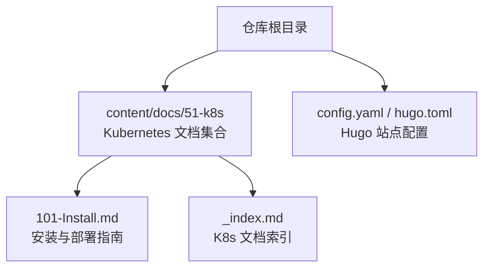
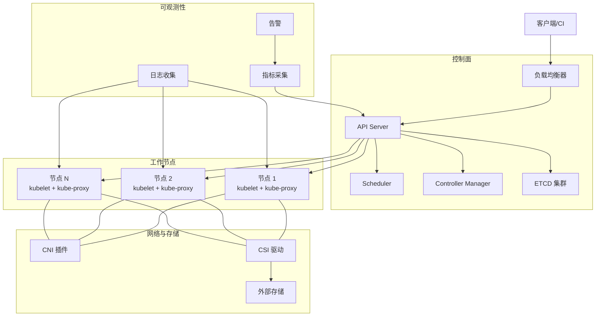
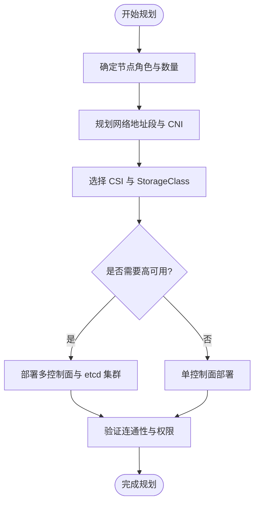
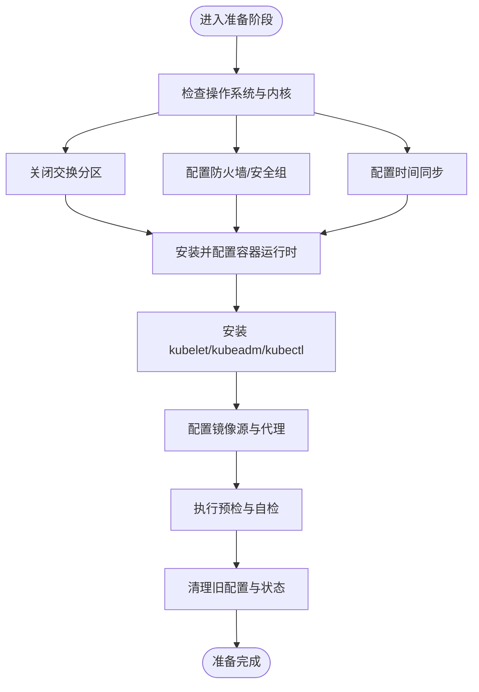
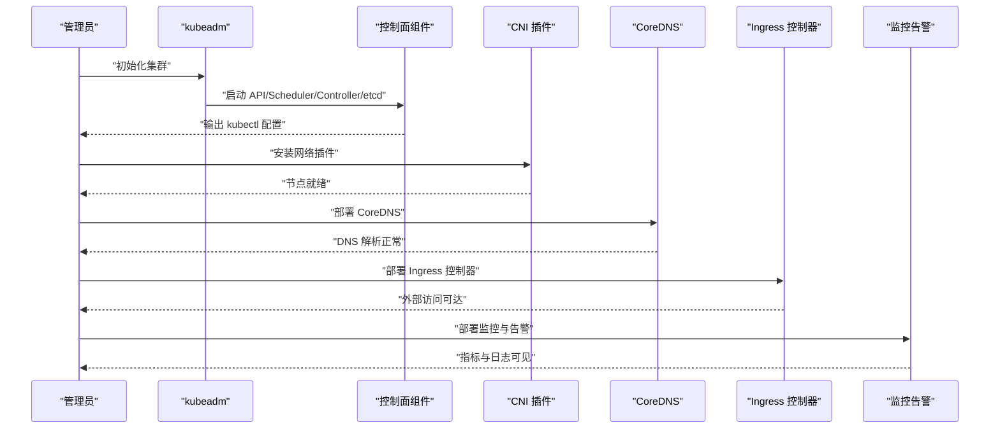
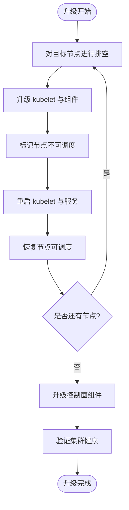
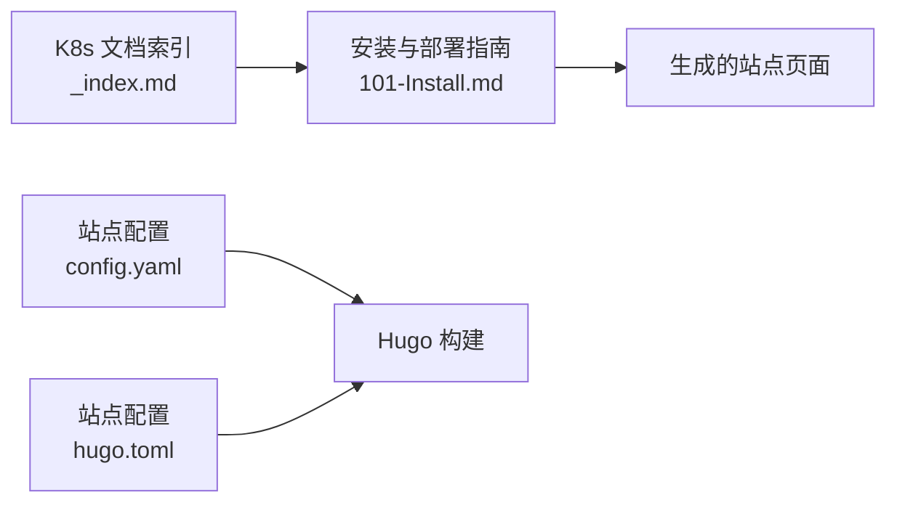

# 安装与部署

<cite>
**本文引用的文件**   
- [content/docs/51-k8s/101-Install.md](file://content/docs/51-k8s/101-Install.md)
- [content/docs/51-k8s/_index.md](file://content/docs/51-k8s/_index.md)
- [config.yaml](file://config.yaml)
- [hugo.toml](file://hugo.toml)
</cite>

## 目录
1. [简介](#简介)
2. [项目结构](#项目结构)
3. [核心组件](#核心组件)
4. [架构总览](#架构总览)
5. [详细组件分析](#详细组件分析)
6. [依赖关系分析](#依赖关系分析)
7. [性能考虑](#性能考虑)
8. [故障排查指南](#故障排查指南)
9. [结论](#结论)
10. [附录](#附录)

## 简介
本指南面向运维工程师与平台团队，提供在多种场景下搭建 Kubernetes 集群的完整操作指引。内容覆盖：
- 多工具安装方式对比与适用场景（kubeadm、minikube、kind）
- 生产环境集群规划（节点角色、网络、存储、高可用）
- 安装前准备（Linux 发行版兼容性检查、内核与依赖项）
- 初始化与基础配置（DNS、Ingress、监控告警）
- 升级、备份恢复与故障转移流程
- 常见问题排查与性能调优建议

## 项目结构
仓库采用 Hugo Book 主题组织文档，Kubernetes 相关文档位于 content/docs/51-k8s 目录下，其中安装指南为独立页面。站点构建配置位于根目录的配置文件。

图表来源
- [content/docs/51-k8s/101-Install.md](file://content/docs/51-k8s/101-Install.md)
- [content/docs/51-k8s/_index.md](file://content/docs/51-k8s/_index.md)
- [config.yaml](file://config.yaml)
- [hugo.toml](file://hugo.toml)

章节来源
- [content/docs/51-k8s/_index.md](file://content/docs/51-k8s/_index.md)
- [config.yaml](file://config.yaml)
- [hugo.toml](file://hugo.toml)

## 核心组件
本节聚焦于“安装与部署”文档的核心组成与编排逻辑，帮助读者快速定位关键步骤与注意事项。

- 安装方式对比与选型
  - kubeadm：适合生产与自定义环境，灵活度高，需自行集成 CNI/CSI/Ingress 等生态组件。
  - minikube：本地开发与教学演示，一键启动单节点集群，便于快速验证。
  - kind：基于容器的本地集群，适合 CI/CD 与自动化测试。
- 生产环境规划要点
  - 节点角色划分：控制面节点与工作节点分离；根据规模设置 etcd 与 API Server 副本数。
  - 网络规划：Pod CIDR、Service CIDR、NodePort 范围、CNI 插件选择与 IPAM 策略。
  - 存储配置：CSI 驱动、StorageClass、动态卷供给与快照/克隆能力。
  - 高可用设计：多控制面节点、负载均衡器、etcd 集群与外部数据库可选。
- 安装前准备
  - Linux 发行版兼容性检查：内核版本、模块加载、系统服务与端口占用。
  - 依赖项准备：容器运行时、kubelet/kubeadm/kubectl 版本对齐、镜像源与代理。
- 初始化与基础配置
  - 集群初始化参数与证书管理。
  - DNS 解析与 CoreDNS 配置。
  - Ingress 控制器部署与域名路由。
  - 监控告警：指标采集、日志收集与告警规则。
- 生命周期管理
  - 版本升级路径与回滚策略。
  - 备份恢复：etcd 快照与集群资源导出。
  - 故障转移：控制面与数据面故障处理。
- 问题排查与性能调优
  - 常见安装失败原因与修复步骤。
  - 调度、网络、存储与系统层面的优化建议。

章节来源
- [content/docs/51-k8s/101-Install.md](file://content/docs/51-k8s/101-Install.md)

## 架构总览
下图展示典型生产级 Kubernetes 集群的高层架构，包括控制面、工作节点、网络与存储以及可观测性组件。

图表来源
- [content/docs/51-k8s/101-Install.md](file://content/docs/51-k8s/101-Install.md)

## 详细组件分析

### 安装方式对比与选型
- kubeadm
  - 优点：生产就绪、高度可定制、生态完善。
  - 缺点：需要较多前置准备与后续集成。
  - 适用：企业生产、私有云、混合云。
- minikube
  - 优点：本地快速体验、开箱即用。
  - 缺点：非生产特性、扩展受限。
  - 适用：开发、教学、功能验证。
- kind
  - 优点：容器化集群、易于脚本化与并行测试。
  - 缺点：I/O 与网络模拟有限。
  - 适用：CI/CD、自动化测试、开发者本地环境。

章节来源
- [content/docs/51-k8s/101-Install.md](file://content/docs/51-k8s/101-Install.md)

### 生产环境集群规划
- 节点角色划分
  - 控制面节点：承载 API Server、Scheduler、Controller Manager、etcd。
  - 工作节点：运行 Pod 与系统守护进程（kubelet、kube-proxy）。
  - 隔离策略：通过污点与容忍度将系统组件与应用负载隔离。
- 网络规划
  - 地址段：合理分配 Pod CIDR、Service CIDR，避免与宿主机网络冲突。
  - CNI 选择：根据需求选择 Flannel、Calico、Cilium 等，关注 IPAM 与策略模型。
  - 出口与入站：NodePort、LoadBalancer、Ingress 入口策略与防火墙规则。
- 存储配置
  - CSI 驱动：对接云厂商或自建存储，定义 StorageClass 与配额策略。
  - 数据持久化：StatefulSet 与 PVC/PV 绑定，快照与克隆能力评估。
- 高可用架构
  - 多控制面节点与 etcd 副本，结合负载均衡器对外暴露 API。
  - 跨机房/跨可用区部署，提升容灾能力。

图表来源
- [content/docs/51-k8s/101-Install.md](file://content/docs/51-k8s/101-Install.md)

章节来源
- [content/docs/51-k8s/101-Install.md](file://content/docs/51-k8s/101-Install.md)

### 安装前准备与依赖项
- 发行版兼容性检查
  - 内核版本与模块：确认所需内核版本与模块加载状态。
  - 系统服务：关闭交换分区、禁用防火墙或放行必要端口。
  - 时间同步：确保 NTP/Chrony 正常。
- 依赖项准备
  - 容器运行时：Docker 或 containerd 的安装与配置。
  - 组件版本对齐：kubelet、kubeadm、kubectl 版本一致。
  - 镜像源与代理：配置国内镜像源与网络代理。
- 预检与自检
  - 使用预检命令检查系统环境与依赖。
  - 清理残留配置与旧集群状态。

图表来源
- [content/docs/51-k8s/101-Install.md](file://content/docs/51-k8s/101-Install.md)

章节来源
- [content/docs/51-k8s/101-Install.md](file://content/docs/51-k8s/101-Install.md)

### 集群初始化与基础配置
- 初始化流程
  - 生成初始化配置与证书。
  - 拉取与控制面组件镜像。
  - 加入工作节点与网络插件安装。
- DNS 设置
  - CoreDNS 部署与配置。
  - 自定义上游 DNS 与转发策略。
- Ingress 控制器
  - 选择控制器（如 Nginx、Traefik）。
  - 配置域名、TLS 与后端服务。
- 监控告警
  - 指标采集（Prometheus）、日志收集（Fluent Bit/EFK）、告警（Alertmanager）。
  - 仪表盘与可视化（Grafana）。

图表来源
- [content/docs/51-k8s/101-Install.md](file://content/docs/51-k8s/101-Install.md)

章节来源
- [content/docs/51-k8s/101-Install.md](file://content/docs/51-k8s/101-Install.md)

### 升级、备份恢复与故障转移
- 版本升级
  - 升级顺序：先升级工作节点，再升级控制面。
  - 灰度与回滚：分批升级，保留旧版本镜像与配置。
- 备份恢复
  - etcd 快照定期备份与异地存储。
  - 集群资源导出与导入（命名空间级别）。
- 故障转移
  - 控制面节点故障：自动选举与负载均衡切换。
  - 数据面节点故障：Pod 重新调度与副本重建。

图表来源
- [content/docs/51-k8s/101-Install.md](file://content/docs/51-k8s/101-Install.md)

章节来源
- [content/docs/51-k8s/101-Install.md](file://content/docs/51-k8s/101-Install.md)

### 常见问题排查
- 节点无法加入集群
  - 检查证书与时间同步。
  - 核对端口与网络连通性。
- Pod 无法通信
  - 核查 CNI 插件状态与 IPAM 分配。
  - 检查防火墙与安全组规则。
- 存储卷挂载失败
  - 校验 CSI 驱动与凭证。
  - 检查后端存储容量与配额。
- 监控与日志缺失
  - 确认采集组件运行状态与权限。
  - 检查日志路径与磁盘空间。

章节来源
- [content/docs/51-k8s/101-Install.md](file://content/docs/51-k8s/101-Install.md)

### 性能调优建议
- 系统层面
  - 调整内核参数（网络缓冲、文件描述符、TCP 队列）。
  - 关闭不必要的服务与模块，释放资源。
- 调度与资源
  - 设置资源请求与限制，避免过载。
  - 使用亲和性与反亲和性优化分布。
- 网络与存储
  - 选择合适的 CNI 与 CSI 驱动，启用零拷贝与批处理。
  - 合理设置 I/O 调度与缓存策略。
- 可观测性
  - 采样率与保留周期平衡。
  - 告警阈值与降噪策略。

章节来源
- [content/docs/51-k8s/101-Install.md](file://content/docs/51-k8s/101-Install.md)

## 依赖关系分析
本节从文档组织角度说明各文件之间的关联关系，帮助读者理解文档导航与构建配置。

图表来源
- [content/docs/51-k8s/_index.md](file://content/docs/51-k8s/_index.md)
- [content/docs/51-k8s/101-Install.md](file://content/docs/51-k8s/101-Install.md)
- [config.yaml](file://config.yaml)
- [hugo.toml](file://hugo.toml)

章节来源
- [content/docs/51-k8s/_index.md](file://content/docs/51-k8s/_index.md)
- [config.yaml](file://config.yaml)
- [hugo.toml](file://hugo.toml)

## 性能考虑
- 控制面资源预留：为 API Server、Scheduler、Controller Manager 与 etcd 预留足够 CPU 与内存。
- 工作节点超分策略：根据应用特征谨慎超分，避免抖动。
- 网络吞吐优化：调整网卡队列与中断亲和，启用多队列。
- 存储 I/O 优化：选择高性能介质与合适的块大小，减少随机写。
- 监控与告警：建立容量与性能基线，提前预警瓶颈。

[本节为通用指导，不直接分析具体文件]

## 故障排查指南
- 预检失败
  - 逐项对照预检结果，修复系统依赖与端口占用。
- 证书过期或错误
  - 重置证书并重新初始化控制面。
- 网络不通
  - 检查 CNI 日志与节点间连通性。
- 存储异常
  - 查看 CSI 驱动日志与后端存储状态。
- 监控缺失
  - 检查采集组件权限与资源配额。

章节来源
- [content/docs/51-k8s/101-Install.md](file://content/docs/51-k8s/101-Install.md)

## 结论
通过本指南，您可以依据不同场景选择合适的安装方式，完成从环境准备到生产上线的全流程部署。建议在正式环境实施前进行充分演练与压测，建立完善的监控与告警体系，并制定清晰的升级与回滚策略，以确保集群稳定与业务连续性。

[本节为总结性内容，不直接分析具体文件]

## 附录
- 术语表
  - CNI：容器网络接口
  - CSI：容器存储接口
  - Ingress：七层流量入口
  - etcd：分布式键值存储
- 参考链接
  - 官方文档与社区资源可在安装指南页面内获取。

[本节为补充信息，不直接分析具体文件]