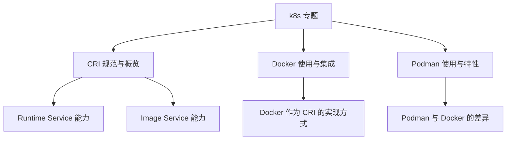
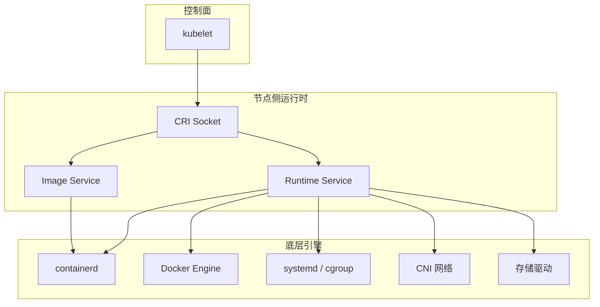
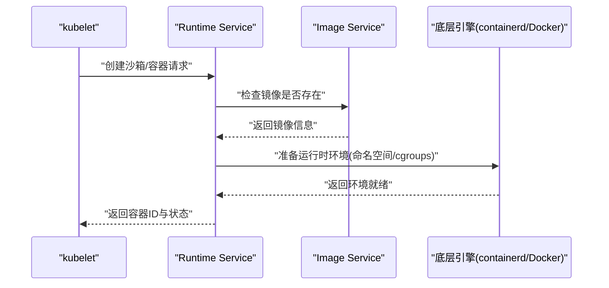
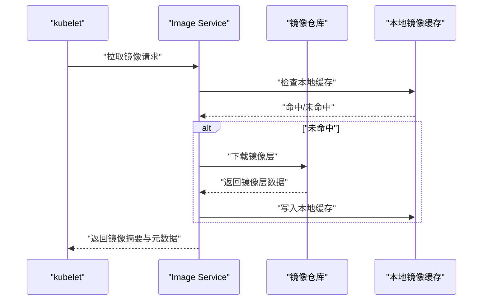
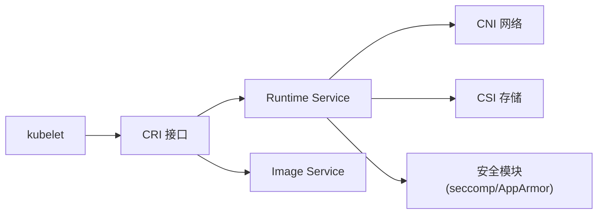

# 容器运行时接口(CRI)

<cite>
**本文引用的文件**   
- [050-CRI.md](file://content/docs/51-k8s/050-CRI.md)
- [103-Podman.md](file://content/docs/51-k8s/103-Podman.md)
- [104-docker.md](file://content/docs/51-k8s/104-docker.md)
</cite>

## 目录
1. [简介](#简介)
2. [项目结构](#项目结构)
3. [核心组件](#核心组件)
4. [架构总览](#架构总览)
5. [详细组件分析](#详细组件分析)
6. [依赖关系分析](#依赖关系分析)
7. [性能考量](#性能考量)
8. [故障排除指南](#故障排除指南)
9. [结论](#结论)
10. [附录](#附录)

## 简介
本章节面向希望系统理解并选用容器运行时方案的开发者与运维工程师，围绕容器运行时接口（CRI）的设计目标、接口定义、主流实现差异、插件开发流程、性能对比与选型建议展开。文档同时提供实际使用示例与常见问题的排查思路，帮助读者在 Kubernetes 生态中做出合适的运行时选择。

## 项目结构
仓库中与 CRI 相关的文档主要位于 k8s 专题目录下，包含 CRI 规范说明、Docker 与 Podman 的使用与差异对比等。下图展示了与本主题直接相关的文档组织：

图表来源
- [050-CRI.md](file://content/docs/51-k8s/050-CRI.md)
- [104-docker.md](file://content/docs/51-k8s/104-docker.md)
- [103-Podman.md](file://content/docs/51-k8s/103-Podman.md)

章节来源
- [050-CRI.md](file://content/docs/51-k8s/050-CRI.md)
- [104-docker.md](file://content/docs/51-k8s/104-docker.md)
- [103-Podman.md](file://content/docs/51-k8s/103-Podman.md)

## 核心组件
本节聚焦 CRI 的两个核心服务：Runtime Service 与 Image Service，概述其职责边界与典型交互点。

- Runtime Service
  - 负责容器的生命周期管理，包括创建、启动、停止、删除容器；执行命令；获取状态与日志；管理沙箱（Pod 级别运行环境）等。
  - 与 kubelet 的调度与编排逻辑紧密协作，确保 Pod 的状态与实际节点上的运行态一致。
- Image Service
  - 负责镜像拉取、解析、缓存与清理；提供镜像元数据查询；支持多源镜像仓库与签名校验等。
  - 为 Runtime Service 提供镜像资源保障，是容器快速启动的关键路径之一。

章节来源
- [050-CRI.md](file://content/docs/51-k8s/050-CRI.md)

## 架构总览
下图展示 kubelet 通过 CRI 与不同运行时实现的交互关系，以及镜像服务在其中的作用。

图表来源
- [050-CRI.md](file://content/docs/51-k8s/050-CRI.md)
- [104-docker.md](file://content/docs/51-k8s/104-docker.md)
- [103-Podman.md](file://content/docs/51-k8s/103-Podman.md)

## 详细组件分析

### CRI 接口与服务划分
- 接口分层
  - Runtime Service：面向容器与沙箱的生命周期操作，强调高吞吐与低延迟。
  - Image Service：面向镜像资源的获取与元数据管理，强调可靠性与可观测性。
- 调用路径
  - kubelet 通过 gRPC 调用 CRI 接口，运行时实现以本地进程或 Unix Socket 形式提供服务。
- 扩展点
  - 通过自定义运行时实现 CRI 接口，接入 Kubernetes 生态；结合 CNI/CSI 完成网络与存储能力补齐。

章节来源
- [050-CRI.md](file://content/docs/51-k8s/050-CRI.md)

### Docker 作为 CRI 实现的特点
- 角色定位
  - Docker 可通过 CRI shim 或直接集成方式被 kubelet 使用，提供 Runtime Service 与 Image Service 能力。
- 优势
  - 生态成熟、工具链完善、社区广泛；适合已有 Docker 技术栈的团队平滑迁移。
- 注意事项
  - 在生产集群中更常见的做法是使用 containerd 作为底层运行时，Docker 更多用于开发与调试场景。

章节来源
- [104-docker.md](file://content/docs/51-k8s/104-docker.md)

### containerd 作为 CRI 实现的特点
- 角色定位
  - containerd 是云原生标准的轻量级容器运行时，天然契合 CRI 设计，提供高性能的 Runtime 与 Image 服务。
- 优势
  - 资源占用更低、启动更快、稳定性强；与 Kubernetes 深度集成，具备完善的监控与排障能力。
- 适用场景
  - 大规模生产集群、对性能与稳定性要求较高的工作负载。

章节来源
- [050-CRI.md](file://content/docs/51-k8s/050-CRI.md)

### Podman 与 Docker 的差异对比
- 容器管理
  - Podman 采用无守护进程模型，强调安全隔离与用户态管理；Docker 采用客户端-服务端模型，功能丰富但依赖守护进程。
- 镜像构建
  - 两者均支持构建镜像，但工具链与最佳实践存在差异；Podman 可与 Buildah 协同，提供更灵活的构建体验。
- 网络配置
  - Podman 默认网络模型与 Docker 不同，需结合 CNI 或 Podman 内置网络进行适配；Docker 在网络方面生态更为成熟。

章节来源
- [103-Podman.md](file://content/docs/51-k8s/103-Podman.md)
- [104-docker.md](file://content/docs/51-k8s/104-docker.md)

### CRI 插件开发与自定义运行时实现
- 开发流程
  - 明确需求与边界：确定需要实现的 Runtime/Image 服务方法。
  - 选择语言与框架：Go 生态下可使用官方 CRI 库简化 gRPC 绑定与序列化。
  - 实现核心逻辑：对接底层容器引擎（如 runc、crun）、镜像拉取器、网络与存储驱动。
  - 测试与验证：编写单元测试与端到端测试，覆盖关键路径与异常分支。
  - 部署与集成：以 Unix Socket 暴露 CRI 接口，配置 kubelet 连接。
- 最佳实践
  - 错误处理与重试策略要清晰；日志与指标要完备；避免阻塞主循环；合理设置超时与并发度。

章节来源
- [050-CRI.md](file://content/docs/51-k8s/050-CRI.md)

### 关键流程时序图

#### 容器创建与启动（kubelet → CRI Runtime Service）

图表来源
- [050-CRI.md](file://content/docs/51-k8s/050-CRI.md)

#### 镜像拉取流程（kubelet → CRI Image Service）

图表来源
- [050-CRI.md](file://content/docs/51-k8s/050-CRI.md)

## 依赖关系分析
- 组件耦合
  - kubelet 仅依赖 CRI 接口契约，不感知具体运行时实现，具备良好的解耦性。
  - Runtime Service 与 Image Service 通常由同一运行时进程提供，也可拆分部署。
- 外部依赖
  - 网络：通过 CNI 插件提供 Pod 网络能力。
  - 存储：通过 CSI 插件提供持久化存储能力。
  - 安全：与 seccomp、AppArmor、SELinux 等内核机制配合。

图表来源
- [050-CRI.md](file://content/docs/51-k8s/050-CRI.md)

章节来源
- [050-CRI.md](file://content/docs/51-k8s/050-CRI.md)

## 性能考量
- 启动时延
  - containerd 通常具备更快的镜像拉取与容器启动速度，适合大规模弹性伸缩场景。
- 资源占用
  - 无守护进程模型（如 Podman）可降低常驻内存与系统调用开销，但在集群编排场景中需权衡与 kubelet 的集成复杂度。
- 镜像缓存
  - 合理的镜像分层与缓存策略能显著降低网络带宽与磁盘 IO 压力。
- 并发与限流
  - 在高并发拉取与启动场景下，应设置合理的并发度与速率限制，避免影响节点稳定性。

[本节为通用指导，不直接分析具体文件]

## 故障排除指南
- 常见问题
  - 镜像拉取失败：检查镜像仓库可达性与认证配置；确认镜像摘要与本地缓存一致性。
  - 容器启动失败：查看运行时日志与事件；核对 cgroup 权限与内核参数。
  - 网络不可用：验证 CNI 插件状态与配置；检查节点网络命名空间与路由表。
- 诊断步骤
  - 使用 kubelet 事件与日志定位问题阶段（镜像、沙箱、容器）。
  - 通过运行时提供的诊断接口获取运行时内部状态与指标。
  - 复现最小用例，逐步缩小问题范围。

章节来源
- [050-CRI.md](file://content/docs/51-k8s/050-CRI.md)
- [104-docker.md](file://content/docs/51-k8s/104-docker.md)
- [103-Podman.md](file://content/docs/51-k8s/103-Podman.md)

## 结论
- 对于生产级 Kubernetes 集群，推荐优先评估基于 containerd 的 CRI 实现，以获得更好的性能与稳定性。
- 若团队已深度使用 Docker，可在过渡期采用 Docker 作为 CRI 实现，但长期建议向 containerd 迁移。
- Podman 在无守护进程与安全隔离方面有独特优势，适合特定场景与工具链整合，但在集群编排集成上需额外投入。
- 自定义运行时开发应以 CRI 接口为契约，结合 CNI/CSI 补齐网络与存储能力，并通过完善的测试与可观测性保障质量。

[本节为总结性内容，不直接分析具体文件]

## 附录
- 术语速查
  - CRI：容器运行时接口，定义 kubelet 与运行时之间的标准通信协议。
  - Runtime Service：负责容器与沙箱生命周期的服务。
  - Image Service：负责镜像拉取与元数据管理的服务。
  - CNI：容器网络接口，提供 Pod 网络能力。
  - CSI：容器存储接口，提供持久化存储能力。

[本节为概念性内容，不直接分析具体文件]