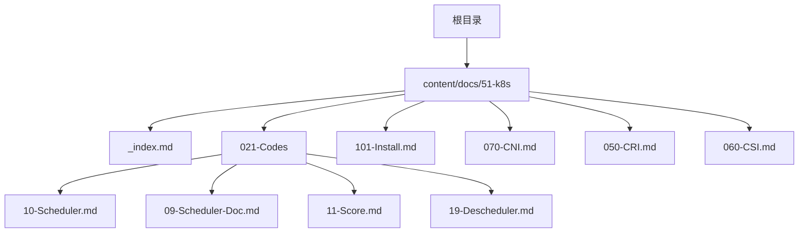
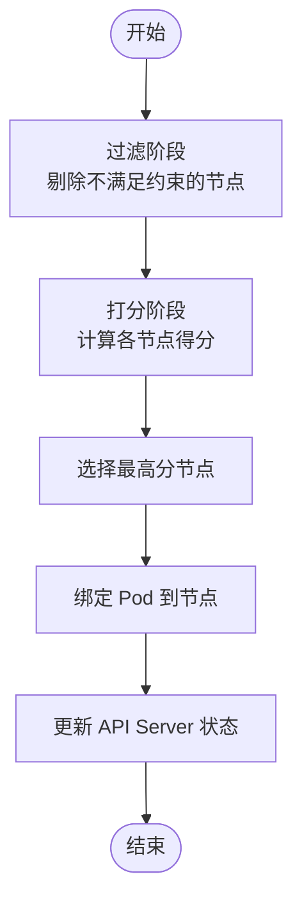
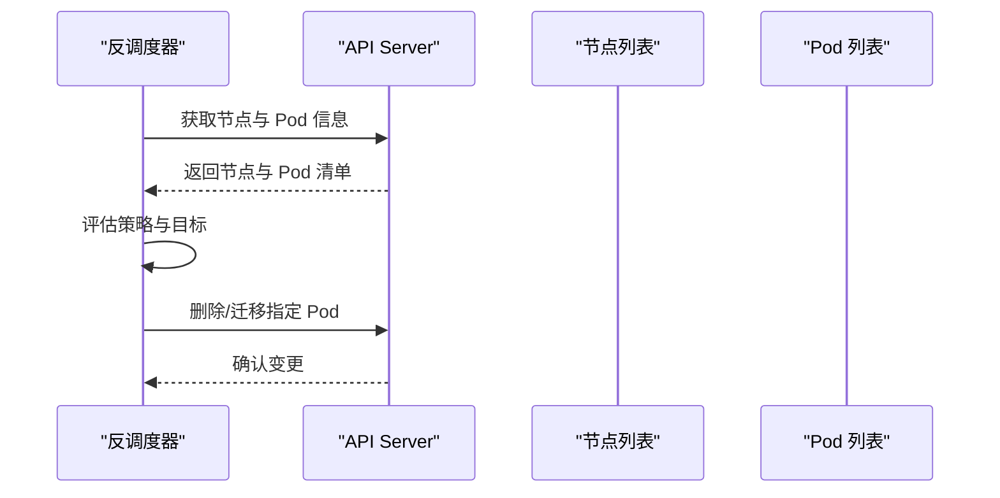
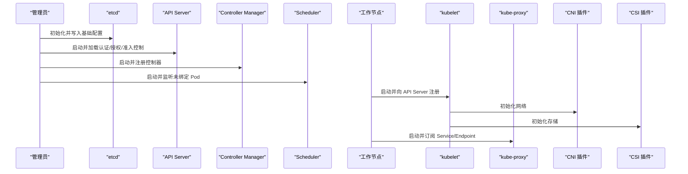
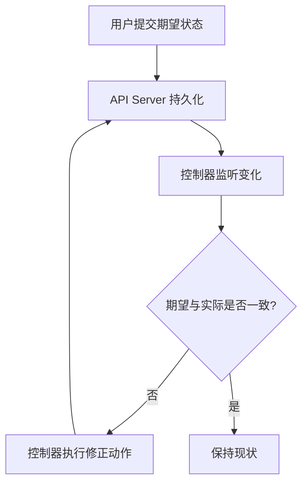
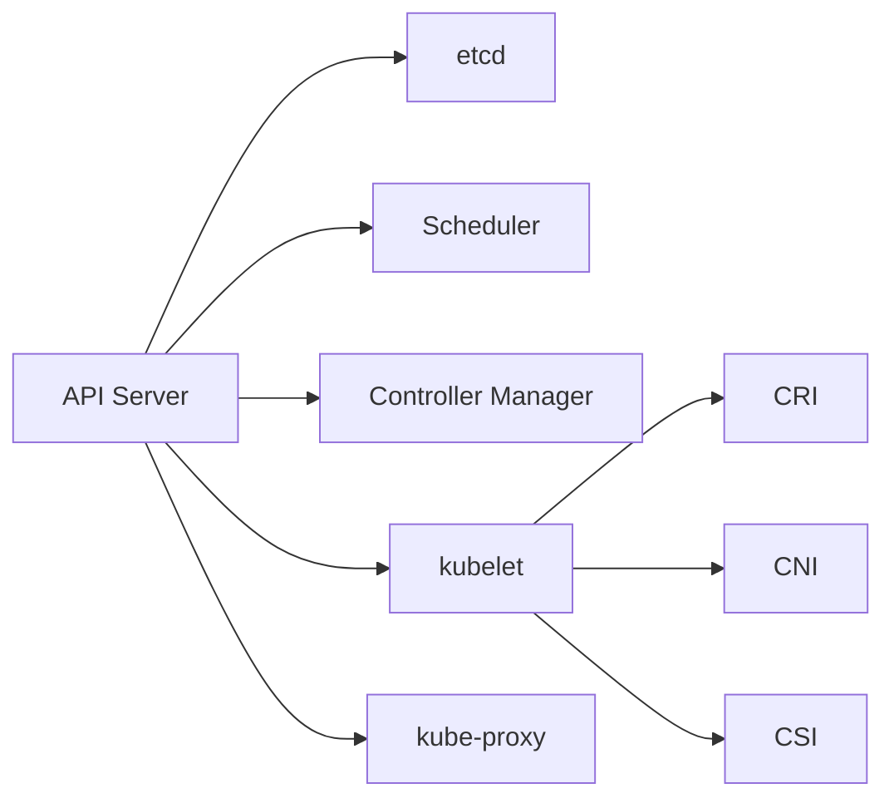

# 核心架构与组件

<cite>
**本文引用的文件**   
- [content/docs/51-k8s/_index.md](file://content/docs/51-k8s/_index.md)
- [content/docs/51-k8s/021-Codes/10-Scheduler.md](file://content/docs/51-k8s/021-Codes/10-Scheduler.md)
- [content/docs/51-k8s/021-Codes/09-Scheduler-Doc.md](file://content/docs/51-k8s/021-Codes/09-Scheduler-Doc.md)
- [content/docs/51-k8s/021-Codes/11-Score.md](file://content/docs/51-k8s/021-Codes/11-Score.md)
- [content/docs/51-k8s/021-Codes/19-Descheduler.md](file://content/docs/51-k8s/021-Codes/19-Descheduler.md)
- [content/docs/51-k8s/101-Install.md](file://content/docs/51-k8s/101-Install.md)
- [content/docs/51-k8s/070-CNI.md](file://content/docs/51-k8s/070-CNI.md)
- [content/docs/51-k8s/050-CRI.md](file://content/docs/51-k8s/050-CRI.md)
- [content/docs/51-k8s/060-CSI.md](file://content/docs/51-k8s/060-CSI.md)
</cite>

## 目录
1. [简介](#简介)
2. [项目结构](#项目结构)
3. [核心组件](#核心组件)
4. [架构总览](#架构总览)
5. [详细组件分析](#详细组件分析)
6. [依赖关系分析](#依赖关系分析)
7. [性能考量](#性能考量)
8. [故障排查指南](#故障排查指南)
9. [结论](#结论)
10. [附录](#附录)

## 简介
本章节面向希望系统理解 Kubernetes 控制平面与工作节点架构、资源模型与控制器模式的读者。文档基于仓库中 k8s 专题内容，围绕以下主题展开：
- 控制平面组件（API Server、etcd、Scheduler、Controller Manager）的职责与交互
- 工作节点组件（kubelet、kube-proxy）的职责与数据流
- 核心资源对象（Pod、Service、Deployment、StatefulSet）的概念与使用场景
- 声明式 API 与控制器模式的工作原理
- 集群初始化流程、组件启动顺序与数据同步机制
- 架构图与通信流程图，帮助开发者建立云原生基础设施的整体认知

## 项目结构
仓库采用 Hugo 静态站点组织技术文档，k8s 相关内容集中在 content/docs/51-k8s 目录下，包含安装、调度器源码解读、CNI/CRI/CSI 等扩展接口说明等。该结构便于按主题快速定位到对应知识点。



图表来源
- [content/docs/51-k8s/_index.md](file://content/docs/51-k8s/_index.md)
- [content/docs/51-k8s/021-Codes/10-Scheduler.md](file://content/docs/51-k8s/021-Codes/10-Scheduler.md)
- [content/docs/51-k8s/021-Codes/09-Scheduler-Doc.md](file://content/docs/51-k8s/021-Codes/09-Scheduler-Doc.md)
- [content/docs/51-k8s/021-Codes/11-Score.md](file://content/docs/51-k8s/021-Codes/11-Score.md)
- [content/docs/51-k8s/021-Codes/19-Descheduler.md](file://content/docs/51-k8s/021-Codes/19-Descheduler.md)
- [content/docs/51-k8s/101-Install.md](file://content/docs/51-k8s/101-Install.md)
- [content/docs/51-k8s/070-CNI.md](file://content/docs/51-k8s/070-CNI.md)
- [content/docs/51-k8s/050-CRI.md](file://content/docs/51-k8s/050-CRI.md)
- [content/docs/51-k8s/060-CSI.md](file://content/docs/51-k8s/060-CSI.md)

章节来源
- [content/docs/51-k8s/_index.md](file://content/docs/51-k8s/_index.md)

## 核心组件
本节概述控制平面与工作节点的关键角色及其职责边界，为后续深入分析奠定基础。

- 控制平面
  - API Server：统一入口，提供声明式 REST/gRPC API，负责鉴权、审计、准入控制与存储读写协调
  - etcd：强一致分布式键值存储，保存集群状态与配置
  - Scheduler：根据约束与策略将 Pod 调度到合适节点
  - Controller Manager：运行各类内置控制器（如 Deployment、ReplicaSet、Node、Endpoint 等），驱动集群状态收敛

- 工作节点
  - kubelet：节点代理，接收并管理 Pod 生命周期，调用 CRI 创建容器，上报节点与 Pod 状态
  - kube-proxy：维护网络规则，实现 Service 的负载均衡与访问转发

- 扩展接口
  - CRI：容器运行时接口，抽象底层容器引擎差异
  - CNI：容器网络接口，定义网络插件能力
  - CSI：容器存储接口，抽象存储后端能力

章节来源
- [content/docs/51-k8s/101-Install.md](file://content/docs/51-k8s/101-Install.md)
- [content/docs/51-k8s/050-CRI.md](file://content/docs/51-k8s/050-CRI.md)
- [content/docs/51-k8s/070-CNI.md](file://content/docs/51-k8s/070-CNI.md)
- [content/docs/51-k8s/060-CSI.md](file://content/docs/51-k8s/060-CSI.md)

## 架构总览
下图展示典型单控制平面集群的组件拓扑与主要数据流向。

```mermaid
graph TB
subgraph "控制平面"
APIServer["API Server"]
ETCD["etcd"]
Scheduler["Scheduler"]
CM["Controller Manager"]
end
subgraph "工作节点"
Kubelet["kubelet"]
Proxy["kube-proxy"]
Runtime["CRI 容器运行时"]
CNI["CNI 网络插件"]
CSI["CSI 存储插件"]
end
Client["客户端(kubectl/SDK)"] --> APIServer
APIServer < --> ETCD
APIServer --> Scheduler
APIServer --> CM
CM --> APIServer
Scheduler --> APIServer
APIServer --> Kubelet
Kubelet --> Runtime
Kubelet --> CNI
Kubelet --> CSI
Proxy --> APIServer
```

图表来源
- [content/docs/51-k8s/101-Install.md](file://content/docs/51-k8s/101-Install.md)
- [content/docs/51-k8s/050-CRI.md](file://content/docs/51-k8s/050-CRI.md)
- [content/docs/51-k8s/070-CNI.md](file://content/docs/51-k8s/070-CNI.md)
- [content/docs/51-k8s/060-CSI.md](file://content/docs/51-k8s/060-CSI.md)

## 详细组件分析

### 调度器（Scheduler）深度解析
调度器是控制平面的关键决策者，负责将待调度 Pod 绑定到合适的节点。其核心流程包括：
- 过滤阶段：依据节点资源、亲和性、污点容忍等约束剔除不满足条件的节点
- 打分阶段：对候选节点进行评分，选择最优节点
- 绑定阶段：将 Pod 与节点绑定，更新 API Server 状态



图表来源
- [content/docs/51-k8s/021-Codes/10-Scheduler.md](file://content/docs/51-k8s/021-Codes/10-Scheduler.md)
- [content/docs/51-k8s/021-Codes/11-Score.md](file://content/docs/51-k8s/021-Codes/11-Score.md)

章节来源
- [content/docs/51-k8s/021-Codes/10-Scheduler.md](file://content/docs/51-k8s/021-Codes/10-Scheduler.md)
- [content/docs/51-k8s/021-Codes/09-Scheduler-Doc.md](file://content/docs/51-k8s/021-Codes/09-Scheduler-Doc.md)
- [content/docs/51-k8s/021-Codes/11-Score.md](file://content/docs/51-k8s/021-Codes/11-Score.md)

### 反调度器（Descheduler）
反调度器用于在集群运行期优化 Pod 分布，解决负载不均、节点压力过大等问题。常见策略包括：
- 驱逐低优先级或可迁移的 Pod
- 重新平衡跨节点的副本分布
- 清理孤立或长期未使用的资源



图表来源
- [content/docs/51-k8s/021-Codes/19-Descheduler.md](file://content/docs/51-k8s/021-Codes/19-Descheduler.md)

章节来源
- [content/docs/51-k8s/021-Codes/19-Descheduler.md](file://content/docs/51-k8s/021-Codes/19-Descheduler.md)

### 集群初始化与组件启动顺序
典型的单控制平面集群初始化步骤如下：
- 准备 etcd 并生成证书与配置文件
- 启动 API Server，完成认证、授权、准入控制链路与存储后端连接
- 启动 Controller Manager，注册并运行内置控制器
- 启动 Scheduler，监听未绑定 Pod 事件
- 在工作节点上启动 kubelet，向 API Server 注册节点并拉取 Pod 规范
- 启动 kube-proxy，订阅 Service 与 Endpoint 变化并下发网络规则
- 部署 CNI 与 CSI 插件，使节点具备网络与存储能力



图表来源
- [content/docs/51-k8s/101-Install.md](file://content/docs/51-k8s/101-Install.md)
- [content/docs/51-k8s/070-CNI.md](file://content/docs/51-k8s/070-CNI.md)
- [content/docs/51-k8s/060-CSI.md](file://content/docs/51-k8s/060-CSI.md)

章节来源
- [content/docs/51-k8s/101-Install.md](file://content/docs/51-k8s/101-Install.md)

### 控制器模式与声明式 API
Kubernetes 通过“期望状态 vs 实际状态”的闭环实现自愈与自动化：
- 用户通过 API Server 提交期望状态（如 Deployment 的副本数）
- 控制器持续观察当前状态，并与期望状态比较
- 若存在偏差，控制器执行操作以消除差异（如创建/删除 Pod）
- 最终集群状态收敛至期望状态



图表来源
- [content/docs/51-k8s/101-Install.md](file://content/docs/51-k8s/101-Install.md)

章节来源
- [content/docs/51-k8s/101-Install.md](file://content/docs/51-k8s/101-Install.md)

### 核心资源对象概览
- Pod：最小部署单元，封装一个或多个紧密耦合的容器
- Service：为 Pod 提供稳定的网络入口与负载均衡
- Deployment：无状态应用的管理器，支持滚动升级与回滚
- StatefulSet：有状态应用的管理器，保证稳定网络标识与有序部署

这些对象通过控制器模式协同工作，确保集群状态始终收敛于用户声明的期望。

章节来源
- [content/docs/51-k8s/101-Install.md](file://content/docs/51-k8s/101-Install.md)

## 依赖关系分析
组件间的主要依赖关系如下：
- API Server 依赖 etcd 作为唯一事实源
- Scheduler 与 Controller Manager 依赖 API Server 的事件与状态
- kubelet 依赖 CRI、CNI、CSI 以完成容器生命周期、网络与存储管理
- kube-proxy 依赖 API Server 的 Service/Endpoint 信息以维护网络规则



图表来源
- [content/docs/51-k8s/101-Install.md](file://content/docs/51-k8s/101-Install.md)
- [content/docs/51-k8s/050-CRI.md](file://content/docs/51-k8s/050-CRI.md)
- [content/docs/51-k8s/070-CNI.md](file://content/docs/51-k8s/070-CNI.md)
- [content/docs/51-k8s/060-CSI.md](file://content/docs/51-k8s/060-CSI.md)

章节来源
- [content/docs/51-k8s/101-Install.md](file://content/docs/51-k8s/101-Install.md)

## 性能考量
- 控制平面可扩展性：多副本 API Server、高可用 etcd 集群、合理配额与限流
- 调度性能：自定义调度器扩展点、缓存与并行化、避免复杂打分逻辑
- 节点侧效率：kubelet 批处理、资源隔离与监控、CNI/CPI/CSI 插件优化
- 网络与存储：选择合适的 CNI 与 CSI 实现，关注延迟与吞吐指标

[本节为通用指导，无需特定文件引用]

## 故障排查指南
- 控制平面健康检查：查看 API Server、etcd、Scheduler、Controller Manager 日志与指标
- 节点问题定位：检查 kubelet 日志、节点条件、资源使用情况
- 网络连通性：验证 CNI 插件状态、iptables/ipvs 规则、Service 与 Endpoint 一致性
- 存储挂载：检查 CSI 插件、卷状态与权限

章节来源
- [content/docs/51-k8s/070-CNI.md](file://content/docs/51-k8s/070-CNI.md)
- [content/docs/51-k8s/060-CSI.md](file://content/docs/51-k8s/060-CSI.md)

## 结论
通过对控制平面与工作节点组件的职责划分、声明式 API 与控制器模式的工作机制、以及集群初始化与数据同步流程的系统梳理，开发者可以更清晰地把握 Kubernetes 的整体架构与运行机制。结合调度器与反调度器的实践，有助于在生产环境中实现更稳健的资源管理与弹性伸缩。

[本节为总结性内容，无需特定文件引用]

## 附录
- 术语表
  - 控制平面：负责集群全局决策与状态管理的组件集合
  - 工作节点：承载工作负载的实际运行环境
  - 控制器：持续观察并修正集群状态的后台进程
  - 声明式 API：用户仅描述期望状态，由系统自动达成目标

[本节为概念性内容，无需特定文件引用]