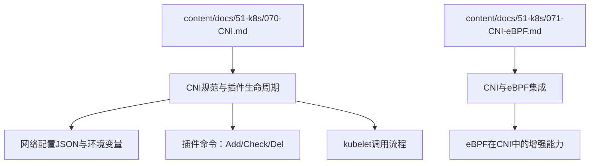
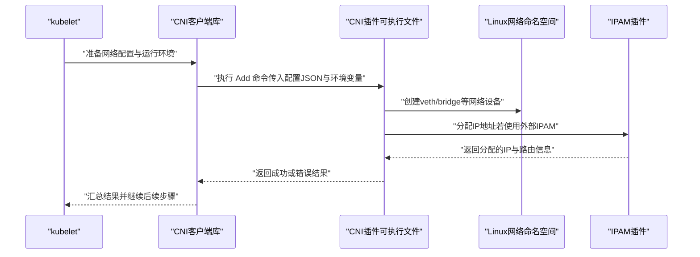
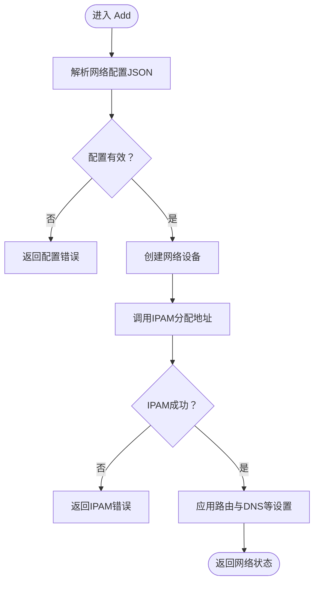
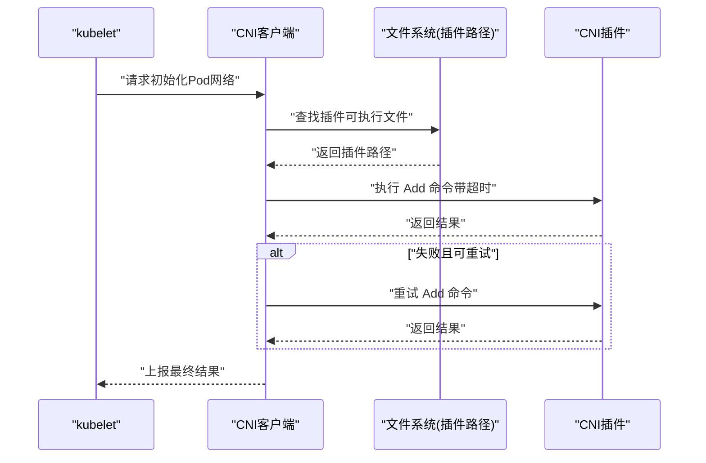
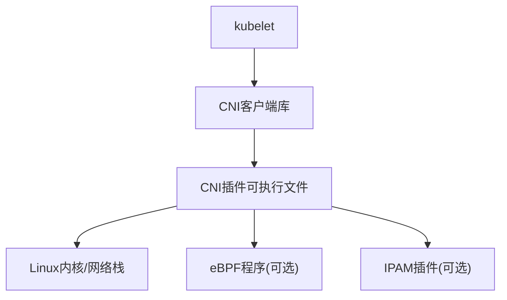

# CNI规范与插件生命周期

<cite>
**本文引用的文件**   
- [070-CNI.md](file://content/docs/51-k8s/070-CNI.md)
- [071-CNI-eBPF.md](file://content/docs/51-k8s/071-CNI-eBPF.md)
</cite>

## 目录
1. [简介](#简介)
2. [项目结构](#项目结构)
3. [核心组件](#核心组件)
4. [架构总览](#架构总览)
5. [详细组件分析](#详细组件分析)
6. [依赖关系分析](#依赖关系分析)
7. [性能考量](#性能考量)
8. [故障排查指南](#故障排查指南)
9. [结论](#结论)
10. [附录](#附录)

## 简介
本技术文档围绕CNI（Container Network Interface）规范与插件生命周期展开，面向希望理解并实现符合规范的CNI插件的开发者。内容涵盖：
- CNI规范的版本演进与核心概念
- 网络配置文件的JSON格式定义、环境变量传递机制与错误处理标准
- 插件生命周期的三个核心命令：Add（添加网络接口）、Check（检查网络状态）、Del（删除网络资源）的执行流程、参数传递与返回值约定
- kubelet如何调用CNI插件进行Pod网络初始化，包括插件发现机制、超时处理与重试策略
- CNI插件开发最佳实践：日志记录、性能监控与资源清理
- 常见问题排查方法与调试技巧

## 项目结构
仓库为Hugo静态站点，CNI相关内容位于“k8s”主题下的文档目录中，主要涉及两篇文档：
- CNI基础规范与插件生命周期说明
- CNI与eBPF结合的实践与扩展思路

图表来源
- [070-CNI.md:1-200](file://content/docs/51-k8s/070-CNI.md#L1-L200)
- [071-CNI-eBPF.md:1-200](file://content/docs/51-k8s/071-CNI-eBPF.md#L1-L200)

章节来源
- [070-CNI.md:1-200](file://content/docs/51-k8s/070-CNI.md#L1-L200)
- [071-CNI-eBPF.md:1-200](file://content/docs/51-k8s/071-CNI-eBPF.md#L1-L200)

## 核心组件
本节聚焦CNI规范中与插件交互的关键要素：
- 网络配置文件：以JSON形式描述网络拓扑、IPAM、设备创建等元数据
- 环境变量：用于向插件传递运行时上下文信息（如容器ID、命名空间、网络名称等）
- 错误模型：统一的错误返回结构与语义，便于上层编排系统判定与重试
- 插件命令：Add、Check、Del三者的输入输出契约

章节来源
- [070-CNI.md:1-200](file://content/docs/51-k8s/070-CNI.md#L1-L200)

## 架构总览
从kubelet到CNI插件的整体调用链路如下：

图表来源
- [070-CNI.md:1-200](file://content/docs/51-k8s/070-CNI.md#L1-L200)

## 详细组件分析

### 网络配置JSON与环境变量
- JSON字段通常包含：网络名称、子网、网关、MTU、DNS、插件类型、IPAM配置等
- 环境变量用于传递容器与节点上下文，例如容器ID、命名空间、网络名称、工作目录等
- 插件应严格校验必填字段与类型，对未知字段采取兼容策略（忽略或报错），确保向后兼容

章节来源
- [070-CNI.md:1-200](file://content/docs/51-k8s/070-CNI.md#L1-L200)

### 插件命令：Add（添加网络接口）
- 输入：网络配置JSON、环境变量
- 行为：在目标命名空间中创建网络设备、配置IP路由、调用IPAM分配地址
- 输出：成功时返回网络状态（如接口名、IP、路由等），失败时返回结构化错误

图表来源
- [070-CNI.md:1-200](file://content/docs/51-k8s/070-CNI.md#L1-L200)

章节来源
- [070-CNI.md:1-200](file://content/docs/51-k8s/070-CNI.md#L1-L200)

### 插件命令：Check（检查网络状态）
- 输入：网络配置JSON、环境变量
- 行为：验证当前命名空间内的网络状态是否符合预期（接口存在、IP可达、路由正确等）
- 输出：成功表示网络处于期望状态；失败返回具体原因，供上层决定是否重试或修复

章节来源
- [070-CNI.md:1-200](file://content/docs/51-k8s/070-CNI.md#L1-L200)

### 插件命令：Del（删除网络资源）
- 输入：网络配置JSON、环境变量
- 行为：清理Add阶段创建的资源（删除接口、释放IP、移除路由等）
- 输出：成功或错误；即使部分资源不存在也应幂等地返回成功

章节来源
- [070-CNI.md:1-200](file://content/docs/51-k8s/070-CNI.md#L1-L200)

### kubelet调用CNI插件的流程
- 插件发现：根据网络配置中的插件路径或默认搜索路径定位可执行文件
- 超时控制：为每个命令设置合理的超时时间，避免阻塞Pod启动
- 重试策略：针对临时性错误（如IPAM不可用）进行有限次重试，避免无限循环
- 错误传播：将插件返回的错误转换为kubelet可理解的错误码与消息

图表来源
- [070-CNI.md:1-200](file://content/docs/51-k8s/070-CNI.md#L1-L200)

章节来源
- [070-CNI.md:1-200](file://content/docs/51-k8s/070-CNI.md#L1-L200)

### CNI与eBPF的集成要点
- eBPF可用于高性能数据包转发、流量观测与策略执行
- 在CNI生命周期中，可在Add阶段加载eBPF程序，在Del阶段卸载
- Check阶段可通过eBPF探针快速判断网络健康度

章节来源
- [071-CNI-eBPF.md:1-200](file://content/docs/51-k8s/071-CNI-eBPF.md#L1-L200)

## 依赖关系分析
CNI生态中的关键依赖关系如下：
- kubelet通过CNI客户端库与插件可执行文件交互
- 插件可能依赖内核模块或eBPF程序以实现高级功能
- IPAM插件作为独立组件，提供地址分配服务

图表来源
- [070-CNI.md:1-200](file://content/docs/51-k8s/070-CNI.md#L1-L200)
- [071-CNI-eBPF.md:1-200](file://content/docs/51-k8s/071-CNI-eBPF.md#L1-L200)

章节来源
- [070-CNI.md:1-200](file://content/docs/51-k8s/070-CNI.md#L1-L200)
- [071-CNI-eBPF.md:1-200](file://content/docs/51-k8s/071-CNI-eBPF.md#L1-L200)

## 性能考量
- 减少系统调用次数：批量创建/配置网络设备，避免频繁切换命名空间
- 合理设置超时与重试：避免长尾延迟影响Pod调度与启动
- 利用eBPF优化数据面：降低包转发路径开销，提升吞吐与低延迟
- 资源清理幂等性：确保Del操作快速完成，避免残留资源导致后续问题

[本节为通用指导，不直接分析具体文件]

## 故障排查指南
- 日志采集：在插件内部输出结构化日志，包含请求ID、命令、耗时与错误码
- 网络诊断：使用ip/netns工具检查命名空间内接口与路由状态
- IPAM问题：确认IPAM服务可用性与地址池容量
- eBPF加载失败：检查内核版本与bpf系统调用权限
- 超时与重试：调整客户端超时阈值与最大重试次数，观察是否改善

章节来源
- [070-CNI.md:1-200](file://content/docs/51-k8s/070-CNI.md#L1-L200)
- [071-CNI-eBPF.md:1-200](file://content/docs/51-k8s/071-CNI-eBPF.md#L1-L200)

## 结论
CNI规范通过明确的JSON配置、环境变量与错误模型，为容器网络提供了稳定可扩展的接口。遵循Add/Check/Del的生命周期契约，并结合eBPF等现代技术，可实现高性能、可观测的网络方案。在实际开发中，建议重视健壮性（幂等、超时、重试）、可观测性（日志、指标）与兼容性（字段校验、向后兼容）。

[本节为总结性内容，不直接分析具体文件]

## 附录
- 术语表：CNI、IPAM、eBPF、命名空间、veth、bridge
- 参考链接：CNI官方规范、主流CNI插件实现、eBPF入门资料

[本节为补充信息，不直接分析具体文件]