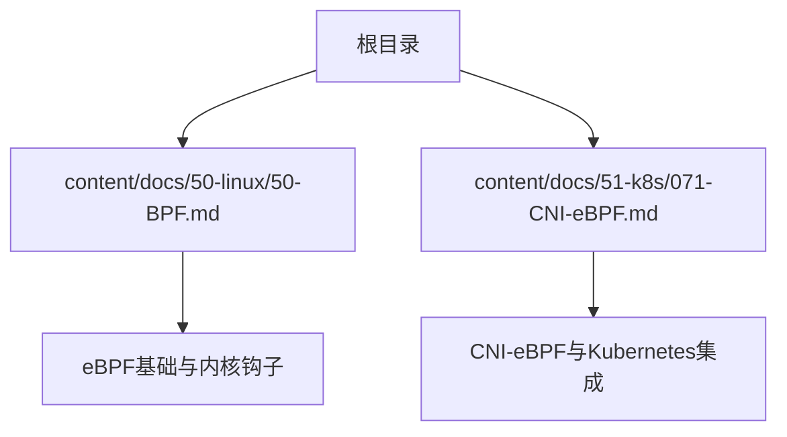
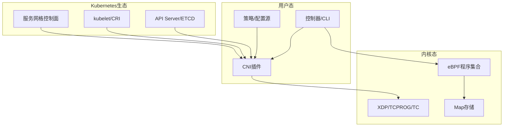
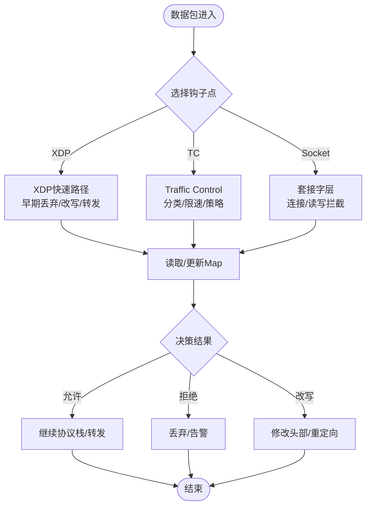
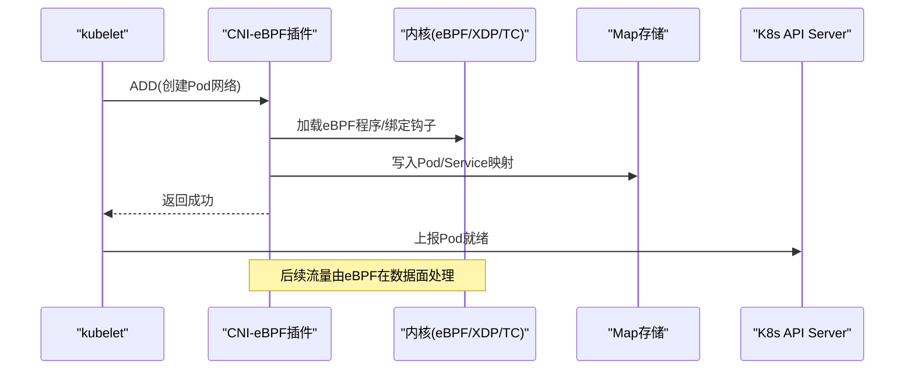
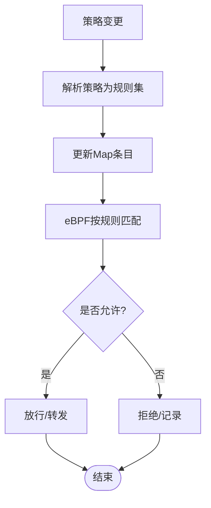
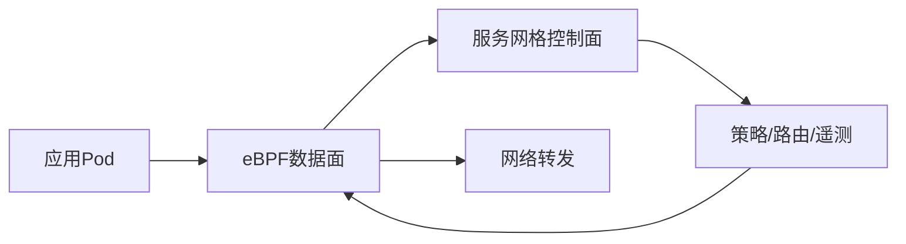
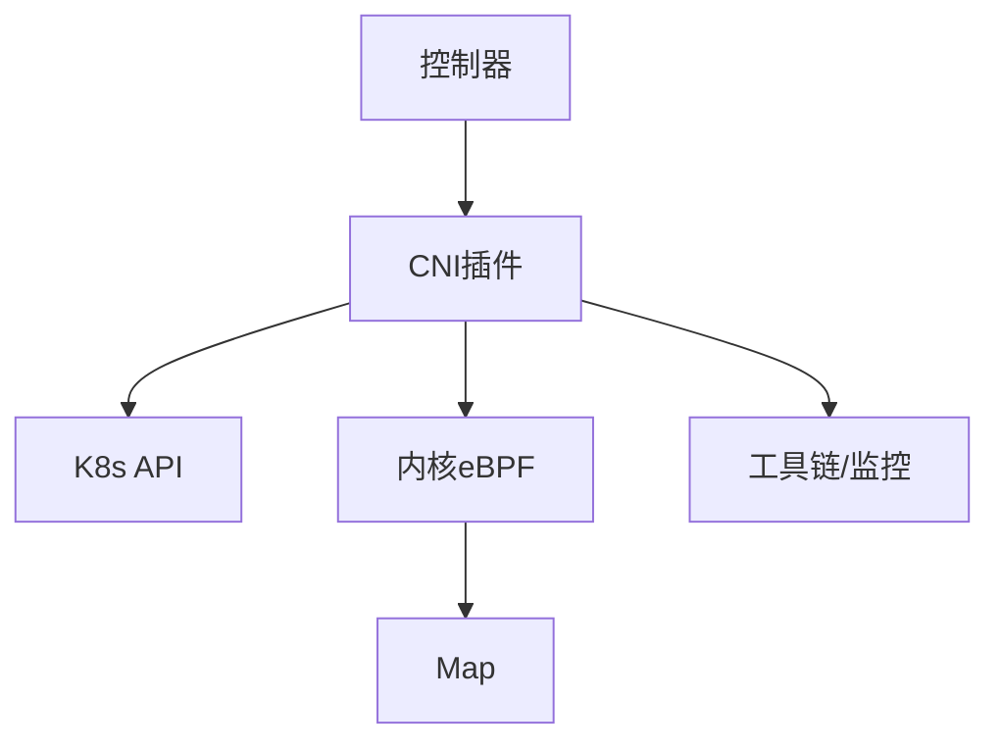

# eBPF容器网络

<cite>
**本文引用的文件**   
- [50-BPF.md](file://content/docs/50-linux/50-BPF.md)
- [071-CNI-eBPF.md](file://content/docs/51-k8s/071-CNI-eBPF.md)
</cite>

## 目录
1. [引言](#引言)
2. [项目结构](#项目结构)
3. [核心组件](#核心组件)
4. [架构总览](#架构总览)
5. [详细组件分析](#详细组件分析)
6. [依赖关系分析](#依赖关系分析)
7. [性能考量](#性能考量)
8. [故障排查指南](#故障排查指南)
9. [结论](#结论)
10. [附录](#附录)

## 引言
本技术文档围绕eBPF在容器网络中的应用展开，系统阐述内核态程序加载、数据包处理路径与网络事件钩子机制；深入解析基于eBPF的高性能网络栈实现（如XDP加速、网络策略执行与服务网格集成）；说明零拷贝转发、动态负载均衡与细粒度访问控制等关键能力；并探讨入侵检测、流量镜像与合规审计等安全场景。文末提供eBPF网络编程入门要点（字节码生成、Map使用与性能调优），以及部署案例与排障方法，帮助开发者构建高性能、高安全的下一代容器网络。

## 项目结构
仓库采用Hugo静态站点组织内容，相关eBPF与CNI-eBPF主题位于以下位置：
- Linux/BPF基础与概念：content/docs/50-linux/50-BPF.md
- Kubernetes/CNI-eBPF实践：content/docs/51-k8s/071-CNI-eBPF.md

图表来源
- [50-BPF.md](file://content/docs/50-linux/50-BPF.md)
- [071-CNI-eBPF.md](file://content/docs/51-k8s/071-CNI-eBPF.md)

章节来源
- [50-BPF.md](file://content/docs/50-linux/50-BPF.md)
- [071-CNI-eBPF.md](file://content/docs/51-k8s/071-CNI-eBPF.md)

## 核心组件
- eBPF程序与钩子点
  - 在内核中通过验证器加载与执行，挂载到网络子系统的关键路径（如XDP、TC、socket等）。
  - 典型用途：包过滤、改写、统计、路由决策、策略执行。
- Map数据结构
  - 用户态与内核态共享的高效KV存储，用于状态同步、计数、表项查找等。
- 用户态控制器
  - 负责编译/加载eBPF程序、管理Map、监听事件、下发策略与配置。
- 与CNI/服务网格的集成
  - 以CNI插件形式接入Kubernetes网络生命周期；与服务网格侧车或边车协同，实现可观测性与策略联动。

章节来源
- [50-BPF.md](file://content/docs/50-linux/50-BPF.md)
- [071-CNI-eBPF.md](file://content/docs/51-k8s/071-CNI-eBPF.md)

## 架构总览
下图展示eBPF在容器网络中的整体架构：用户态控制器负责加载与编排，内核态eBPF程序在数据面高速处理，Map作为共享状态载体，CNI与服务网格完成上层编排与策略下发。

图表来源
- [50-BPF.md](file://content/docs/50-linux/50-BPF.md)
- [071-CNI-eBPF.md](file://content/docs/51-k8s/071-CNI-eBPF.md)

## 详细组件分析

### 组件A：内核态eBPF程序与钩子点
- 作用
  - 在网卡驱动层（XDP）、协议栈入口（TC）、套接字层（socket）等位置插入逻辑，实现包级处理与策略执行。
- 关键点
  - 程序加载需通过内核验证器，确保安全性与终止性。
  - 通过Map与用户态交换状态与指标。
  - 结合kprobe/uprobe等扩展点捕获更丰富的运行时信息。

图表来源
- [50-BPF.md](file://content/docs/50-linux/50-BPF.md)

章节来源
- [50-BPF.md](file://content/docs/50-linux/50-BPF.md)

### 组件B：CNI-eBPF与Kubernetes集成
- 职责
  - 在Pod生命周期内创建/销毁veth对、配置IPAM、注入eBPF程序与策略、上报状态。
- 流程概览
  - 接收CNI请求 → 解析参数 → 调用内核接口加载eBPF程序 → 更新Map → 返回结果。

图表来源
- [071-CNI-eBPF.md](file://content/docs/51-k8s/071-CNI-eBPF.md)

章节来源
- [071-CNI-eBPF.md](file://content/docs/51-k8s/071-CNI-eBPF.md)

### 组件C：网络策略与安全
- 功能
  - 基于eBPF实现细粒度L3/L4访问控制、命名空间隔离、白名单/黑名单、端口与协议限制。
- 与策略源的协作
  - 从K8s NetworkPolicy或其他策略源获取规则，转换为Map条目，由eBPF在数据面匹配执行。

图表来源
- [071-CNI-eBPF.md](file://content/docs/51-k8s/071-CNI-eBPF.md)

章节来源
- [071-CNI-eBPF.md](file://content/docs/51-k8s/071-CNI-eBPF.md)

### 组件D：服务网格集成
- 模式
  - 与Sidecar/边车协同，将部分代理能力下沉至eBPF，降低延迟与资源开销。
- 能力
  - 基于eBPF的流量镜像、灰度发布、熔断与重试、可观测性采集。

图表来源
- [071-CNI-eBPF.md](file://content/docs/51-k8s/071-CNI-eBPF.md)

章节来源
- [071-CNI-eBPF.md](file://content/docs/51-k8s/071-CNI-eBPF.md)

## 依赖关系分析
- 模块耦合
  - 控制器与内核通过标准接口交互，Map作为松耦合的状态通道。
  - CNI插件与Kubernetes API解耦，仅关注网络生命周期。
- 外部依赖
  - 内核版本与特性支持（XDP、TC、Map类型、验证器能力）。
  - 工具链（编译器、调试器、可视化与监控）。

图表来源
- [50-BPF.md](file://content/docs/50-linux/50-BPF.md)
- [071-CNI-eBPF.md](file://content/docs/51-k8s/071-CNI-eBPF.md)

章节来源
- [50-BPF.md](file://content/docs/50-linux/50-BPF.md)
- [071-CNI-eBPF.md](file://content/docs/51-k8s/071-CNI-eBPF.md)

## 性能考量
- 数据面优化
  - 优先使用XDP/TC等早路径减少上下文切换与内存拷贝。
  - 利用Map进行批量查询与聚合，避免频繁系统调用。
- 资源与可扩展性
  - 合理设计Map容量与淘汰策略，避免热点冲突。
  - 分片与哈希优化，提升并发下的吞吐与低延迟。
- 可观测性
  - 通过eBPF导出指标，结合Prometheus/Grafana进行实时监控与容量规划。

[本节为通用指导，不直接分析具体文件]

## 故障排查指南
- 常见问题定位
  - 程序加载失败：检查内核版本、特性开关与验证器错误日志。
  - 策略未生效：核对策略到Map的转换与键值一致性。
  - 性能退化：观察Map命中率、CPU软中断分布与队列拥塞。
- 建议步骤
  - 启用详细日志与采样，复现问题后收集内核与用户态堆栈。
  - 逐步回滚策略与程序版本，确认回归范围。
  - 使用专用工具进行包级抓包与路径追踪，定位丢包与异常改写。

章节来源
- [50-BPF.md](file://content/docs/50-linux/50-BPF.md)
- [071-CNI-eBPF.md](file://content/docs/51-k8s/071-CNI-eBPF.md)

## 结论
eBPF为容器网络提供了内核态可编程的数据面能力，能够在保持高吞吐与低延迟的同时，实现灵活的网络策略、可观测性与安全增强。通过合理的架构设计与性能调优，结合CNI与服务网格生态，可构建面向未来的高性能、高安全容器网络。

[本节为总结性内容，不直接分析具体文件]

## 附录
- eBPF网络编程入门要点
  - 字节码生成：理解从高级语言到eBPF字节码的编译链路，关注指令集与约束。
  - Map使用：选择合适的Map类型与生命周期，注意并发与内存占用。
  - 性能调优：减少系统调用、批量化操作、避免热点冲突、合理设置超时与阈值。
- 实际部署案例
  - 在Kubernetes集群中以CNI-eBPF方式部署，逐步引入网络策略与可观测性。
  - 与现有服务网格共存，先镜像与度量，再渐进替换代理逻辑。
- 参考阅读
  - 内核与eBPF官方文档、社区最佳实践与基准测试报告。

[本节为补充材料，不直接分析具体文件]