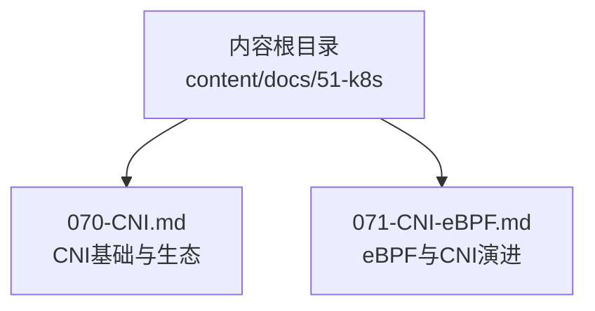
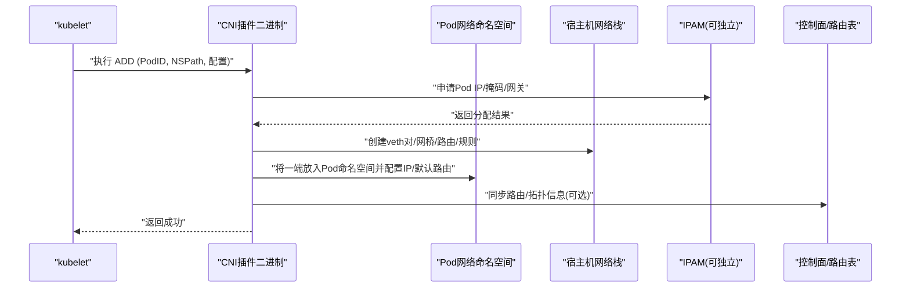
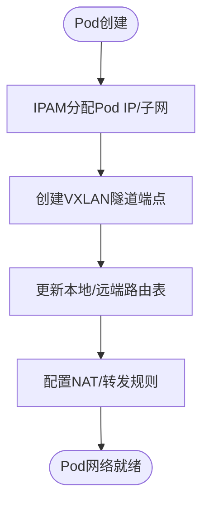
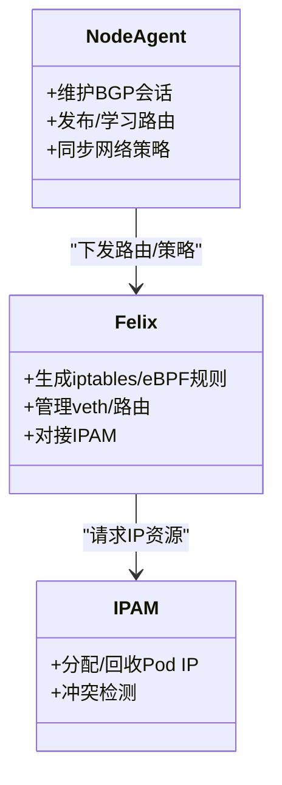
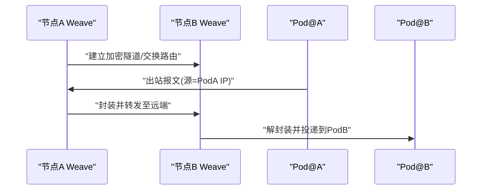
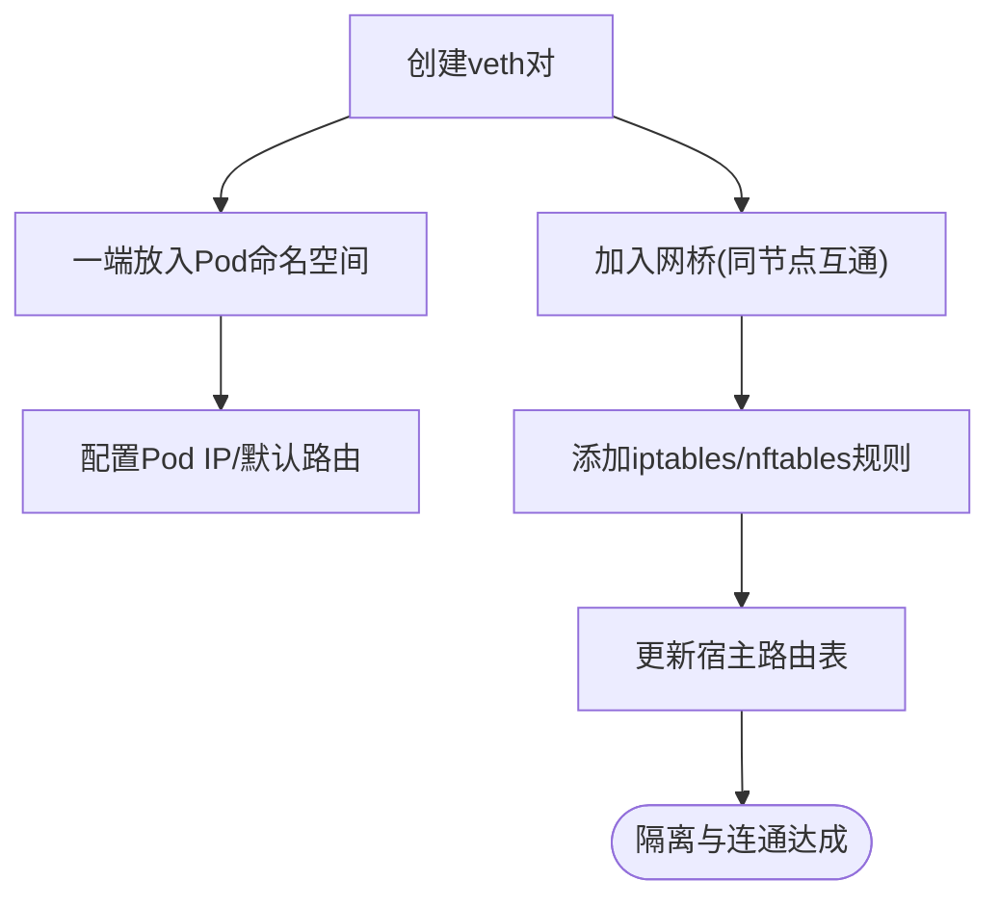
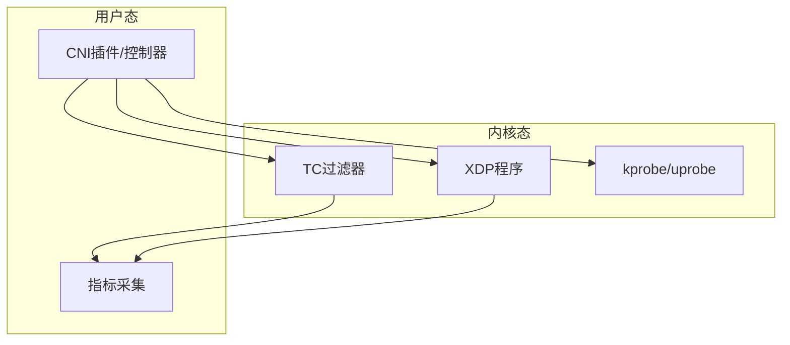
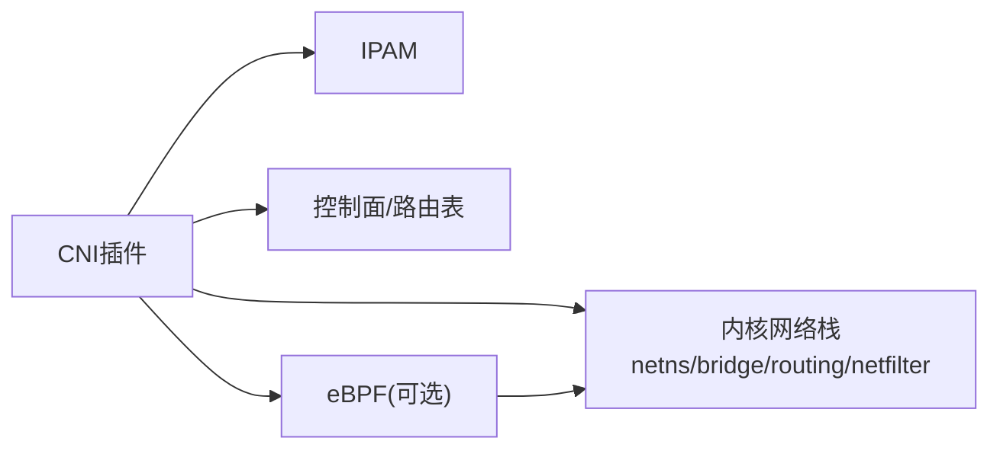

# 传统CNI插件实现

<cite>
**本文引用的文件**   
- [070-CNI.md](file://content/docs/51-k8s/070-CNI.md)
- [071-CNI-eBPF.md](file://content/docs/51-k8s/071-CNI-eBPF.md)
</cite>

## 目录
1. [简介](#简介)
2. [项目结构](#项目结构)
3. [核心组件](#核心组件)
4. [架构总览](#架构总览)
5. [详细组件分析](#详细组件分析)
6. [依赖关系分析](#依赖关系分析)
7. [性能考量](#性能考量)
8. [故障排查指南](#故障排查指南)
9. [结论](#结论)
10. [附录](#附录)

## 简介
本技术文档面向传统CNI插件的实现与选型，聚焦主流方案Flannel、Calico与Weave的架构设计与实现原理，系统比较其网络模型、IP地址分配策略与服务发现机制；深入说明Linux网络命名空间隔离（veth对、网桥、iptables）在CNI中的落地方式；并从性能、扩展性与适用场景维度给出选型指南与部署最佳实践；最后提供网络连通性测试、流量分析与性能监控等故障排查方法，并通过实际案例展示如何依据业务需求选择并优化网络。

## 项目结构
仓库为Hugo静态站点，CNI相关内容位于k8s文档目录下：
- content/docs/51-k8s/070-CNI.md：CNI基础与生态概览
- content/docs/51-k8s/071-CNI-eBPF.md：eBPF在现代CNI中的应用与演进

图表来源
- [070-CNI.md](file://content/docs/51-k8s/070-CNI.md)
- [071-CNI-eBPF.md](file://content/docs/51-k8s/071-CNI-eBPF.md)

章节来源
- [070-CNI.md](file://content/docs/51-k8s/070-CNI.md)
- [071-CNI-eBPF.md](file://content/docs/51-k8s/071-CNI-eBPF.md)

## 核心组件
本节从CNI视角梳理关键能力与职责边界，帮助读者建立整体认知：
- CNI接口契约：负责Pod网络配置生命周期（ADD/DEL/VERSION），由kubelet调用具体插件二进制完成网络创建与销毁。
- IPAM（IP地址管理）：独立或内嵌于插件，负责Pod IP分配、回收与冲突检测。
- 数据面转发：基于内核协议栈（如veth+网桥+iptables/nftables）或旁路加速（如eBPF/XDP）。
- 控制面协同：与集群控制器（如kube-controller-manager）及外部路由/服务发现组件协作，完成跨节点可达性与Service访问。

章节来源
- [070-CNI.md](file://content/docs/51-k8s/070-CNI.md)

## 架构总览
下图展示了传统CNI插件在Kubernetes中的典型交互流程：kubelet通过CNI接口调用插件，插件根据配置创建veth对、配置命名空间端点、设置路由与防火墙规则，并与IPAM/控制面协同完成跨节点通信。

图表来源
- [070-CNI.md](file://content/docs/51-k8s/070-CNI.md)

## 详细组件分析

### Flannel（VXLAN覆盖网络）
- 网络模型：以Overlay为主，使用VXLAN封装跨节点二层互通，简化底层网络要求。
- IP分配：通常配合内置或外部IPAM进行子网划分与分配，避免冲突。
- 服务发现：与Kubernetes Service集成，结合NodePort/ClusterIP与宿主路由/iptables实现转发。
- 适用场景：中小规模集群、跨机房/云环境快速打通、对底层网络限制较严格的场景。

图表来源
- [070-CNI.md](file://content/docs/51-k8s/070-CNI.md)

章节来源
- [070-CNI.md](file://content/docs/51-k8s/070-CNI.md)

### Calico（BGP路由网络）
- 网络模型：纯三层路由，利用BGP在各节点间分发Pod CIDR与Egress IP，无需Overlay封装。
- IP分配：严格CIDR规划，支持多CIDR、池化与动态扩缩容。
- 服务发现：与Kubernetes深度集成，结合BIRD/BGP与iptables/eBPF实现高效转发。
- 适用场景：大规模集群、高性能低延迟、需要细粒度安全策略与多租户隔离的场景。

图表来源
- [070-CNI.md](file://content/docs/51-k8s/070-CNI.md)

章节来源
- [070-CNI.md](file://content/docs/51-k8s/070-CNI.md)

### Weave（网络编织）
- 网络模型：分布式P2P加密隧道，节点间自动发现与密钥协商，构建全互联覆盖网络。
- IP分配：内置IPAM，支持子网管理与冲突自愈。
- 服务发现：与Kubernetes Service联动，结合DNS与转发规则提供服务访问。
- 适用场景：多云/混合云、跨地域互联、强调开箱即用与安全性的场景。

图表来源
- [070-CNI.md](file://content/docs/51-k8s/070-CNI.md)

章节来源
- [070-CNI.md](file://content/docs/51-k8s/070-CNI.md)

### Linux网络命名空间隔离（veth/网桥/iptables）
- veth对：一端置于Pod命名空间，另一端置于宿主或网桥，实现进程级网络隔离与双向转发。
- 网桥：作为二层汇聚点，连接多个veth端点，承担同节点Pod间二层转发。
- iptables/nftables：实现NAT、SNAT/DNAT、端口映射、策略控制与跨节点访问控制。
- 路由：通过内核路由表与策略路由实现跨节点可达与多CIDR场景下的精确转发。

图表来源
- [070-CNI.md](file://content/docs/51-k8s/070-CNI.md)

章节来源
- [070-CNI.md](file://content/docs/51-k8s/070-CNI.md)

### eBPF在现代CNI中的角色（演进方向）
- 数据面加速：通过kprobe/uprobe、tc、XDP等钩子实现零拷贝转发、负载均衡与策略执行。
- 可编程性：替代部分iptables逻辑，降低CPU开销与规则膨胀带来的抖动。
- 可观测性：内建指标采集与流式导出，便于性能调优与问题定位。

图表来源
- [071-CNI-eBPF.md](file://content/docs/51-k8s/071-CNI-eBPF.md)

章节来源
- [071-CNI-eBPF.md](file://content/docs/51-k8s/071-CNI-eBPF.md)

## 依赖关系分析
- 组件耦合：CNI插件与IPAM、控制面（kube-controller-manager）、内核子系统（netns、bridge、routing、netfilter）存在强耦合；eBPF引入内核版本与模块依赖。
- 间接依赖：BGP依赖BIRD/GoBGP等；Overlay依赖内核VXLAN/GRE模块；iptables依赖nftables内核支持。
- 潜在环路与风险：路由环路需依靠TTL/防环策略；规则过多导致内核态抖动；eBPF兼容性问题需关注内核版本矩阵。

图表来源
- [070-CNI.md](file://content/docs/51-k8s/070-CNI.md)
- [071-CNI-eBPF.md](file://content/docs/51-k8s/071-CNI-eBPF.md)

章节来源
- [070-CNI.md](file://content/docs/51-k8s/070-CNI.md)
- [071-CNI-eBPF.md](file://content/docs/51-k8s/071-CNI-eBPF.md)

## 性能考量
- 转发路径：Overlay封装带来额外开销，BGP直连更贴近内核转发；eBPF可进一步降低规则匹配成本。
- 规则规模：iptables规则数量与复杂度影响匹配时延，建议采用分层策略与批量更新。
- CPU与内存：高并发下注意上下文切换与锁竞争，合理调整队列与中断亲和。
- 吞吐与延迟：大报文分片、GRO/LRO开启、网卡卸载特性（TSO/UDSOFF）有助于提升吞吐。
- 可扩展性：横向扩容节点时，路由收敛与IPAM扩容是关键瓶颈点。

[本节为通用指导，不直接分析具体文件]

## 故障排查指南
- 连通性测试：
  - 同节点Pod互访：验证veth/网桥与本地路由。
  - 跨节点Pod互访：检查Overlay/BGP状态、路由表与防火墙规则。
  - 外网访问：确认SNAT/NAT与上游路由。
- 流量分析：
  - 抓包：在veth端、网桥口、物理口分别抓取，定位丢包位置。
  - 路由追踪：traceroute/mtr辅助定位中间节点异常。
- 性能监控：
  - 内核指标：netstat/ss、/proc/net/dev、perf/bpftrace。
  - 组件指标：插件与控制面暴露的Prometheus指标，观察队列长度、错误计数与延迟分布。
- 常见问题：
  - IP冲突：核查IPAM日志与分配记录，必要时强制回收。
  - 路由黑洞：检查BGP邻居状态或Overlay隧道健康度。
  - 规则风暴：评估iptables规则增长趋势，考虑迁移至eBPF或nftables。

章节来源
- [070-CNI.md](file://content/docs/51-k8s/070-CNI.md)

## 结论
- 若追求简单部署与跨环境兼容，Flannel是稳妥之选；
- 若追求极致性能与大规模扩展，Calico的BGP模型更具优势；
- 若强调开箱即用与跨域互联，Weave的P2P加密隧道值得考虑；
- 随着内核与eBPF成熟，逐步向eBPF驱动的数据面演进，可在保持功能的同时显著提升性能与可观测性。

[本节为总结性内容，不直接分析具体文件]

## 附录
- 术语速查：
  - CNI：容器网络接口标准
  - IPAM：IP地址管理
  - Overlay：覆盖网络（如VXLAN）
  - BGP：边界网关协议
  - eBPF：扩展Berkeley Packet Filter
- 参考阅读：
  - CNI规范与插件开发指南
  - 各插件官方文档与最佳实践

[本节为补充材料，不直接分析具体文件]