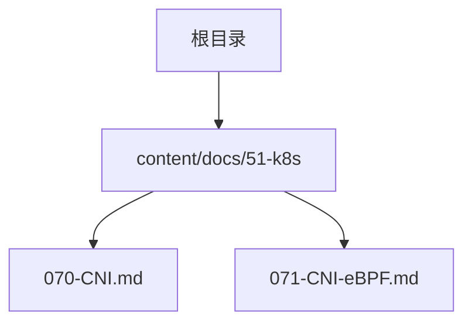
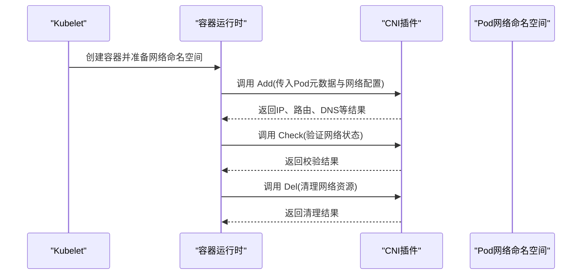
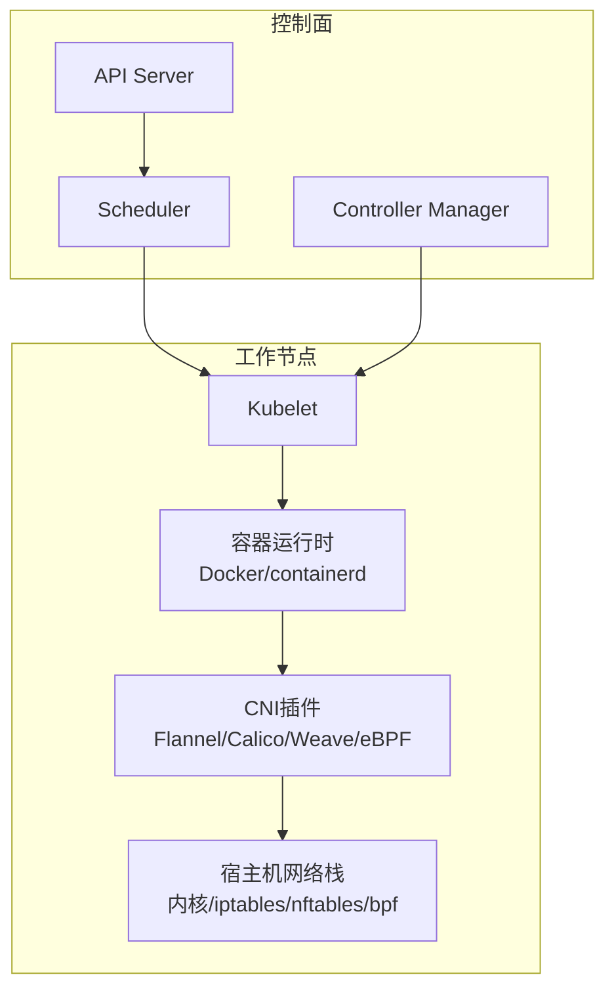
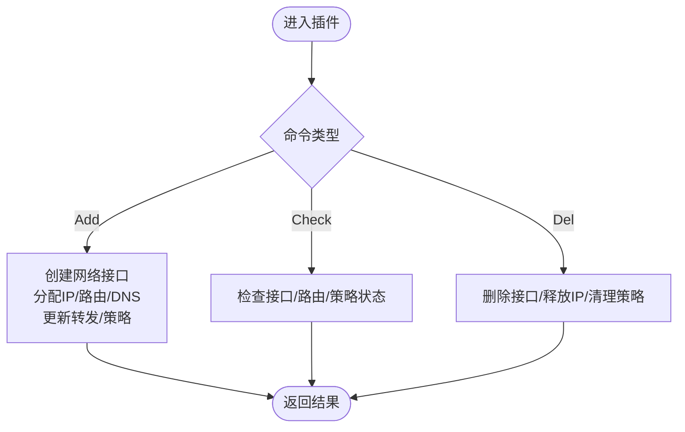
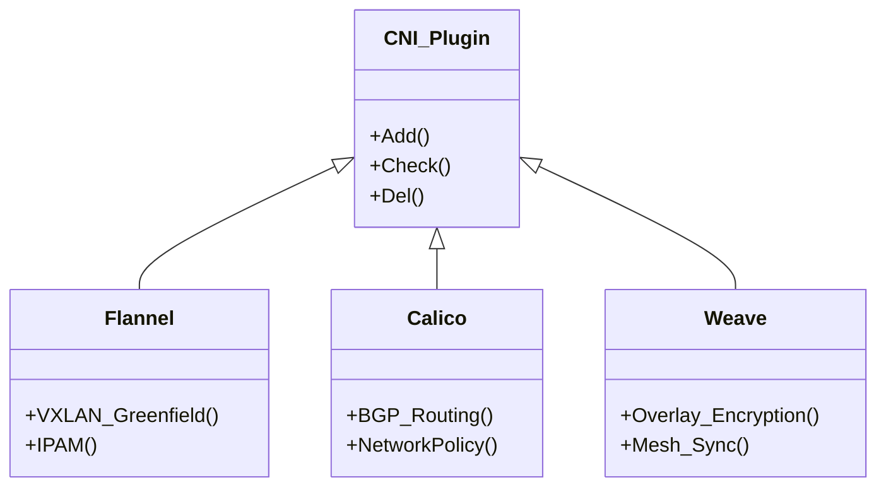
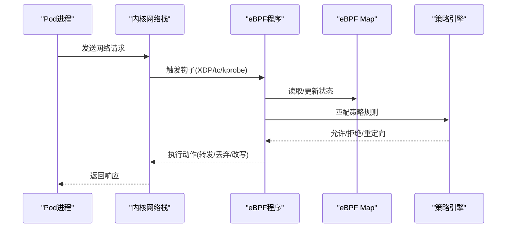
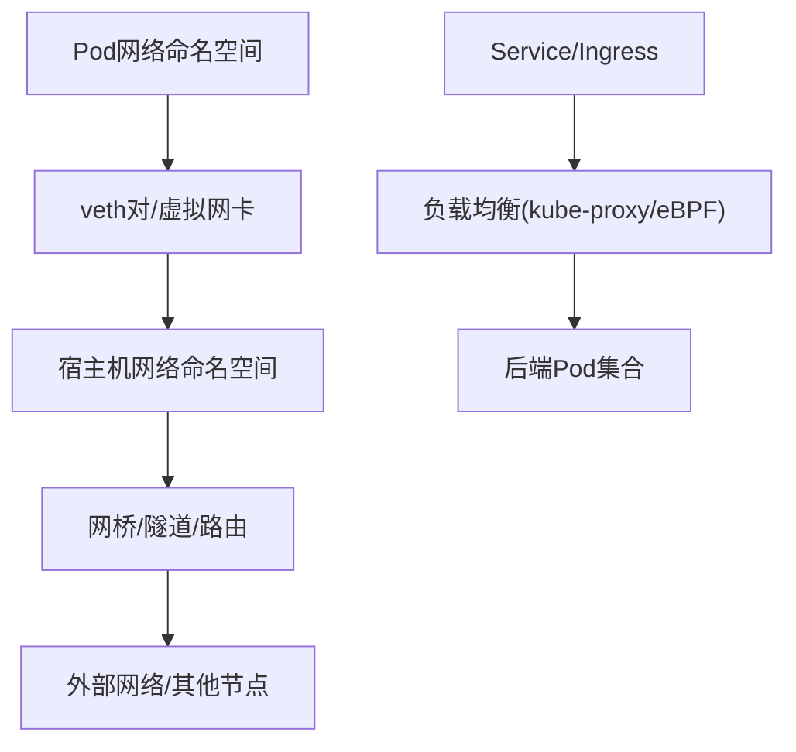
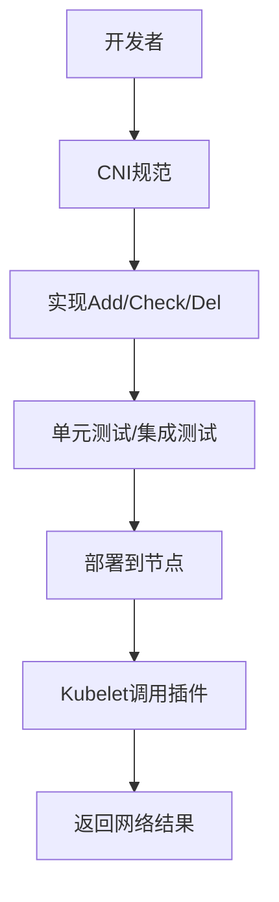
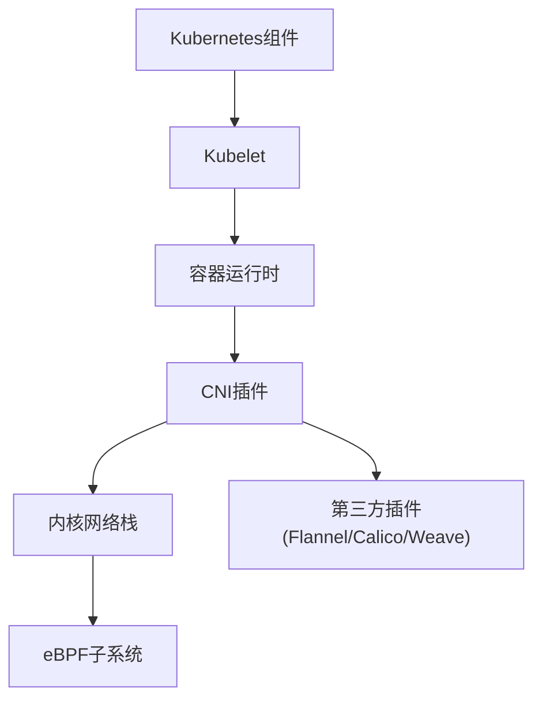

# 网络插件接口(CNI)

<cite>
**本文引用的文件**   
- [070-CNI.md](file://content/docs/51-k8s/070-CNI.md)
- [071-CNI-eBPF.md](file://content/docs/51-k8s/071-CNI-eBPF.md)
</cite>

## 目录
1. [简介](#简介)
2. [项目结构](#项目结构)
3. [核心组件](#核心组件)
4. [架构总览](#架构总览)
5. [详细组件分析](#详细组件分析)
6. [依赖关系分析](#依赖关系分析)
7. [性能考量](#性能考量)
8. [故障排查指南](#故障排查指南)
9. [结论](#结论)
10. [附录](#附录)

## 简介
本技术文档围绕容器网络接口（CNI）展开，系统阐述CNI规范的设计思想与插件生命周期管理，深入解析Add、Check、Del命令的实现机制；对比主流CNI插件（Flannel、Calico、Weave）的网络模型与性能特点；探讨eBPF在容器网络中的高性能数据包处理、网络策略执行与服务发现优化；说明Pod网络命名空间隔离、IP地址分配与服务暴露的实现原理；并提供CNI插件开发指南、自定义网络策略配置方法以及网络故障排查工具与性能调优技巧，帮助开发者构建高性能的容器网络环境。

## 项目结构
仓库中与CNI相关的知识内容主要位于以下文档：
- CNI基础与生命周期：content/docs/51-k8s/070-CNI.md
- CNI与eBPF进阶：content/docs/51-k8s/071-CNI-eBPF.md

图表来源
- [070-CNI.md](file://content/docs/51-k8s/070-CNI.md)
- [071-CNI-eBPF.md](file://content/docs/51-k8s/071-CNI-eBPF.md)

章节来源
- [070-CNI.md](file://content/docs/51-k8s/070-CNI.md)
- [071-CNI-eBPF.md](file://content/docs/51-k8s/071-CNI-eBPF.md)

## 核心组件
本节聚焦CNI规范的核心概念与关键流程，包括：
- CNI插件接口定义与调用约定
- 插件生命周期：Add、Check、Del
- 标准输入输出格式与错误码约定
- 多插件链式编排与配置传递

图表来源
- [070-CNI.md](file://content/docs/51-k8s/070-CNI.md)

章节来源
- [070-CNI.md](file://content/docs/51-k8s/070-CNI.md)

## 架构总览
CNI在Kubernetes中的整体交互涉及Kubelet、容器运行时与CNI插件三方协作。Kubelet负责调度与生命周期协调，容器运行时负责创建容器与网络命名空间，CNI插件负责具体网络能力实现（如VXLAN、BGP、eBPF等）。

图表来源
- [070-CNI.md](file://content/docs/51-k8s/070-CNI.md)

章节来源
- [070-CNI.md](file://content/docs/51-k8s/070-CNI.md)

## 详细组件分析

### CNI插件生命周期与命令实现
- Add命令：为Pod创建veth对、配置IP与路由、注入DNS信息、更新宿主机的转发规则或BGP宣告等。
- Check命令：验证当前网络状态是否符合预期（如IP可达、路由存在、策略生效）。
- Del命令：清理veth对、释放IP、删除路由与策略、恢复宿主机转发规则。

图表来源
- [070-CNI.md](file://content/docs/51-k8s/070-CNI.md)

章节来源
- [070-CNI.md](file://content/docs/51-k8s/070-CNI.md)

### 主流CNI插件工作原理与性能特点
- Flannel
  - 网络模型：基于Overlay（VXLAN/GRE）将Pod流量封装后通过宿主机物理网络传输。
  - 性能特点：实现简单、部署便捷；跨节点封包/解包带来一定CPU开销，适合中小规模集群。
- Calico
  - 网络模型：基于纯三层路由与BGP，无需Overlay，支持网络策略（NetworkPolicy）。
  - 性能特点：无封包开销、低延迟；大规模集群表现优异，策略匹配复杂度需关注。
- Weave
  - 网络模型：分布式Overlay网络，内置加密与自愈能力。
  - 性能特点：安全与可用性较强；加密与分布式同步引入额外开销，适用于对安全有要求的场景。

图表来源
- [070-CNI.md](file://content/docs/51-k8s/070-CNI.md)

章节来源
- [070-CNI.md](file://content/docs/51-k8s/070-CNI.md)

### eBPF在容器网络中的应用
- 高性能数据包处理
  - 使用kprobe/uprobe与tc/XDP钩子进行零拷贝或最小拷贝的数据路径加速。
  - 利用map存储热点状态（如连接跟踪、路由缓存），减少系统调用与上下文切换。
- 网络策略执行
  - 在数据面直接匹配L3/L4/L7字段，实现细粒度访问控制，降低用户态策略引擎开销。
- 服务发现优化
  - 结合eBPF与kube-proxy替代方案，实现高效的服务端负载均衡与连接复用。

图表来源
- [071-CNI-eBPF.md](file://content/docs/51-k8s/071-CNI-eBPF.md)

章节来源
- [071-CNI-eBPF.md](file://content/docs/51-k8s/071-CNI-eBPF.md)

### Pod网络命名空间隔离、IP分配与服务暴露
- 命名空间隔离
  - 每个Pod拥有独立网络命名空间，包含独立的网卡、路由表、防火墙规则与端口空间。
- IP地址分配
  - CNI插件根据IPAM策略为Pod分配唯一IP，并在宿主机与Pod间建立连通性（veth对、网桥或隧道）。
- 服务暴露
  - 通过Service与Ingress对象抽象后端Pod集合，结合kube-proxy或eBPF实现负载均衡与外部访问入口。

图表来源
- [070-CNI.md](file://content/docs/51-k8s/070-CNI.md)

章节来源
- [070-CNI.md](file://content/docs/51-k8s/070-CNI.md)

### CNI插件开发指南与自定义网络策略
- 开发要点
  - 遵循CNI标准输入输出格式，正确处理错误码与日志。
  - 实现Add/Check/Del三件套，确保幂等性与可恢复性。
  - 合理设计配置项，支持多插件链式编排与参数透传。
- 自定义网络策略
  - 在插件中集成策略匹配逻辑（如基于标签、命名空间、CIDR）。
  - 结合eBPF在数据面执行策略，提升性能与可扩展性。

图表来源
- [070-CNI.md](file://content/docs/51-k8s/070-CNI.md)

章节来源
- [070-CNI.md](file://content/docs/51-k8s/070-CNI.md)

## 依赖关系分析
CNI生态的关键依赖包括：
- Kubernetes组件：Kubelet、API Server、Controller Manager
- 容器运行时：containerd/Docker
- 内核子系统：netfilter、routing、BPF
- 第三方插件：Flannel/Calico/Weave及eBPF工具链

图表来源
- [070-CNI.md](file://content/docs/51-k8s/070-CNI.md)
- [071-CNI-eBPF.md](file://content/docs/51-k8s/071-CNI-eBPF.md)

章节来源
- [070-CNI.md](file://content/docs/51-k8s/070-CNI.md)
- [071-CNI-eBPF.md](file://content/docs/51-k8s/071-CNI-eBPF.md)

## 性能考量
- 选择合适网络模型
  - 小规模集群可选用Overlay（Flannel）简化部署；大规模集群建议采用纯三层路由（Calico）以降低封包开销。
- 启用eBPF加速
  - 在数据面使用XDP/tc钩子与map缓存，减少系统调用与上下文切换，提升吞吐与降低延迟。
- 策略匹配优化
  - 将复杂策略下沉至内核态（eBPF），避免频繁用户态切换。
- 监控与观测
  - 采集eBPF指标与网络统计，定位瓶颈并进行针对性调优。

[本节为通用指导，不直接分析具体文件]

## 故障排查指南
- 常见问题定位
  - 检查CNI插件日志与返回值，确认Add/Check/Del是否成功。
  - 验证Pod网络命名空间内的接口、路由与DNS配置是否正确。
  - 核对宿主机转发规则与策略是否按预期生效。
- 工具与方法
  - 使用kubectl与crictl查看Pod与容器网络状态。
  - 借助iproute2、ss、tcpdump在内核层抓包与分析。
  - 针对eBPF问题，使用bpftrace与bpftool进行动态探测与调试。

章节来源
- [070-CNI.md](file://content/docs/51-k8s/070-CNI.md)
- [071-CNI-eBPF.md](file://content/docs/51-k8s/071-CNI-eBPF.md)

## 结论
CNI作为容器网络的标准化接口，提供了灵活且可扩展的网络能力接入点。通过理解其生命周期与命令实现，并结合主流插件与eBPF技术，可以在不同规模与需求下构建高性能、高可用的容器网络。建议在大规模集群中优先采用纯三层路由与eBPF加速，在需要强安全与自愈能力的场景中考虑Weave等具备内建加密与分布式特性的方案。

[本节为总结性内容，不直接分析具体文件]

## 附录
- 术语表
  - CNI：容器网络接口
  - Overlay：覆盖网络（如VXLAN/GRE）
  - eBPF：扩展伯克利数据包过滤器
  - IPAM：IP地址管理
  - NetworkPolicy：网络策略
- 参考文档
  - CNI规范与示例：参见CNI官方文档与社区示例
  - eBPF入门与实践：参见内核文档与eBPF工具链手册

[本节为补充信息，不直接分析具体文件]