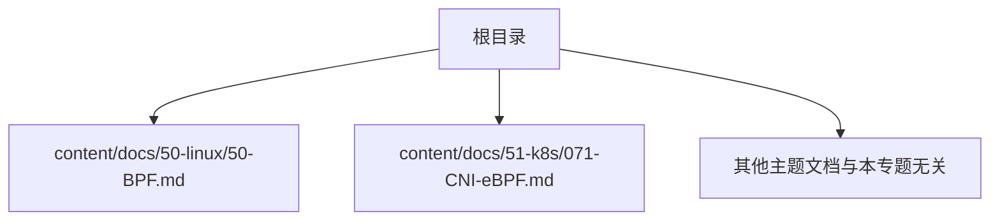
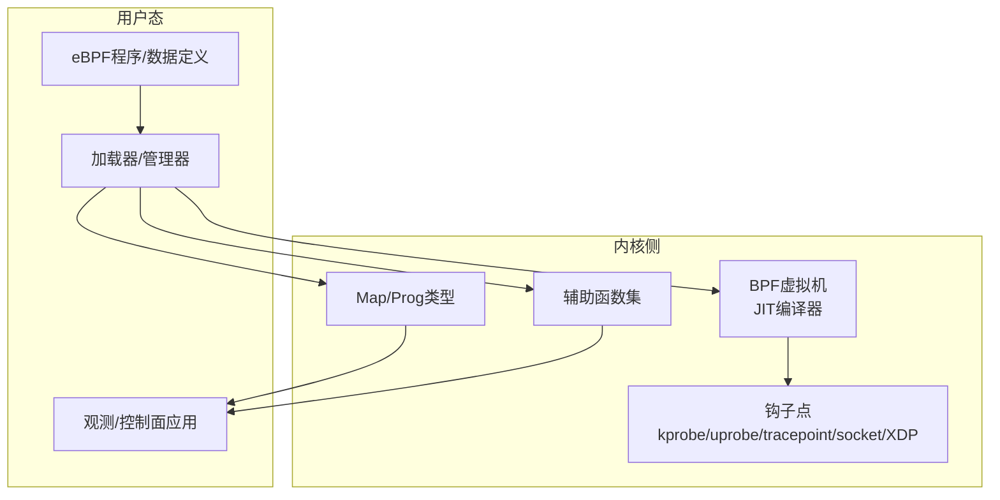
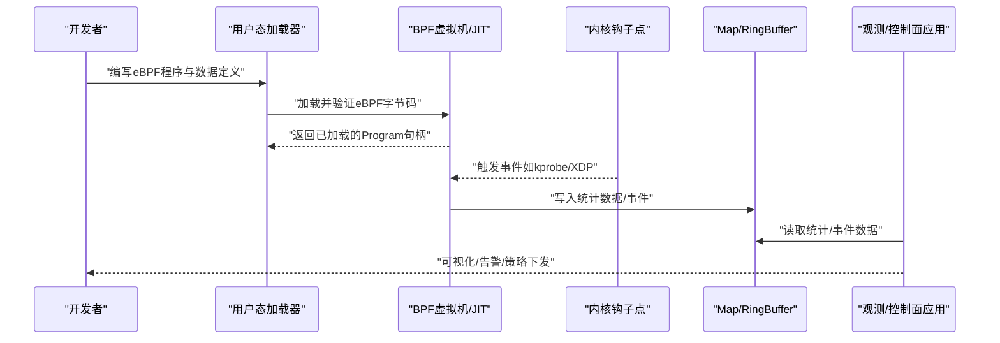
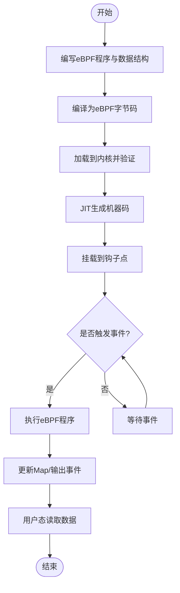
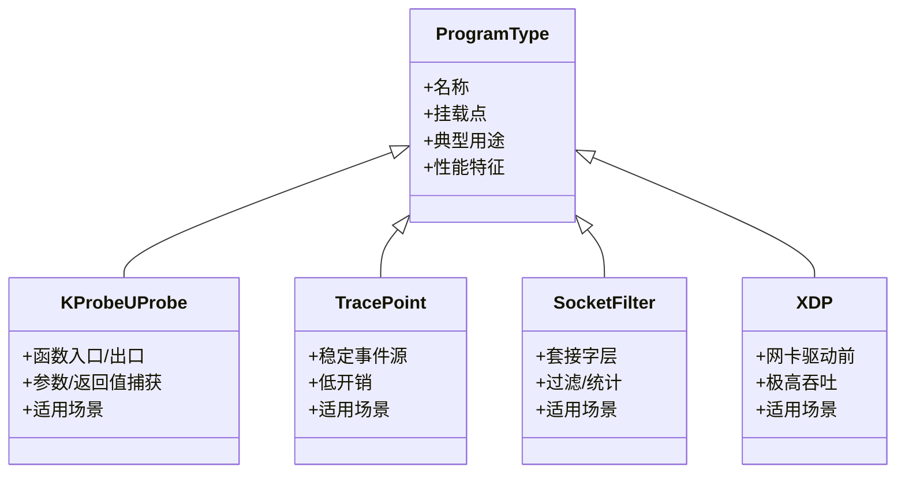
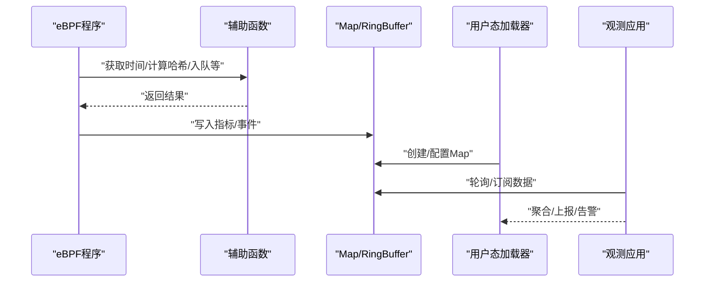
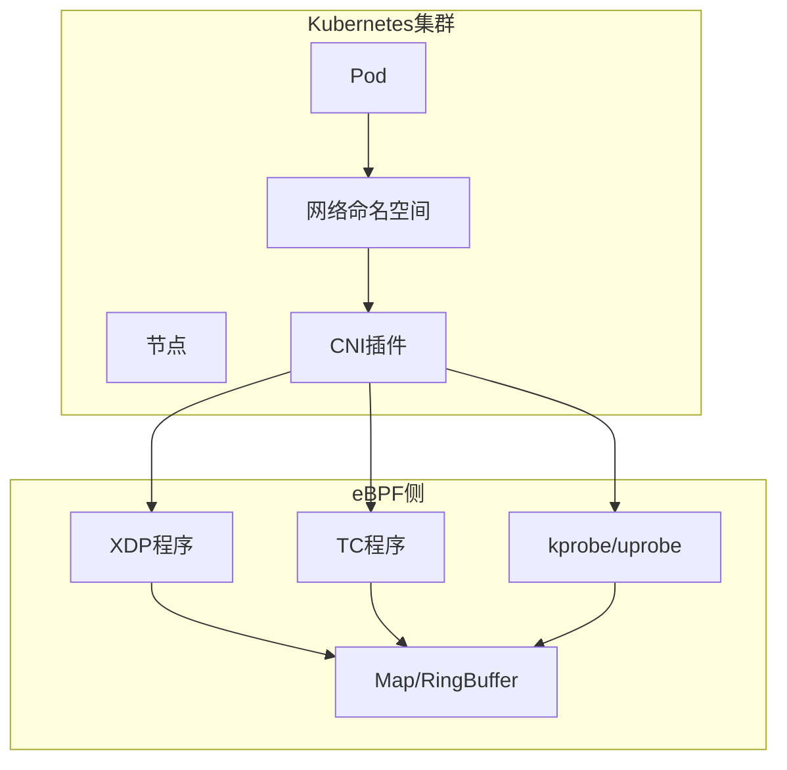
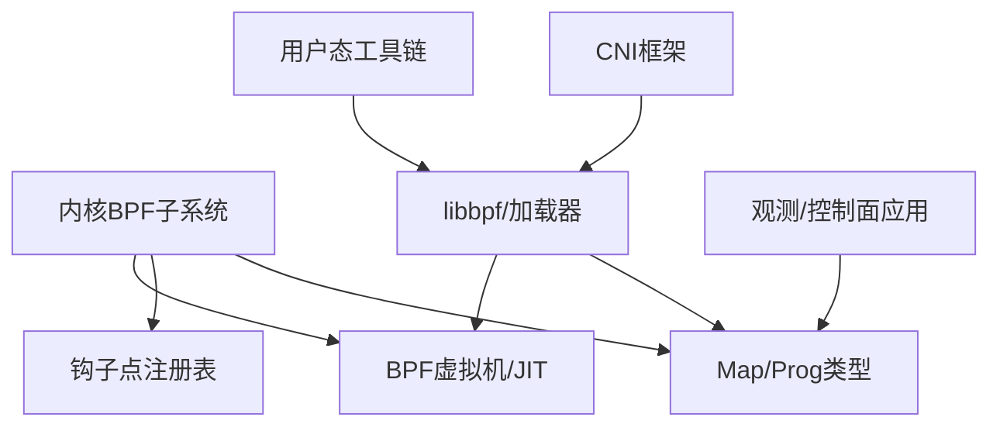

# BPF/eBPF技术详解

<cite>
**本文引用的文件**   
- [content/docs/50-linux/50-BPF.md](file://content/docs/50-linux/50-BPF.md)
- [content/docs/51-k8s/071-CNI-eBPF.md](file://content/docs/51-k8s/071-CNI-eBPF.md)
</cite>

## 目录
1. [简介](#简介)
2. [项目结构](#项目结构)
3. [核心组件](#核心组件)
4. [架构总览](#架构总览)
5. [详细组件分析](#详细组件分析)
6. [依赖关系分析](#依赖关系分析)
7. [性能考量](#性能考量)
8. [故障排查指南](#故障排查指南)
9. [结论](#结论)
10. [附录](#附录)

## 简介
本文件面向希望系统掌握BPF与eBPF技术的读者，围绕技术原理、架构设计、执行模型、程序类型与应用场景展开，并结合仓库中现有内容对CNI+eBPF实践进行解读。文档力求在保持技术深度的同时，提供清晰的图示与可操作的实践建议，帮助读者在现代Linux系统中有效运用eBPF实现网络监控、性能分析与安全审计等目标。

## 项目结构
仓库采用Hugo静态站点组织文档，BPF/eBPF相关内容主要位于以下位置：
- Linux子系统文档：content/docs/50-linux/50-BPF.md
- Kubernetes/CNI相关文档：content/docs/51-k8s/071-CNI-eBPF.md

**图表来源** 
- [content/docs/50-linux/50-BPF.md](file://content/docs/50-linux/50-BPF.md)
- [content/docs/51-k8s/071-CNI-eBPF.md](file://content/docs/51-k8s/071-CNI-eBPF.md)

**章节来源**
- [content/docs/50-linux/50-BPF.md](file://content/docs/50-linux/50-BPF.md)
- [content/docs/51-k8s/071-CNI-eBPF.md](file://content/docs/51-k8s/071-CNI-eBPF.md)

## 核心组件
本节聚焦仓库中与BPF/eBPF相关的知识要点与实践路径，重点包括：
- eBPF程序类型与钩子点：kprobe/uprobe、tracepoint、socket filter、XDP等
- 编程模型：数据结构定义、辅助函数调用、用户空间通信机制
- 典型应用场景：网络监控、性能分析、安全审计
- 工具链与调试：编译、加载、观测与排障
- CNI+eBPF：在Kubernetes网络栈中的集成方式与优势

为便于理解，下图给出概念性组件关系图（非代码映射）：

[此图为概念示意，不直接对应具体源码文件]

**章节来源**
- [content/docs/50-linux/50-BPF.md](file://content/docs/50-linux/50-BPF.md)
- [content/docs/51-k8s/071-CNI-eBPF.md](file://content/docs/51-k8s/071-CNI-eBPF.md)

## 架构总览
从整体视角看，eBPF由“用户态程序与工具”和“内核态运行时”两部分组成：
- 用户态负责编写、编译、加载eBPF程序，管理Map与RingBuffer等共享数据结构，并对外暴露观测与控制接口
- 内核态提供安全的BPF虚拟机、JIT优化、丰富的辅助函数与各类钩子点，确保程序安全高效地运行

[此图为概念流程示意，不直接对应具体源码文件]

## 详细组件分析

### 组件A：BPF/eBPF基础概念与执行模型
- 背景与演进：从BPF到eBPF的安全沙箱、JIT编译、丰富Map类型与辅助函数
- 执行模型：用户态加载→内核态验证→JIT优化→挂载至钩子点→事件驱动执行
- 关键约束：有界循环、指令数限制、只读访问上下文、通过辅助函数与Map交互

[此图为概念流程图，不直接对应具体源码文件]

**章节来源**
- [content/docs/50-linux/50-BPF.md](file://content/docs/50-linux/50-BPF.md)

### 组件B：eBPF程序类型与应用场景
- kprobe/uprobe：内核/用户态函数级插桩，适用于性能剖析与行为追踪
- tracepoint：稳定API的事件点，适合长期运行的观测任务
- socket filter：套接字层过滤与统计，常用于网络流量采集
- XDP：数据包最早阶段处理，适合高性能过滤、负载均衡与安全策略

[此图为概念类图，不直接对应具体源码文件]

**章节来源**
- [content/docs/50-linux/50-BPF.md](file://content/docs/50-linux/50-BPF.md)

### 组件C：编程模型与用户态通信
- 数据结构定义：使用标准C结构体描述事件与指标，注意对齐与大小限制
- 辅助函数调用：通过内核提供的辅助函数完成时间戳、哈希、随机数、队列操作等
- 用户态通信：通过Map（数组、哈希、LRU等）或RingBuffer传递数据；配合libbpf等库简化加载与管理

[此图为概念序列图，不直接对应具体源码文件]

**章节来源**
- [content/docs/50-linux/50-BPF.md](file://content/docs/50-linux/50-BPF.md)

### 组件D：CNI+eBPF实践
- 动机与价值：在Kubernetes网络栈中引入eBPF，提升Pod间通信的可观测性与性能
- 集成方式：以CNI插件形式注入，结合eBPF程序实现流量镜像、度量收集、策略控制
- 运维要点：版本兼容、资源隔离、回滚策略与灰度发布

**图表来源** 
- [content/docs/51-k8s/071-CNI-eBPF.md](file://content/docs/51-k8s/071-CNI-eBPF.md)

**章节来源**
- [content/docs/51-k8s/071-CNI-eBPF.md](file://content/docs/51-k8s/071-CNI-eBPF.md)

## 依赖关系分析
- 内核依赖：BPF虚拟机、JIT、Map/Prog类型、辅助函数、钩子点注册表
- 用户态依赖：编译器（Clang/LLVM）、加载器（libbpf等）、观测/控制面应用
- 生态依赖：CNI框架、容器运行时、调度与编排平台

[此图为概念依赖图，不直接对应具体源码文件]

**章节来源**
- [content/docs/50-linux/50-BPF.md](file://content/docs/50-linux/50-BPF.md)
- [content/docs/51-k8s/071-CNI-eBPF.md](file://content/docs/51-k8s/071-CNI-eBPF.md)

## 性能考量
- 选择合适钩子点：XDP/TC用于高吞吐网络路径，kprobe/uprobe与tracepoint用于细粒度观测
- 减少拷贝与放大：尽量在内核端聚合指标，仅向用户态发送必要信息
- Map设计优化：合理选择Map类型与容量，避免热点冲突与内存抖动
- 采样与限流：在高负载下启用采样与丢弃策略，保障系统稳定性
- 观察与调优：结合perf、bpftrace、bpftool等工具定位瓶颈

[本节为通用指导，不直接分析具体文件]

## 故障排查指南
- 常见问题：
  - 加载失败：检查程序合法性、指令数与循环边界
  - 无数据产出：确认钩子点挂载成功、事件是否触发
  - 性能退化：评估Map读写频率、用户态读取频率与聚合策略
- 常用工具：
  - bpftrace：快速脚本化观测
  - bpftool：查看已加载程序与Map状态
  - perf：结合eBPF进行性能剖析
- 排障步骤：
  - 逐步缩小范围：先验证钩子点，再检查Map写入，最后审视用户态读取
  - 降低复杂度：最小化程序逻辑，逐步增加功能
  - 记录基线：建立正常状态下的指标基线，便于对比异常

**章节来源**
- [content/docs/50-linux/50-BPF.md](file://content/docs/50-linux/50-BPF.md)

## 结论
eBPF为现代Linux系统提供了强大而灵活的内核可编程能力。通过选择合适的程序类型与钩子点、遵循良好的编程模型与性能实践，可以在网络监控、性能分析与安全审计等领域取得显著成效。结合CNI框架，eBPF能够在Kubernetes环境中实现更高性能的容器网络方案。

[本节为总结性内容，不直接分析具体文件]

## 附录
- 术语速查：
  - BPF：Berkeley Packet Filter，早期包过滤框架
  - eBPF：extended BPF，增强版，支持更丰富的功能与安全性
  - Map：内核态键值存储，供eBPF程序与用户态共享数据
  - RingBuffer：高效环形缓冲区，用于事件传输
  - 辅助函数：内核提供的安全API，扩展eBPF能力
- 参考路径：
  - BPF基础与进阶：[content/docs/50-linux/50-BPF.md](file://content/docs/50-linux/50-BPF.md)
  - CNI+eBPF实践：[content/docs/51-k8s/071-CNI-eBPF.md](file://content/docs/51-k8s/071-CNI-eBPF.md)