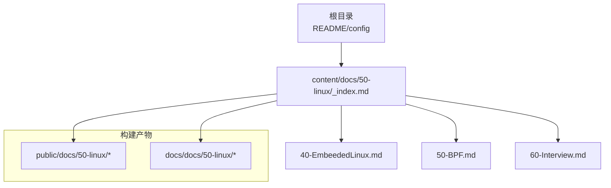
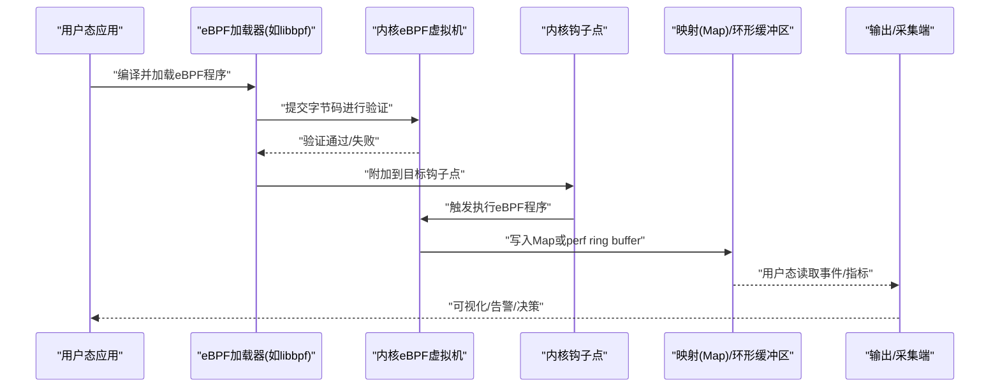
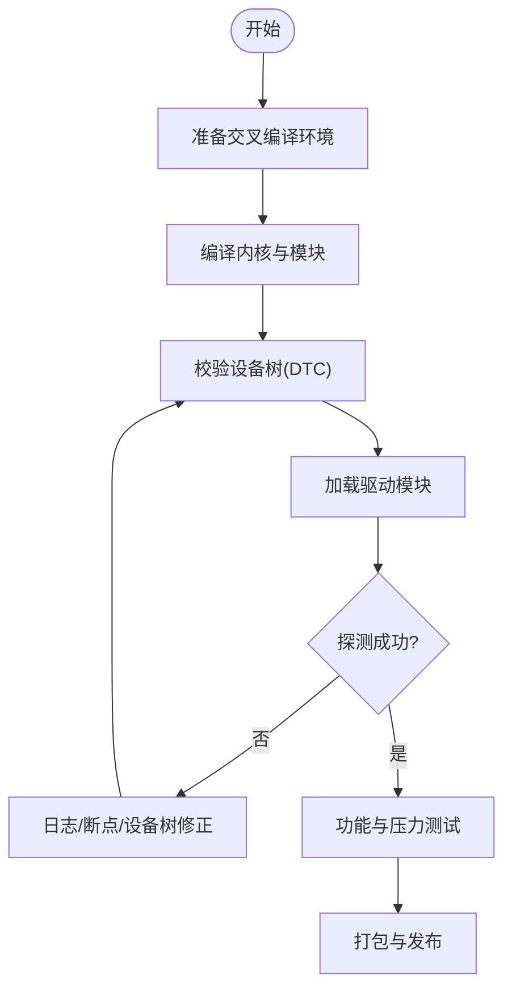
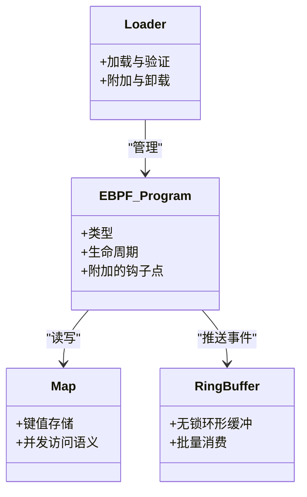
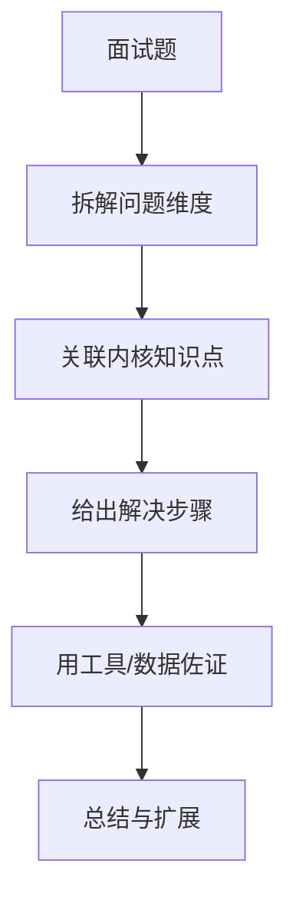
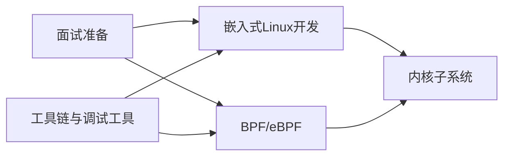

# Linux内核技术

<cite>
**本文引用的文件**   
- [content/docs/50-linux/_index.md](file://content/docs/50-linux/_index.md)
- [content/docs/50-linux/40-EmbeededLinux.md](file://content/docs/50-linux/40-EmbeededLinux.md)
- [content/docs/50-linux/50-BPF.md](file://content/docs/50-linux/50-BPF.md)
- [content/docs/50-linux/60-Interview.md](file://content/docs/50-linux/60-Interview.md)
</cite>

## 更新摘要
**变更内容**   
- 新增完整的Linux系统管理知识体系，涵盖嵌入式Linux、BPF技术和面试准备三大主题
- 大幅扩展原有Linux内核技术文档的覆盖范围
- 增加实际代码示例和调试技巧
- 完善架构图表和流程图说明

## 目录
1. [简介](#简介)
2. [项目结构](#项目结构)
3. [核心组件](#核心组件)
4. [架构总览](#架构总览)
5. [详细组件分析](#详细组件分析)
6. [依赖关系分析](#依赖关系分析)
7. [性能与可观测性](#性能与可观测性)
8. [故障排查指南](#故障排查指南)
9. [结论](#结论)
10. [附录：面试要点与实战清单](#附录面试要点与实战清单)

## 简介
本仓库围绕嵌入式Linux开发、BPF/eBPF技术与内核面试准备三大主题，提供体系化的知识组织与学习路径。内容覆盖Linux内核架构、系统调用机制、内存管理、进程调度等核心概念；深入讲解交叉编译、设备树配置与驱动开发流程；全面介绍BPF/eBPF原理与应用场景（网络监控、性能分析、安全审计），并配套实践案例与调试技巧，帮助读者从理论到工程落地形成闭环。

## 项目结构
文档采用Hugo静态站点组织，源码位于 content/docs/50-linux 目录下，按主题分章：
- 嵌入式Linux：交叉编译、设备树、驱动开发
- BPF/eBPF：原理、工具链、典型用例
- 面试准备：高频问题、答题框架、实战建议

图表来源
- [content/docs/50-linux/_index.md](file://content/docs/50-linux/_index.md)

章节来源
- [content/docs/50-linux/_index.md](file://content/docs/50-linux/_index.md)

## 核心组件
- 嵌入式Linux专题
  - 交叉编译工具链与环境搭建
  - 设备树（DTS/DTC）语法与绑定规范
  - 字符/块/网络设备驱动开发流程与调试
- BPF/eBPF专题
  - eBPF程序类型、生命周期与数据面/控制面交互
  - 常用钩子点（kprobe/uprobe/fentry/fexit/cgroup/netfilter/XDP等）
  - 典型用例：网络遥测、性能剖析、安全策略
- 面试准备专题
  - 内核子系统速览（进程、内存、I/O、网络、文件系统）
  - 经典问题与结构化回答模板
  - 实战演练与排障思路

章节来源
- [content/docs/50-linux/40-EmbeededLinux.md](file://content/docs/50-linux/40-EmbeededLinux.md)
- [content/docs/50-linux/50-BPF.md](file://content/docs/50-linux/50-BPF.md)
- [content/docs/50-linux/60-Interview.md](file://content/docs/50-linux/60-Interview.md)

## 架构总览
下图展示"用户态工具—eBPF程序—内核钩子—数据通道"的整体工作流，适用于网络监控、性能分析与安全审计等场景。

图表来源
- [content/docs/50-linux/50-BPF.md](file://content/docs/50-linux/50-BPF.md)

## 详细组件分析

### 嵌入式Linux开发
- 交叉编译
  - 工具链选择与安装（aarch64/arm/x86_64等）
  - 环境变量与Makefile集成
  - 常见陷阱：ABI差异、库依赖、链接顺序
- 设备树
  - DTS结构与节点命名约定
  - 属性定义与绑定文档
  - 动态更新与热插拔支持
- 驱动开发
  - 字符/块/网络设备驱动骨架
  - 中断处理、DMA、IOMMU与电源管理
  - 调试手段：printk、ftrace、perf、crash、kgdb

图表来源
- [content/docs/50-linux/40-EmbeededLinux.md](file://content/docs/50-linux/40-EmbeededLinux.md)

章节来源
- [content/docs/50-linux/40-EmbeededLinux.md](file://content/docs/50-linux/40-EmbeededLinux.md)

### BPF/eBPF技术详解
- 原理与模型
  - eBPF字节码、JIT编译与安全验证
  - Map与Ring Buffer作为内核-用户态共享数据结构
  - 程序类型与生命周期管理
- 编程与实践
  - 常用钩子点与适用场景
  - 采样与聚合策略，避免热点路径开销
  - 与现有生态集成（Cilium、bcc、libbpf）
- 典型用例
  - 网络监控：包级统计、延迟分布、丢包定位
  - 性能分析：CPU热点、锁竞争、页缓存命中率
  - 安全审计：异常系统调用、敏感文件访问、容器逃逸检测

图表来源
- [content/docs/50-linux/50-BPF.md](file://content/docs/50-linux/50-BPF.md)

章节来源
- [content/docs/50-linux/50-BPF.md](file://content/docs/50-linux/50-BPF.md)

### 面试准备指南
- 知识图谱
  - 进程与调度：任务状态、调度类、优先级与实时策略
  - 内存管理：页表、TLB、Slab/SLUB、NUMA与OOM
  - I/O栈：VFS、块层、网络协议栈与零拷贝
  - 同步原语：自旋锁、互斥量、RCU、原子操作
- 答题框架
  - STAR法（情境-任务-行动-结果）
  - 分层拆解（从现象到根因）
  - 量化指标（时延、吞吐、资源占用）
- 实战演练
  - 结合perf/ftrace/bpftrace定位瓶颈
  - 使用crash/kdump分析崩溃现场
  - 编写最小复现与回归测试

图表来源
- [content/docs/50-linux/60-Interview.md](file://content/docs/50-linux/60-Interview.md)

章节来源
- [content/docs/50-linux/60-Interview.md](file://content/docs/50-linux/60-Interview.md)

## 依赖关系分析
- 主题内聚
  - 嵌入式Linux与BPF在驱动与网络栈中互补：前者负责硬件抽象与能力暴露，后者用于运行时可观测性与策略注入
  - 面试准备贯穿前两者，强调以问题为导向的知识整合
- 外部依赖
  - 工具链与编译器（交叉编译、Clang/BCC/libbpf）
  - 内核特性开关（CONFIG_BPF_*、CONFIG_EBPF_*、CONFIG_DEVICE_TREE等）
  - 调试与分析工具（perf、ftrace、bpftrace、crash）

图表来源
- [content/docs/50-linux/40-EmbeededLinux.md](file://content/docs/50-linux/40-EmbeededLinux.md)
- [content/docs/50-linux/50-BPF.md](file://content/docs/50-linux/50-BPF.md)
- [content/docs/50-linux/60-Interview.md](file://content/docs/50-linux/60-Interview.md)

章节来源
- [content/docs/50-linux/40-EmbeededLinux.md](file://content/docs/50-linux/40-EmbeededLinux.md)
- [content/docs/50-linux/50-BPF.md](file://content/docs/50-linux/50-BPF.md)
- [content/docs/50-linux/60-Interview.md](file://content/docs/50-linux/60-Interview.md)

## 性能与可观测性
- 设计原则
  - 低开销：尽量在eBPF侧完成过滤与聚合，减少用户态往返
  - 可扩展：使用Map分区与多队列降低热点
  - 可回滚：灰度发布与快速卸载策略
- 关键指标
  - 事件吞吐、采样率、CPU占用、内存峰值
  - 端到端时延与抖动
- 最佳实践
  - 合理选择钩子点与程序类型
  - 使用tail call与多程序协作
  - 结合perf/ftrace做基线对比

[本节为通用指导，不直接分析具体文件]

## 故障排查指南
- 常见问题
  - 交叉编译失败：工具链版本、ABI不匹配、头文件缺失
  - 设备树错误：节点/属性拼写、兼容性字符串不匹配
  - eBPF验证失败：越界访问、未初始化变量、循环复杂度超限
- 定位方法
  - dmesg/printk分级输出
  - ftrace/tracepoints定位热点路径
  - perf记录火焰图与热点函数
  - crash/kdump分析内核崩溃
- 恢复策略
  - 回退到稳定版本
  - 缩小变更范围，逐步验证
  - 建立回归测试与自动化巡检

章节来源
- [content/docs/50-linux/40-EmbeededLinux.md](file://content/docs/50-linux/40-EmbeededLinux.md)
- [content/docs/50-linux/50-BPF.md](file://content/docs/50-linux/50-BPF.md)

## 结论
本仓库将嵌入式Linux、BPF/eBPF与面试准备有机串联，既提供工程化落地路径，又强化系统性思维与实战能力。建议读者按"基础概念→工具链→实践案例→复盘总结"的顺序推进，并结合真实业务场景持续迭代。

[本节为总结性内容，不直接分析具体文件]

## 附录：面试要点与实战清单
- 必知内核子系统
  - 进程与调度、内存管理、I/O与网络栈、文件系统、同步原语
- 高频问题方向
  - 系统调用路径、页分配与回收、锁与RCU、网络零拷贝、eBPF钩子选择
- 实战清单
  - 使用bpftrace快速采集网络/磁盘/CPU指标
  - 基于libbpf编写最小eBPF程序并接入可视化
  - 在ARM平台完成一次完整的交叉编译与驱动加载

章节来源
- [content/docs/50-linux/60-Interview.md](file://content/docs/50-linux/60-Interview.md)