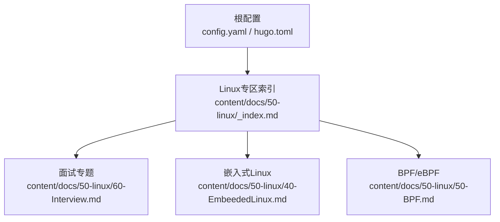
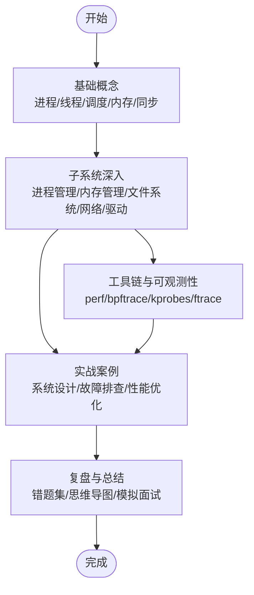
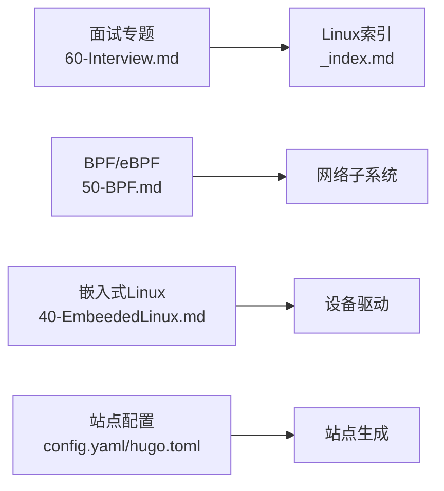

# Linux内核面试准备

<cite>
**本文引用的文件**   
- [content/docs/50-linux/60-Interview.md](file://content/docs/50-linux/60-Interview.md)
- [content/docs/50-linux/_index.md](file://content/docs/50-linux/_index.md)
- [content/docs/50-linux/40-EmbeededLinux.md](file://content/docs/50-linux/40-EmbeededLinux.md)
- [content/docs/50-linux/50-BPF.md](file://content/docs/50-linux/50-BPF.md)
- [config.yaml](file://config.yaml)
- [hugo.toml](file://hugo.toml)
</cite>

## 目录
1. [简介](#简介)
2. [项目结构](#项目结构)
3. [核心组件](#核心组件)
4. [架构总览](#架构总览)
5. [详细组件分析](#详细组件分析)
6. [依赖分析](#依赖分析)
7. [性能考虑](#性能考虑)
8. [故障排查指南](#故障排查指南)
9. [结论](#结论)
10. [附录](#附录)

## 简介
本文件面向准备Linux内核相关岗位面试的工程师，围绕进程管理、内存管理、文件系统、网络子系统、设备驱动等核心领域，整理经典面试题与解答思路，并结合仓库中已有的“面试”专题内容，提供系统化复习路径与实践建议。文档同时给出可视化图示，帮助读者建立从概念到代码落地的整体认知。

## 项目结构
仓库采用Hugo静态站点组织内容，Linux内核相关内容集中在 content/docs/50-linux 目录下，其中：
- 60-Interview.md：面试专题入口与要点汇总
- _index.md：Linux子域导航索引
- 40-EmbeededLinux.md：嵌入式Linux主题（可作为内核与硬件交互的切入点）
- 50-BPF.md：BPF/eBPF主题（可关联内核可观测性与网络/系统调用追踪）

图表来源
- [config.yaml](file://config.yaml)
- [hugo.toml](file://hugo.toml)
- [content/docs/50-linux/_index.md](file://content/docs/50-linux/_index.md)
- [content/docs/50-linux/60-Interview.md](file://content/docs/50-linux/60-Interview.md)
- [content/docs/50-linux/40-EmbeededLinux.md](file://content/docs/50-linux/40-EmbeededLinux.md)
- [content/docs/50-linux/50-BPF.md](file://content/docs/50-linux/50-BPF.md)

章节来源
- [content/docs/50-linux/_index.md](file://content/docs/50-linux/_index.md)
- [content/docs/50-linux/60-Interview.md](file://content/docs/50-linux/60-Interview.md)
- [content/docs/50-linux/40-EmbeededLinux.md](file://content/docs/50-linux/40-EmbeededLinux.md)
- [content/docs/50-linux/50-BPF.md](file://content/docs/50-linux/50-BPF.md)
- [config.yaml](file://config.yaml)
- [hugo.toml](file://hugo.toml)

## 核心组件
- 面试专题（60-Interview.md）：作为知识地图与问题清单的聚合页，适合按模块逐项攻克。
- Linux专区索引（_index.md）：提供子域导航，便于快速定位进程、内存、FS、网络、驱动等主题。
- 嵌入式Linux（40-EmbeededLinux.md）：聚焦内核与硬件交互、启动流程、设备树、中断等，是理解底层机制的重要入口。
- BPF/eBPF（50-BPF.md）：覆盖内核可观测性、安全与网络加速场景，常与网络子系统、系统调用追踪结合考察。

章节来源
- [content/docs/50-linux/60-Interview.md](file://content/docs/50-linux/60-Interview.md)
- [content/docs/50-linux/_index.md](file://content/docs/50-linux/_index.md)
- [content/docs/50-linux/40-EmbeededLinux.md](file://content/docs/50-linux/40-EmbeededLinux.md)
- [content/docs/50-linux/50-BPF.md](file://content/docs/50-linux/50-BPF.md)

## 架构总览
下图展示面试准备的知识结构与学习路径，强调从“基础概念—子系统深入—实战案例—工具链”的递进关系。

[此图为概念性流程图，不直接映射具体源码文件]

## 详细组件分析

### 进程管理与调度
- 关键知识点
  - 进程/线程模型、task_struct、状态机与上下文切换
  - 调度器类与策略（CFS、实时）、负载均衡与NUMA感知
  - 优先级、nice值、调度延迟与公平性
  - 锁与同步（自旋锁、互斥量、RCU、原子操作）
- 常见面试题方向
  - 解释一次完整上下文切换的开销与优化点
  - CFS如何保证公平性与低延迟？
  - 高并发下锁竞争热点的定位与缓解
- 实践建议
  - 使用perf sched、ftrace trace_sched_switch观察调度行为
  - 在测试环境复现锁竞争并验证优化效果

章节来源
- [content/docs/50-linux/60-Interview.md](file://content/docs/50-linux/60-Interview.md)

### 内存管理
- 关键知识点
  - 虚拟内存、页表、TLB、缺页异常处理
  - 伙伴系统与slab/slub分配器、页面回收与换页
  - NUMA拓扑、内存节点与本地化分配
  - 内存屏障、一致性模型与可见性
- 常见面试题方向
  - 大对象与小对象分配策略差异及适用场景
  - 内存泄漏与碎片化的诊断方法
  - 高吞吐场景下的零拷贝与内存复用
- 实践建议
  - 使用kmemleak、vmstat、numastat定位问题
  - 通过eBPF统计分配路径热点

章节来源
- [content/docs/50-linux/60-Interview.md](file://content/docs/50-linux/60-Interview.md)

### 文件系统与VFS
- 关键知识点
  - VFS抽象层、inode/dentry/file三元组
  - 页缓存与缓冲区缓存、写回与一致性
  - 典型文件系统特性（ext4/xfs/btrfs）与挂载流程
  - O_DIRECT、mmap、splice/vmsplice零拷贝路径
- 常见面试题方向
  - 顺序读写与随机IO的性能差异与优化
  - 大文件写入时的页缓存压力与调优
  - 跨文件系统数据迁移的高效方案
- 实践建议
  - 使用iostat、blktrace、bpftrace跟踪IO路径
  - 对比不同mount选项对吞吐与延迟的影响

章节来源
- [content/docs/50-linux/60-Interview.md](file://content/docs/50-linux/60-Interview.md)

### 网络子系统
- 关键知识点
  - sk_buff生命周期、协议栈分层（L2-L4）
  - 套接字API与内核态实现、NAPI与软中断
  - TCP拥塞控制、队列与丢包策略
  - XDP/eBPF在数据包路径上的加速
- 常见面试题方向
  - 小包风暴下的CPU占用分析与优化
  - 高并发连接下的内存与锁瓶颈定位
  - 基于eBPF的流量镜像与监控
- 实践建议
  - 使用ss、ethtool、tc、bpftrace进行端到端诊断
  - 编写简单XDP程序验证转发路径优化

章节来源
- [content/docs/50-linux/60-Interview.md](file://content/docs/50-linux/60-Interview.md)
- [content/docs/50-linux/50-BPF.md](file://content/docs/50-linux/50-BPF.md)

### 设备驱动与中断
- 关键知识点
  - 驱动模型（platform/PCI/USB）、probe/remove流程
  - 中断处理上半部/下半部、软IRQ与任务队列
  - DMA与IOMMU、内存映射与一致性
  - 设备树与固件加载
- 常见面试题方向
  - 中断延迟抖动的原因与优化手段
  - 驱动并发访问共享资源的保护策略
  - 设备热插拔与电源管理的注意事项
- 实践建议
  - 使用irqtop、latencytop、ftrace分析中断路径
  - 在虚拟机或开发板上验证驱动行为

章节来源
- [content/docs/50-linux/60-Interview.md](file://content/docs/50-linux/60-Interview.md)
- [content/docs/50-linux/40-EmbeededLinux.md](file://content/docs/50-linux/40-EmbeededLinux.md)

### BPF/eBPF与可观测性
- 关键知识点
  - eBPF程序类型（kprobe/uprobe/tracepoint/socket/XDP）
  - 与内核数据结构交互、Map与RingBuffer
  - bpftrace与perf事件组合使用
- 常见面试题方向
  - 如何在生产环境安全地采集系统指标
  - 用eBPF实现轻量级网络监控与限流
  - 避免eBPF程序阻塞与OOM的策略
- 实践建议
  - 使用bpftrace快速定位热点函数与参数
  - 将eBPF探针集成到CI中进行回归验证

章节来源
- [content/docs/50-linux/50-BPF.md](file://content/docs/50-linux/50-BPF.md)
- [content/docs/50-linux/60-Interview.md](file://content/docs/50-linux/60-Interview.md)

### 嵌入式Linux与内核启动
- 关键知识点
  - Bootloader与内核初始化阶段
  - 设备树解析、时钟/复位/电源管理
  - 最小系统构建与裁剪
- 常见面试题方向
  - 启动慢的根因定位与优化
  - 外设驱动适配的关键步骤与常见问题
- 实践建议
  - 使用dmesg、loglevel调试早期启动阶段
  - 在QEMU或开发板复现问题

章节来源
- [content/docs/50-linux/40-EmbeededLinux.md](file://content/docs/50-linux/40-EmbeededLinux.md)

### 面试题型与解题思路

#### 系统设计题（示例：设计一个高吞吐的网络代理）
- 目标
  - 在有限CPU核数下提升吞吐、降低延迟
- 关键点
  - 多队列与CPU亲和、NAPI与轮询
  - 零拷贝路径（splice/vmsplice、sendfile）
  - 用户态旁路（DPDK/XDP）与内核协同
- 评估维度
  - 吞吐、延迟、CPU利用率、可扩展性、稳定性
- 实践建议
  - 以bpftrace/perf为观测手段，逐步引入优化并量化收益

章节来源
- [content/docs/50-linux/60-Interview.md](file://content/docs/50-linux/60-Interview.md)

#### 故障排查题（示例：服务器偶发卡顿）
- 目标
  - 快速定位卡顿根因并给出缓解方案
- 关键点
  - 区分CPU饥饿、锁竞争、IO等待、GC/换页
  - 使用perf top/ftrace/blktrace/eBPF交叉验证
- 输出物
  - 时间线、热点函数/路径、资源瓶颈证据、修复建议
- 实践建议
  - 建立基线与阈值告警，缩短MTTR

章节来源
- [content/docs/50-linux/60-Interview.md](file://content/docs/50-linux/60-Interview.md)

#### 性能优化题（示例：数据库连接池导致CPU飙升）
- 目标
  - 在高并发短连接场景下降低CPU与锁争用
- 关键点
  - 连接复用、批量提交、减少系统调用
  - 调整内核参数（如somaxconn、tcp_tw_reuse）
- 验证方式
  - 压测前后对比吞吐、延迟、CPU、上下文切换次数
- 实践建议
  - 使用bpftrace统计系统调用分布与热点

章节来源
- [content/docs/50-linux/60-Interview.md](file://content/docs/50-linux/60-Interview.md)

## 依赖分析
- 内容依赖
  - 面试专题依赖于Linux专区索引提供的导航结构
  - BPF与网络/可观测性主题相互支撑
  - 嵌入式Linux为驱动与中断话题提供背景
- 站点配置依赖
  - Hugo站点通过配置文件定义主题、语言、菜单与SEO等元信息

图表来源
- [content/docs/50-linux/60-Interview.md](file://content/docs/50-linux/60-Interview.md)
- [content/docs/50-linux/_index.md](file://content/docs/50-linux/_index.md)
- [content/docs/50-linux/50-BPF.md](file://content/docs/50-linux/50-BPF.md)
- [content/docs/50-linux/40-EmbeededLinux.md](file://content/docs/50-linux/40-EmbeededLinux.md)
- [config.yaml](file://config.yaml)
- [hugo.toml](file://hugo.toml)

章节来源
- [content/docs/50-linux/60-Interview.md](file://content/docs/50-linux/60-Interview.md)
- [content/docs/50-linux/_index.md](file://content/docs/50-linux/_index.md)
- [content/docs/50-linux/50-BPF.md](file://content/docs/50-linux/50-BPF.md)
- [content/docs/50-linux/40-EmbeededLinux.md](file://content/docs/50-linux/40-EmbeededLinux.md)
- [config.yaml](file://config.yaml)
- [hugo.toml](file://hugo.toml)

## 性能考虑
- 通用原则
  - 先测量后优化，明确瓶颈在CPU/内存/IO/网络哪一层
  - 关注热点路径与锁粒度，优先消除不必要的拷贝与上下文切换
  - 利用eBPF与perf进行无侵入式观测，避免二次扰动
- 子系统要点
  - 进程/调度：合理设置CPU亲和与nice，避免长尾延迟
  - 内存：选择合适分配器与大小类，减少碎片与换页
  - 文件系统：按需启用O_DIRECT/mmap，注意写回策略
  - 网络：NAPI、多队列、XDP与零拷贝组合拳
  - 驱动：中断合并、DMA对齐、避免忙轮询

[本节为通用指导，不直接分析具体文件]

## 故障排查指南
- 方法论
  - 明确现象与范围（时间窗口、影响面、变更历史）
  - 分层定位（应用—内核—硬件），交叉验证
  - 收集证据（日志、快照、火焰图、eBPF脚本）
- 常用工具
  - perf、ftrace、bpftrace、systemtap、crash、netstat/ss/iostat
- 输出规范
  - 根因陈述、证据链、影响评估、修复方案与回归验证计划

[本节为通用指导，不直接分析具体文件]

## 结论
- 面试准备应围绕“概念—子系统—工具—案例”的闭环展开
- 以实际案例驱动学习，形成可复用的排障与优化模板
- 持续积累错题集与最佳实践，提升表达与结构化思维

[本节为总结性内容，不直接分析具体文件]

## 附录
- 学习资源建议
  - 官方文档与内核源码注释
  - 经典书籍与课程（进程/内存/网络/驱动分册）
  - 社区博客与会议演讲（内核峰会、技术大会）
- 实践项目建议
  - 基于eBPF的系统调用与网络监控小工具
  - 在QEMU/开发板上移植与调试最小驱动
  - 针对特定工作负载的端到端性能优化实验

[本节为补充建议，不直接分析具体文件]