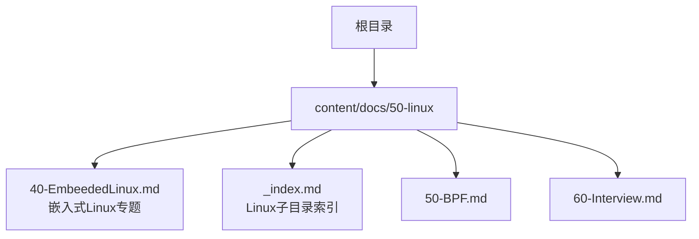
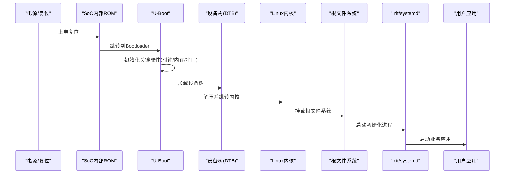
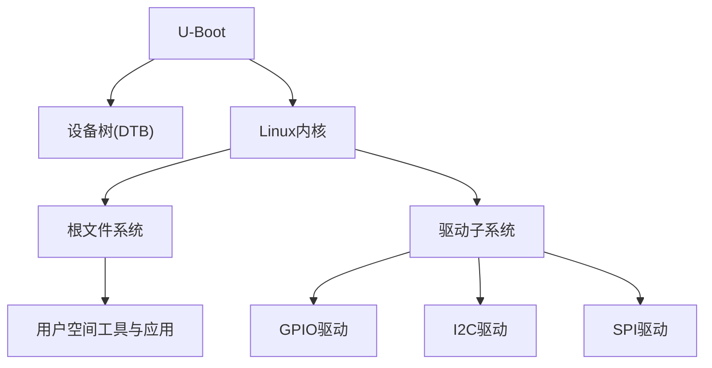

# 嵌入式Linux开发

<cite>
**本文引用的文件**   
- [content/docs/50-linux/40-EmbeededLinux.md](file://content/docs/50-linux/40-EmbeededLinux.md)
</cite>

## 目录
1. [简介](#简介)
2. [项目结构](#项目结构)
3. [核心组件](#核心组件)
4. [架构总览](#架构总览)
5. [详细组件分析](#详细组件分析)
6. [依赖关系分析](#依赖关系分析)
7. [性能考虑](#性能考虑)
8. [故障排查指南](#故障排查指南)
9. [结论](#结论)
10. [附录](#附录)

## 简介
本文件面向嵌入式Linux开发者，围绕系统架构、交叉编译环境搭建、Bootloader（U-Boot）配置、内核裁剪与优化、设备树（Device Tree）概念与配置方法、驱动开发流程（字符设备、块设备、网络设备）、常见外设驱动实践（GPIO、I2C、SPI），以及调试技巧、性能优化与常见问题解决方案进行系统化说明。内容以仓库中“嵌入式Linux”主题文档为基础，结合通用工程实践进行扩展，帮助读者从入门到实战逐步掌握嵌入式Linux全栈开发能力。

## 项目结构
仓库采用Hugo静态站点组织技术文档，嵌入式Linux相关内容位于 content/docs/50-linux 目录下，其中 40-EmbeededLinux.md 为嵌入式Linux专题入口页。整体结构清晰，便于按主题检索与扩展。

图表来源
- [content/docs/50-linux/_index.md](file://content/docs/50-linux/_index.md)
- [content/docs/50-linux/40-EmbeededLinux.md](file://content/docs/50-linux/40-EmbeededLinux.md)

章节来源
- [content/docs/50-linux/40-EmbeededLinux.md](file://content/docs/50-linux/40-EmbeededLinux.md)

## 核心组件
- 交叉编译工具链：用于在主机上生成目标平台可执行文件与库，是构建Bootloader、内核与用户态应用的基础。
- Bootloader（U-Boot）：负责硬件初始化、加载内核与设备树、传递启动参数。
- Linux内核：提供进程调度、内存管理、文件系统、网络栈与驱动框架。
- 设备树（DTS/DTB）：描述板级硬件资源（中断、时钟、总线、引脚等），供内核动态识别与加载驱动。
- 驱动子系统：字符设备、块设备、网络设备三大类，分别对应不同I/O模型与接口。
- 用户空间工具：busybox、systemd/init、udev、strace、gdbserver等，用于运行环境与调试。

章节来源
- [content/docs/50-linux/40-EmbeededLinux.md](file://content/docs/50-linux/40-EmbeededLinux.md)

## 架构总览
嵌入式Linux典型启动与运行路径如下：

图表来源
- [content/docs/50-linux/40-EmbeededLinux.md](file://content/docs/50-linux/40-EmbeededLinux.md)

## 详细组件分析

### 交叉编译环境搭建
- 选择合适工具链：根据目标架构（ARM/aarch64/MIPS/RISC-V等）与ABI（eabi/eabihf）选取官方或供应商提供的工具链。
- 环境变量配置：设置 PATH、CROSS_COMPILE、ARCH、CFLAGS/LDFLAGS 等，确保 make、gcc、ld、objcopy 等命令正确解析。
- 构建顺序建议：先构建最小根文件系统与基础库，再构建U-Boot与内核，最后打包应用。
- 缓存与并行：合理配置 -j 并行度与ccache，提升构建效率。
- 验证与回归：通过 hello world、busybox、简单网络测试用例验证工具链可用性与稳定性。

章节来源
- [content/docs/50-linux/40-EmbeededLinux.md](file://content/docs/50-linux/40-EmbeededLinux.md)

### Bootloader（U-Boot）配置
- 目标板支持：选择或移植对应 board 配置，启用必要的驱动（串口、MMC/SD、以太网、USB）。
- 环境变量：设置 bootcmd、bootargs、fdt_addr、kernel_addr 等，定义默认启动流程与内核参数。
- 设备树加载：指定 DTB 路径与地址，确保内核能正确解析硬件信息。
- 存储介质：支持从 eMMC/SD/NAND/网络/TFTP 启动，按需启用相应驱动与协议。
- 安全与签名：可选启用固件签名校验与安全启动流程。

章节来源
- [content/docs/50-linux/40-EmbeededLinux.md](file://content/docs/50-linux/40-EmbeededLinux.md)

### 内核裁剪与优化
- 配置策略：基于 defconfig 与 menuconfig 裁剪不必要的子系统与驱动，减少镜像体积与启动时间。
- 关键选项：启用精简的 initramfs、选择合适的文件系统（ext4/squashfs/cramfs）、关闭调试与冗余日志。
- 性能调优：调整调度器、内存回收、页面大小、NUMA/多核亲和性、中断合并等。
- 模块与内置：对稳定驱动使用内置，对热插拔设备使用模块，平衡灵活性与开销。
- 安全加固：开启 SELinux/AppArmor、禁用不必要服务、限制内核功能暴露面。

章节来源
- [content/docs/50-linux/40-EmbeededLinux.md](file://content/docs/50-linux/40-EmbeededLinux.md)

### 设备树（Device Tree）概念与配置
- 基本概念：DTS 文本描述硬件拓扑，编译为 DTB 二进制供内核解析；节点与属性表达设备、总线、资源映射。
- 节点定义：包含设备节点、控制器节点（如 i2c@xxx、spi@yyy）、引脚复用（pinctrl）、时钟（clocks）、中断（interrupts）等。
- 属性设置：常用属性包括 reg、interrupt-parent、gpio-controller、status、compatible、clock-frequency 等。
- 绑定文档：遵循各驱动的 binding 规范，确保 compatible 字符串与内核匹配。
- 调试手段：使用 dtc 编译检查语法，借助内核 dmesg 与 sysfs 查看设备树解析结果。

章节来源
- [content/docs/50-linux/40-EmbeededLinux.md](file://content/docs/50-linux/40-EmbeededLinux.md)

### 驱动开发流程与实践
- 字符设备驱动：实现 open/read/write/ioctl/release 等 file_operations，注册 cdev，创建设备节点，处理并发与错误码。
- 块设备驱动：实现 request_fn 或 bio 队列操作，适配 block_device_operations，处理扇区对齐与I/O调度。
- 网络设备驱动：实现 net_device_ops，完成 probe/remove、tx/rx 路径、中断与DMA、流量控制与统计。
- 资源管理：统一使用 devm_* API 管理内存、IRQ、时钟、GPIO，简化错误路径清理。
- 同步与并发：合理使用自旋锁、互斥量、completion、workqueue，避免死锁与竞态。
- 测试与验证：通过 /proc、/sys、dmesg、perf、ftrace、kprobes 等进行功能与性能验证。

章节来源
- [content/docs/50-linux/40-EmbeededLinux.md](file://content/docs/50-linux/40-EmbeededLinux.md)

### GPIO 控制实践要点
- 使用 gpiolib 抽象层，通过设备树声明 GPIO 引脚与极性。
- 在驱动中申请 GPIO、设置方向、读写电平，注意去抖与延时。
- 结合 pinctrl 配置引脚复用与电气特性（上拉/下拉、驱动强度）。
- 事件驱动：必要时使用 IRQ 模式监听边沿变化。

章节来源
- [content/docs/50-linux/40-EmbeededLinux.md](file://content/docs/50-linux/40-EmbeededLinux.md)

### I2C 通信实践要点
- 使用 i2c-core 与适配器驱动，通过设备树声明 i2c 总线与从设备。
- 在驱动中用 i2c_transfer 或 i2c_smbus_xxx 发送/接收数据。
- 处理时序与时钟频率，注意总线仲裁与错误重试。
- 配合传感器/寄存器映射，封装读写函数提高可读性。

章节来源
- [content/docs/50-linux/40-EmbeededLinux.md](file://content/docs/50-linux/40-EmbeededLinux.md)

### SPI 接口实践要点
- 使用 spi-core 与控制器驱动，设备树声明 spi 总线与从设备。
- 通过 spi_sync 或 spi_async 进行数据传输，配置位序、时钟极性与相位。
- 针对高速设备优化 DMA 与缓冲区大小，降低CPU占用。
- 处理片选与CS切换，确保时序满足器件要求。

章节来源
- [content/docs/50-linux/40-EmbeededLinux.md](file://content/docs/50-linux/40-EmbeededLinux.md)

### 调试技巧
- 内核日志：dmesg、printk 级别控制、动态打印（dynamic_debug）。
- 跟踪与剖析：ftrace、perf、bpftrace/kprobe，定位热点与延迟。
- 用户态调试：gdb/gdbserver、strace、valgrind、ltrace。
- 设备树调试：dtc 编译检查、/proc/device-tree 查看解析结果。
- 电源与功耗：pm_runtime、cpufreq、idle 状态分析与优化。

章节来源
- [content/docs/50-linux/40-EmbeededLinux.md](file://content/docs/50-linux/40-EmbeededLinux.md)

### 性能优化方法
- 启动时间：精简内核与init流程、启用早期日志、减少驱动探测耗时。
- I/O吞吐：合理队列深度、批量传输、零拷贝、DMA 对齐。
- CPU利用率：中断合并、软中断与NAPI、工作队列替代忙轮询。
- 内存管理：大页、slab优化、内存池、避免频繁分配释放。
- 网络栈：TCP窗口、拥塞控制算法、RPS/RFS、网卡多队列。

章节来源
- [content/docs/50-linux/40-EmbeededLinux.md](file://content/docs/50-linux/40-EmbeededLinux.md)

### 常见问题与解决方案
- 无法挂载根文件系统：检查 bootargs 中的 root= 与 fstype，确认分区与文件系统类型。
- 设备树不生效：核对 compatible 字符串、reg 地址与中断号，使用 dmesg 查看解析错误。
- 驱动加载失败：确认模块签名、依赖库版本、设备树节点存在且 status="okay"。
- 性能不达预期：使用 perf/ftrace 定位瓶颈，调整队列与中断合并，评估DMA与缓存一致性。
- 启动不稳定：检查电源与复位时序、时钟配置、外部存储器初始化顺序。

章节来源
- [content/docs/50-linux/40-EmbeededLinux.md](file://content/docs/50-linux/40-EmbeededLinux.md)

## 依赖关系分析
嵌入式Linux各组件之间的依赖关系如下：

图表来源
- [content/docs/50-linux/40-EmbeededLinux.md](file://content/docs/50-linux/40-EmbeededLinux.md)

## 性能考虑
- 构建阶段：启用ccache与并行构建，减少重复编译成本。
- 运行时：优先使用异步与批处理I/O，降低上下文切换与中断开销。
- 资源受限：裁剪内核与用户态组件，避免不必要的服务与日志输出。
- 监控与度量：建立性能基线，持续采集关键指标（启动时间、吞吐、时延、功耗）。

[本节为通用指导，无需具体文件引用]

## 故障排查指南
- 启动问题：检查U-Boot环境变量与日志、内核命令行参数、设备树与驱动匹配。
- 驱动问题：确认设备树节点、中断与资源映射、驱动probe路径与错误码。
- 性能问题：使用perf/ftrace定位热点，调整队列与中断合并，评估DMA与缓存一致性。
- 网络问题：检查网卡驱动、MTU、多队列与RPS/RFS配置，抓包分析丢包与重传。
- 电源问题：验证pm_runtime使用、空闲状态与唤醒源配置。

章节来源
- [content/docs/50-linux/40-EmbeededLinux.md](file://content/docs/50-linux/40-EmbeededLinux.md)

## 结论
嵌入式Linux开发涉及从工具链、Bootloader、内核到驱动与用户空间的完整链路。通过合理的裁剪与优化、严谨的设备树配置与驱动实践，结合系统的调试与性能分析方法，可以在资源受限平台上获得稳定高效的系统表现。建议在项目中形成标准化流程与知识库，持续提升交付质量与迭代效率。

[本节为总结性内容，无需具体文件引用]

## 附录
- 参考文档：内核文档 Documentation/devicetree/、Documentation/driver-api/、Documentation/networking/。
- 工具推荐：dtc、make menuconfig、perf、ftrace、gdb/gdbserver、strace。
- 最佳实践：模块化设计、清晰的设备树绑定、完善的错误处理与日志、自动化测试与回归。

[本节为补充信息，无需具体文件引用]