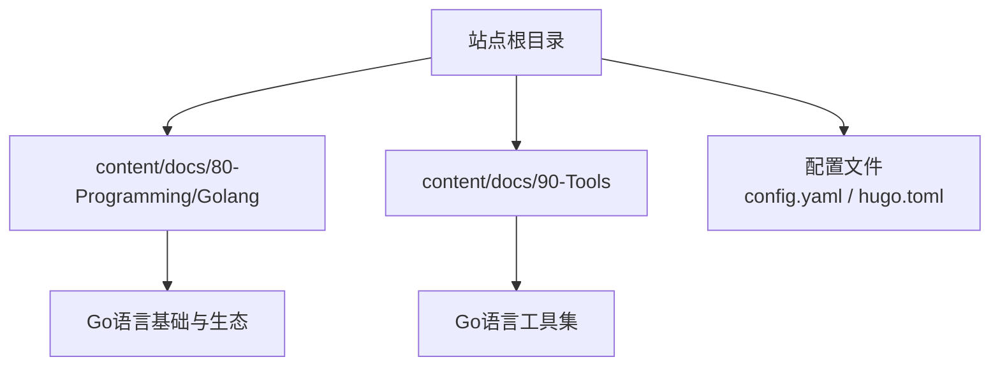
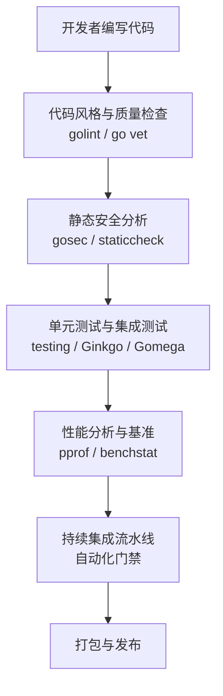
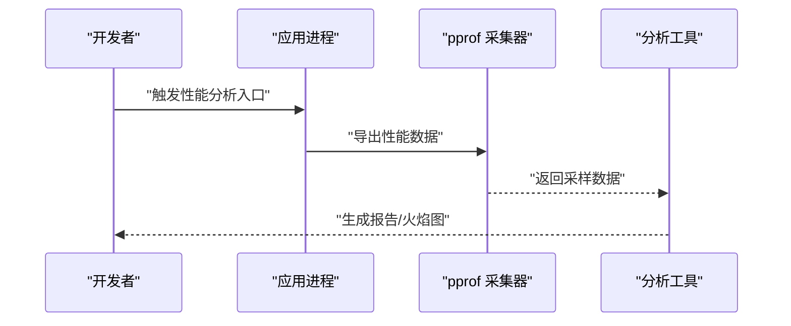
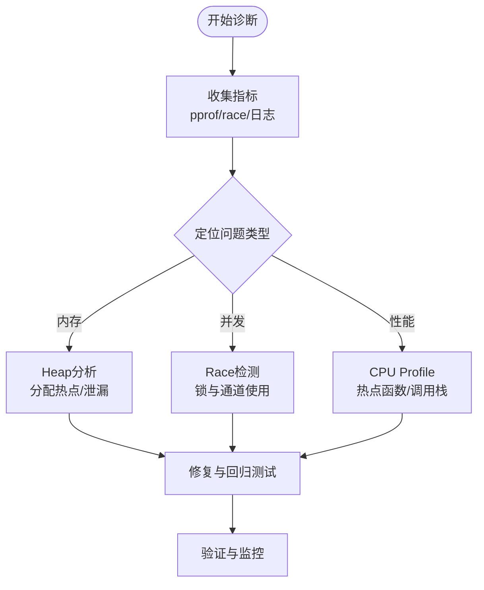
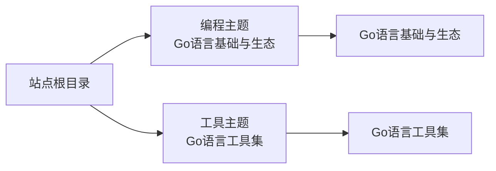

# Go语言开发工具

<cite>
**本文引用的文件**   
- [content/docs/80-Programming/Golang/01_Golang.md](file://content/docs/80-Programming/Golang/01_Golang.md)
- [content/docs/90-Tools/11_Golang.md](file://content/docs/90-Tools/11_Golang.md)
- [config.yaml](file://config.yaml)
- [hugo.toml](file://hugo.toml)
</cite>

## 目录
1. [简介](#简介)
2. [项目结构](#项目结构)
3. [核心组件](#核心组件)
4. [架构总览](#架构总览)
5. [详细组件分析](#详细组件分析)
6. [依赖分析](#依赖分析)
7. [性能考虑](#性能考虑)
8. [故障排查指南](#故障排查指南)
9. [结论](#结论)
10. [附录](#附录)

## 简介
本章节面向Go语言开发者，系统化梳理提升开发效率的工具链与实践方法。内容覆盖代码质量检查（golint、go vet）、静态分析（gosec、staticcheck）、性能分析与基准测试（pprof、benchstat）、测试框架（testing包、Ginkgo、Gomega），以及调试技巧与问题排查（内存泄漏、并发问题、性能瓶颈）。同时提供IDE配置优化建议（VS Code、GoLand）、代码格式化规范、模块管理与依赖版本控制策略，并给出可落地的项目配置示例与自动化脚本思路，帮助构建高效、稳定的Go开发环境。

## 项目结构
仓库为Hugo文档站点，Go语言相关内容位于“编程”与“工具”两个主题目录下：
- 编程主题下的Go语言基础与生态文章
- 工具主题下的Go语言工具集文章
- Hugo站点配置文件用于组织内容与导航

图表来源
- [content/docs/80-Programming/Golang/01_Golang.md](file://content/docs/80-Programming/Golang/01_Golang.md)
- [content/docs/90-Tools/11_Golang.md](file://content/docs/90-Tools/11_Golang.md)
- [config.yaml](file://config.yaml)
- [hugo.toml](file://hugo.toml)

章节来源
- [content/docs/80-Programming/Golang/01_Golang.md](file://content/docs/80-Programming/Golang/01_Golang.md)
- [content/docs/90-Tools/11_Golang.md](file://content/docs/90-Tools/11_Golang.md)
- [config.yaml](file://config.yaml)
- [hugo.toml](file://hugo.toml)

## 核心组件
围绕Go语言开发效率提升，将工具链划分为以下核心组件：
- 代码质量检查：golint、go vet
- 静态安全分析：gosec、staticcheck
- 性能分析与基准：pprof、benchstat
- 测试框架：testing包、Ginkgo、Gomega
- 调试与诊断：pprof、race detector、日志与追踪
- IDE与编辑器：VS Code、GoLand
- 工程化与自动化：Makefile、CI流水线、预提交钩子
- 模块与依赖管理：go.mod、go.sum、版本策略

章节来源
- [content/docs/80-Programming/Golang/01_Golang.md](file://content/docs/80-Programming/Golang/01_Golang.md)
- [content/docs/90-Tools/11_Golang.md](file://content/docs/90-Tools/11_Golang.md)

## 架构总览
下图展示从编码到交付的端到端流程，涵盖本地开发、质量门禁、性能验证与发布阶段的关键工具与步骤。

[此图为概念性流程图，不直接映射具体源码文件]

## 详细组件分析

### 代码质量检查：golint 与 go vet
- golint：关注代码风格与可读性，建议在IDE中实时提示并在CI中作为软门禁。
- go vet：编译器级静态检查，发现潜在错误（如格式字符串不匹配、不可达代码等），应作为硬性门禁。

实践要点
- 在IDE中启用golint与go vet，保证提交前即时反馈。
- 在CI中统一规则，避免团队风格漂移。
- 对历史代码逐步治理，优先修复高危问题。

章节来源
- [content/docs/80-Programming/Golang/01_Golang.md](file://content/docs/80-Programming/Golang/01_Golang.md)
- [content/docs/90-Tools/11_Golang.md](file://content/docs/90-Tools/11_Golang.md)

### 静态分析：gosec 与 staticcheck
- gosec：聚焦安全漏洞扫描（如硬编码密钥、弱加密算法、不安全HTTP调用等）。
- staticcheck：更全面的静态分析，包含常见反模式、未使用变量、类型误用等。

实践要点
- 将gosec纳入CI，阻断高危安全问题。
- 结合staticcheck进行深度代码审查，减少运行时异常。
- 针对误报通过配置排除或注释说明，保持规则可维护。

章节来源
- [content/docs/90-Tools/11_Golang.md](file://content/docs/90-Tools/11_Golang.md)

### 性能分析与基准：pprof 与 benchstat
- pprof：采集CPU、内存、阻塞、互斥锁等指标，定位热点与瓶颈。
- benchstat：对比多次基准测试结果，评估优化效果。

典型工作流
- 启动服务后通过HTTP接口或命令行导出pprof数据。
- 使用可视化工具生成火焰图，识别热点函数与调用路径。
- 编写基准用例，使用benchstat比较优化前后差异。

[此图为概念性序列图，不直接映射具体源码文件]

章节来源
- [content/docs/80-Programming/Golang/01_Golang.md](file://content/docs/80-Programming/Golang/01_Golang.md)
- [content/docs/90-Tools/11_Golang.md](file://content/docs/90-Tools/11_Golang.md)

### 测试框架：testing包、Ginkgo、Gomega
- testing包：标准库测试框架，适合单元与简单集成测试。
- Ginkgo + Gomega：BDD风格测试套件，适合复杂场景与行为驱动描述。

最佳实践
- 分层测试：单元测试快速回归，集成测试覆盖外部依赖交互。
- 表驱动测试：复用测试逻辑，提高覆盖率与维护性。
- 使用Ginkgo组织大型测试套件，配合Gomega断言增强可读性。

章节来源
- [content/docs/80-Programming/Golang/01_Golang.md](file://content/docs/80-Programming/Golang/01_Golang.md)
- [content/docs/90-Tools/11_Golang.md](file://content/docs/90-Tools/11_Golang.md)

### 调试与诊断：内存泄漏、并发问题、性能瓶颈
- 内存泄漏检测：结合pprof的heap快照与diff，定位未释放资源。
- 并发问题诊断：启用-race检测，捕获数据竞争；使用mutex/profile分析锁热点。
- 性能瓶颈分析：CPU profile定位热点函数，goroutine profile排查阻塞。

[此图为概念性流程图，不直接映射具体源码文件]

章节来源
- [content/docs/80-Programming/Golang/01_Golang.md](file://content/docs/80-Programming/Golang/01_Golang.md)
- [content/docs/90-Tools/11_Golang.md](file://content/docs/90-Tools/11_Golang.md)

### IDE配置优化：VS Code 与 GoLand
- VS Code：安装Go扩展，启用golint、go vet、gofmt、gopls；配置保存时自动格式化。
- GoLand：开启代码检查与静态分析，配置运行模板以快速启动pprof与基准测试。

建议
- 统一团队IDE配置，减少环境差异带来的摩擦。
- 将常用命令封装为任务或快捷方式，提升操作效率。

章节来源
- [content/docs/90-Tools/11_Golang.md](file://content/docs/90-Tools/11_Golang.md)

### 代码格式化规范与工程化
- 格式化：统一使用gofmt或goimports，确保风格一致。
- 工程化：通过Makefile或Task编排lint、test、build、release等目标。
- 预提交钩子：在git hook中执行轻量检查，阻止低质量提交。

章节来源
- [content/docs/90-Tools/11_Golang.md](file://content/docs/90-Tools/11_Golang.md)

### 模块管理与依赖版本控制
- go.mod/go.sum：声明依赖与版本锁定，确保可重现构建。
- 版本策略：采用语义化版本，定期更新依赖并回归测试。
- 私有模块：配置代理与认证，保障供应链安全。

章节来源
- [content/docs/80-Programming/Golang/01_Golang.md](file://content/docs/80-Programming/Golang/01_Golang.md)
- [content/docs/90-Tools/11_Golang.md](file://content/docs/90-Tools/11_Golang.md)

### 实际项目配置示例与自动化脚本
- Makefile示例：定义clean、fmt、vet、lint、test、cover、build、release等目标。
- CI流水线：在GitHub Actions或GitLab CI中串联lint、test、security scan、benchmark。
- 预提交钩子：在pre-commit中执行go vet与golint，拦截问题提交。

章节来源
- [content/docs/90-Tools/11_Golang.md](file://content/docs/90-Tools/11_Golang.md)

## 依赖分析
本节从“内容依赖”的角度理解站点内Go语言相关文档的组织关系与导航结构。

图表来源
- [content/docs/80-Programming/Golang/01_Golang.md](file://content/docs/80-Programming/Golang/01_Golang.md)
- [content/docs/90-Tools/11_Golang.md](file://content/docs/90-Tools/11_Golang.md)

章节来源
- [content/docs/80-Programming/Golang/01_Golang.md](file://content/docs/80-Programming/Golang/01_Golang.md)
- [content/docs/90-Tools/11_Golang.md](file://content/docs/90-Tools/11_Golang.md)

## 性能考虑
- 基准先行：在关键路径编写基准用例，量化优化收益。
- 渐进式优化：先解决高影响热点，再处理细枝末节。
- 回归验证：每次优化后进行回归测试与基准对比，防止退化。

[本节为通用指导，不直接分析具体文件]

## 故障排查指南
- 建立标准化排障清单：收集pprof、race、日志、指标。
- 分域定位：区分内存、并发、I/O、网络、第三方库问题。
- 最小复现：构造最小可复现场景，降低定位成本。
- 复盘与沉淀：将常见问题与解决方案沉淀为知识库与自动化检查。

章节来源
- [content/docs/80-Programming/Golang/01_Golang.md](file://content/docs/80-Programming/Golang/01_Golang.md)
- [content/docs/90-Tools/11_Golang.md](file://content/docs/90-Tools/11_Golang.md)

## 结论
通过系统化的工具链与工程化实践，Go语言项目的开发效率与质量可以得到显著提升。建议团队在本地与CI两端统一规则，形成“写即检、测即验、优有据”的闭环，持续迭代与沉淀最佳实践。

[本节为总结性内容，不直接分析具体文件]

## 附录
- 术语速查：golint、go vet、gosec、staticcheck、pprof、benchstat、Ginkgo、Gomega、go.mod、go.sum
- 参考链接：各工具的官方文档与社区指南

[本节为补充信息，不直接分析具体文件]