# 云平台工具链

<cite>
**本文引用的文件**   
- [content/docs/90-Tools/21_Cloud.md](file://content/docs/90-Tools/21_Cloud.md)
- [content/docs/70-CNCF/90_Iac.md](file://content/docs/70-CNCF/90_Iac.md)
- [content/docs/51-k8s/104-docker.md](file://content/docs/51-k8s/104-docker.md)
- [content/docs/51-k8s/101-Install.md](file://content/docs/51-k8s/101-Install.md)
- [content/docs/70-CNCF/40Observe.md](file://content/docs/70-CNCF/40Observe.md)
- [content/docs/70-CNCF/50Logging.md](file://content/docs/70-CNCF/50Logging.md)
- [content/docs/51-k8s/080-Security.md](file://content/docs/51-k8s/080-Security.md)
- [config.yaml](file://config.yaml)
</cite>

## 目录
1. [简介](#简介)
2. [项目结构](#项目结构)
3. [核心组件](#核心组件)
4. [架构总览](#架构总览)
5. [详细组件分析](#详细组件分析)
6. [依赖关系分析](#依赖关系分析)
7. [性能与成本优化](#性能与成本优化)
8. [故障排查指南](#故障排查指南)
9. [结论](#结论)
10. [附录](#附录)

## 简介
本章节聚焦多云环境下的工具集成，覆盖主流云服务商开发工具链、基础设施即代码（IaC）、容器化部署、监控与日志、安全扫描与合规、多账户与权限控制、成本优化以及自动化流程示例。内容基于仓库中现有文档进行系统化整理与扩展，帮助读者在多云场景下构建一致、可观测、安全且高效的平台工程体系。

## 项目结构
围绕“云平台工具链”主题，仓库中与多云工具链相关的文档主要分布在以下路径：
- 多云工具概览：content/docs/90-Tools/21_Cloud.md
- 基础设施即代码：content/docs/70-CNCF/90_Iac.md
- 容器与编排：content/docs/51-k8s/104-docker.md、content/docs/51-k8s/101-Install.md
- 可观测性（指标与日志）：content/docs/70-CNCF/40Observe.md、content/docs/70-CNCF/50Logging.md
- 安全与合规：content/docs/51-k8s/080-Security.md
- 站点配置（用于定位文档结构与导航）：config.yaml

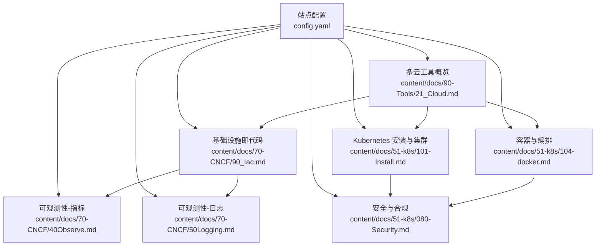

图表来源
- [content/docs/90-Tools/21_Cloud.md](file://content/docs/90-Tools/21_Cloud.md)
- [content/docs/70-CNCF/90_Iac.md](file://content/docs/70-CNCF/90_Iac.md)
- [content/docs/51-k8s/104-docker.md](file://content/docs/51-k8s/104-docker.md)
- [content/docs/51-k8s/101-Install.md](file://content/docs/51-k8s/101-Install.md)
- [content/docs/70-CNCF/40Observe.md](file://content/docs/70-CNCF/40Observe.md)
- [content/docs/70-CNCF/50Logging.md](file://content/docs/70-CNCF/50Logging.md)
- [content/docs/51-k8s/080-Security.md](file://content/docs/51-k8s/080-Security.md)
- [config.yaml](file://config.yaml)

章节来源
- [content/docs/90-Tools/21_Cloud.md](file://content/docs/90-Tools/21_Cloud.md)
- [content/docs/70-CNCF/90_Iac.md](file://content/docs/70-CNCF/90_Iac.md)
- [content/docs/51-k8s/104-docker.md](file://content/docs/51-k8s/104-docker.md)
- [content/docs/51-k8s/101-Install.md](file://content/docs/51-k8s/101-Install.md)
- [content/docs/70-CNCF/40Observe.md](file://content/docs/70-CNCF/40Observe.md)
- [content/docs/70-CNCF/50Logging.md](file://content/docs/70-CNCF/50Logging.md)
- [content/docs/51-k8s/080-Security.md](file://content/docs/51-k8s/080-Security.md)
- [config.yaml](file://config.yaml)

## 核心组件
- 多云开发工具链
  - AWS CLI、Azure CLI、Google Cloud SDK、阿里云CLI：统一认证、资源清单管理、跨云脚本化操作、CI/CD集成要点。
- 基础设施即代码（IaC）
  - Terraform、CloudFormation、Pulumi：声明式建模、状态管理、模块化与复用、变更审计与回滚策略。
- 容器化与编排
  - Docker镜像构建与最佳实践；Kubernetes集群生命周期管理；Helm包管理与版本治理。
- 可观测性与日志
  - Prometheus+Grafana指标采集与可视化；ELK Stack日志收集、索引与检索；多源聚合与告警联动。
- 安全与合规
  - 镜像扫描、配置基线检查、运行时防护、最小权限与密钥管理。
- 多账户与权限控制
  - 组织级账号模型、角色与策略、跨账号访问与工作流隔离。
- 成本优化与资源治理
  - 资源标签、配额与预算、闲置资源回收、弹性伸缩与混合部署。
- 自动化与流水线
  - 从代码到生产的多阶段流水线，包含计划、预览、审批、部署与验证。

章节来源
- [content/docs/90-Tools/21_Cloud.md](file://content/docs/90-Tools/21_Cloud.md)
- [content/docs/70-CNCF/90_Iac.md](file://content/docs/70-CNCF/90_Iac.md)
- [content/docs/51-k8s/104-docker.md](file://content/docs/51-k8s/104-docker.md)
- [content/docs/51-k8s/101-Install.md](file://content/docs/51-k8s/101-Install.md)
- [content/docs/70-CNCF/40Observe.md](file://content/docs/70-CNCF/40Observe.md)
- [content/docs/70-CNCF/50Logging.md](file://content/docs/70-CNCF/50Logging.md)
- [content/docs/51-k8s/080-Security.md](file://content/docs/51-k8s/080-Security.md)

## 架构总览
多云工具链的整体架构以“统一入口、分层解耦、可观测闭环、安全左移”为原则，将多云CLI、IaC、容器与编排、可观测与安全等能力串联为端到端流水线。

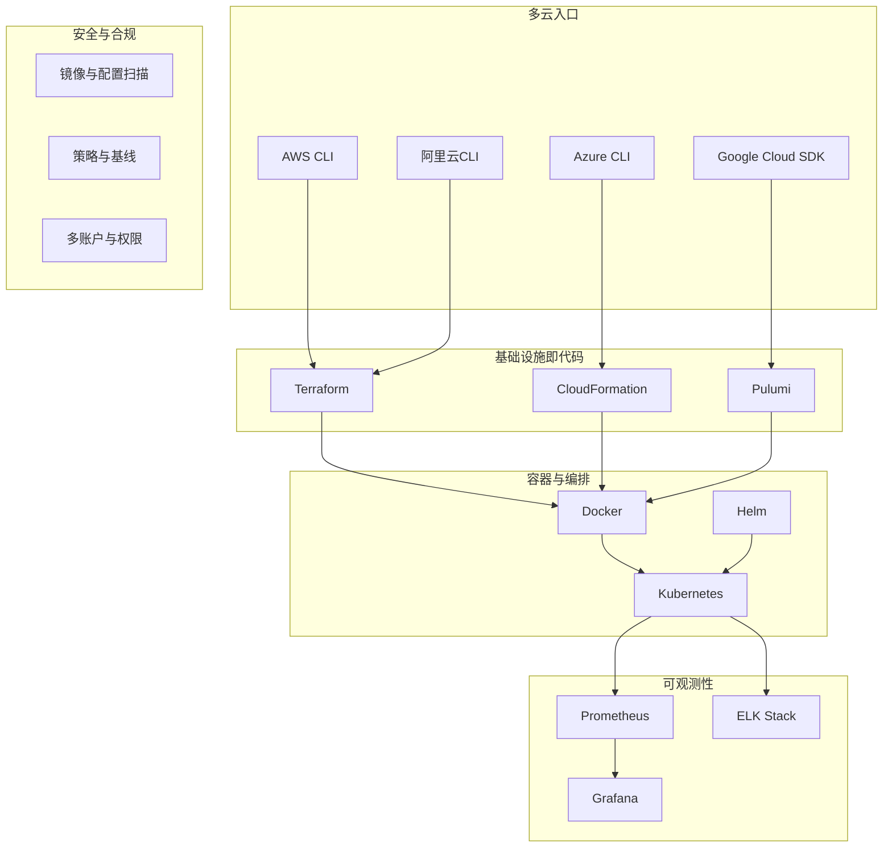

图表来源
- [content/docs/90-Tools/21_Cloud.md](file://content/docs/90-Tools/21_Cloud.md)
- [content/docs/70-CNCF/90_Iac.md](file://content/docs/70-CNCF/90_Iac.md)
- [content/docs/51-k8s/104-docker.md](file://content/docs/51-k8s/104-docker.md)
- [content/docs/51-k8s/101-Install.md](file://content/docs/51-k8s/101-Install.md)
- [content/docs/70-CNCF/40Observe.md](file://content/docs/70-CNCF/40Observe.md)
- [content/docs/70-CNCF/50Logging.md](file://content/docs/70-CNCF/50Logging.md)
- [content/docs/51-k8s/080-Security.md](file://content/docs/51-k8s/080-Security.md)

## 详细组件分析

### 多云开发工具链（AWS CLI / Azure CLI / Google Cloud SDK / 阿里云CLI）
- 目标与价值
  - 统一命令行入口，支持跨云资源查询、批量操作与脚本化自动化。
- 关键能力
  - 身份与会话管理、区域与项目选择、输出格式与过滤、批处理与并发、与CI/CD集成。
- 最佳实践
  - 使用短期凭证与角色假设；集中化配置与凭据存储；命令模板与别名；幂等与重试策略；变更审计与日志。
- 典型工作流
  - 登录与上下文切换 → 列出/创建/更新资源 → 导出清单 → 触发IaC或流水线。

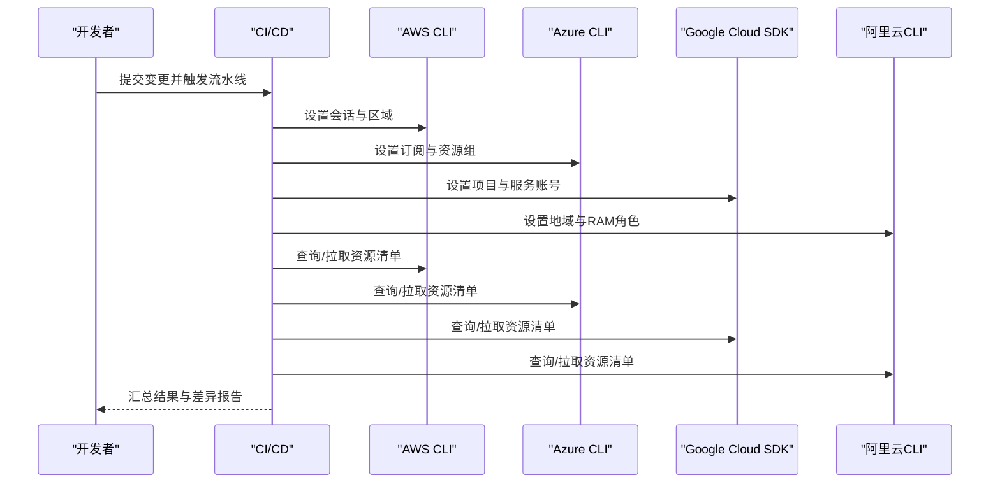

图表来源
- [content/docs/90-Tools/21_Cloud.md](file://content/docs/90-Tools/21_Cloud.md)

章节来源
- [content/docs/90-Tools/21_Cloud.md](file://content/docs/90-Tools/21_Cloud.md)

### 基础设施即代码（Terraform / CloudFormation / Pulumi）
- 目标与价值
  - 以代码描述基础设施，实现可重复、可审计、可回滚的变更管理。
- 关键能力
  - 状态管理、模块与复用、变量与环境隔离、计划与预览、依赖图与并行执行。
- 最佳实践
  - 模块化拆分与版本化；远程状态与锁定；敏感信息加密；变更评审与审批；灰度与蓝绿发布。
- 典型工作流
  - 编写/重构模块 → 计划与预览 → 审批 → 应用 → 验收与审计。

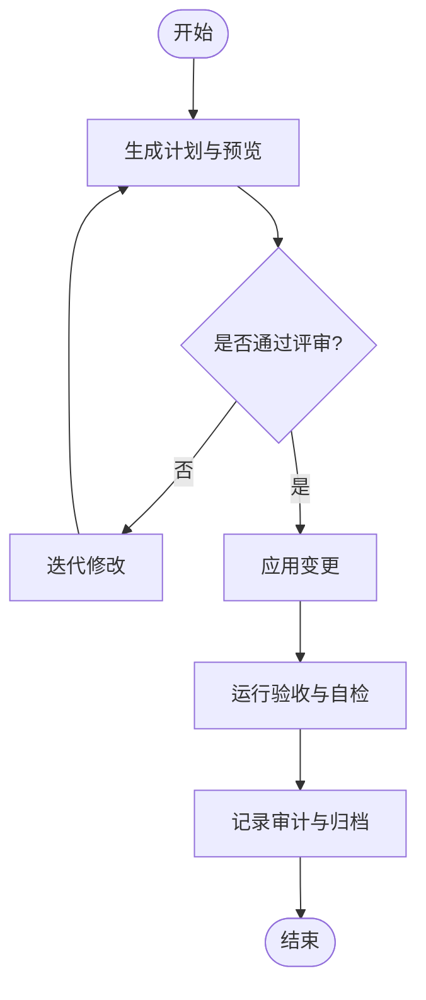

图表来源
- [content/docs/70-CNCF/90_Iac.md](file://content/docs/70-CNCF/90_Iac.md)

章节来源
- [content/docs/70-CNCF/90_Iac.md](file://content/docs/70-CNCF/90_Iac.md)

### 容器化与编排（Docker / Kubernetes / Helm）
- 目标与价值
  - 标准化应用打包与交付，提供弹性、可移植的运行环境与治理能力。
- 关键能力
  - 镜像构建与优化、多阶段构建与缓存；集群生命周期管理；服务发现、负载均衡、滚动升级；Helm包管理与版本治理。
- 最佳实践
  - 镜像瘦身与安全加固；命名空间与资源配额；健康检查与探针；配置与密钥分离；渐进式发布与回滚。
- 典型工作流
  - 构建镜像 → 推送仓库 → 部署到集群 → 暴露服务 → 监控与告警。

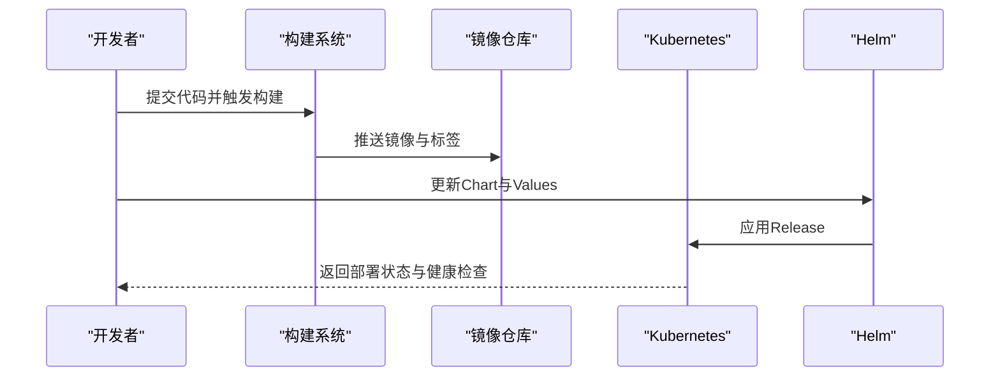

图表来源
- [content/docs/51-k8s/104-docker.md](file://content/docs/51-k8s/104-docker.md)
- [content/docs/51-k8s/101-Install.md](file://content/docs/51-k8s/101-Install.md)

章节来源
- [content/docs/51-k8s/104-docker.md](file://content/docs/51-k8s/104-docker.md)
- [content/docs/51-k8s/101-Install.md](file://content/docs/51-k8s/101-Install.md)

### 可观测性与日志（Prometheus / Grafana / ELK）
- 目标与价值
  - 建立统一的指标与日志采集、可视化与告警体系，提升问题定位效率与系统稳定性。
- 关键能力
  - 指标抓取与存储、仪表盘与告警规则；日志采集、解析、索引与检索；跨系统关联与根因分析。
- 最佳实践
  - 指标维度设计、采样与保留策略；日志分级与脱敏；高可用与容量规划；告警收敛与降噪。
- 典型工作流
  - 部署采集器 → 配置抓取与管道 → 构建仪表盘与告警 → 联调演练与复盘。

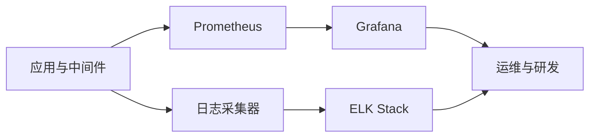

图表来源
- [content/docs/70-CNCF/40Observe.md](file://content/docs/70-CNCF/40Observe.md)
- [content/docs/70-CNCF/50Logging.md](file://content/docs/70-CNCF/50Logging.md)

章节来源
- [content/docs/70-CNCF/40Observe.md](file://content/docs/70-CNCF/40Observe.md)
- [content/docs/70-CNCF/50Logging.md](file://content/docs/70-CNCF/50Logging.md)

### 安全与合规（镜像扫描 / 配置基线 / 运行时防护）
- 目标与价值
  - 在开发与运行全链路引入安全检查与合规校验，降低风险面。
- 关键能力
  - 镜像漏洞扫描、依赖库审计；IaC与配置基线检查；运行时行为监控与阻断；最小权限与密钥管理。
- 最佳实践
  - 安全门禁与质量门槛；策略即代码与持续评估；事件响应与取证；定期演练与红蓝对抗。
- 典型工作流
  - 代码提交触发扫描 → 失败阻断并反馈修复建议 → 通过后进入部署 → 运行时持续监测。

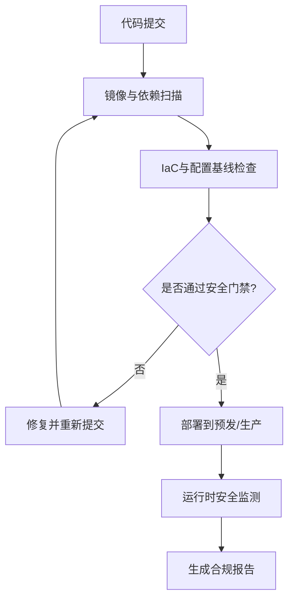

图表来源
- [content/docs/51-k8s/080-Security.md](file://content/docs/51-k8s/080-Security.md)

章节来源
- [content/docs/51-k8s/080-Security.md](file://content/docs/51-k8s/080-Security.md)

### 多账户管理与权限控制
- 目标与价值
  - 在多组织与多环境中实施清晰的边界与最小权限，保障安全与合规。
- 关键能力
  - 组织树与成员管理；角色与策略定义；跨账号访问与工作流隔离；审计与合规报表。
- 最佳实践
  - 按环境/业务划分账号；集中身份与单点登录；临时权限与审批流；变更留痕与回溯。
- 典型工作流
  - 申请权限 → 审批与下发 → 执行任务 → 审计与复盘。

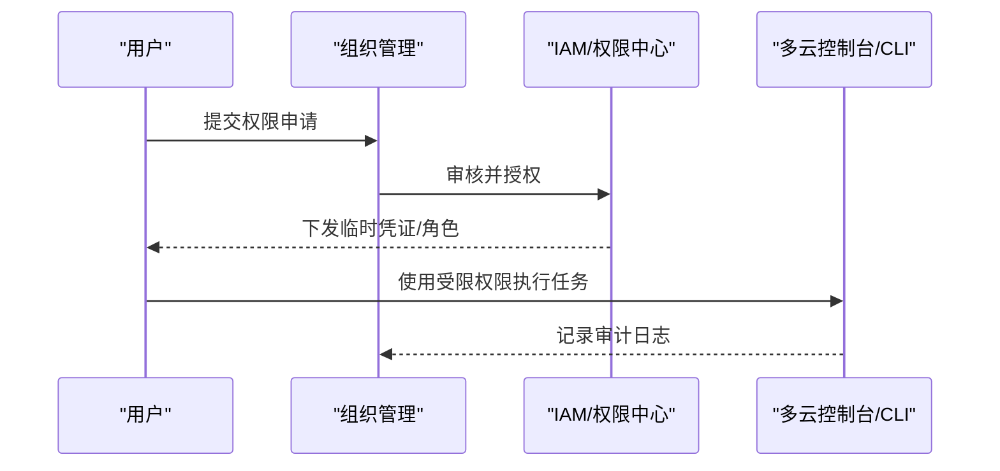

图表来源
- [content/docs/51-k8s/080-Security.md](file://content/docs/51-k8s/080-Security.md)

章节来源
- [content/docs/51-k8s/080-Security.md](file://content/docs/51-k8s/080-Security.md)

### 成本优化与资源管理
- 目标与价值
  - 通过精细化治理与弹性策略，降低总体拥有成本并提升资源利用率。
- 关键能力
  - 资源标签与分摊；配额与预算；闲置资源识别与回收；弹性伸缩与混合部署。
- 最佳实践
  - 统一标签规范与成本看板；自动扩缩容与休眠策略；预留实例与竞价实例组合；容量规划与压测。
- 典型工作流
  - 采集用量与成本数据 → 分析与洞察 → 制定优化策略 → 自动化执行与复评。

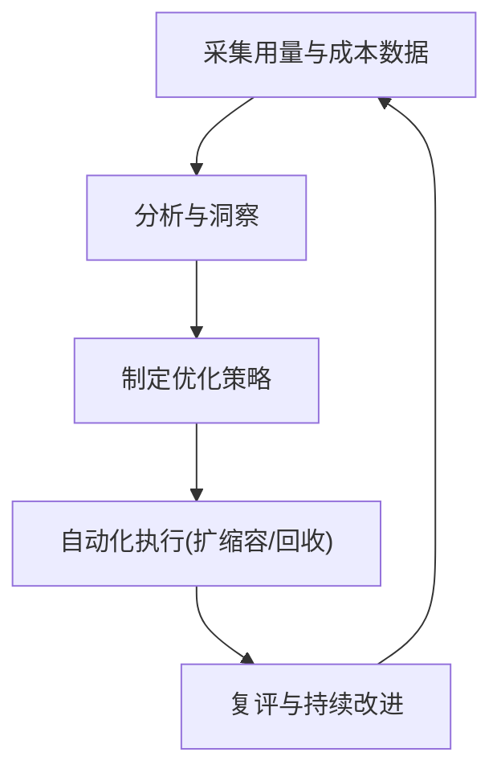

图表来源
- [content/docs/90-Tools/21_Cloud.md](file://content/docs/90-Tools/21_Cloud.md)

章节来源
- [content/docs/90-Tools/21_Cloud.md](file://content/docs/90-Tools/21_Cloud.md)

### 自动化与流水线示例
- 目标与价值
  - 将多云CLI、IaC、容器与编排、可观测与安全整合为端到端流水线，提升交付效率与一致性。
- 关键能力
  - 多阶段流水线（构建、测试、计划、部署、验证）；参数化与环境隔离；回滚与自愈；通知与审计。
- 最佳实践
  - 小步快跑与灰度发布；失败快速回退；关键路径保护与审批；全链路追踪与可观测。
- 典型流程
  - 代码提交 → 构建与扫描 → IaC计划与预览 → 审批 → 部署与验证 → 监控与告警。

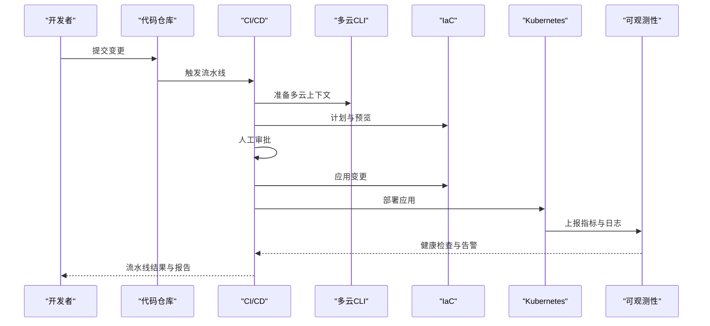

图表来源
- [content/docs/90-Tools/21_Cloud.md](file://content/docs/90-Tools/21_Cloud.md)
- [content/docs/70-CNCF/90_Iac.md](file://content/docs/70-CNCF/90_Iac.md)
- [content/docs/51-k8s/104-docker.md](file://content/docs/51-k8s/104-docker.md)
- [content/docs/51-k8s/101-Install.md](file://content/docs/51-k8s/101-Install.md)
- [content/docs/70-CNCF/40Observe.md](file://content/docs/70-CNCF/40Observe.md)
- [content/docs/70-CNCF/50Logging.md](file://content/docs/70-CNCF/50Logging.md)

章节来源
- [content/docs/90-Tools/21_Cloud.md](file://content/docs/90-Tools/21_Cloud.md)
- [content/docs/70-CNCF/90_Iac.md](file://content/docs/70-CNCF/90_Iac.md)
- [content/docs/51-k8s/104-docker.md](file://content/docs/51-k8s/104-docker.md)
- [content/docs/51-k8s/101-Install.md](file://content/docs/51-k8s/101-Install.md)
- [content/docs/70-CNCF/40Observe.md](file://content/docs/70-CNCF/40Observe.md)
- [content/docs/70-CNCF/50Logging.md](file://content/docs/70-CNCF/50Logging.md)

## 依赖关系分析
多云工具链各层之间存在明确的依赖与协作关系：多云CLI作为统一入口驱动IaC；IaC负责资源编排与依赖管理；容器与编排承载应用运行；可观测与安全贯穿全流程。

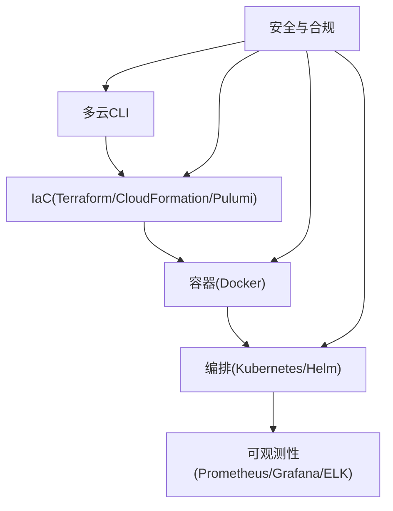

图表来源
- [content/docs/90-Tools/21_Cloud.md](file://content/docs/90-Tools/21_Cloud.md)
- [content/docs/70-CNCF/90_Iac.md](file://content/docs/70-CNCF/90_Iac.md)
- [content/docs/51-k8s/104-docker.md](file://content/docs/51-k8s/104-docker.md)
- [content/docs/51-k8s/101-Install.md](file://content/docs/51-k8s/101-Install.md)
- [content/docs/70-CNCF/40Observe.md](file://content/docs/70-CNCF/40Observe.md)
- [content/docs/70-CNCF/50Logging.md](file://content/docs/70-CNCF/50Logging.md)
- [content/docs/51-k8s/080-Security.md](file://content/docs/51-k8s/080-Security.md)

章节来源
- [content/docs/90-Tools/21_Cloud.md](file://content/docs/90-Tools/21_Cloud.md)
- [content/docs/70-CNCF/90_Iac.md](file://content/docs/70-CNCF/90_Iac.md)
- [content/docs/51-k8s/104-docker.md](file://content/docs/51-k8s/104-docker.md)
- [content/docs/51-k8s/101-Install.md](file://content/docs/51-k8s/101-Install.md)
- [content/docs/70-CNCF/40Observe.md](file://content/docs/70-CNCF/40Observe.md)
- [content/docs/70-CNCF/50Logging.md](file://content/docs/70-CNCF/50Logging.md)
- [content/docs/51-k8s/080-Security.md](file://content/docs/51-k8s/080-Security.md)

## 性能与成本优化
- 指标与日志
  - 合理采样与保留策略，避免过度采集导致存储与计算压力；对热点指标进行聚合与降采样。
- 容器与编排
  - 镜像体积与启动时间优化；水平/垂直弹性策略；节点池与混部策略；资源请求与限制调优。
- IaC与多云
  - 并行执行与依赖图优化；按需启用远端状态与锁定；减少不必要的资源变更。
- 安全与合规
  - 扫描与基线检查在流水线早期执行，缩短反馈周期；运行时检测与告警阈值调优。

[本节为通用指导，不直接分析具体文件]

## 故障排查指南
- 多云CLI
  - 常见问题：认证失败、区域/项目未设置、网络与代理、限流与重试。
  - 排查要点：检查会话与凭据、确认上下文、查看错误码与日志、启用调试输出。
- IaC
  - 常见问题：状态冲突、依赖缺失、敏感信息泄露、计划差异过大。
  - 排查要点：锁定与并发控制、模块版本对齐、变量与后端配置、增量变更与分步应用。
- 容器与编排
  - 常见问题：镜像拉取失败、健康检查不通过、资源不足、配置错误。
  - 排查要点：镜像仓库连通性、Pod事件与日志、资源配额与限制、ConfigMap/Secret挂载。
- 可观测性
  - 常见问题：指标丢失、延迟高、日志未入库、告警风暴。
  - 排查要点：抓取端点可达性、存储容量与压缩、日志管道与解析规则、告警去重与抑制。
- 安全与合规
  - 常见问题：扫描误报、策略过严、运行时拦截误判。
  - 排查要点：白名单与豁免策略、规则版本与知识库更新、策略灰度与回滚。

章节来源
- [content/docs/90-Tools/21_Cloud.md](file://content/docs/90-Tools/21_Cloud.md)
- [content/docs/70-CNCF/90_Iac.md](file://content/docs/70-CNCF/90_Iac.md)
- [content/docs/51-k8s/104-docker.md](file://content/docs/51-k8s/104-docker.md)
- [content/docs/51-k8s/101-Install.md](file://content/docs/51-k8s/101-Install.md)
- [content/docs/70-CNCF/40Observe.md](file://content/docs/70-CNCF/40Observe.md)
- [content/docs/70-CNCF/50Logging.md](file://content/docs/70-CNCF/50Logging.md)
- [content/docs/51-k8s/080-Security.md](file://content/docs/51-k8s/080-Security.md)

## 结论
通过多云CLI、IaC、容器与编排、可观测与安全等工具的协同，团队可以在多云环境下实现一致的交付体验与治理标准。结合自动化流水线与成本优化策略，能够持续提升交付效率、系统稳定性与资源利用效率。

[本节为总结性内容，不直接分析具体文件]

## 附录
- 参考文档定位
  - 多云工具概览：content/docs/90-Tools/21_Cloud.md
  - 基础设施即代码：content/docs/70-CNCF/90_Iac.md
  - 容器与编排：content/docs/51-k8s/104-docker.md、content/docs/51-k8s/101-Install.md
  - 可观测性：content/docs/70-CNCF/40Observe.md、content/docs/70-CNCF/50Logging.md
  - 安全与合规：content/docs/51-k8s/080-Security.md
  - 站点配置：config.yaml

章节来源
- [content/docs/90-Tools/21_Cloud.md](file://content/docs/90-Tools/21_Cloud.md)
- [content/docs/70-CNCF/90_Iac.md](file://content/docs/70-CNCF/90_Iac.md)
- [content/docs/51-k8s/104-docker.md](file://content/docs/51-k8s/104-docker.md)
- [content/docs/51-k8s/101-Install.md](file://content/docs/51-k8s/101-Install.md)
- [content/docs/70-CNCF/40Observe.md](file://content/docs/70-CNCF/40Observe.md)
- [content/docs/70-CNCF/50Logging.md](file://content/docs/70-CNCF/50Logging.md)
- [content/docs/51-k8s/080-Security.md](file://content/docs/51-k8s/080-Security.md)
- [config.yaml](file://config.yaml)