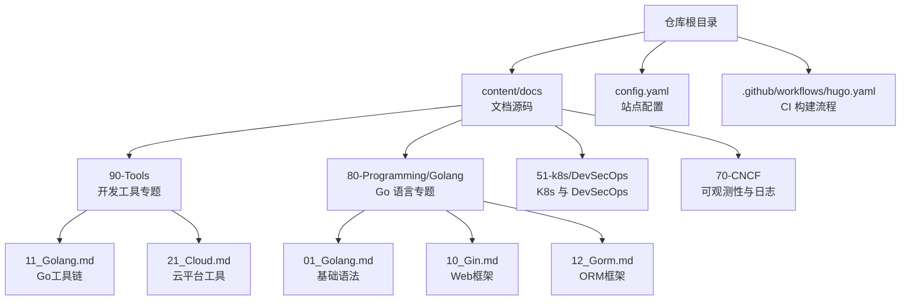
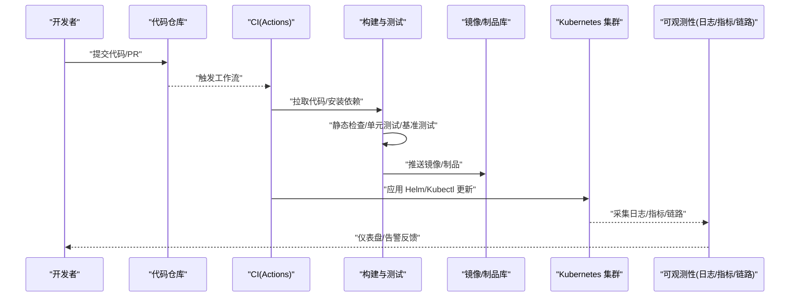
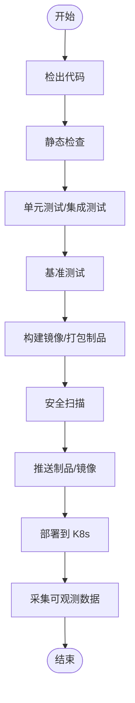
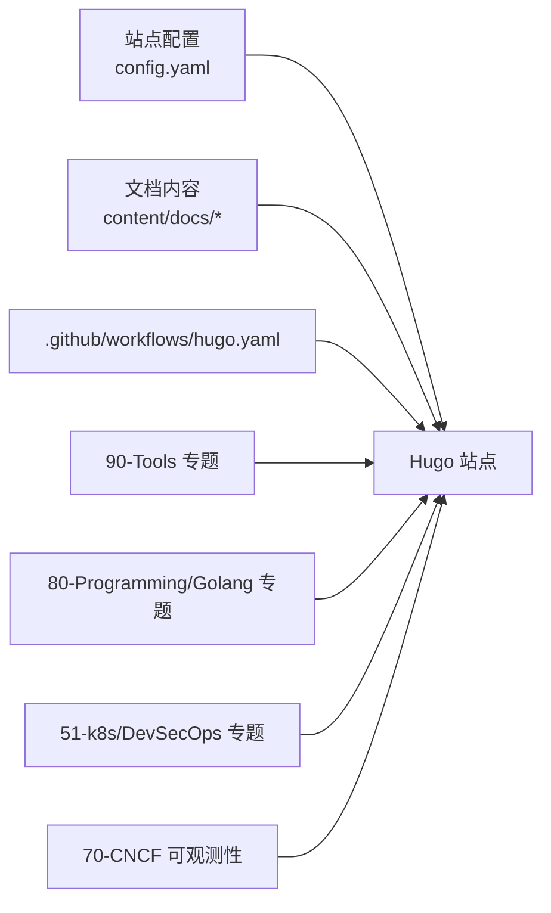

# 开发工具指南

<cite>
**本文引用的文件**   
- [README.md](file://README.md)
- [config.yaml](file://config.yaml)
- [.github/workflows/hugo.yaml](file://.github/workflows/hugo.yaml)
- [content/docs/90-Tools/_index.md](file://content/docs/90-Tools/_index.md)
- [content/docs/90-Tools/11_Golang.md](file://content/docs/90-Tools/11_Golang.md)
- [content/docs/90-Tools/21_Cloud.md](file://content/docs/90-Tools/21_Cloud.md)
- [content/docs/80-Programming/Golang/_index.md](file://content/docs/80-Programming/Golang/_index.md)
- [content/docs/80-Programming/Golang/01_Golang.md](file://content/docs/80-Programming/Golang/01_Golang.md)
- [content/docs/80-Programming/Golang/10_Gin.md](file://content/docs/80-Programming/Golang/10_Gin.md)
- [content/docs/80-Programming/Golang/12_Gorm.md](file://content/docs/80-Programming/Golang/12_Gorm.md)
- [content/docs/51-k8s/DevSecOps/_index.md](file://content/docs/51-k8s/DevSecOps/_index.md)
- [content/docs/51-k8s/DevSecOps/51-Tekton.md](file://content/docs/51-k8s/DevSecOps/51-Tekton.md)
- [content/docs/51-k8s/DevSecOps/52-Argo.md](file://content/docs/51-k8s/DevSecOps/52-Argo.md)
- [content/docs/70-CNCF/40Observe.md](file://content/docs/70-CNCF/40Observe.md)
- [content/docs/70-CNCF/50Logging.md](file://content/docs/70-CNCF/50Logging.md)
</cite>

## 更新摘要
**所做更改**   
- 新增Go语言开发工具链专业使用文档，涵盖代码质量、性能分析与调试技巧
- 新增云平台工具链文档，包括AWS、Azure、阿里云等主流云服务商的工具集成
- 完善DevOps流水线配置与使用指南，涵盖CI/CD、容器编排、监控告警等关键环节
- 增强团队协作最佳实践和效率提升技巧内容

## 目录
1. [简介](#简介)
2. [项目结构](#项目结构)
3. [核心组件](#核心组件)
4. [架构总览](#架构总览)
5. [详细组件分析](#详细组件分析)
6. [依赖关系分析](#依赖关系分析)
7. [性能与效率建议](#性能与效率建议)
8. [故障排查指南](#故障排查指南)
9. [结论](#结论)
10. [附录](#附录)

## 简介
本指南面向使用 Go 语言进行工程化开发的团队，聚焦"代码质量、性能分析、测试与调试"以及"云平台工具链与 DevOps 流水线"。内容覆盖：
- Go 生态中的静态检查、格式化、基准测试、pprof 等工具链
- AWS、Azure、阿里云等主流云平台的 CLI 与 IaC 集成要点
- CI/CD（GitHub Actions）、容器编排（Kubernetes）、可观测性（日志、指标、链路）的落地实践
- 团队协作规范与自动化脚本思路，帮助构建高效可靠的开发环境

## 项目结构
仓库采用 Hugo Book 主题组织文档，源码位于 content 目录，站点配置在根目录。CI 通过 GitHub Actions 自动构建并部署。

图表来源
- [README.md](file://README.md)
- [config.yaml](file://config.yaml)
- [.github/workflows/hugo.yaml](file://.github/workflows/hugo.yaml)

章节来源
- [README.md](file://README.md)
- [config.yaml](file://config.yaml)
- [.github/workflows/hugo.yaml](file://.github/workflows/hugo.yaml)

## 核心组件
围绕"开发工具指南"的目标，将内容划分为以下核心组件：
- Go 语言工具链：代码质量、性能分析与调试
- 云平台工具链：AWS/Azure/阿里云 CLI 与基础设施即代码
- DevOps 流水线：CI/CD、容器编排、监控告警
- 可观测性：日志、指标、链路追踪
- 团队协作与最佳实践：规范、模板与自动化

章节来源
- [content/docs/90-Tools/_index.md](file://content/docs/90-Tools/_index.md)
- [content/docs/80-Programming/Golang/_index.md](file://content/docs/80-Programming/Golang/_index.md)
- [content/docs/51-k8s/DevSecOps/_index.md](file://content/docs/51-k8s/DevSecOps/_index.md)
- [content/docs/70-CNCF/40Observe.md](file://content/docs/70-CNCF/40Observe.md)
- [content/docs/70-CNCF/50Logging.md](file://content/docs/70-CNCF/50Logging.md)

## 架构总览
下图展示从本地开发到云端交付的整体工作流，涵盖代码提交、CI 构建、制品发布、K8s 部署与可观测性闭环。

图表来源
- [.github/workflows/hugo.yaml](file://.github/workflows/hugo.yaml)
- [content/docs/51-k8s/DevSecOps/_index.md](file://content/docs/51-k8s/DevSecOps/_index.md)
- [content/docs/70-CNCF/40Observe.md](file://content/docs/70-CNCF/40Observe.md)
- [content/docs/70-CNCF/50Logging.md](file://content/docs/70-CNCF/50Logging.md)

## 详细组件分析

### Go 语言工具链与实战
- 代码质量与风格
  - 推荐组合：gofmt/gofumpt、go vet、staticcheck、golangci-lint
  - 建议在 PR 前统一执行，保证风格一致与潜在问题早发现
- 性能分析与调试
  - pprof 用于 CPU/内存/阻塞/锁分析；结合 go test -bench 做基准回归
  - delve 作为交互式调试器，支持断点、变量查看与热更新
- 测试框架与覆盖率
  - 标准库 testing + testify 扩展；配合 go test -cover 输出覆盖率
  - 建议为关键路径编写表驱动测试与基准用例
- 常用命令与工作流
  - 本地快速验证：fmt/vet/test/bench/pprof/dlv
  - 在 CI 中固化 lint/test/bench 步骤，阻断低质量变更

**更新** 新增了详细的Go语言工具链使用指南，包括代码质量检查、性能分析和调试技巧

章节来源
- [content/docs/90-Tools/11_Golang.md](file://content/docs/90-Tools/11_Golang.md)
- [content/docs/80-Programming/Golang/01_Golang.md](file://content/docs/80-Programming/Golang/01_Golang.md)
- [content/docs/80-Programming/Golang/10_Gin.md](file://content/docs/80-Programming/Golang/10_Gin.md)
- [content/docs/80-Programming/Golang/12_Gorm.md](file://content/docs/80-Programming/Golang/12_Gorm.md)

### 云平台工具链（AWS/Azure/阿里云）
- 通用能力
  - CLI 登录与多账号切换、密钥管理、区域/项目隔离
  - IaC 工具（Terraform/CloudFormation/Bicep/ROS）与版本控制联动
- AWS
  - 常用服务：EKS、ECR、S3、IAM、CloudWatch
  - 集成要点：kubeconfig 生成、镜像仓库访问、权限最小化
- Azure
  - 常用服务：AKS、ACR、Key Vault、Monitor
  - 集成要点：Service Principal/Workload Identity、AcrLoginServer 配置
- 阿里云
  - 常用服务：ACK、ACR、KMS、SLS
  - 集成要点：RAM 角色、凭证注入、日志与审计接入

**更新** 新增了完整的云平台工具链文档，涵盖三大主流云服务商的工具集成方法

章节来源
- [content/docs/90-Tools/21_Cloud.md](file://content/docs/90-Tools/21_Cloud.md)

### DevOps 流水线与容器编排
- CI/CD（GitHub Actions）
  - 工作流定义、缓存依赖、并行任务、产物上传与部署
  - 安全扫描与合规门禁（如 SAST/DAST、镜像扫描）
- 容器与编排
  - Docker 多阶段构建、镜像签名与漏洞扫描
  - Kubernetes 部署策略（滚动/蓝绿/金丝雀），Helm/Kustomize 管理
- 流水线示例（概念图）

**更新** 完善了DevOps流水线配置指南，包含具体的CI/CD流程和容器编排实践

图表来源
- [.github/workflows/hugo.yaml](file://.github/workflows/hugo.yaml)
- [content/docs/51-k8s/DevSecOps/51-Tekton.md](file://content/docs/51-k8s/DevSecOps/51-Tekton.md)
- [content/docs/51-k8s/DevSecOps/52-Argo.md](file://content/docs/51-k8s/DevSecOps/52-Argo.md)

章节来源
- [.github/workflows/hugo.yaml](file://.github/workflows/hugo.yaml)
- [content/docs/51-k8s/DevSecOps/_index.md](file://content/docs/51-k8s/DevSecOps/_index.md)
- [content/docs/51-k8s/DevSecOps/51-Tekton.md](file://content/docs/51-k8s/DevSecOps/51-Tekton.md)
- [content/docs/51-k8s/DevSecOps/52-Argo.md](file://content/docs/51-k8s/DevSecOps/52-Argo.md)

### 可观测性与日志
- 指标与告警
  - Prometheus/Grafana 采集与应用埋点；基于阈值与复合规则设置告警
- 日志
  - 结构化日志、集中式收集与检索；日志脱敏与保留策略
- 链路追踪
  - OpenTelemetry 统一采集；跨服务调用可视化与慢请求定位

**更新** 增强了可观测性相关内容，包括指标采集、日志管理和链路追踪的最佳实践

章节来源
- [content/docs/70-CNCF/40Observe.md](file://content/docs/70-CNCF/40Observe.md)
- [content/docs/70-CNCF/50Logging.md](file://content/docs/70-CNCF/50Logging.md)

### 团队协作与最佳实践
- 分支与发布
  - GitFlow/Trunk-Based 策略；语义化版本与变更日志
- 代码评审
  - 强制小步提交、清晰描述、自动化门禁（lint/test/bench）
- 文档与知识沉淀
  - 以仓库为单一事实源；模板化文档与示例工程
- 效率提升技巧
  - 开发环境标准化、自动化脚本、快捷键配置
  - 代码片段管理、常用命令速查、调试技巧分享

**更新** 新增了团队协作最佳实践和效率提升技巧，帮助团队构建高效的开发环境

[本节为通用实践总结，不直接分析具体文件]

## 依赖关系分析
- 文档与配置
  - Hugo 站点由 config.yaml 驱动，内容来源于 content 目录
- CI 与构建
  - .github/workflows/hugo.yaml 负责构建与部署，串联各专题文档
- 专题耦合
  - "Go 工具链"与"DevSecOps/可观测性"相互支撑：前者保障质量与性能，后者提供持续交付与运行期洞察

图表来源
- [config.yaml](file://config.yaml)
- [.github/workflows/hugo.yaml](file://.github/workflows/hugo.yaml)
- [content/docs/90-Tools/_index.md](file://content/docs/90-Tools/_index.md)
- [content/docs/80-Programming/Golang/_index.md](file://content/docs/80-Programming/Golang/_index.md)
- [content/docs/51-k8s/DevSecOps/_index.md](file://content/docs/51-k8s/DevSecOps/_index.md)
- [content/docs/70-CNCF/40Observe.md](file://content/docs/70-CNCF/40Observe.md)

章节来源
- [config.yaml](file://config.yaml)
- [.github/workflows/hugo.yaml](file://.github/workflows/hugo.yaml)
- [content/docs/90-Tools/_index.md](file://content/docs/90-Tools/_index.md)
- [content/docs/80-Programming/Golang/_index.md](file://content/docs/80-Programming/Golang/_index.md)
- [content/docs/51-k8s/DevSecOps/_index.md](file://content/docs/51-k8s/DevSecOps/_index.md)
- [content/docs/70-CNCF/40Observe.md](file://content/docs/70-CNCF/40Observe.md)

## 性能与效率建议
- 本地开发
  - 启用增量构建与缓存；合理划分模块粒度，减少无关编译
  - 使用 pprof 定位热点，结合基准测试建立回归基线
- CI 优化
  - 并行化任务、缓存依赖与下载产物；按需执行重型步骤
- 生产运行
  - 指标采样与聚合降成本；日志分级与轮转；告警降噪与收敛
- 开发体验
  - IDE 插件配置、代码片段管理、快捷键定制
  - 调试技巧分享、常见问题速查、自动化脚本库

**更新** 新增了开发体验和效率提升的具体建议，包括IDE配置和自动化脚本

[本节为通用指导，不直接分析具体文件]

## 故障排查指南
- 常见问题
  - 依赖缺失或网络超时：检查代理与缓存策略
  - 权限不足：校验 IAM/RAM/SP 权限与 kubeconfig 有效性
  - 镜像拉取失败：确认仓库地址、标签与凭据
- 定位方法
  - 使用 CI 日志与工件；在 K8s 中查看 Pod 事件与容器日志
  - 结合 pprof 与链路追踪定位瓶颈与异常路径
- 性能问题排查
  - CPU/内存泄漏检测、GC调优、goroutine泄漏诊断
  - 数据库查询优化、缓存命中率分析、网络延迟排查

**更新** 新增了性能问题排查指南，包括常见的性能瓶颈定位方法

章节来源
- [.github/workflows/hugo.yaml](file://.github/workflows/hugo.yaml)
- [content/docs/70-CNCF/40Observe.md](file://content/docs/70-CNCF/40Observe.md)
- [content/docs/70-CNCF/50Logging.md](file://content/docs/70-CNCF/50Logging.md)

## 结论
通过将 Go 语言工具链、云平台工具链与 DevOps 流水线有机结合，并在可观测性的闭环下持续改进，可以显著提升研发效率与系统可靠性。建议以"质量左移、自动化优先、度量驱动"为原则，逐步完善团队工程体系。

**更新** 总结了新增的开发工具指南的核心价值和应用场景

[本节为总结性内容，不直接分析具体文件]

## 附录
- 参考入口
  - 工具总览：[content/docs/90-Tools/_index.md](file://content/docs/90-Tools/_index.md)
  - Go 语言专题：[content/docs/80-Programming/Golang/_index.md](file://content/docs/80-Programming/Golang/_index.md)
  - DevSecOps 专题：[content/docs/51-k8s/DevSecOps/_index.md](file://content/docs/51-k8s/DevSecOps/_index.md)
  - 可观测性专题：[content/docs/70-CNCF/40Observe.md](file://content/docs/70-CNCF/40Observe.md)、[content/docs/70-CNCF/50Logging.md](file://content/docs/70-CNCF/50Logging.md)
- 站点与 CI
  - 站点配置：[config.yaml](file://config.yaml)
  - CI 工作流：[.github/workflows/hugo.yaml](file://.github/workflows/hugo.yaml)
- 实用资源
  - Go 官方文档、云平台CLI手册、Kubernetes最佳实践
  - 开源工具集、社区资源、学习路径推荐

**更新** 新增了实用资源链接和学习路径推荐