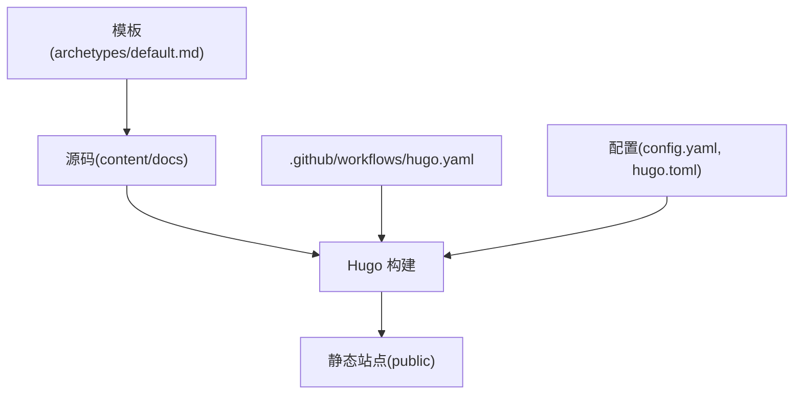
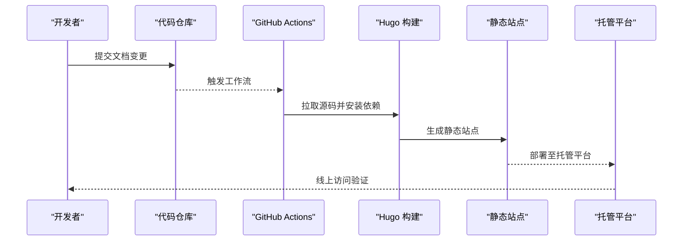
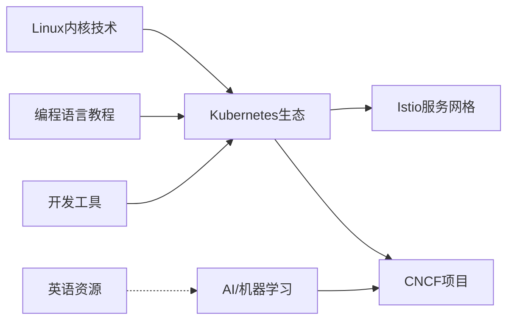
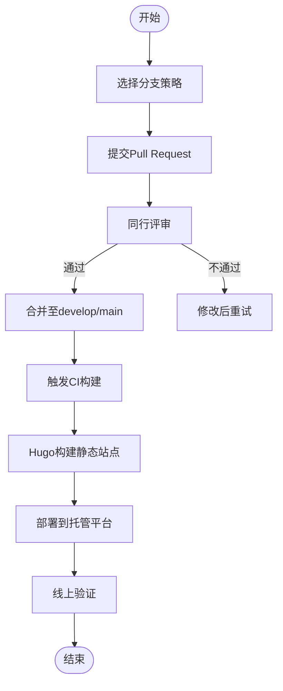
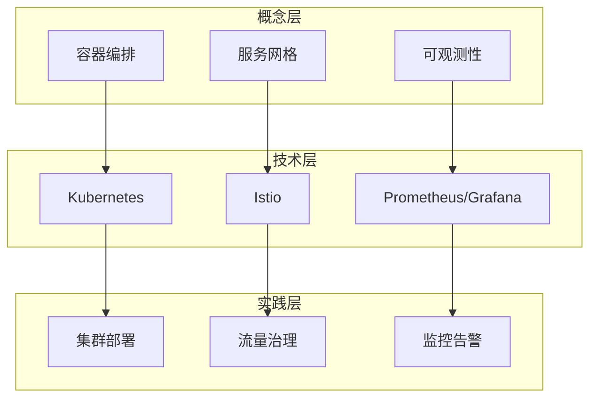
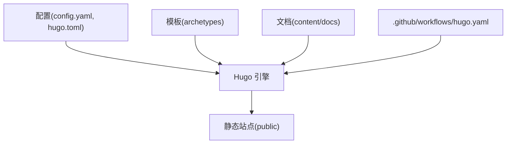

# 技术文档体系

<cite>
**本文引用的文件**   
- [README.md](file://README.md)
- [config.yaml](file://config.yaml)
- [hugo.toml](file://hugo.toml)
- [.github/workflows/hugo.yaml](file://.github/workflows/hugo.yaml)
- [content/docs/_index.md](file://content/docs/_index.md)
- [content/docs/50-linux/_index.md](file://content/docs/50-linux/_index.md)
- [content/docs/51-k8s/_index.md](file://content/docs/51-k8s/_index.md)
- [content/docs/52-istio/_index.md](file://content/docs/52-istio/_index.md)
- [content/docs/60-AI/_index.md](file://content/docs/60-AI/_index.md)
- [content/docs/70-CNCF/_index.md](file://content/docs/70-CNCF/_index.md)
- [content/docs/80-Programming/_index.md](file://content/docs/80-Programming/_index.md)
- [content/docs/90-Tools/_index.md](file://content/docs/90-Tools/_index.md)
- [content/docs/99-English/_index.md](file://content/docs/99-English/_index.md)
- [archetypes/default.md](file://archetypes/default.md)
</cite>

## 目录
1. [简介](#简介)
2. [项目结构](#项目结构)
3. [核心组件](#核心组件)
4. [架构总览](#架构总览)
5. [详细组件分析](#详细组件分析)
6. [依赖关系分析](#依赖关系分析)
7. [性能与可维护性](#性能与可维护性)
8. [故障排查指南](#故障排查指南)
9. [结论](#结论)
10. [附录](#附录)

## 简介
本项目是一个基于静态站点生成器构建的技术知识管理体系，采用“按技术领域划分”的文档组织结构，覆盖Linux内核技术、Kubernetes生态、Istio服务网格、AI/机器学习、CNCF项目、编程语言教程、开发工具等主题。通过统一的元数据、分类与标签体系，实现跨文档链接导航与知识图谱化组织；借助CI流水线完成版本化构建与发布，确保内容更新的可追溯性与一致性。

## 项目结构
仓库采用“源码即文档”的模式：
- content/docs：按技术领域划分的文档源（Markdown），每个领域包含一个索引页 _index.md 用于定义范围与导航。
- archetypes：新页面模板，统一元数据与样式规范。
- .github/workflows：GitHub Actions 工作流，负责构建与部署。
- config.yaml / hugo.toml：站点配置（语言、菜单、SEO、搜索等）。
- public：构建产物（由CI生成，不在源码中提交）。

图表来源
- [.github/workflows/hugo.yaml](file://.github/workflows/hugo.yaml)
- [config.yaml](file://config.yaml)
- [hugo.toml](file://hugo.toml)
- [archetypes/default.md](file://archetypes/default.md)

章节来源
- [README.md](file://README.md)
- [config.yaml](file://config.yaml)
- [hugo.toml](file://hugo.toml)
- [.github/workflows/hugo.yaml](file://.github/workflows/hugo.yaml)
- [content/docs/_index.md](file://content/docs/_index.md)
- [archetypes/default.md](file://archetypes/default.md)

## 核心组件
- 文档域与索引
  - 每个技术领域在 content/docs 下以独立目录表示，并通过 _index.md 声明该领域的范围、重点与导航。
  - 示例领域：Linux内核技术、Kubernetes生态、Istio服务网格、AI/机器学习、CNCF项目、编程语言教程、开发工具、英语资源等。
- 模板与元数据
  - archetypes/default.md 提供新页面的默认元数据与结构，保证标题、摘要、标签、分类等字段的一致性。
- 站点配置
  - config.yaml 与 hugo.toml 共同管理站点语言、菜单、SEO、搜索、多语言等能力。
- CI/CD
  .github/workflows/hugo.yaml 定义了从源码到静态站点的构建流程，支持分支策略与缓存优化。

章节来源
- [content/docs/50-linux/_index.md](file://content/docs/50-linux/_index.md)
- [content/docs/51-k8s/_index.md](file://content/docs/51-k8s/_index.md)
- [content/docs/52-istio/_index.md](file://content/docs/52-istio/_index.md)
- [content/docs/60-AI/_index.md](file://content/docs/60-AI/_index.md)
- [content/docs/70-CNCF/_index.md](file://content/docs/70-CNCF/_index.md)
- [content/docs/80-Programming/_index.md](file://content/docs/80-Programming/_index.md)
- [content/docs/90-Tools/_index.md](file://content/docs/90-Tools/_index.md)
- [content/docs/99-English/_index.md](file://content/docs/99-English/_index.md)
- [archetypes/default.md](file://archetypes/default.md)
- [config.yaml](file://config.yaml)
- [hugo.toml](file://hugo.toml)
- [.github/workflows/hugo.yaml](file://.github/workflows/hugo.yaml)

## 架构总览
下图展示了从源码到发布的端到端流程，以及各组件之间的职责边界。

图表来源
- [.github/workflows/hugo.yaml](file://.github/workflows/hugo.yaml)

## 详细组件分析

### 文档域与索引设计
- 设计原则
  - 单一职责：每个领域聚焦一个技术栈或主题，避免交叉耦合。
  - 可发现性：通过 _index.md 明确范围、关键词与导航入口。
  - 可扩展性：新增领域只需创建目录与索引，遵循统一模板。
- 领域清单与重点
  - Linux内核技术：内核基础、BPF、嵌入式Linux、面试要点等。
  - Kubernetes生态：容器运行时(CRI)、网络(CNI)、存储(CSI)、调度器、安全、认证考试、DevSecOps等。
  - Istio服务网格：流量治理、源码阅读、Envoy集成、培训资料等。
  - AI/机器学习：MLOps、大模型与RAG、Agent实践、案例笔记等。
  - CNCF项目：观测、日志、Redis、基础设施即代码(IaC)等。
  - 编程语言教程：Go、Vue、工具集等。
  - 开发工具：云原生工具链、效率工具等。
  - 英语资源：英语学习、儿童教育、影视资源等。
- 关联关系
  - 跨域引用：例如Kubernetes与Istio、AI与CNCF观测/日志、Linux内核与BPF/CNI-eBPF等。
  - 统一标签与分类：通过元数据建立横向检索与聚合视图。

章节来源
- [content/docs/50-linux/_index.md](file://content/docs/50-linux/_index.md)
- [content/docs/51-k8s/_index.md](file://content/docs/51-k8s/_index.md)
- [content/docs/52-istio/_index.md](file://content/docs/52-istio/_index.md)
- [content/docs/60-AI/_index.md](file://content/docs/60-AI/_index.md)
- [content/docs/70-CNCF/_index.md](file://content/docs/70-CNCF/_index.md)
- [content/docs/80-Programming/_index.md](file://content/docs/80-Programming/_index.md)
- [content/docs/90-Tools/_index.md](file://content/docs/90-Tools/_index.md)
- [content/docs/99-English/_index.md](file://content/docs/99-English/_index.md)

### 版本管理与内容更新流程
- 分支策略
  - main：稳定发布基线。
  - develop：日常开发与合并目标。
  - feature/*：功能特性分支。
  - hotfix/*：紧急修复分支。
- 构建与发布
  - GitHub Actions 监听推送事件，执行Hugo构建，输出静态站点并部署。
  - 建议开启缓存与增量构建以提升速度。
- 回滚与追踪
  - 利用Git提交信息与标签进行版本回溯。
  - 构建产物与部署记录应保留至少N个版本以便回滚。

章节来源
- [.github/workflows/hugo.yaml](file://.github/workflows/hugo.yaml)

### 编写规范与质量标准
- 元数据规范
  - 标题、摘要、标签、分类、日期、作者等字段必须完整。
  - 使用统一模板（archetypes）减少遗漏。
- 结构与风格
  - 层级清晰，段落短小，配图与表格适度。
  - 术语一致，首次出现给出简要解释。
- 质量检查
  - 链接有效性、拼写与语法、图片路径、代码块语言标注。
  - SEO友好：标题、描述、结构化数据。
- 审核流程
  - 自测→同行评审→合入→自动化构建→回归验证。

章节来源
- [archetypes/default.md](file://archetypes/default.md)

### 跨文档链接导航与知识图谱
- 链接策略
  - 内部链接使用相对路径或站点内路由，避免硬编码绝对URL。
  - 通过标签与分类形成多维聚合视图。
- 知识图谱
  - 以“概念—技术—实践—案例”为节点，用标签与引用边连接。
  - 在索引页提供“相关文档”“延伸阅读”模块，引导读者深入。
- 检索增强
  - 启用站内搜索与全文索引，提升定位效率。
  - 对长文提供目录与锚点，便于跳转。

[本图为概念性知识图谱示意，无需源码映射]

### 学习路径建议
- 入门级
  - 先修：Linux基础、命令行、网络基础。
  - 推荐顺序：Linux内核技术 → Kubernetes生态基础 → 开发工具。
- 进阶级
  - 方向一：Kubernetes + Istio（微服务治理）。
  - 方向二：AI/机器学习 + CNCF观测与日志（MLOps）。
- 专家级
  - 源码阅读与贡献：调度器、CNI/eBPF、Istio控制面。
  - 性能调优与安全加固：内核参数、网络栈、RBAC与策略。

[本节为通用学习建议，不涉及具体源码文件]

## 依赖关系分析
- 外部依赖
  - Hugo：静态站点生成器。
  - GitHub Actions：持续集成与部署。
  - 托管平台：静态站点托管（如Pages/对象存储+CDN）。
- 内部依赖
  - 配置驱动：config.yaml/hugo.toml 决定站点行为。
  - 模板驱动：archetypes 统一页面结构。
  - 内容驱动：content/docs 下的领域索引与文章。

图表来源
- [config.yaml](file://config.yaml)
- [hugo.toml](file://hugo.toml)
- [archetypes/default.md](file://archetypes/default.md)
- [.github/workflows/hugo.yaml](file://.github/workflows/hugo.yaml)

章节来源
- [config.yaml](file://config.yaml)
- [hugo.toml](file://hugo.toml)
- [.github/workflows/hugo.yaml](file://.github/workflows/hugo.yaml)

## 性能与可维护性
- 构建性能
  - 启用Hugo缓存与增量构建，合理拆分大文档。
  - 图片压缩与懒加载，减少首屏体积。
- 可维护性
  - 统一模板与命名约定，降低认知成本。
  - 定期清理死链与过期内容，保持索引页精炼。
- 可观测性
  - 站点访问统计与错误日志接入，指导优化。

[本节为通用建议，不涉及具体源码文件]

## 故障排查指南
- 常见问题
  - 构建失败：检查Hugo版本、依赖缺失、配置语法错误。
  - 链接失效：校验站内链接与图片路径。
  - 搜索不可用：确认搜索脚本与索引生成。
- 定位方法
  - 查看CI日志，复现本地构建。
  - 使用浏览器开发者工具定位前端问题。
  - 通过标签/分类聚合快速定位问题范围。

章节来源
- [.github/workflows/hugo.yaml](file://.github/workflows/hugo.yaml)

## 结论
本技术文档体系以“领域化组织 + 统一模板 + 自动化构建”为核心，实现了高质量、可演进的知识沉淀。通过清晰的索引与标签体系，读者可按需构建个人学习路径；通过CI/CD与版本策略，团队可高效协作与持续交付。未来可在知识图谱可视化、智能检索与内容质量度量方面进一步演进。

## 附录
- 术语表
  - 领域索引：每个技术领域的入口页，定义范围与导航。
  - 元数据：页面级别的标题、摘要、标签、分类等结构化信息。
  - 知识图谱：以概念—技术—实践—案例为节点的关联图。
- 参考
  - README：项目说明与使用说明。
  - 配置与模板：站点与页面结构的权威来源。

章节来源
- [README.md](file://README.md)
- [config.yaml](file://config.yaml)
- [hugo.toml](file://hugo.toml)
- [archetypes/default.md](file://archetypes/default.md)