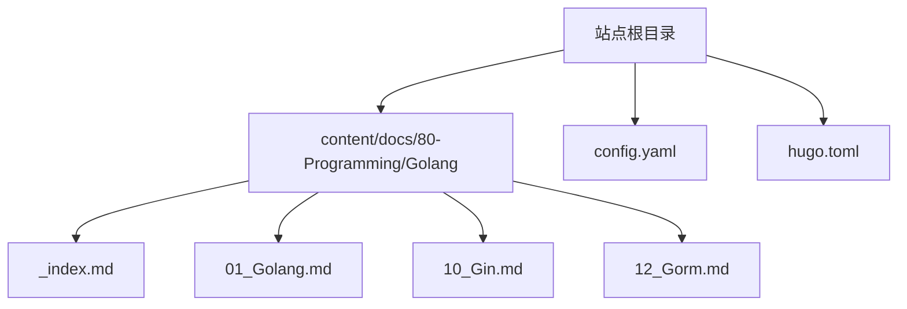
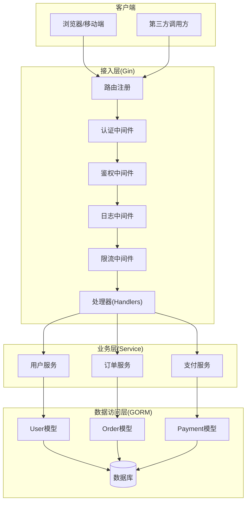
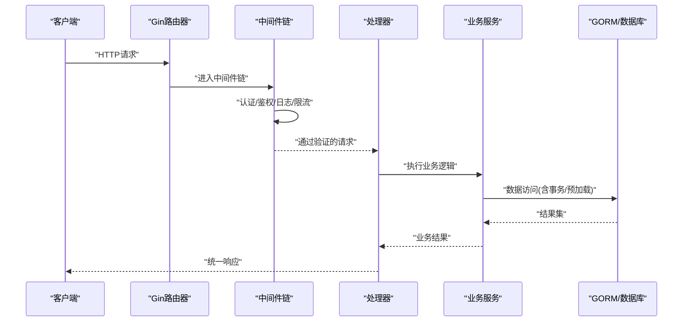
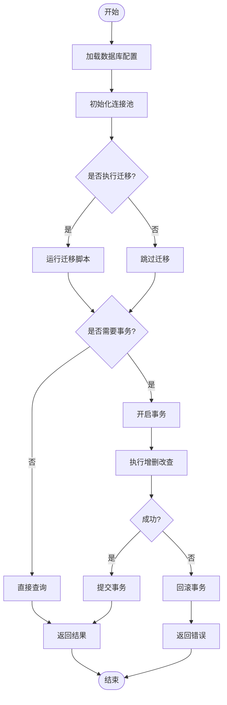
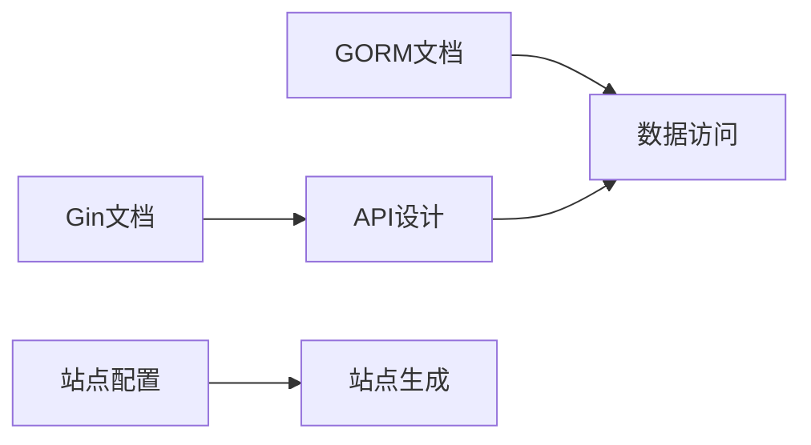

# Go语言开发

<cite>
**本文引用的文件**   
- [content/docs/80-Programming/Golang/_index.md](file://content/docs/80-Programming/Golang/_index.md)
- [content/docs/80-Programming/Golang/01_Golang.md](file://content/docs/80-Programming/Golang/01_Golang.md)
- [content/docs/80-Programming/Golang/10_Gin.md](file://content/docs/80-Programming/Golang/10_Gin.md)
- [content/docs/80-Programming/Golang/12_Gorm.md](file://content/docs/80-Programming/Golang/12_Gorm.md)
- [config.yaml](file://config.yaml)
- [hugo.toml](file://hugo.toml)
</cite>

## 目录
1. [简介](#简介)
2. [项目结构](#项目结构)
3. [核心组件](#核心组件)
4. [架构总览](#架构总览)
5. [详细组件分析](#详细组件分析)
6. [依赖关系分析](#依赖关系分析)
7. [性能考虑](#性能考虑)
8. [故障排查指南](#故障排查指南)
9. [结论](#结论)
10. [附录](#附录)

## 简介
本指南面向Go语言后端开发者，围绕企业级Web服务构建所需的关键技术栈展开：Go语言核心语法与并发模型、Gin Web框架的路由与中间件、GORM数据库操作与迁移、RESTful API设计与实现、错误处理与日志记录、配置管理等。内容以仓库中“编程-Golang”系列文档为基础，结合最佳实践与实战案例，帮助读者快速掌握现代Go后端开发的完整流程。

## 项目结构
本项目为Hugo静态站点，文档位于 content/docs/80-Programming/Golang 目录下，包含Go语言基础、Gin、GORM等主题文章；站点根目录的配置文件用于控制站点行为与导航。

图表来源
- [content/docs/80-Programming/Golang/_index.md](file://content/docs/80-Programming/Golang/_index.md)
- [content/docs/80-Programming/Golang/01_Golang.md](file://content/docs/80-Programming/Golang/01_Golang.md)
- [content/docs/80-Programming/Golang/10_Gin.md](file://content/docs/80-Programming/Golang/10_Gin.md)
- [content/docs/80-Programming/Golang/12_Gorm.md](file://content/docs/80-Programming/Golang/12_Gorm.md)
- [config.yaml](file://config.yaml)
- [hugo.toml](file://hugo.toml)

章节来源
- [content/docs/80-Programming/Golang/_index.md](file://content/docs/80-Programming/Golang/_index.md)
- [config.yaml](file://config.yaml)
- [hugo.toml](file://hugo.toml)

## 核心组件
- Go语言基础与并发模型：涵盖类型系统、函数与方法、接口、错误处理、goroutine与channel、上下文传递、同步原语等。
- Gin Web框架：路由设计、参数绑定与校验、中间件机制、统一响应封装、请求生命周期扩展。
- GORM数据库操作：模型定义、关联查询、事务、预加载、批量操作、性能优化与数据库迁移。
- RESTful API实战：资源建模、版本化策略、分页与过滤、错误码规范、鉴权与限流、日志与可观测性。
- 工程化能力：配置管理（环境变量与配置文件）、结构化日志、指标与追踪、测试与持续集成。

章节来源
- [content/docs/80-Programming/Golang/01_Golang.md](file://content/docs/80-Programming/Golang/01_Golang.md)
- [content/docs/80-Programming/Golang/10_Gin.md](file://content/docs/80-Programming/Golang/10_Gin.md)
- [content/docs/80-Programming/Golang/12_Gorm.md](file://content/docs/80-Programming/Golang/12_Gorm.md)

## 架构总览
下图展示一个典型的企业级Go后端服务在Gin+GORM之上的分层架构与数据流向。

图表来源
- [content/docs/80-Programming/Golang/10_Gin.md](file://content/docs/80-Programming/Golang/10_Gin.md)
- [content/docs/80-Programming/Golang/12_Gorm.md](file://content/docs/80-Programming/Golang/12_Gorm.md)

## 详细组件分析

### Gin Web框架组件分析
- 路由与分组：按模块划分路由组，统一前缀与公共中间件挂载。
- 中间件链：认证、鉴权、日志、限流、CORS、恢复等中间件组合。
- 请求处理：参数解析、表单与JSON绑定、文件上传、流式响应。
- 统一响应与错误：标准化返回结构、错误码映射、异常捕获与上报。

图表来源
- [content/docs/80-Programming/Golang/10_Gin.md](file://content/docs/80-Programming/Golang/10_Gin.md)

章节来源
- [content/docs/80-Programming/Golang/10_Gin.md](file://content/docs/80-Programming/Golang/10_Gin.md)

### GORM数据访问组件分析
- 模型与表映射：标签驱动的结构体到表映射、字段约束与索引。
- 关联查询：HasOne/HasMany/BelongsToMany、Preload与Joins的选择。
- 事务与并发：Begin/Commit/Rollback、隔离级别与锁策略。
- 性能优化：批量插入、只读查询、连接池调优、慢查询监控。
- 迁移与版本：自动生成与手动迁移脚本、回滚策略。

图表来源
- [content/docs/80-Programming/Golang/12_Gorm.md](file://content/docs/80-Programming/Golang/12_Gorm.md)

章节来源
- [content/docs/80-Programming/Golang/12_Gorm.md](file://content/docs/80-Programming/Golang/12_Gorm.md)

### Go并发与错误处理要点
- goroutine与channel：生产者-消费者模式、扇入扇出、超时与取消。
- context：传播取消信号、携带请求级元数据、跨边界传递。
- 错误处理：自定义错误类型、错误包装与堆栈、统一错误码。
- 同步原语：Mutex、WaitGroup、Once、RWMutex的使用场景与陷阱。

章节来源
- [content/docs/80-Programming/Golang/01_Golang.md](file://content/docs/80-Programming/Golang/01_Golang.md)

### RESTful API实战案例
- 资源建模：名词化资源、层级与嵌套、状态机与枚举。
- 版本化：URL版本或Header版本策略，向后兼容原则。
- 分页与过滤：游标分页、字段过滤、排序与搜索。
- 鉴权与限流：JWT/OAuth2、RBAC、IP白名单、令牌桶/漏桶。
- 日志与可观测性：结构化日志、TraceID透传、指标采集。

章节来源
- [content/docs/80-Programming/Golang/10_Gin.md](file://content/docs/80-Programming/Golang/10_Gin.md)
- [content/docs/80-Programming/Golang/12_Gorm.md](file://content/docs/80-Programming/Golang/12_Gorm.md)

## 依赖关系分析
- 文档内依赖：Gin与GORM章节相互引用，体现“路由-处理器-服务-数据访问”的分层协作。
- 站点配置：站点标题、语言、菜单与主题等由配置文件集中管理。

图表来源
- [content/docs/80-Programming/Golang/10_Gin.md](file://content/docs/80-Programming/Golang/10_Gin.md)
- [content/docs/80-Programming/Golang/12_Gorm.md](file://content/docs/80-Programming/Golang/12_Gorm.md)
- [config.yaml](file://config.yaml)
- [hugo.toml](file://hugo.toml)

章节来源
- [content/docs/80-Programming/Golang/10_Gin.md](file://content/docs/80-Programming/Golang/10_Gin.md)
- [content/docs/80-Programming/Golang/12_Gorm.md](file://content/docs/80-Programming/Golang/12_Gorm.md)
- [config.yaml](file://config.yaml)
- [hugo.toml](file://hugo.toml)

## 性能考虑
- Gin层面：启用Gzip压缩、合理设置Keep-Alive、避免不必要的反射与拷贝。
- GORM层面：使用预加载减少N+1查询、批量写入、只读查询走只读副本、连接池大小与最大空闲数调优。
- 并发层面：限制并发度、使用缓冲通道、避免长持有锁、注意goroutine泄漏。
- 可观测性：慢查询告警、CPU/内存/GC指标、分布式追踪采样率控制。

[本节为通用指导，不直接分析具体文件]

## 故障排查指南
- 常见问题定位：检查中间件顺序、确认上下文是否被提前取消、核对数据库连接池与事务边界。
- 日志与追踪：确保每个请求携带唯一标识，关键路径输出结构化日志，错误堆栈完整保留。
- 性能瓶颈：利用pprof定位热点、分析SQL执行计划、观察GC停顿与内存分配。
- 回滚与降级：失败重试与退避、熔断与舱壁、灰度发布与快速回滚。

[本节为通用指导，不直接分析具体文件]

## 结论
通过本指南，读者可以基于Gin与GORM搭建高可用、可扩展的后端服务，并掌握并发模型、错误处理、日志与配置等企业级必备技能。建议在实际项目中遵循分层架构、统一错误与日志规范、完善测试与可观测性，持续提升交付质量与稳定性。

[本节为总结性内容，不直接分析具体文件]

## 附录
- 参考文档入口与导航见站点根目录配置。
- 如需进一步阅读，请参考各章节文档的具体条目。

章节来源
- [config.yaml](file://config.yaml)
- [hugo.toml](file://hugo.toml)