# Vue.js前端开发

<cite>
**本文引用的文件**   
- [config.yaml](file://config.yaml)
- [hugo.toml](file://hugo.toml)
- [README.md](file://README.md)
- [10_Vue.md](file://content/docs/80-Programming/10_Vue.md)
</cite>

## 目录
1. [简介](#简介)
2. [项目结构](#项目结构)
3. [核心组件](#核心组件)
4. [架构总览](#架构总览)
5. [详细组件分析](#详细组件分析)
6. [依赖分析](#依赖分析)
7. [性能考虑](#性能考虑)
8. [故障排查指南](#故障排查指南)
9. [结论](#结论)
10. [附录](#附录)

## 简介
本指南面向使用Vue.js进行现代Web应用开发的工程师，围绕响应式数据绑定、计算属性、侦听器与生命周期钩子展开，结合路由管理与状态管理最佳实践，给出单文件组件(SFC)的组织规范与实战技巧。内容覆盖表单处理、HTTP请求、错误处理与性能优化，并通过一个基于Hugo静态站点中“Vue教程”文档的示例，展示从需求到落地的完整流程。

## 项目结构
本项目为Hugo静态站点，包含主题、内容与生成产物等目录。与Vue开发相关的知识以Markdown文档形式组织在内容目录中，便于阅读与检索。

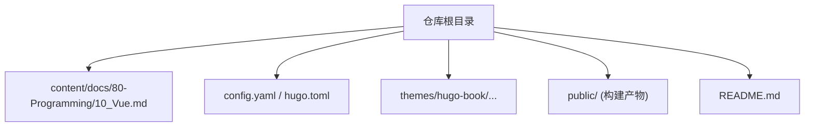

图表来源
- [config.yaml:1-200](file://config.yaml#L1-L200)
- [hugo.toml:1-200](file://hugo.toml#L1-L200)
- [10_Vue.md:1-200](file://content/docs/80-Programming/10_Vue.md#L1-L200)

章节来源
- [config.yaml:1-200](file://config.yaml#L1-L200)
- [hugo.toml:1-200](file://hugo.toml#L1-L200)
- [README.md:1-200](file://README.md#L1-L200)

## 核心组件
本节聚焦Vue.js的核心概念与常用能力，帮助快速建立系统性认知：
- 响应式数据绑定：理解数据驱动视图的基本原理与双向绑定的适用场景
- 计算属性：声明式派生状态，避免模板内复杂逻辑
- 侦听器：对副作用或异步操作进行监听与编排
- 生命周期钩子：掌握挂载、更新、销毁等关键时机
- 路由管理(Vue Router)：页面级导航与参数传递
- 状态管理(Vuex/Pinia)：跨组件共享状态与可预测的状态变更
- 单文件组件(SFC)：模板、脚本、样式的模块化组织
- 表单处理：受控与非受控模式、校验与提交
- HTTP请求：封装与拦截器、错误重试与取消
- 错误处理：全局与局部策略、用户提示与日志上报
- 性能优化：懒加载、虚拟列表、缓存与渲染优化

章节来源
- [10_Vue.md:1-200](file://content/docs/80-Programming/10_Vue.md#L1-L200)

## 架构总览
下图展示了典型Vue应用的前端分层与交互关系，涵盖UI层、路由层、状态层与网络层，以及它们之间的调用顺序与职责边界。

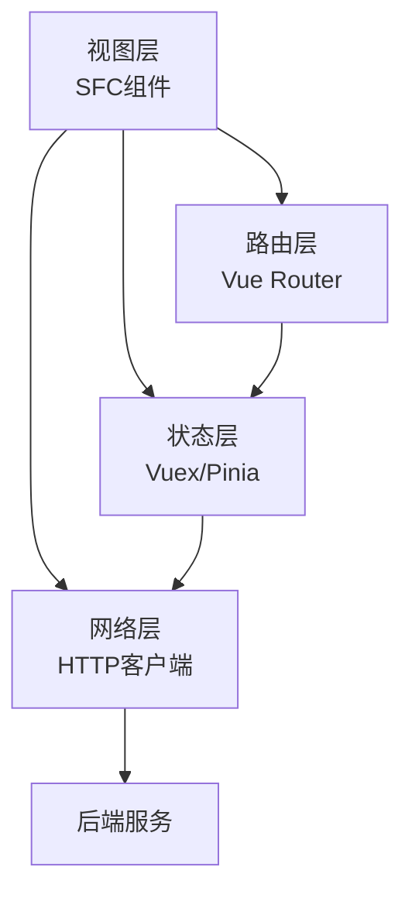

图表来源
- [10_Vue.md:1-200](file://content/docs/80-Programming/10_Vue.md#L1-L200)

## 详细组件分析

### 响应式数据与计算属性
- 设计要点
  - 将派生数据放入计算属性，保持模板简洁
  - 避免在计算属性中执行副作用
  - 合理使用深度侦听与一次性侦听
- 复杂度与性能
  - 计算属性具备缓存特性，仅依赖变化时重新计算
  - 过度嵌套或频繁变化的依赖会影响性能，需拆分与扁平化

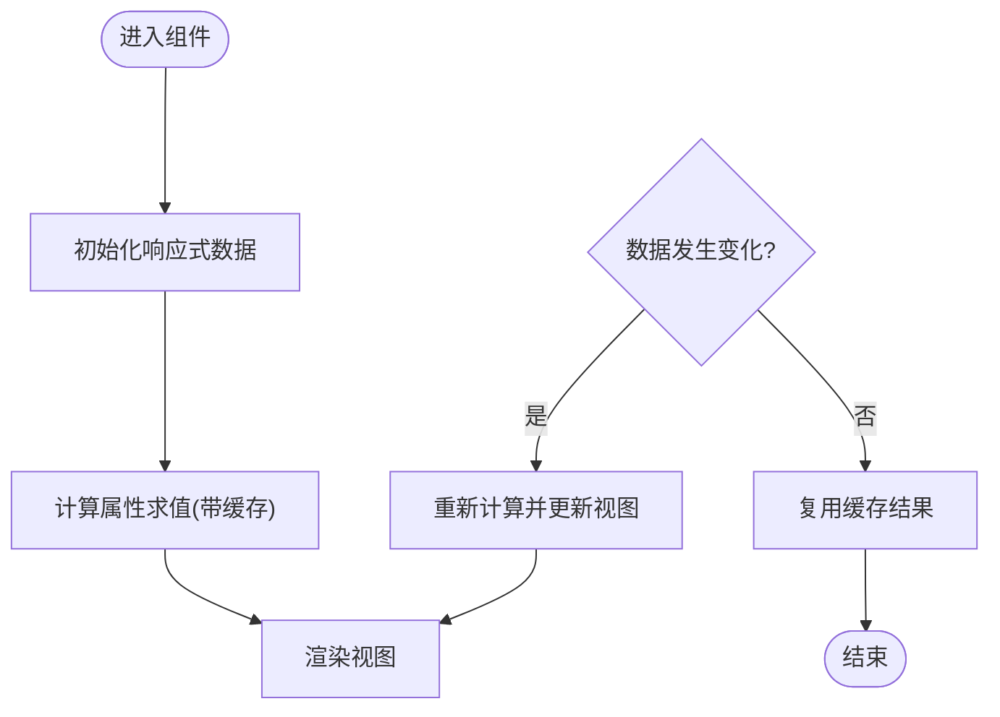

图表来源
- [10_Vue.md:1-200](file://content/docs/80-Programming/10_Vue.md#L1-L200)

章节来源
- [10_Vue.md:1-200](file://content/docs/80-Programming/10_Vue.md#L1-L200)

### 侦听器与副作用
- 设计要点
  - 侦听器用于副作用（如网络请求、DOM操作）
  - 注意清理副作用，避免内存泄漏
  - 组合多个侦听器时使用统一的副作用编排
- 常见陷阱
  - 重复触发导致竞态条件
  - 未正确解绑导致的资源泄露

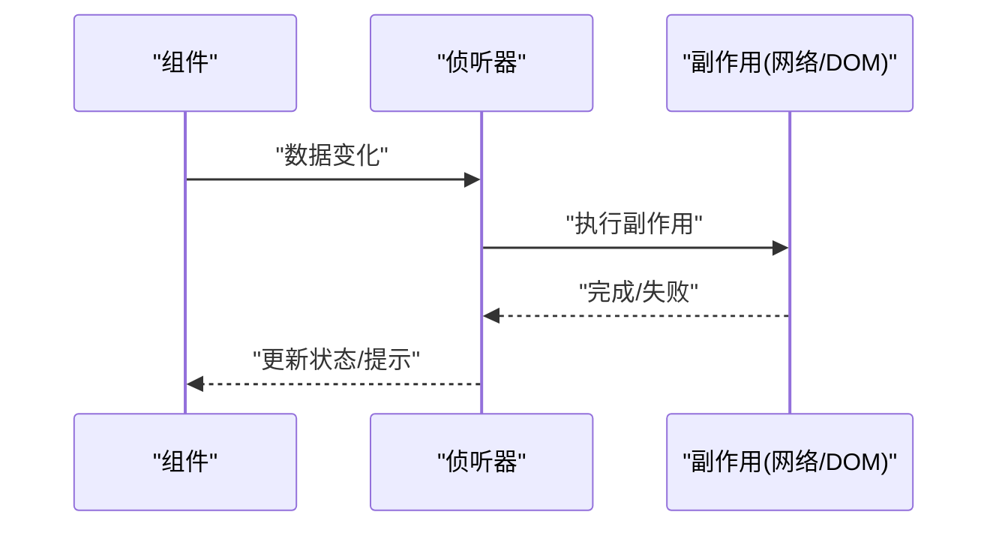

图表来源
- [10_Vue.md:1-200](file://content/docs/80-Programming/10_Vue.md#L1-L200)

章节来源
- [10_Vue.md:1-200](file://content/docs/80-Programming/10_Vue.md#L1-L200)

### 生命周期钩子
- 关键阶段
  - 创建与挂载：初始化数据、订阅事件、发起首屏请求
  - 更新：谨慎处理，避免重复渲染
  - 销毁：清理定时器、事件监听、第三方实例
- 最佳实践
  - 将副作用集中在合适的钩子中
  - 避免在beforeDestroy/destroyed之外访问已销毁的实例

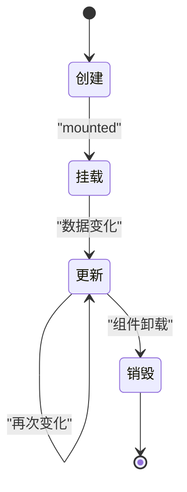

图表来源
- [10_Vue.md:1-200](file://content/docs/80-Programming/10_Vue.md#L1-L200)

章节来源
- [10_Vue.md:1-200](file://content/docs/80-Programming/10_Vue.md#L1-L200)

### 路由管理(Vue Router)
- 设计要点
  - 按功能域划分路由模块
  - 使用路由元信息承载权限与标题
  - 合理配置懒加载与预取
- 导航守卫
  - 全局前置守卫做鉴权与埋点
  - 路由独享守卫处理细粒度控制
  - 组件内守卫处理局部逻辑

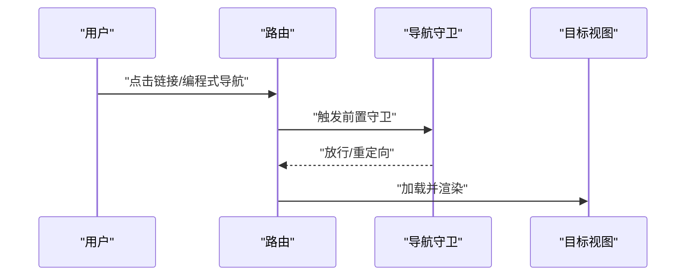

图表来源
- [10_Vue.md:1-200](file://content/docs/80-Programming/10_Vue.md#L1-L200)

章节来源
- [10_Vue.md:1-200](file://content/docs/80-Programming/10_Vue.md#L1-L200)

### 状态管理(Vuex/Pinia)
- 设计要点
  - 单一数据源，明确Action/Mutation/Getter职责
  - 将业务逻辑下沉至Store，组件只负责展示与触发
  - 使用模块化组织大型应用状态
- 持久化与缓存
  - 结合本地存储实现关键状态持久化
  - 合理设置失效策略与版本迁移

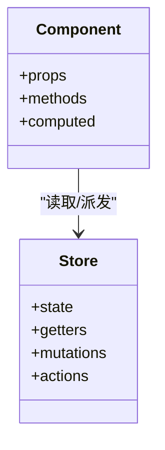

图表来源
- [10_Vue.md:1-200](file://content/docs/80-Programming/10_Vue.md#L1-L200)

章节来源
- [10_Vue.md:1-200](file://content/docs/80-Programming/10_Vue.md#L1-L200)

### 单文件组件(SFC)规范与组织
- 文件命名与目录结构
  - 按功能域分组，公共组件独立存放
  - 统一命名约定，提升可读性与可维护性
- 组件内部组织
  - 模板、脚本、样式分离，必要时引入外部资源
  - 通过Props与Events实现父子通信，避免深层耦合
- 代码风格
  - 严格类型检查与ESLint规则
  - 组件粒度适中，职责单一

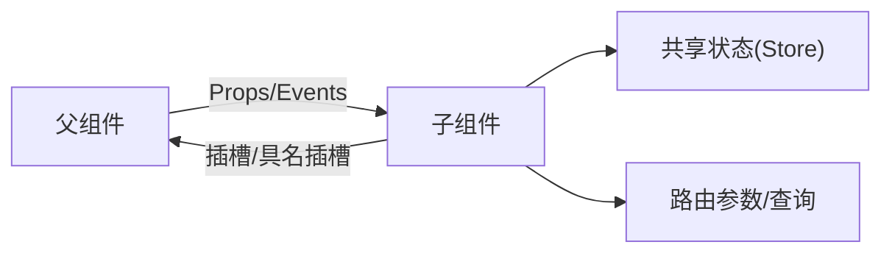

图表来源
- [10_Vue.md:1-200](file://content/docs/80-Programming/10_Vue.md#L1-L200)

章节来源
- [10_Vue.md:1-200](file://content/docs/80-Programming/10_Vue.md#L1-L200)

### 表单处理与校验
- 受控与非受控
  - 受控表单适合强校验与联动
  - 非受控表单适合大表单与性能敏感场景
- 校验策略
  - 前端即时校验与提交前校验结合
  - 错误消息集中管理与国际化
- 提交流程
  - 防抖/节流避免重复提交
  - 成功与失败分支的用户反馈

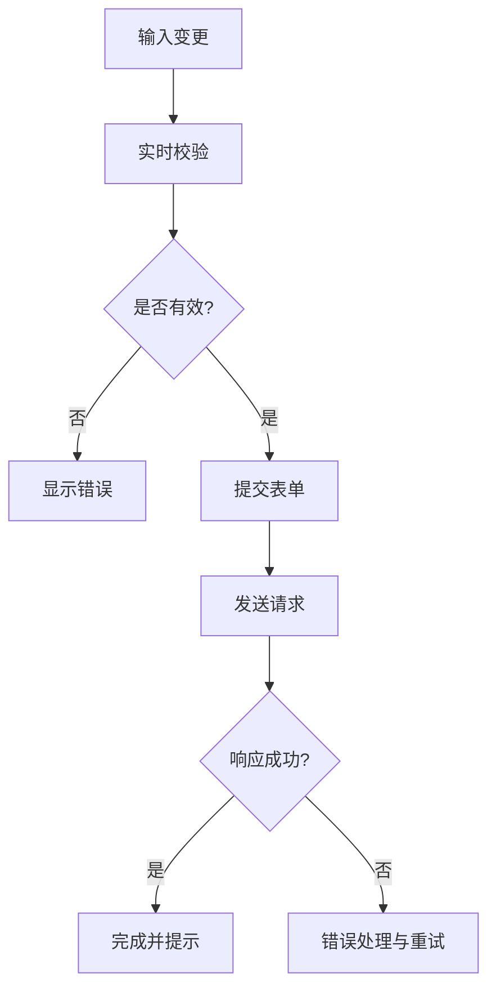

图表来源
- [10_Vue.md:1-200](file://content/docs/80-Programming/10_Vue.md#L1-L200)

章节来源
- [10_Vue.md:1-200](file://content/docs/80-Programming/10_Vue.md#L1-L200)

### HTTP请求与错误处理
- 封装策略
  - 统一请求入口，配置基础URL、超时与重试
  - 请求/响应拦截器处理鉴权、日志与错误
- 错误分类
  - 网络错误、业务错误、服务端异常分别处理
  - 提供用户友好的提示与降级方案
- 取消与去抖
  - 使用AbortController取消过期请求
  - 搜索类接口采用防抖减少无效请求

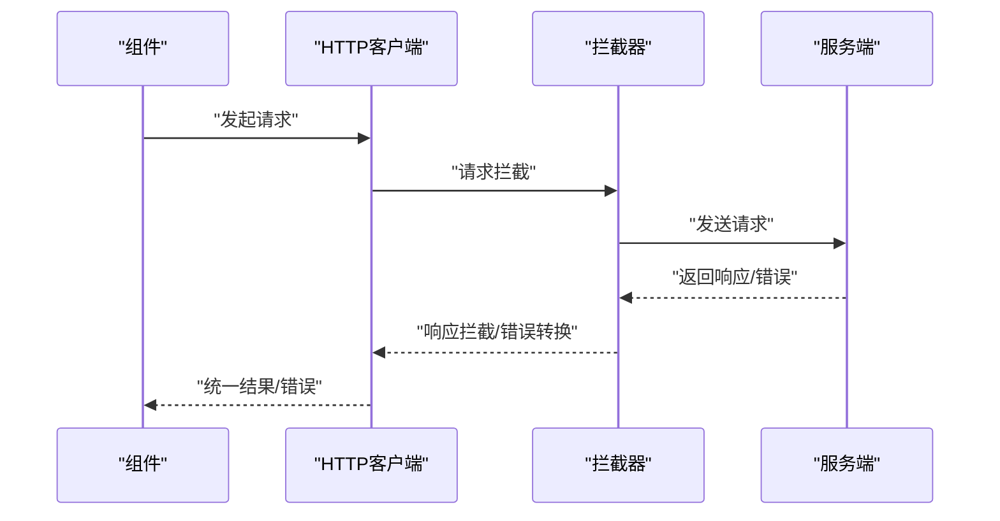

图表来源
- [10_Vue.md:1-200](file://content/docs/80-Programming/10_Vue.md#L1-L200)

章节来源
- [10_Vue.md:1-200](file://content/docs/80-Programming/10_Vue.md#L1-L200)

### 性能优化
- 渲染优化
  - 合理使用v-memo/v-once与key
  - 大数据列表采用虚拟滚动
- 资源优化
  - 路由与组件懒加载
  - 图片与字体按需加载与压缩
- 缓存策略
  - 浏览器缓存与服务端缓存配合
  - 状态持久化与增量更新

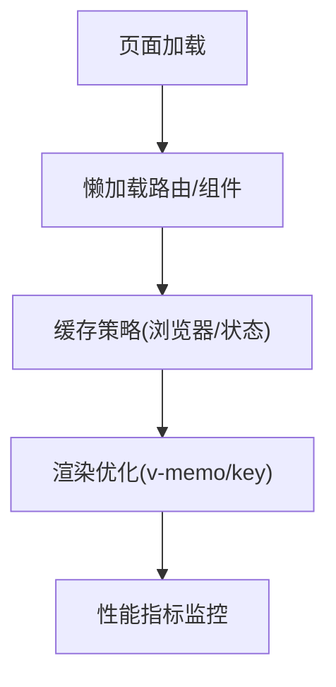

图表来源
- [10_Vue.md:1-200](file://content/docs/80-Programming/10_Vue.md#L1-L200)

章节来源
- [10_Vue.md:1-200](file://content/docs/80-Programming/10_Vue.md#L1-L200)

## 依赖分析
- 运行时依赖
  - Vue核心库与生态插件（Router、State Management、HTTP客户端等）
- 构建与工具链
  - 包管理器、打包器、类型检查与代码质量工具
- 文档与站点
  - Hugo作为静态站点生成器，主题与配置文件决定站点结构与样式

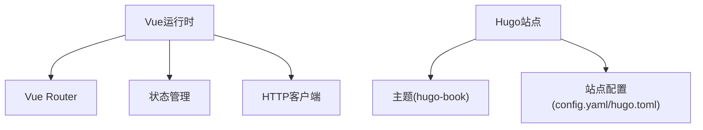

图表来源
- [config.yaml:1-200](file://config.yaml#L1-L200)
- [hugo.toml:1-200](file://hugo.toml#L1-L200)
- [10_Vue.md:1-200](file://content/docs/80-Programming/10_Vue.md#L1-L200)

章节来源
- [config.yaml:1-200](file://config.yaml#L1-L200)
- [hugo.toml:1-200](file://hugo.toml#L1-L200)

## 性能考虑
- 首屏加载
  - 路由与组件懒加载、关键CSS内联、字体预加载
- 运行期性能
  - 避免不必要的重渲染，合理使用计算属性与侦听器
  - 大数据集虚拟化与分页
- 可观测性
  - 接入性能监控与错误上报，定位瓶颈与异常

[本节为通用指导，不直接分析具体文件]

## 故障排查指南
- 常见问题定位
  - 路由跳转失败：检查路由定义、守卫逻辑与权限配置
  - 状态不同步：确认Store中的状态变更路径与组件订阅
  - 请求失败：查看拦截器日志、错误码映射与重试策略
- 调试建议
  - 使用浏览器开发者工具与Vue Devtools
  - 增加结构化日志与错误上下文
  - 编写单元测试与集成测试覆盖关键路径

章节来源
- [10_Vue.md:1-200](file://content/docs/80-Programming/10_Vue.md#L1-L200)

## 结论
通过系统化的学习与实践，开发者可以高效地运用Vue.js构建高质量的前端应用。建议在团队内统一SFC规范与错误处理策略，持续优化性能与可维护性，并结合监控与测试保障线上稳定性。

[本节为总结性内容，不直接分析具体文件]

## 附录
- 参考文档
  - 仓库中的Vue教程文档可作为入门与进阶的学习材料
- 站点配置
  - Hugo站点配置文件可用于了解站点结构与主题定制方式

章节来源
- [10_Vue.md:1-200](file://content/docs/80-Programming/10_Vue.md#L1-L200)
- [config.yaml:1-200](file://config.yaml#L1-L200)
- [hugo.toml:1-200](file://hugo.toml#L1-L200)