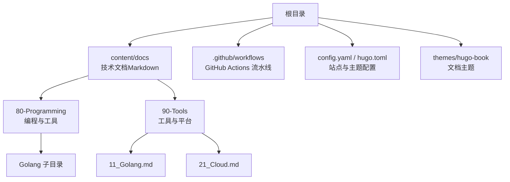
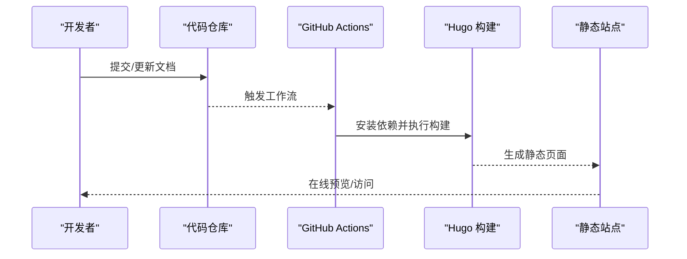
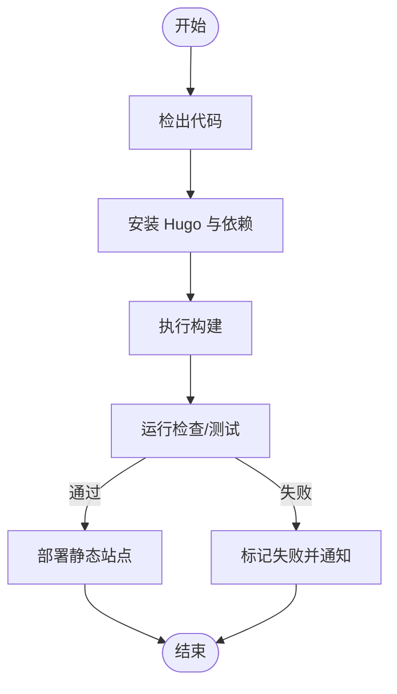
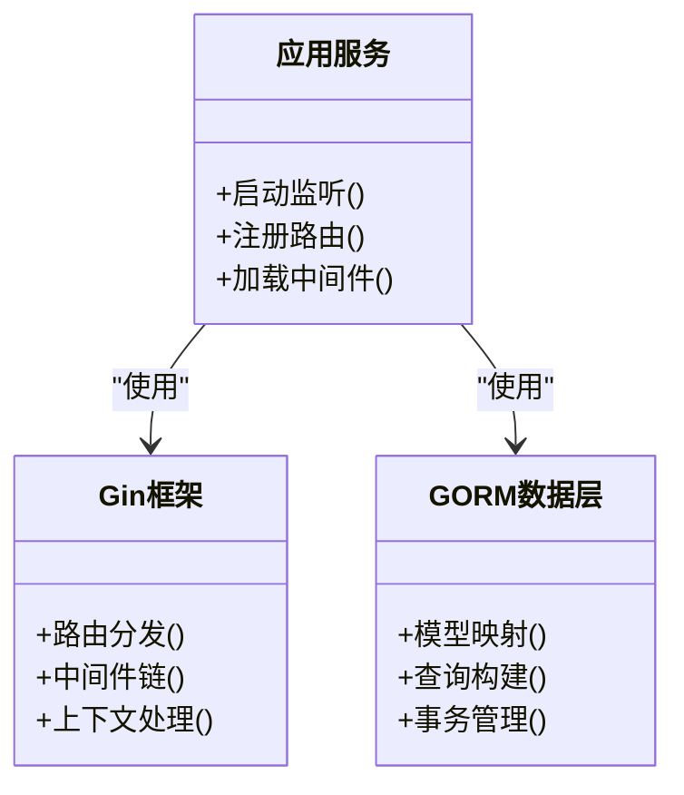
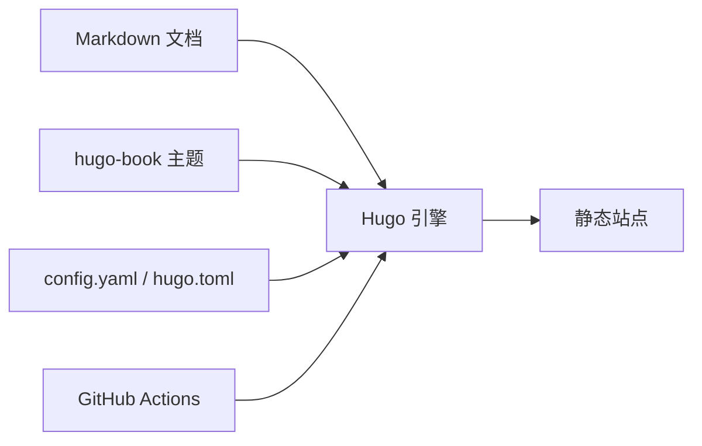

# 开发工具集

<cite>
**本文引用的文件**   
- [README.md](file://README.md)
- [config.yaml](file://config.yaml)
- [hugo.toml](file://hugo.toml)
- [.github/workflows/hugo.yaml](file://.github/workflows/hugo.yaml)
- [content/docs/80-Programming/05_Toolkit.md](file://content/docs/80-Programming/05_Toolkit.md)
- [content/docs/90-Tools/11_Golang.md](file://content/docs/90-Tools/11_Golang.md)
- [content/docs/90-Tools/21_Cloud.md](file://content/docs/90-Tools/21_Cloud.md)
- [content/docs/80-Programming/Golang/_index.md](file://content/docs/80-Programming/Golang/_index.md)
- [content/docs/80-Programming/Golang/01_Golang.md](file://content/docs/80-Programming/Golang/01_Golang.md)
- [content/docs/80-Programming/Golang/10_Gin.md](file://content/docs/80-Programming/Golang/10_Gin.md)
- [content/docs/80-Programming/Golang/12_Gorm.md](file://content/docs/80-Programming/Golang/12_Gorm.md)
</cite>

## 目录
1. [简介](#简介)
2. [项目结构](#项目结构)
3. [核心组件](#核心组件)
4. [架构总览](#架构总览)
5. [详细组件分析](#详细组件分析)
6. [依赖分析](#依赖分析)
7. [性能考虑](#性能考虑)
8. [故障排查指南](#故障排查指南)
9. [结论](#结论)
10. [附录](#附录)

## 简介
本指南面向现代开发环境，围绕“工具链与效率提升”主题，结合仓库中已有的文档与配置，系统化梳理IDE与编辑器优化、调试与测试、版本控制与质量门禁、自动化构建与发布、命令行与网络调试等关键能力。目标是通过可落地的实践方案，帮助团队快速搭建高效、稳定、可复用的开发工作流。

## 项目结构
仓库采用Hugo静态站点组织技术文档，内容按主题分目录存放，便于检索与扩展。与“开发工具集”直接相关的源文件主要位于 content/docs 下，包含通用工具、Go语言生态工具以及云原生相关工具的文章；同时通过 .github/workflows 定义CI流程，使用 config.yaml/hugo.toml 管理站点与主题配置。

图表来源
- [config.yaml](file://config.yaml)
- [hugo.toml](file://hugo.toml)
- [.github/workflows/hugo.yaml](file://.github/workflows/hugo.yaml)

章节来源
- [README.md](file://README.md)
- [config.yaml](file://config.yaml)
- [hugo.toml](file://hugo.toml)
- [.github/workflows/hugo.yaml](file://.github/workflows/hugo.yaml)

## 核心组件
- 文档内容与导航：以 Markdown 为中心，按主题划分，覆盖通用工具、Go语言生态、云原生工具等。
- 构建与发布：基于 Hugo 生成静态站点，并通过 GitHub Actions 自动构建与部署。
- 主题与样式：使用 hugo-book 主题，提供清晰的文档结构与阅读体验。

章节来源
- [content/docs/80-Programming/05_Toolkit.md](file://content/docs/80-Programming/05_Toolkit.md)
- [content/docs/90-Tools/11_Golang.md](file://content/docs/90-Tools/11_Golang.md)
- [content/docs/90-Tools/21_Cloud.md](file://content/docs/90-Tools/21_Cloud.md)
- [content/docs/80-Programming/Golang/_index.md](file://content/docs/80-Programming/Golang/_index.md)
- [content/docs/80-Programming/Golang/01_Golang.md](file://content/docs/80-Programming/Golang/01_Golang.md)
- [content/docs/80-Programming/Golang/10_Gin.md](file://content/docs/80-Programming/Golang/10_Gin.md)
- [content/docs/80-Programming/Golang/12_Gorm.md](file://content/docs/80-Programming/Golang/12_Gorm.md)

## 架构总览
下图展示了从源码到文档站点的整体流程：开发者在本地或远程编写 Markdown 文档，提交后触发 CI 构建，最终输出静态站点并部署。

图表来源
- [.github/workflows/hugo.yaml](file://.github/workflows/hugo.yaml)
- [config.yaml](file://config.yaml)
- [hugo.toml](file://hugo.toml)

## 详细组件分析

### IDE与编辑器优化（VS Code、GoLand）
- VS Code 推荐方向
  - Go 语言支持：启用官方 Go 插件，配置 gopls、goimports、dlv 等，提升补全、跳转与调试体验。
  - 任务与快捷键：为常用命令（格式化、测试、构建、运行）配置 tasks 与 keybindings，减少重复操作。
  - 终端集成：在内置终端中复用 go 工具链与环境变量，统一工作区设置。
- GoLand 推荐方向
  - 代码检查与重构：开启内置检查规则，配合外部 linter 统一风格。
  - 调试器：配置 dlv 断点、条件断点与热重载，加速问题定位。
  - 数据库与API：集成数据库客户端与HTTP客户端，缩短联调路径。

章节来源
- [content/docs/80-Programming/Golang/01_Golang.md](file://content/docs/80-Programming/Golang/01_Golang.md)
- [content/docs/80-Programming/Golang/_index.md](file://content/docs/80-Programming/Golang/_index.md)

### 调试与测试（单元测试、集成测试、性能分析）
- 单元测试与覆盖率
  - 使用标准库测试框架编写用例，结合覆盖率统计评估测试完备性。
  - 将覆盖率阈值纳入CI，防止回归。
- 集成测试
  - 针对服务间交互与外部依赖，构造最小化测试环境，确保端到端场景可用。
- 性能分析与基准
  - 使用性能剖析工具识别热点，结合基准测试验证优化效果。
- 调试技巧
  - 合理设置断点与日志级别，利用结构化日志与上下文追踪定位问题。

章节来源
- [content/docs/80-Programming/Golang/01_Golang.md](file://content/docs/80-Programming/Golang/01_Golang.md)

### 版本控制与协作（Git、分支策略、PR模板）
- 分支模型
  - 采用主分支保护与功能分支开发，合并前进行代码审查与自动化检查。
- 提交规范
  - 约定提交信息格式，便于自动生成变更日志与追溯问题。
- PR 模板
  - 使用模板引导贡献者完善描述、影响范围与测试说明，降低沟通成本。

章节来源
- [.gitee/PULL_REQUEST_TEMPLATE.en.md](file://.gitee/PULL_REQUEST_TEMPLATE.en.md)
- [.gitee/ISSUE_TEMPLATE.en.md](file://.gitee/ISSUE_TEMPLATE.en.md)

### 代码质量与自动化（Lint、安全扫描、依赖治理）
- 代码风格与静态检查
  - 统一格式化与lint规则，在保存时或提交前自动修复常见问题。
- 安全与依赖
  - 定期扫描依赖漏洞，锁定版本并建立升级策略。
- 质量门禁
  - 将检查与测试作为合并前置条件，保证主干质量。

章节来源
- [content/docs/80-Programming/05_Toolkit.md](file://content/docs/80-Programming/05_Toolkit.md)

### 自动化构建与发布（Hugo + GitHub Actions）
- 构建流程
  - 在CI中安装Hugo与依赖，执行构建并产出静态资源。
- 部署策略
  - 将产物推送至托管平台或对象存储，实现持续交付。
- 回滚与灰度
  - 通过版本号与别名路由，支持快速回滚与灰度发布。

图表来源
- [.github/workflows/hugo.yaml](file://.github/workflows/hugo.yaml)
- [config.yaml](file://config.yaml)
- [hugo.toml](file://hugo.toml)

章节来源
- [.github/workflows/hugo.yaml](file://.github/workflows/hugo.yaml)
- [config.yaml](file://config.yaml)
- [hugo.toml](file://hugo.toml)

### 命令行与网络调试（curl、HTTP 客户端、抓包）
- 命令行工具
  - 使用 curl 或 HTTP 客户端进行接口连通性与响应校验。
- 抓包与链路分析
  - 借助抓包工具观察请求细节，结合服务端日志定位瓶颈。
- API 测试
  - 将常用请求收敛为脚本或集合，形成可重复的冒烟测试。

章节来源
- [content/docs/80-Programming/05_Toolkit.md](file://content/docs/80-Programming/05_Toolkit.md)

### Go 生态工具链（Gin、GORM、CLI 与脚手架）
- Web 框架与中间件
  - 基于 Gin 构建高性能服务，结合中间件实现鉴权、限流与日志。
- ORM 与数据层
  - 使用 GORM 简化数据访问，关注迁移与索引设计。
- CLI 与脚手架
  - 封装常用命令，统一工程初始化与代码生成，提升一致性。

图表来源
- [content/docs/80-Programming/Golang/10_Gin.md](file://content/docs/80-Programming/Golang/10_Gin.md)
- [content/docs/80-Programming/Golang/12_Gorm.md](file://content/docs/80-Programming/Golang/12_Gorm.md)

章节来源
- [content/docs/80-Programming/Golang/10_Gin.md](file://content/docs/80-Programming/Golang/10_Gin.md)
- [content/docs/80-Programming/Golang/12_Gorm.md](file://content/docs/80-Programming/Golang/12_Gorm.md)
- [content/docs/80-Programming/Golang/_index.md](file://content/docs/80-Programming/Golang/_index.md)

### 云原生与平台工具（容器、编排、可观测性）
- 容器与镜像
  - 多阶段构建减小镜像体积，固定基础镜像版本提升稳定性。
- 编排与服务发现
  - 使用编排平台管理服务生命周期与健康检查。
- 可观测性
  - 接入指标、日志与链路追踪，建立告警与排障闭环。

章节来源
- [content/docs/90-Tools/21_Cloud.md](file://content/docs/90-Tools/21_Cloud.md)

## 依赖分析
- 文档与主题
  - 文档内容依赖 hugo-book 主题提供的布局与样式。
- 构建与部署
  - 构建流程依赖 Hugo 运行时与 GitHub Actions 环境。
- 配置耦合
  - config.yaml 与 hugo.toml 共同决定站点行为与主题参数。

图表来源
- [config.yaml](file://config.yaml)
- [hugo.toml](file://hugo.toml)
- [.github/workflows/hugo.yaml](file://.github/workflows/hugo.yaml)

章节来源
- [config.yaml](file://config.yaml)
- [hugo.toml](file://hugo.toml)
- [.github/workflows/hugo.yaml](file://.github/workflows/hugo.yaml)

## 性能考虑
- 构建性能
  - 缓存依赖与构建产物，按需增量构建，缩短CI时长。
- 站点性能
  - 压缩资源、懒加载图片、精简主题与插件，提升首屏速度。
- 开发与调试
  - 合理使用日志与采样，避免在生产环境开启高开销诊断。

## 故障排查指南
- 构建失败
  - 检查 Hugo 版本与主题兼容性，确认环境变量与依赖是否齐全。
- 部署异常
  - 核对部署凭据与目标地址，查看CI日志定位具体步骤失败原因。
- 文档渲染问题
  - 校验 Markdown 语法与短代码引用，必要时在本地复现。

章节来源
- [.github/workflows/hugo.yaml](file://.github/workflows/hugo.yaml)
- [config.yaml](file://config.yaml)
- [hugo.toml](file://hugo.toml)

## 结论
通过将文档、构建、部署与质量门禁串联成一体化流水线，并以Go生态工具链为抓手，团队可以在统一的工具平台上获得一致的体验与更高的交付效率。建议持续沉淀最佳实践，定期复盘工具链的有效性，保持演进与优化。

## 附录
- 参考文章与入口
  - 通用工具与技巧：[content/docs/80-Programming/05_Toolkit.md](file://content/docs/80-Programming/05_Toolkit.md)
  - Go 工具与生态：[content/docs/90-Tools/11_Golang.md](file://content/docs/90-Tools/11_Golang.md)
  - 云原生工具与实践：[content/docs/90-Tools/21_Cloud.md](file://content/docs/90-Tools/21_Cloud.md)
  - Go 语言专题入口：[content/docs/80-Programming/Golang/_index.md](file://content/docs/80-Programming/Golang/_index.md)
  - Go 入门与进阶：[content/docs/80-Programming/Golang/01_Golang.md](file://content/docs/80-Programming/Golang/01_Golang.md)
  - Gin 框架实践：[content/docs/80-Programming/Golang/10_Gin.md](file://content/docs/80-Programming/Golang/10_Gin.md)
  - GORM 数据层实践：[content/docs/80-Programming/Golang/12_Gorm.md](file://content/docs/80-Programming/Golang/12_Gorm.md)