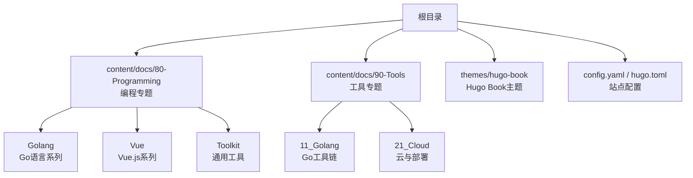
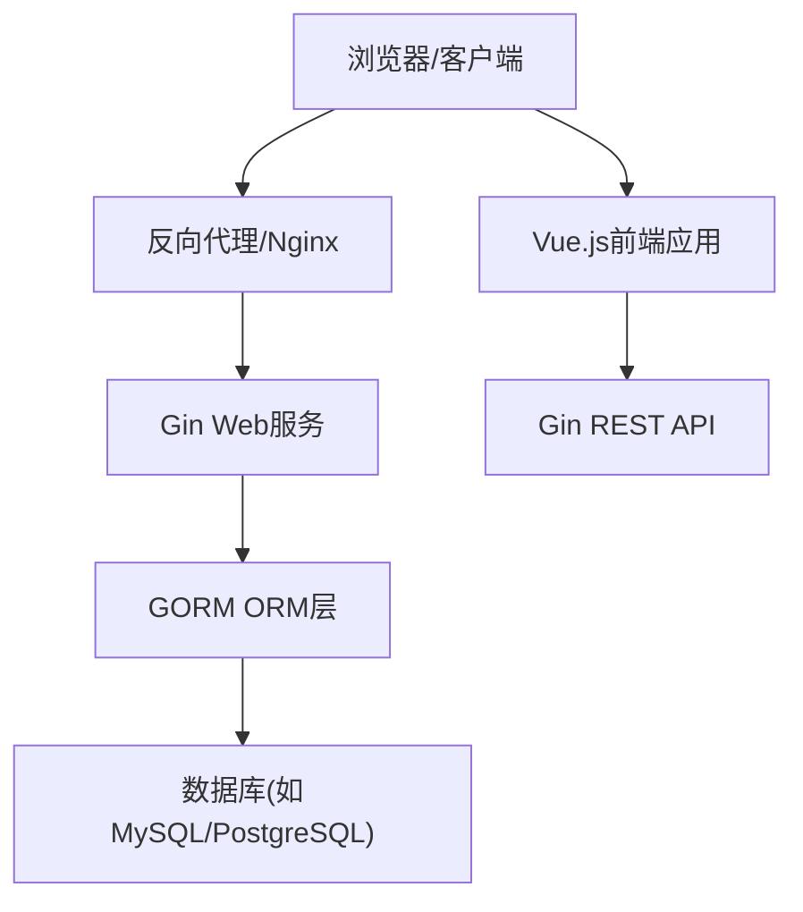
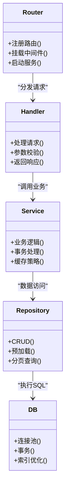
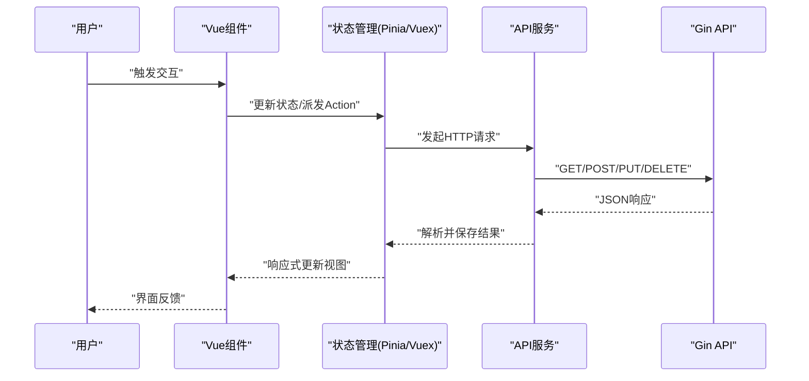
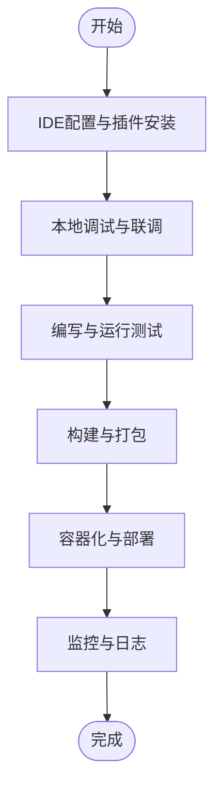
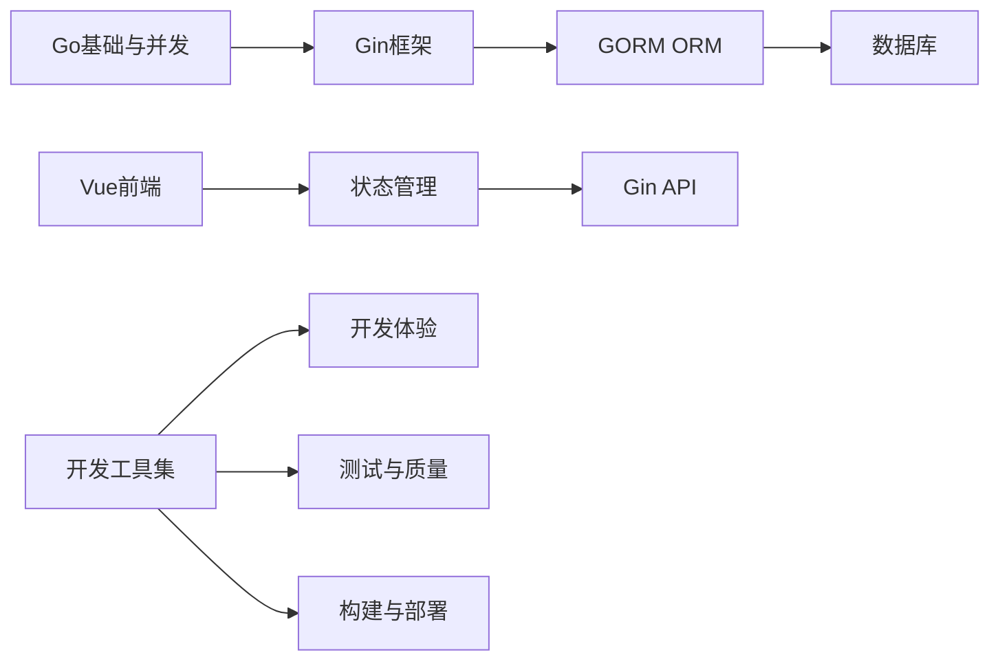

# 编程语言教程

<cite>
**本文引用的文件**   
- [README.md](file://README.md)
- [config.yaml](file://config.yaml)
- [hugo.toml](file://hugo.toml)
- [content/docs/80-Programming/_index.md](file://content/docs/80-Programming/_index.md)
- [content/docs/80-Programming/Golang/_index.md](file://content/docs/80-Programming/Golang/_index.md)
- [content/docs/80-Programming/Golang/01_Golang.md](file://content/docs/80-Programming/Golang/01_Golang.md)
- [content/docs/80-Programming/Golang/10_Gin.md](file://content/docs/80-Programming/Golang/10_Gin.md)
- [content/docs/80-Programming/Golang/12_Gorm.md](file://content/docs/80-Programming/Golang/12_Gorm.md)
- [content/docs/80-Programming/10_Vue.md](file://content/docs/80-Programming/10_Vue.md)
- [content/docs/80-Programming/05_Toolkit.md](file://content/docs/80-Programming/05_Toolkit.md)
- [content/docs/90-Tools/_index.md](file://content/docs/90-Tools/_index.md)
- [content/docs/90-Tools/11_Golang.md](file://content/docs/90-Tools/11_Golang.md)
- [content/docs/90-Tools/21_Cloud.md](file://content/docs/90-Tools/21_Cloud.md)
</cite>

## 更新摘要
**所做更改**   
- 新增Vue.js前端开发教程章节，涵盖核心概念、组件化开发和状态管理
- 完善Go语言开发教程，包括Gin框架和GORM ORM的深入讲解
- 扩展开发工具集内容，提供IDE配置、调试工具和测试框架的实用指南
- 更新项目结构说明，反映多语言编程教程的组织方式
- 增强前后端分离架构的实践指导

## 目录
1. [简介](#简介)
2. [项目结构](#项目结构)
3. [核心组件](#核心组件)
4. [架构总览](#架构总览)
5. [详细组件分析](#详细组件分析)
6. [依赖关系分析](#依赖关系分析)
7. [性能与优化建议](#性能与优化建议)
8. [故障排查指南](#故障排查指南)
9. [结论](#结论)
10. [附录](#附录)

## 简介
本教程面向希望构建现代Web应用的开发者，围绕Go语言后端、Vue.js前端与常用开发工具集展开，提供从语法特性到并发编程、从Gin Web框架到GORM数据库操作、从Vue组件化与状态管理到IDE配置、调试与测试的完整实践指南。文档以Hugo静态站点组织内容，便于阅读与检索，并配套实战案例，覆盖从需求分析到部署上线的全流程。

**更新** 新增了多语言编程教程，重点介绍Vue.js前端开发、Go语言开发（Gin框架和GORM ORM）以及开发工具集的使用技巧。

## 项目结构
本项目采用Hugo Book主题组织技术文档，内容按主题分目录存放，重点包括：
- Go语言后端：基础语法、并发模型、Gin框架、GORM ORM库
- Vue.js前端：核心概念、组件化、状态管理
- 开发工具集：IDE配置、调试、测试、云与运维工具

**图表来源**
- [config.yaml](file://config.yaml)
- [hugo.toml](file://hugo.toml)
- [content/docs/80-Programming/_index.md](file://content/docs/80-Programming/_index.md)
- [content/docs/90-Tools/_index.md](file://content/docs/90-Tools/_index.md)

**章节来源**
- [README.md](file://README.md)
- [config.yaml](file://config.yaml)
- [hugo.toml](file://hugo.toml)
- [content/docs/80-Programming/_index.md](file://content/docs/80-Programming/_index.md)
- [content/docs/90-Tools/_index.md](file://content/docs/90-Tools/_index.md)

## 核心组件
- Go语言后端
  - 语法与并发：变量、类型、函数、接口、goroutine与channel等
  - Gin框架：路由、中间件、请求处理、参数校验、错误处理
  - GORM：模型定义、CRUD、事务、预加载、连接池与性能调优
- Vue.js前端
  - 响应式数据、模板语法、指令、计算属性与侦听器
  - 组件化：单文件组件、父子通信、插槽、事件总线
  - 状态管理：Pinia/Vuex（根据实际选择）、模块化与持久化
- 开发工具集
  - IDE与插件：VS Code、Go扩展、Volar、ESLint、Prettier
  - 调试与测试：Delve、Chrome DevTools、Jest/Vitest、Go test
  - 构建与部署：Docker、CI/CD、Nginx/Caddy、云平台

**章节来源**
- [content/docs/80-Programming/Golang/_index.md](file://content/docs/80-Programming/Golang/_index.md)
- [content/docs/80-Programming/Golang/01_Golang.md](file://content/docs/80-Programming/Golang/01_Golang.md)
- [content/docs/80-Programming/Golang/10_Gin.md](file://content/docs/80-Programming/Golang/10_Gin.md)
- [content/docs/80-Programming/Golang/12_Gorm.md](file://content/docs/80-Programming/Golang/12_Gorm.md)
- [content/docs/80-Programming/10_Vue.md](file://content/docs/80-Programming/10_Vue.md)
- [content/docs/80-Programming/05_Toolkit.md](file://content/docs/80-Programming/05_Toolkit.md)
- [content/docs/90-Tools/11_Golang.md](file://content/docs/90-Tools/11_Golang.md)
- [content/docs/90-Tools/21_Cloud.md](file://content/docs/90-Tools/21_Cloud.md)

## 架构总览
下图展示前后端分离的典型架构：浏览器通过HTTP访问由Gin提供的REST API，Gin调用GORM进行数据持久化；前端使用Vue.js进行页面渲染与交互，并通过API网关或反向代理统一入口。

**图表来源**
- [content/docs/80-Programming/Golang/10_Gin.md](file://content/docs/80-Programming/Golang/10_Gin.md)
- [content/docs/80-Programming/Golang/12_Gorm.md](file://content/docs/80-Programming/Golang/12_Gorm.md)
- [content/docs/80-Programming/10_Vue.md](file://content/docs/80-Programming/10_Vue.md)

## 详细组件分析

### Go语言后端组件
- 语法与并发
  - 并发原语：goroutine、channel、sync包
  - 上下文控制：context超时与取消
  - 错误处理：多值返回、自定义错误类型
- Gin框架
  - 路由分组、中间件链、参数绑定与校验
  - 统一错误码与日志记录
- GORM最佳实践
  - 模型标签、关联查询、预加载减少N+1
  - 连接池配置、批量写入、事务边界
  - 慢查询分析与索引优化

**图表来源**
- [content/docs/80-Programming/Golang/10_Gin.md](file://content/docs/80-Programming/Golang/10_Gin.md)
- [content/docs/80-Programming/Golang/12_Gorm.md](file://content/docs/80-Programming/Golang/12_Gorm.md)

**章节来源**
- [content/docs/80-Programming/Golang/01_Golang.md](file://content/docs/80-Programming/Golang/01_Golang.md)
- [content/docs/80-Programming/Golang/10_Gin.md](file://content/docs/80-Programming/Golang/10_Gin.md)
- [content/docs/80-Programming/Golang/12_Gorm.md](file://content/docs/80-Programming/Golang/12_Gorm.md)

### Vue.js前端组件
- 核心概念
  - 响应式系统、模板语法、指令、生命周期
- 组件化开发
  - 单文件组件、props与events、插槽与作用域插槽
  - 组件复用与组合式API
- 状态管理
  - Pinia/Vuex模块划分、异步Action、持久化存储
  - 与后端API集成、错误处理与重试

**图表来源**
- [content/docs/80-Programming/10_Vue.md](file://content/docs/80-Programming/10_Vue.md)
- [content/docs/80-Programming/Golang/10_Gin.md](file://content/docs/80-Programming/Golang/10_Gin.md)

**章节来源**
- [content/docs/80-Programming/10_Vue.md](file://content/docs/80-Programming/10_Vue.md)

### 开发工具集
- IDE与插件
  - VS Code：Go扩展、Volar、ESLint、Prettier、GitLens
  - 快捷键与工作区设置、代码片段
- 调试与测试
  - Delve断点调试、Chrome DevTools网络面板
  - Go test单元测试、覆盖率；Jest/Vitest前端测试
- 构建与部署
  - Docker镜像构建、多阶段构建
  - CI/CD流水线、Nginx/Caddy反向代理
  - 云平台部署与监控告警

**章节来源**
- [content/docs/80-Programming/05_Toolkit.md](file://content/docs/80-Programming/05_Toolkit.md)
- [content/docs/90-Tools/11_Golang.md](file://content/docs/90-Tools/11_Golang.md)
- [content/docs/90-Tools/21_Cloud.md](file://content/docs/90-Tools/21_Cloud.md)

## 依赖关系分析
- 内容依赖
  - Go语言系列依赖基础语法与并发知识
  - Gin与GORM在Web服务中形成"路由-处理器-服务-仓储-数据库"的层次依赖
  - Vue前端依赖状态管理与API服务层
- 工具依赖
  - 开发工具贯穿编码、调试、测试、构建与部署全流程
  - 云与运维工具支撑发布与可观测性

**图表来源**
- [content/docs/80-Programming/Golang/01_Golang.md](file://content/docs/80-Programming/Golang/01_Golang.md)
- [content/docs/80-Programming/Golang/10_Gin.md](file://content/docs/80-Programming/Golang/10_Gin.md)
- [content/docs/80-Programming/Golang/12_Gorm.md](file://content/docs/80-Programming/Golang/12_Gorm.md)
- [content/docs/80-Programming/10_Vue.md](file://content/docs/80-Programming/10_Vue.md)
- [content/docs/90-Tools/11_Golang.md](file://content/docs/90-Tools/11_Golang.md)

**章节来源**
- [content/docs/80-Programming/Golang/_index.md](file://content/docs/80-Programming/Golang/_index.md)
- [content/docs/80-Programming/10_Vue.md](file://content/docs/80-Programming/10_Vue.md)
- [content/docs/90-Tools/_index.md](file://content/docs/90-Tools/_index.md)

## 性能与优化建议
- Go后端
  - 合理设计goroutine数量与channel缓冲，避免阻塞与泄漏
  - 使用context控制超时与取消，提升资源利用率
  - Gin中间件链精简，避免重复计算与I/O
- GORM
  - 使用预加载减少N+1查询，按需选择字段
  - 调整连接池大小与最大空闲时间，匹配负载
  - 批量插入与事务合并，降低往返开销
  - 结合数据库索引与EXPLAIN分析慢查询
- Vue前端
  - 合理使用计算属性与侦听器，避免不必要的重渲染
  - 组件懒加载与路由懒加载，减小首屏体积
  - 列表虚拟化与分页，提升大数据量渲染性能
- 工具与部署
  - 多阶段Docker构建减小镜像体积
  - 启用Gzip/Brotli压缩与静态资源缓存
  - 监控关键指标：QPS、延迟、错误率与资源使用

## 故障排查指南
- Go后端
  - 使用pprof定位CPU与内存热点，结合trace分析goroutine阻塞
  - 结构化日志输出，包含请求ID与上下文信息
  - 统一错误码与错误包装，便于前端提示与排障
- GORM
  - 开启SQL日志，关注慢查询与未命中索引的语句
  - 检查事务边界与锁竞争，避免死锁
  - 连接池耗尽时扩容或优化长事务
- Vue前端
  - 使用DevTools检查响应式更新与组件树
  - 网络面板查看API响应与错误，统一错误处理
  - 控制台捕获未处理的Promise拒绝与异常
- 工具链
  - 单元测试失败时最小复现用例，逐步缩小范围
  - 构建失败时检查依赖版本与平台差异
  - 部署后验证健康检查与回滚策略

**章节来源**
- [content/docs/90-Tools/11_Golang.md](file://content/docs/90-Tools/11_Golang.md)
- [content/docs/90-Tools/21_Cloud.md](file://content/docs/90-Tools/21_Cloud.md)

## 结论
通过Go语言后端、Vue.js前端与开发工具集的协同，可以构建高可用、易维护的现代Web应用。建议在项目中遵循分层架构与最佳实践，持续优化性能与可观测性，并以自动化测试与CI/CD保障交付质量。

## 附录
- 实战案例建议
  - 需求分析：明确功能边界与非功能性需求
  - 设计：领域建模、API契约、数据库ER图
  - 实现：前后端并行开发，接口Mock与联调
  - 测试：单元、集成与端到端测试
  - 部署：容器化、灰度发布与监控告警
  - 运维：日志聚合、链路追踪与容量规划