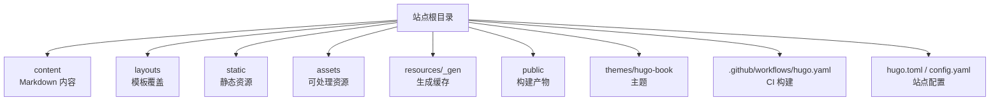
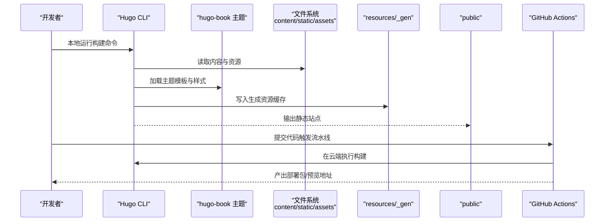
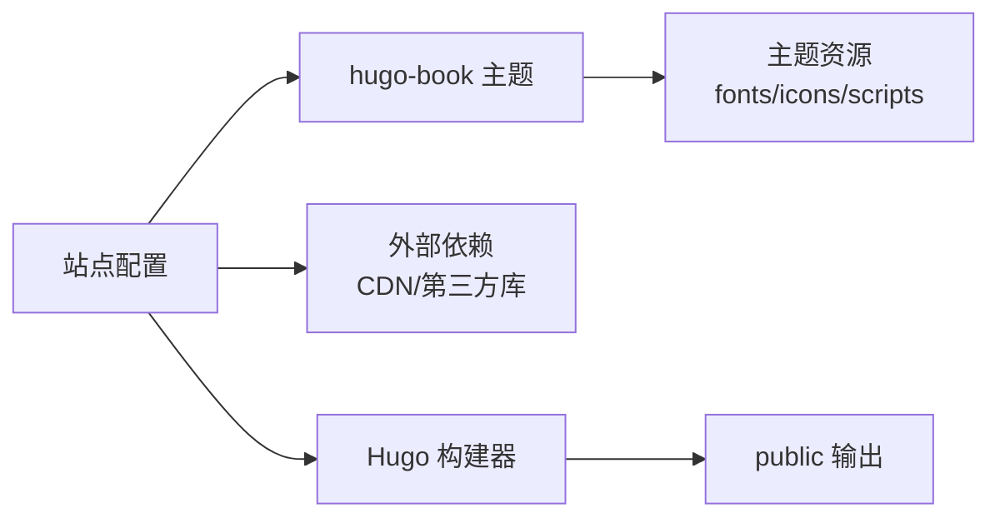

# 故障排除

<cite>
**本文引用的文件**   
- [hugo.toml](file://hugo.toml)
- [config.yaml](file://config.yaml)
- [.github/workflows/hugo.yaml](file://.github/workflows/hugo.yaml)
- [README.md](file://README.md)
- [themes/hugo-book/theme.toml](file://themes/hugo-book/theme.toml)
- [themes/hugo-book/README.md](file://themes/hugo-book/README.md)
</cite>

## 目录
1. [简介](#简介)
2. [项目结构](#项目结构)
3. [核心组件](#核心组件)
4. [架构总览](#架构总览)
5. [详细组件分析](#详细组件分析)
6. [依赖分析](#依赖分析)
7. [性能考虑](#性能考虑)
8. [故障排除指南](#故障排除指南)
9. [结论](#结论)
10. [附录](#附录)

## 简介
本指南面向使用 Hugo + hugo-book 主题构建文档站点的开发者与维护者，聚焦于“问题定位—根因分析—修复验证”的闭环。内容覆盖：
- 构建期常见问题（依赖冲突、版本不兼容、权限与路径）
- 主题相关异常（样式渲染、模板错误、资源加载失败）
- 内容相关问题（Markdown 语法、图片引用、链接失效）
- 性能问题（页面加载慢、内存占用高、构建时间长）
- 浏览器兼容性与移动端适配
- 网络问题（CDN、跨域、SSL）
- 调试工具与技巧（Hugo 调试模式、日志分析、CI 日志）
- 问题反馈与社区支持渠道

## 项目结构
本项目采用标准 Hugo 站点布局，并使用 hugo-book 作为主题。关键目录与职责：
- content：站点内容（Markdown 文档、文章等）
- layouts：站点级模板覆盖（可选）
- static：静态资源（字体、图标、第三方库等）
- assets：Hugo Pipes 处理的资源（SCSS、JS 等）
- resources/_gen：Hugo 生成的资源缓存
- public：最终静态输出
- themes/hugo-book：主题源码与示例站点
- .github/workflows/hugo.yaml：GitHub Actions 构建与部署流水线
- hugo.toml / config.yaml：站点配置（二者通常只保留其一）

图表来源
- [hugo.toml:1-200](file://hugo.toml#L1-L200)
- [config.yaml:1-200](file://config.yaml#L1-L200)
- [.github/workflows/hugo.yaml:1-200](file://.github/workflows/hugo.yaml#L1-L200)

章节来源
- [hugo.toml:1-200](file://hugo.toml#L1-L200)
- [config.yaml:1-200](file://config.yaml#L1-L200)
- [.github/workflows/hugo.yaml:1-200](file://.github/workflows/hugo.yaml#L1-L200)

## 核心组件
- Hugo 核心与 CLI：负责解析内容、渲染模板、生成静态站点。
- hugo-book 主题：提供文档站点所需的布局、侧边栏、搜索、暗色模式等能力。
- CI 流水线：在 GitHub Actions 中执行构建与部署，确保一致性。
- 站点配置：通过 hugo.toml 或 config.yaml 控制主题行为、语言、菜单、SEO、构建选项等。

章节来源
- [themes/hugo-book/theme.toml:1-200](file://themes/hugo-book/theme.toml#L1-L200)
- [themes/hugo-book/README.md:1-200](file://themes/hugo-book/README.md#L1-L200)
- [hugo.toml:1-200](file://hugo.toml#L1-L200)
- [config.yaml:1-200](file://config.yaml#L1-L200)

## 架构总览
下图展示了从内容到产物的典型构建流程，以及 CI 的作用。

图表来源
- [.github/workflows/hugo.yaml:1-200](file://.github/workflows/hugo.yaml#L1-L200)
- [hugo.toml:1-200](file://hugo.toml#L1-L200)
- [config.yaml:1-200](file://config.yaml#L1-L200)

## 详细组件分析

### 构建与配置
- 配置文件选择：同时存在 hugo.toml 与 config.yaml 时，需确认实际生效的配置来源，避免重复定义导致冲突。
- 主题配置：通过主题提供的参数项控制外观与功能（如侧边栏、搜索、多语言等）。
- 构建选项：启用/禁用优化、缓存、资源压缩等会影响构建时间与产物体积。

章节来源
- [hugo.toml:1-200](file://hugo.toml#L1-L200)
- [config.yaml:1-200](file://config.yaml#L1-L200)
- [themes/hugo-book/theme.toml:1-200](file://themes/hugo-book/theme.toml#L1-L200)

### 主题与模板
- 主题入口与默认布局由主题管理，站点可通过 layouts 覆盖特定模板。
- 常见异常包括：模板变量未定义、短代码缺失、资源路径不正确等。

章节来源
- [themes/hugo-book/README.md:1-200](file://themes/hugo-book/README.md#L1-L200)
- [themes/hugo-book/theme.toml:1-200](file://themes/hugo-book/theme.toml#L1-L200)

### CI 流水线
- 工作流定义了 Hugo 版本、构建参数与部署步骤。
- 若构建失败，应优先检查工作流日志中的错误堆栈与退出码。

章节来源
- [.github/workflows/hugo.yaml:1-200](file://.github/workflows/hugo.yaml#L1-L200)

## 依赖分析
- 主题依赖：hugo-book 主题及其内置资源（字体、图标、脚本）。
- 外部依赖：可能通过 CDN 引入第三方库（如搜索、数学公式渲染等），需关注版本与可用性。
- 构建依赖：Hugo 版本需与主题要求匹配；Node/Go 环境需满足工作流定义。

图表来源
- [hugo.toml:1-200](file://hugo.toml#L1-L200)
- [config.yaml:1-200](file://config.yaml#L1-L200)
- [themes/hugo-book/theme.toml:1-200](file://themes/hugo-book/theme.toml#L1-L200)

章节来源
- [hugo.toml:1-200](file://hugo.toml#L1-L200)
- [config.yaml:1-200](file://config.yaml#L1-L200)
- [themes/hugo-book/theme.toml:1-200](file://themes/hugo-book/theme.toml#L1-L200)

## 性能考虑
- 构建时间过长：减少不必要的资源处理、关闭开发模式下的冗余输出、清理 resources/_gen 缓存后重试。
- 页面加载缓慢：合并与压缩资源、按需加载脚本、合理使用懒加载与预加载策略。
- 内存占用过高：限制并行构建任务、降低资源缩放尺寸、避免超大图片直接内联。

[本节为通用指导，无需具体文件引用]

## 故障排除指南

### 一、构建期问题
- 依赖冲突与版本不兼容
  - 现象：构建报错提示模块版本不匹配或主题不支持当前 Hugo 版本。
  - 诊断：核对工作流与本地 Hugo 版本是否一致；查看主题 README 的版本要求。
  - 解决：统一 Hugo 版本；升级或降级主题至兼容版本；必要时锁定依赖版本。
  - 参考位置：
    - [hugo.toml:1-200](file://hugo.toml#L1-L200)
    - [config.yaml:1-200](file://config.yaml#L1-L200)
    - [.github/workflows/hugo.yaml:1-200](file://.github/workflows/hugo.yaml#L1-L200)
    - [themes/hugo-book/README.md:1-200](file://themes/hugo-book/README.md#L1-L200)

- 权限问题
  - 现象：无法写入 public 或 resources/_gen 目录。
  - 诊断：检查目录权限与用户上下文；CI 中确认 runner 权限。
  - 解决：修正目录权限；在 CI 中设置正确的环境变量与工作目录。

- 路径与相对引用错误
  - 现象：资源 404、图片不显示、样式未加载。
  - 诊断：检查 baseURL、relativeURLs、资源路径大小写与平台差异。
  - 解决：统一路径风格；避免绝对路径混用；在 Windows 与 Linux 下保持一致性。

章节来源
- [hugo.toml:1-200](file://hugo.toml#L1-L200)
- [config.yaml:1-200](file://config.yaml#L1-L200)
- [.github/workflows/hugo.yaml:1-200](file://.github/workflows/hugo.yaml#L1-L200)

### 二、主题相关问题
- 样式渲染异常
  - 现象：主题样式错乱、暗色模式无效、侧边栏折叠异常。
  - 诊断：检查 SCSS 覆盖是否生效；确认浏览器缓存；查看控制台 CSS 加载状态。
  - 解决：清理浏览器缓存与 Hugo 资源缓存；修正自定义样式优先级；确认主题变量未被覆盖。

- 模板错误
  - 现象：页面空白、部分区块缺失、短代码报错。
  - 诊断：查看 Hugo 构建日志中的模板错误信息；确认模板变量与数据模型。
  - 解决：修正模板语法；补齐必要的数据字段；恢复被误删的模板片段。

- 资源加载失败
  - 现象：字体、图标、脚本 404。
  - 诊断：检查资源路径与 baseURL；确认资源是否在 static 或 assets 正确放置。
  - 解决：修正路径；将资源放入对应目录；重新构建并清理缓存。

章节来源
- [themes/hugo-book/theme.toml:1-200](file://themes/hugo-book/theme.toml#L1-L200)
- [themes/hugo-book/README.md:1-200](file://themes/hugo-book/README.md#L1-L200)

### 三、内容相关问题
- Markdown 语法错误
  - 现象：标题层级错乱、列表嵌套异常、表格渲染失败。
  - 诊断：使用在线校验工具或本地构建查看警告；逐段隔离问题段落。
  - 解决：修正语法；避免混用不同风格的标记；保持前后端一致的渲染期望。

- 图片引用失败
  - 现象：图片不显示、占位符出现。
  - 诊断：检查图片路径、文件名大小写、是否存在；确认 CDN 可达。
  - 解决：修正路径；上传缺失图片；替换为可用镜像源。

- 链接失效
  - 现象：站内链接跳转错误、外链返回 404。
  - 诊断：使用链接检查工具扫描；核对 baseURL 与 relativeURLs 设置。
  - 解决：修正链接；更新失效外链；必要时添加重定向规则。

章节来源
- [hugo.toml:1-200](file://hugo.toml#L1-L200)
- [config.yaml:1-200](file://config.yaml#L1-L200)

### 四、性能问题诊断与优化
- 页面加载缓慢
  - 诊断：使用浏览器性能面板与 Lighthouse 分析首屏与关键资源。
  - 优化：启用资源压缩与缓存；按需加载脚本；减少首屏请求数。
- 内存占用过高
  - 诊断：观察构建过程 CPU/内存峰值；定位大资源与复杂模板。
  - 优化：拆分资源；降低图片分辨率；减少并行任务。
- 构建时间过长
  - 诊断：记录各阶段耗时；识别瓶颈（资源处理、模板渲染）。
  - 优化：清理缓存；减少不必要处理；使用增量构建。

[本节为通用指导，无需具体文件引用]

### 五、浏览器兼容性与移动端适配
- 兼容性
  - 现象：某些浏览器样式异常、交互失效。
  - 诊断：在不同浏览器与版本上复现；查看 Polyfill 与特性检测。
  - 解决：添加必要的兼容层；降级高级特性；提供回退方案。
- 移动端适配
  - 现象：布局错位、触摸交互异常。
  - 诊断：使用设备模拟器与真机测试；检查视口与媒体查询。
  - 解决：调整响应式断点；优化触控区域；避免固定宽度元素。

[本节为通用指导，无需具体文件引用]

### 六、网络问题（CDN、跨域、SSL）
- CDN 配置错误
  - 现象：资源 404、缓存命中异常。
  - 诊断：检查 CDN 域名与路径映射；确认缓存策略。
  - 解决：修正 CDN 配置；刷新缓存；回退至本地资源验证。
- 跨域问题
  - 现象：API 调用失败、脚本加载被阻止。
  - 诊断：查看控制台 CORS 错误；检查服务端响应头。
  - 解决：配置允许的来源与方法；或使用代理转发。
- SSL 证书问题
  - 现象：HTTPS 访问失败、混合内容警告。
  - 诊断：检查证书有效期与链完整性；确认全站 HTTPS。
  - 解决：更新证书；移除 HTTP 资源引用；强制 HTTPS。

[本节为通用指导，无需具体文件引用]

### 七、调试工具与技巧
- 浏览器开发者工具
  - 使用 Network 面板排查资源加载；使用 Console 查看错误；使用 Performance 分析耗时。
- Hugo 调试模式
  - 开启详细日志与构建警告；逐步缩小问题范围。
- 日志分析
  - 本地构建日志与 CI 日志对照；关注错误堆栈与退出码。
- 缓存清理
  - 清理 resources/_gen 与浏览器缓存，避免旧资源干扰。

[本节为通用指导，无需具体文件引用]

### 八、问题反馈与社区支持
- 内部反馈
  - 建立 Issue 模板与 PR 模板，明确复现步骤、环境与期望结果。
- 社区支持
  - 参考主题 README 与官方文档；在合适渠道提问并提供最小可复现仓库。

章节来源
- [README.md:1-200](file://README.md#L1-L200)
- [themes/hugo-book/README.md:1-200](file://themes/hugo-book/README.md#L1-L200)

## 结论
通过系统化的问题定位与修复流程，结合清晰的配置管理与 CI 一致性保障，可以显著降低构建与运行时异常的概率。建议在日常维护中：
- 统一版本与环境，避免漂移
- 规范资源与路径管理，减少平台差异
- 完善日志与监控，快速定位问题
- 持续优化性能与兼容性，提升用户体验

[本节为总结性内容，无需具体文件引用]

## 附录

### 常用命令与操作清单
- 本地构建与预览：使用 Hugo 命令进行构建与本地服务启动
- 清理缓存：删除 resources/_gen 与浏览器缓存
- 检查链接与资源：使用工具扫描 404 与缺失资源
- 性能审计：使用 Lighthouse 与浏览器性能面板

[本节为通用指导，无需具体文件引用]