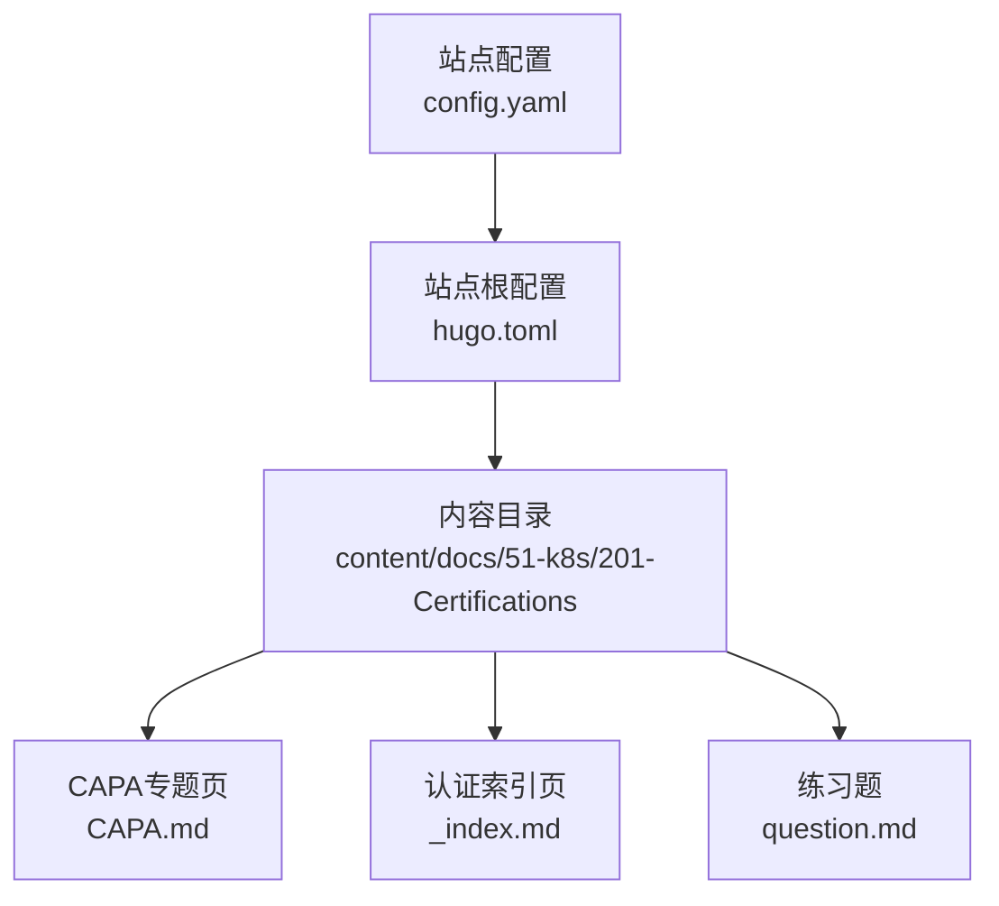
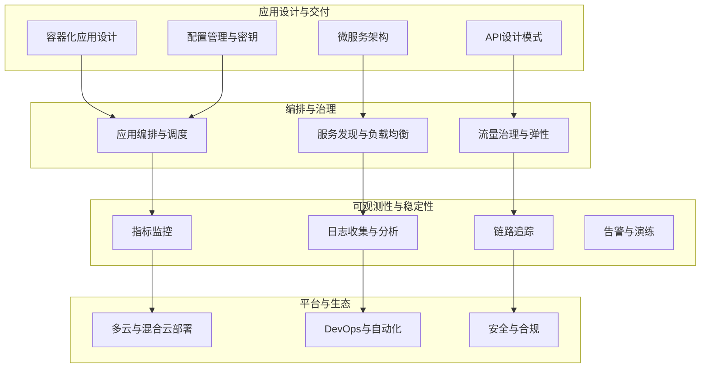
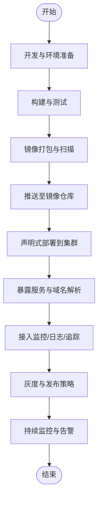
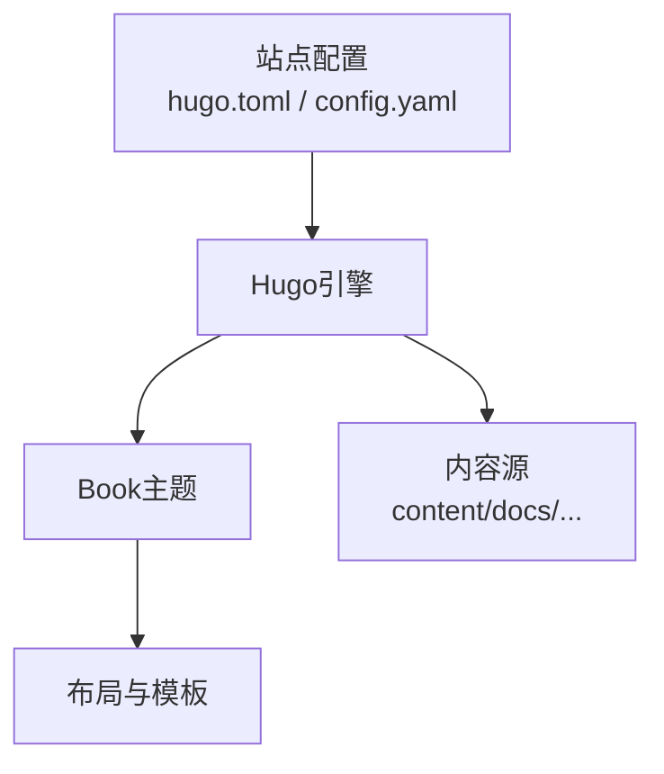

# CAPA应用平台认证学习路径

<cite>
**本文引用的文件**   
- [CAPA.md](file://content/docs/51-k8s/201-Certifications/CAPA.md)
- [_index.md](file://content/docs/51-k8s/201-Certifications/_index.md)
- [question.md](file://content/docs/51-k8s/201-Certifications/question.md)
- [config.yaml](file://config.yaml)
- [hugo.toml](file://hugo.toml)
</cite>

## 目录
1. [简介](#简介)
2. [项目结构](#项目结构)
3. [核心组件](#核心组件)
4. [架构总览](#架构总览)
5. [详细组件分析](#详细组件分析)
6. [依赖分析](#依赖分析)
7. [性能考虑](#性能考虑)
8. [故障排查指南](#故障排查指南)
9. [结论](#结论)
10. [附录](#附录)

## 简介
本学习指南面向准备参加CAPA（Certified Application Platform Associate）应用平台认证的工程师，围绕云原生应用开发与管理的核心能力构建系统化学习路径。内容覆盖容器化应用设计、微服务架构、API设计模式、可观测性实践、应用编排与配置管理、服务发现与负载均衡、监控日志链路追踪集成、性能调优与故障排查、多云与混合云部署策略，以及DevOps与自动化部署最佳实践。同时提供真实项目案例与代码示例的参考路径，帮助读者从开发环境搭建到生产环境部署形成闭环能力。

## 项目结构
仓库采用Hugo静态站点组织文档内容，认证相关学习资料位于“k8s/201-Certifications”目录下，其中包含CAPA专题页面、认证概览索引与练习题等。站点根级配置文件用于主题与多语言设置，便于统一渲染与导航。

图示来源
- [hugo.toml:1-20](file://hugo.toml#L1-L20)
- [config.yaml:1-20](file://config.yaml#L1-L20)
- [CAPA.md:1-20](file://content/docs/51-k8s/201-Certifications/CAPA.md#L1-L20)
- [_index.md:1-20](file://content/docs/51-k8s/201-Certifications/_index.md#L1-L20)
- [question.md:1-20](file://content/docs/51-k8s/201-Certifications/question.md#L1-L20)

章节来源
- [hugo.toml:1-20](file://hugo.toml#L1-L20)
- [config.yaml:1-20](file://config.yaml#L1-L20)
- [CAPA.md:1-20](file://content/docs/51-k8s/201-Certifications/CAPA.md#L1-L20)
- [_index.md:1-20](file://content/docs/51-k8s/201-Certifications/_index.md#L1-L20)
- [question.md:1-20](file://content/docs/51-k8s/201-Certifications/question.md#L1-L20)

## 核心组件
- CAPA专题页：聚焦CAPA认证的学习目标、知识域划分、备考建议与实践清单，作为学习路径的主入口。
- 认证索引页：汇总各认证（如CKA、CKS、CCA等）的导航与关联资源，便于横向对比与进阶规划。
- 练习题：提供典型题型与解题思路，辅助巩固关键概念与实操要点。

章节来源
- [CAPA.md:1-20](file://content/docs/51-k8s/201-Certifications/CAPA.md#L1-L20)
- [_index.md:1-20](file://content/docs/51-k8s/201-Certifications/_index.md#L1-L20)
- [question.md:1-20](file://content/docs/51-k8s/201-Certifications/question.md#L1-L20)

## 架构总览
下图展示CAPA学习路径的知识域与能力模型，强调从应用设计到运维保障的全链路能力。

[此图为概念性架构图，不直接映射具体源码文件]

## 详细组件分析

### CAPA学习路径与知识域
- 学习目标：掌握云原生应用全生命周期管理能力，包括设计、交付、运行与优化。
- 知识域：
  - 容器化与镜像工程：镜像分层、最小化镜像、安全扫描与签名。
  - 微服务与API：领域建模、接口契约、版本兼容与降级策略。
  - 配置与密钥：外部化配置、动态更新、敏感信息管理。
  - 编排与调度：工作负载定义、扩缩容策略、亲和与反亲和、拓扑分布。
  - 服务网格与流量治理：路由、熔断、重试、超时与灰度发布。
  - 可观测性：指标采集、日志聚合、分布式追踪与告警联动。
  - 平台与生态：多云/混合云策略、GitOps流水线、安全基线与合规检查。
- 实战清单：
  - 在本地或集群中完成一次端到端交付：编码→构建镜像→推送仓库→声明式部署→暴露服务→接入监控与日志→灰度发布→回滚演练。
  - 通过练习题检验对关键概念的理解与排错能力。

章节来源
- [CAPA.md:1-20](file://content/docs/51-k8s/201-Certifications/CAPA.md#L1-L20)
- [question.md:1-20](file://content/docs/51-k8s/201-Certifications/question.md#L1-L20)

### 认证导航与进阶路线
- 横向对比：将CAPA与其他认证（如CKA、CKS、CCA等）进行能力矩阵对照，明确差异与互补点。
- 进阶建议：以CAPA为起点，逐步深入系统管理员与安全专家方向，结合企业场景选择专项认证。

章节来源
- [_index.md:1-20](file://content/docs/51-k8s/201-Certifications/_index.md#L1-L20)

### 练习题与解题方法
- 题型分类：概念辨析、命令操作、排错定位、方案设计。
- 解题步骤：
  - 审题定位：识别问题边界与约束条件。
  - 假设验证：基于日志、指标与事件快速缩小范围。
  - 方案实施：使用声明式配置与最小权限原则落地修复。
  - 回归验证：观察指标恢复与业务可用性确认。

章节来源
- [question.md:1-20](file://content/docs/51-k8s/201-Certifications/question.md#L1-L20)

### 概念总览
以下流程图展示从开发到生产的典型交付与运行流程，帮助建立全局视角。

[此图为概念性流程图，不直接映射具体源码文件]

## 依赖分析
站点由Hugo驱动，主题与多语言配置位于根级配置文件；内容按主题分目录组织，便于扩展与维护。

图示来源
- [hugo.toml:1-20](file://hugo.toml#L1-L20)
- [config.yaml:1-20](file://config.yaml#L1-L20)

章节来源
- [hugo.toml:1-20](file://hugo.toml#L1-L20)
- [config.yaml:1-20](file://config.yaml#L1-L20)

## 性能考虑
- 镜像体积与启动时间：精简基础镜像、减少层数、按需安装依赖。
- 资源配额与限制：合理设置CPU/内存请求与上限，避免抖动与抢占。
- 扩缩容策略：基于指标与队列长度自动伸缩，关注冷启动成本。
- 网络与I/O：优化连接复用、缓存命中率与磁盘I/O路径。
- 可观测性开销：采样率控制、日志分级与异步写入，降低运行时影响。

[本节为通用指导，无需特定文件引用]

## 故障排查指南
- 常见问题定位：
  - 启动失败：检查镜像可达性、环境变量与挂载卷权限。
  - 服务不可用：核对端口暴露、网络策略与服务发现一致性。
  - 性能退化：观察CPU/内存/网络指标，定位热点与瓶颈。
  - 日志缺失：确认日志采集器状态与输出格式规范。
  - 链路异常：检查追踪ID透传与跨服务调用链完整性。
- 排障工具与方法：
  - 事件与描述信息：查看工作负载事件与资源描述。
  - 指标与日志：结合Prometheus与日志系统进行关联分析。
  - 追踪与快照：利用分布式追踪与快照回放定位根因。
  - 变更回溯：基于GitOps记录与制品版本快速回滚。

章节来源
- [question.md:1-20](file://content/docs/51-k8s/201-Certifications/question.md#L1-L20)

## 结论
CAPA认证强调“以应用为中心”的云原生能力体系。通过本学习路径，读者可以系统掌握从应用设计、交付到运行保障的关键技能，并在多云与混合云环境中实现稳定、高效与安全的交付与运维。建议结合练习题与实战清单，逐步构建个人知识库与排障手册，持续提升工程化水平。

[本节为总结性内容，无需特定文件引用]

## 附录
- 推荐实践清单：
  - 使用声明式配置管理应用与平台资源。
  - 建立统一的镜像命名与版本策略。
  - 将安全扫描纳入CI流水线并阻断高危风险。
  - 制定灰度发布与回滚预案并定期演练。
  - 完善可观测性三支柱（指标、日志、追踪）与告警规则。
- 参考路径：
  - CAPA专题页：[CAPA.md](file://content/docs/51-k8s/201-Certifications/CAPA.md)
  - 认证索引与导航：[_index.md](file://content/docs/51-k8s/201-Certifications/_index.md)
  - 练习题与思路：[question.md](file://content/docs/51-k8s/201-Certifications/question.md)