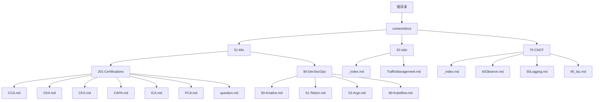
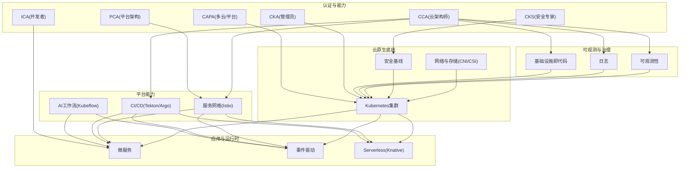
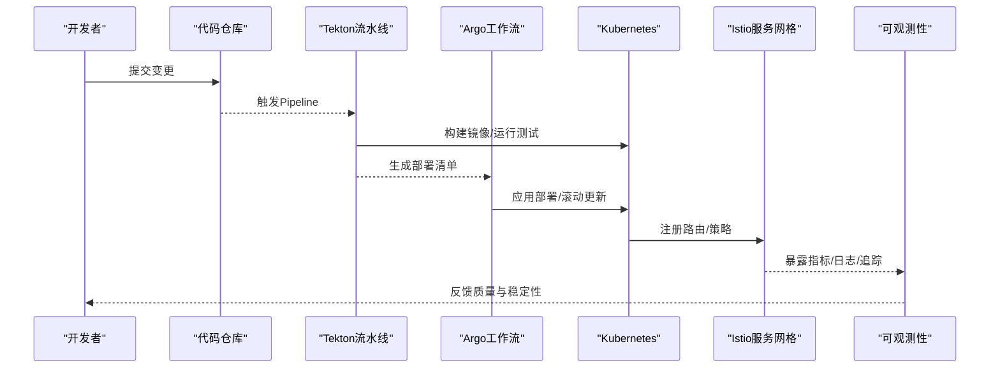
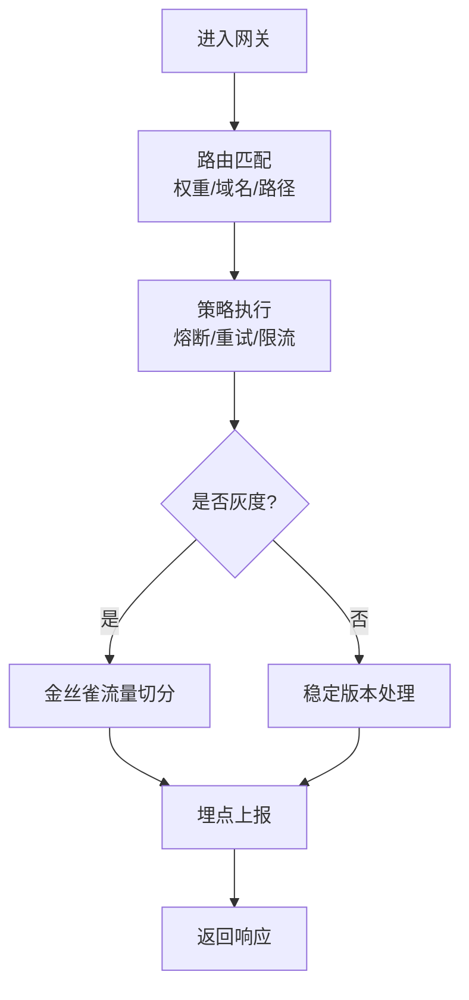
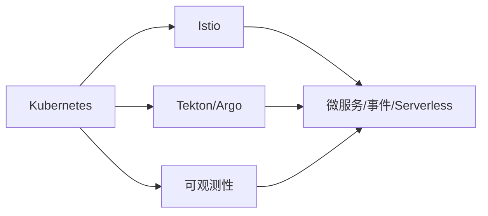

# CCA云架构师认证学习路径

<cite>
**本文引用的文件**   
- [README.md](file://README.md)
- [config.yaml](file://config.yaml)
- [hugo.toml](file://hugo.toml)
- [content/docs/51-k8s/201-Certifications/_index.md](file://content/docs/51-k8s/201-Certifications/_index.md)
- [content/docs/51-k8s/201-Certifications/CCA.md](file://content/docs/51-k8s/201-Certifications/CCA.md)
- [content/docs/51-k8s/201-Certifications/CKA.md](file://content/docs/51-k8s/201-Certifications/CKA.md)
- [content/docs/51-k8s/201-Certifications/CKS.md](file://content/docs/51-k8s/201-Certifications/CKS.md)
- [content/docs/51-k8s/201-Certifications/CAPA.md](file://content/docs/51-k8s/201-Certifications/CAPA.md)
- [content/docs/51-k8s/201-Certifications/ICA.md](file://content/docs/51-k8s/201-Certifications/ICA.md)
- [content/docs/51-k8s/201-Certifications/PCA.md](file://content/docs/51-k8s/201-Certifications/PCA.md)
- [content/docs/51-k8s/201-Certifications/question.md](file://content/docs/51-k8s/201-Certifications/question.md)
- [content/docs/51-k8s/_index.md](file://content/docs/51-k8s/_index.md)
- [content/docs/51-k8s/90-DevSecOps/_index.md](file://content/docs/51-k8s/90-DevSecOps/_index.md)
- [content/docs/51-k8s/90-DevSecOps/50-Knative.md](file://content/docs/51-k8s/90-DevSecOps/50-Knative.md)
- [content/docs/51-k8s/90-DevSecOps/51-Tekton.md](file://content/docs/51-k8s/90-DevSecOps/51-Tekton.md)
- [content/docs/51-k8s/90-DevSecOps/52-Argo.md](file://content/docs/51-k8s/90-DevSecOps/52-Argo.md)
- [content/docs/51-k8s/90-DevSecOps/80-Kubeflow.md](file://content/docs/51-k8s/90-DevSecOps/80-Kubeflow.md)
- [content/docs/52-istio/_index.md](file://content/docs/52-istio/_index.md)
- [content/docs/52-istio/TrafficManagement.md](file://content/docs/52-istio/TrafficManagement.md)
- [content/docs/70-CNCF/_index.md](file://content/docs/70-CNCF/_index.md)
- [content/docs/70-CNCF/40Observe.md](file://content/docs/70-CNCF/40Observe.md)
- [content/docs/70-CNCF/50Logging.md](file://content/docs/70-CNCF/50Logging.md)
- [content/docs/70-CNCF/90_Iac.md](file://content/docs/70-CNCF/90_Iac.md)
</cite>

## 目录
1. [引言](#引言)
2. [项目结构](#项目结构)
3. [核心组件](#核心组件)
4. [架构总览](#架构总览)
5. [详细组件分析](#详细组件分析)
6. [依赖关系分析](#依赖关系分析)
7. [性能与可靠性考量](#性能与可靠性考量)
8. [故障排查指南](#故障排查指南)
9. [结论](#结论)
10. [附录](#附录)

## 引言
本学习指南面向希望获得CCA（Cloud Native Architect）云架构师能力认证的工程师与架构师，围绕云原生架构设计的核心原则与最佳实践展开，覆盖微服务、事件驱动、Serverless等主流设计模式；提供企业级解决方案的方法论，包括技术选型、架构评估与风险管控；深入讲解分布式系统设计、数据一致性、容错机制；阐述可扩展性、可靠性与安全性的设计原则；并给出多租户与SaaS化改造的实践经验、架构演进与技术债务管理策略，以及架构评审与质量保证流程。同时结合大型企业的云原生转型案例与演进路径，帮助读者构建系统化的知识体系与实战能力。

## 项目结构
仓库采用Hugo静态站点组织内容，文档以Markdown形式按主题分层存放，便于导航与检索。关键目录说明：
- content/docs：所有教程与专题文档，按领域划分（如k8s、istio、CNCF等）。
- content/docs/51-k8s：Kubernetes生态相关文档，包含认证、代码解析、安全、安装等子模块。
- content/docs/51-k8s/201-Certifications：各类认证资料汇总，含CCA、CKA、CKS、CAPA、ICA、PCA及题库参考。
- content/docs/52-istio：服务网格与流量治理相关内容。
- content/docs/70-CNCF：可观测性、日志、基础设施即代码等通用能力文档。
- config.yaml/hugo.toml：站点配置与主题设置。

图表来源
- [content/docs/51-k8s/201-Certifications/_index.md](file://content/docs/51-k8s/201-Certifications/_index.md)
- [content/docs/51-k8s/90-DevSecOps/_index.md](file://content/docs/51-k8s/90-DevSecOps/_index.md)
- [content/docs/52-istio/_index.md](file://content/docs/52-istio/_index.md)
- [content/docs/70-CNCF/_index.md](file://content/docs/70-CNCF/_index.md)

章节来源
- [README.md](file://README.md)
- [config.yaml](file://config.yaml)
- [hugo.toml](file://hugo.toml)
- [content/docs/51-k8s/_index.md](file://content/docs/51-k8s/_index.md)

## 核心组件
- 认证学习矩阵：涵盖CCA、CKA、CKS、CAPA、ICA、PCA等，形成从容器编排到安全、多云与平台工程的能力图谱。
- DevSecOps流水线：基于Knative、Tekton、Argo、Kubeflow等工具链，支撑持续集成、持续交付与AI工作流。
- 服务网格与流量治理：通过Istio实现细粒度流量控制、可观测性与安全策略。
- CNCF通用能力：可观测性、日志采集与基础设施即代码，为云原生平台提供基础支撑。

章节来源
- [content/docs/51-k8s/201-Certifications/_index.md](file://content/docs/51-k8s/201-Certifications/_index.md)
- [content/docs/51-k8s/90-DevSecOps/_index.md](file://content/docs/51-k8s/90-DevSecOps/_index.md)
- [content/docs/52-istio/_index.md](file://content/docs/52-istio/_index.md)
- [content/docs/70-CNCF/_index.md](file://content/docs/70-CNCF/_index.md)

## 架构总览
下图展示CCA学习路径在知识域上的整体架构：以Kubernetes为核心底座，向上延伸至服务网格、CI/CD与AI工作流，横向贯穿可观测性、日志与IaC能力，最终汇聚于认证与实战演练。

图表来源
- [content/docs/51-k8s/201-Certifications/_index.md](file://content/docs/51-k8s/201-Certifications/_index.md)
- [content/docs/51-k8s/90-DevSecOps/50-Knative.md](file://content/docs/51-k8s/90-DevSecOps/50-Knative.md)
- [content/docs/51-k8s/90-DevSecOps/51-Tekton.md](file://content/docs/51-k8s/90-DevSecOps/51-Tekton.md)
- [content/docs/51-k8s/90-DevSecOps/52-Argo.md](file://content/docs/51-k8s/90-DevSecOps/52-Argo.md)
- [content/docs/51-k8s/90-DevSecOps/80-Kubeflow.md](file://content/docs/51-k8s/90-DevSecOps/80-Kubeflow.md)
- [content/docs/52-istio/TrafficManagement.md](file://content/docs/52-istio/TrafficManagement.md)
- [content/docs/70-CNCF/40Observe.md](file://content/docs/70-CNCF/40Observe.md)
- [content/docs/70-CNCF/50Logging.md](file://content/docs/70-CNCF/50Logging.md)
- [content/docs/70-CNCF/90_Iac.md](file://content/docs/70-CNCF/90_Iac.md)

## 详细组件分析

### CCA认证学习路径与知识地图
- 目标定位：培养具备企业级云原生架构设计与治理能力的高级人才，强调方法论、权衡取舍与落地实践。
- 知识域：
  - 架构模式：微服务、事件驱动、Serverless。
  - 平台能力：Kubernetes、服务网格、CI/CD、可观测性、IaC。
  - 安全与合规：零信任、最小权限、供应链安全。
  - 数据与一致性：分布式事务、幂等、补偿、最终一致。
  - 多租户与SaaS：隔离、配额、计费、灰度发布。
  - 演进与治理：架构评审、质量门禁、技术债管理。
- 学习建议：以“问题驱动”为主线，结合真实业务场景进行方案设计与复盘。

章节来源
- [content/docs/51-k8s/201-Certifications/CCA.md](file://content/docs/51-k8s/201-Certifications/CCA.md)

### 认证矩阵与能力对照
- CKA：聚焦Kubernetes集群运维与排障，强调命令实操与故障定位。
- CKS：聚焦安全加固、镜像与供应链安全、运行时防护。
- CAPA/ICA/PCA：分别对应多云/平台工程、开发者体验与平台架构能力。
- 建议路径：先掌握CKA/CKS基础，再向CCA/PCA进阶，结合CAPA拓展多云与平台工程能力。

章节来源
- [content/docs/51-k8s/201-Certifications/CKA.md](file://content/docs/51-k8s/201-Certifications/CKA.md)
- [content/docs/51-k8s/201-Certifications/CKS.md](file://content/docs/51-k8s/201-Certifications/CKS.md)
- [content/docs/51-k8s/201-Certifications/CAPA.md](file://content/docs/51-k8s/201-Certifications/CAPA.md)
- [content/docs/51-k8s/201-Certifications/ICA.md](file://content/docs/51-k8s/201-Certifications/ICA.md)
- [content/docs/51-k8s/201-Certifications/PCA.md](file://content/docs/51-k8s/201-Certifications/PCA.md)

### 题库与实战演练
- 题型与范围：覆盖集群管理、网络、存储、调度、安全、可观测性等。
- 练习方法：以题带点，建立错题本与知识点索引，结合实验环境复现与验证。
- 建议：将题目映射到实际生产问题，提升迁移能力。

章节来源
- [content/docs/51-k8s/201-Certifications/question.md](file://content/docs/51-k8s/201-Certifications/question.md)

### DevSecOps与自动化流水线
- Knative：无服务器运行时，支持弹性伸缩与按需计费。
- Tekton：声明式CI/CD流水线，适合复杂编排与跨环境交付。
- Argo：工作流与GitOps，统一应用生命周期管理。
- Kubeflow：端到端机器学习流水线，覆盖数据准备、训练、部署与监控。

图表来源
- [content/docs/51-k8s/90-DevSecOps/50-Knative.md](file://content/docs/51-k8s/90-DevSecOps/50-Knative.md)
- [content/docs/51-k8s/90-DevSecOps/51-Tekton.md](file://content/docs/51-k8s/90-DevSecOps/51-Tekton.md)
- [content/docs/51-k8s/90-DevSecOps/52-Argo.md](file://content/docs/51-k8s/90-DevSecOps/52-Argo.md)
- [content/docs/51-k8s/90-DevSecOps/80-Kubeflow.md](file://content/docs/51-k8s/90-DevSecOps/80-Kubeflow.md)
- [content/docs/52-istio/TrafficManagement.md](file://content/docs/52-istio/TrafficManagement.md)
- [content/docs/70-CNCF/40Observe.md](file://content/docs/70-CNCF/40Observe.md)

### 服务网格与流量治理
- 流量模型：请求路由、熔断、重试、超时、限流、灰度与金丝雀发布。
- 安全模型：mTLS、访问控制、策略审计。
- 可观测性：接入链路追踪、指标与日志聚合。

图表来源
- [content/docs/52-istio/TrafficManagement.md](file://content/docs/52-istio/TrafficManagement.md)

### 可观测性与日志
- 指标：Prometheus生态，定义SLO/SLI，告警规则与阈值。
- 日志：集中采集、结构化输出、检索与关联。
- 追踪：端到端调用链，定位瓶颈与异常。

章节来源
- [content/docs/70-CNCF/40Observe.md](file://content/docs/70-CNCF/40Observe.md)
- [content/docs/70-CNCF/50Logging.md](file://content/docs/70-CNCF/50Logging.md)

### 基础设施即代码（IaC）
- 理念：声明式配置、版本化管理、可重复部署。
- 实践：资源模板化、参数化与环境隔离、变更评审与回滚。

章节来源
- [content/docs/70-CNCF/90_Iac.md](file://content/docs/70-CNCF/90_Iac.md)

## 依赖关系分析
- 组件耦合：
  - Kubernetes作为核心底座，被服务网格、CI/CD、可观测性广泛依赖。
  - Istio对应用层透明注入，增强流量治理与安全。
  - Tekton/Argo协同完成从代码到运行的全链路自动化。
- 外部依赖：
  - 云厂商API、对象存储、消息队列、数据库等。
- 潜在风险：
  - 过度耦合导致升级困难；需通过抽象与接口契约降低耦合。
  - 第三方组件版本漂移，需引入依赖锁定与回归测试。

图表来源
- [content/docs/51-k8s/201-Certifications/_index.md](file://content/docs/51-k8s/201-Certifications/_index.md)
- [content/docs/52-istio/TrafficManagement.md](file://content/docs/52-istio/TrafficManagement.md)
- [content/docs/70-CNCF/40Observe.md](file://content/docs/70-CNCF/40Observe.md)

## 性能与可靠性考量
- 可扩展性：水平扩展优先，结合HPA/VPA与弹性运行时（Knative）应对峰值。
- 可靠性：多副本、健康检查、优雅退出、故障转移与自愈。
- 一致性：根据业务容忍度选择强一致或最终一致，配合幂等与补偿。
- 容量规划：压测与基准测试，容量水位与扩容阈值管理。
- 成本优化：资源配额、闲置回收、冷热分层与按需实例。

[本节为通用指导，不直接分析具体文件]

## 故障排查指南
- 常见问题：
  - 启动失败：镜像拉取、资源不足、配置错误。
  - 网络不通：CNI插件、Service/Ingress、DNS解析。
  - 性能退化：CPU/内存争用、磁盘IO、网络拥塞。
  - 安全告警：证书过期、RBAC拒绝、镜像漏洞。
- 排查步骤：
  - 收集指标与日志，定位时间窗口与影响面。
  - 使用服务网格与追踪工具还原调用链。
  - 逐步缩小范围，隔离变更与复现问题。
  - 制定修复方案与回滚预案，验证后上线。

章节来源
- [content/docs/51-k8s/201-Certifications/question.md](file://content/docs/51-k8s/201-Certifications/question.md)
- [content/docs/70-CNCF/40Observe.md](file://content/docs/70-CNCF/40Observe.md)
- [content/docs/70-CNCF/50Logging.md](file://content/docs/70-CNCF/50Logging.md)

## 结论
CCA学习路径强调“以业务为中心、以平台为基石、以治理为保障”。通过系统化掌握微服务、事件驱动与Serverless等模式，结合Kubernetes、服务网格、CI/CD与可观测性等平台能力，辅以严格的安全与合规要求，能够构建高可用、可扩展、易治理的云原生架构。建议在实战中沉淀方法论与资产，持续优化架构与技术债，推动企业云原生转型稳步前行。

[本节为总结性内容，不直接分析具体文件]

## 附录
- 推荐学习顺序：
  - 基础：Kubernetes与容器生态（CKA/CKS）。
  - 进阶：服务网格与流量治理（Istio）、CI/CD与GitOps（Tekton/Argo）。
  - 专项：可观测性、日志与IaC。
  - 综合：CCA/PCA/CAPA，结合企业场景进行架构设计与评审。
- 实战建议：
  - 搭建实验环境，模拟生产拓扑与故障注入。
  - 建立度量与看板，跟踪SLO达成与改进闭环。
  - 定期开展架构评审与复盘，完善规范与模板。

[本节为补充信息，不直接分析具体文件]