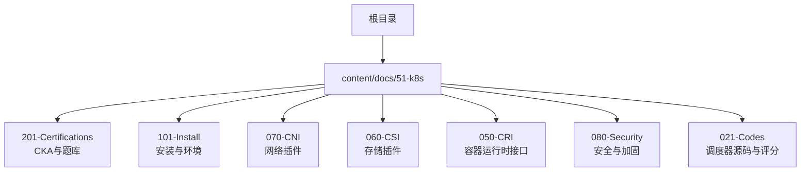
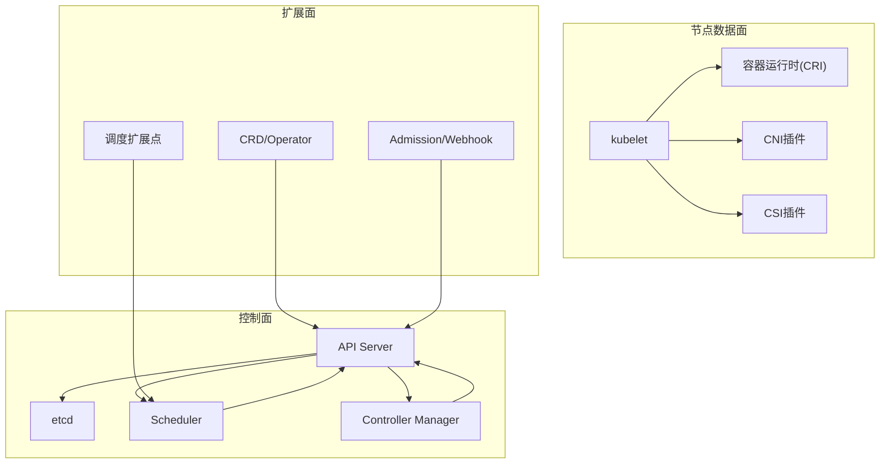
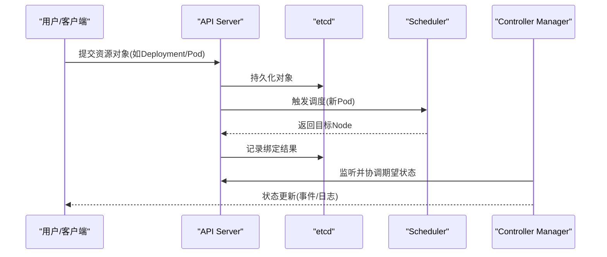
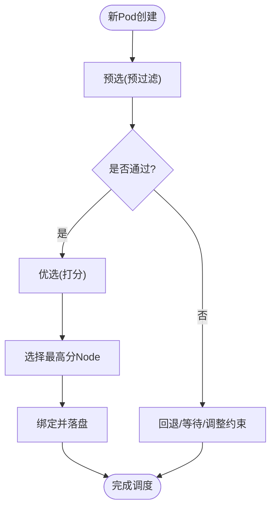
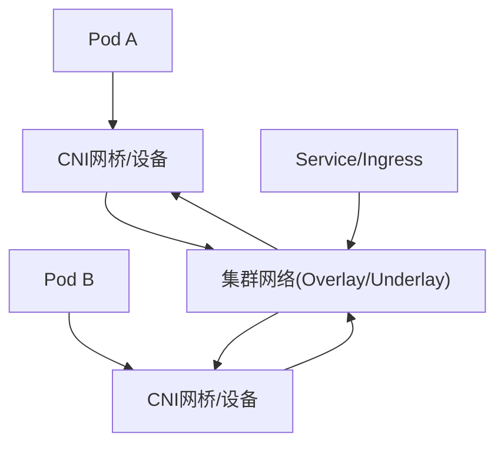
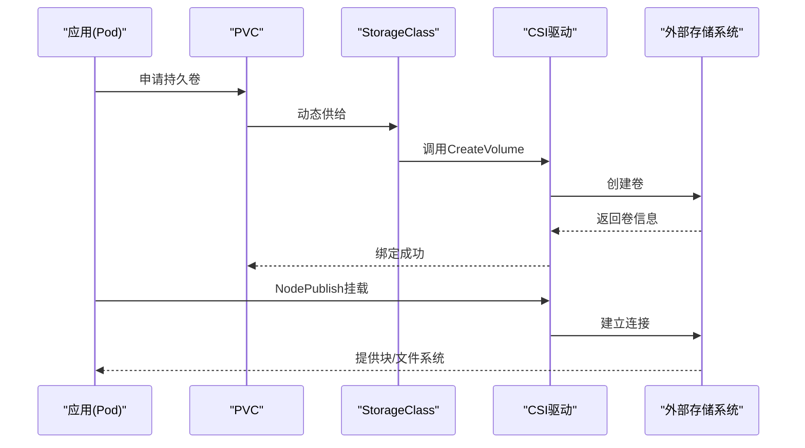
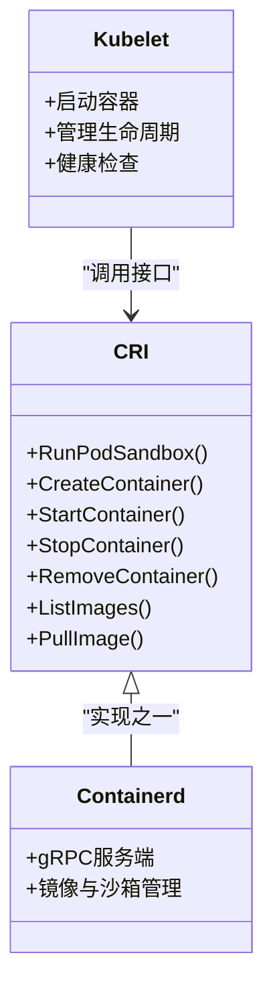
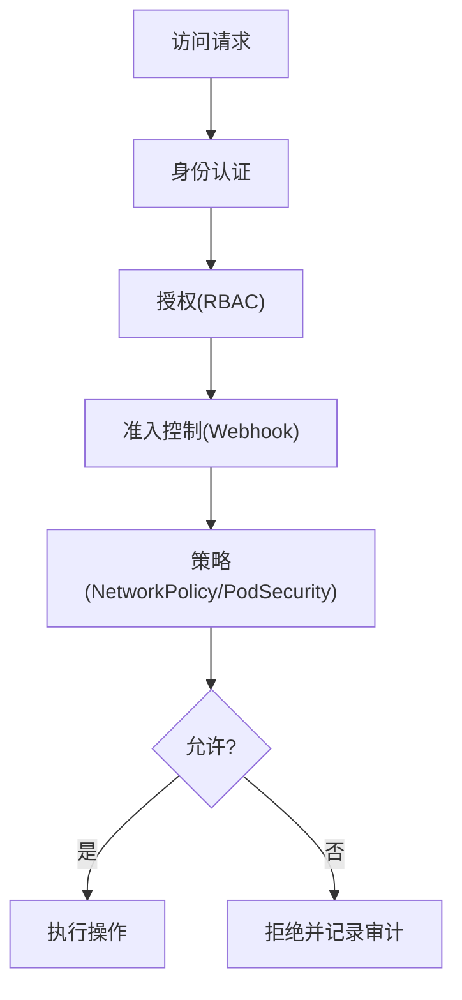
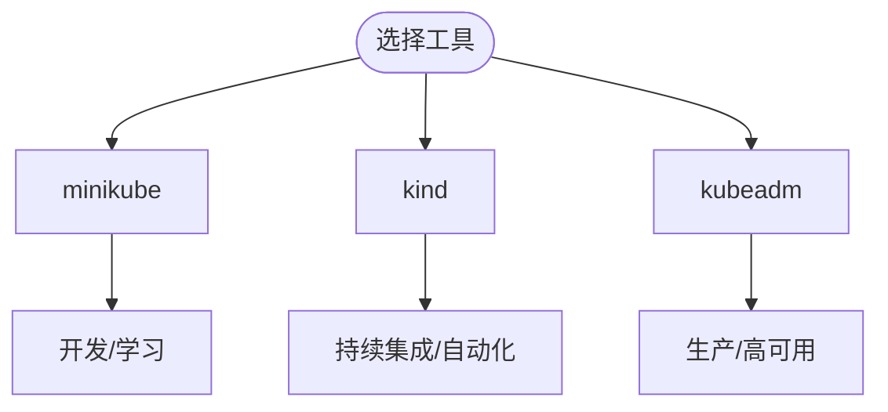
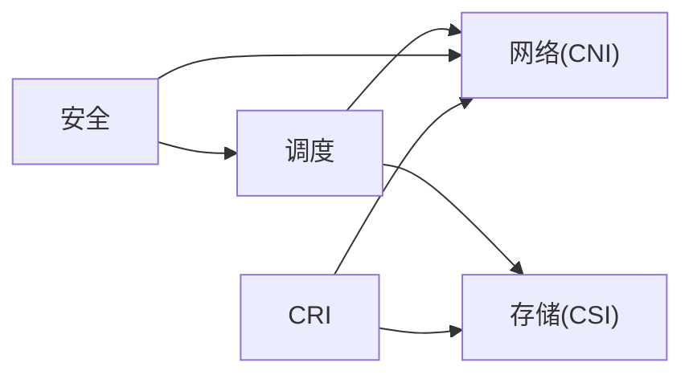

# CKA认证学习路径

<cite>
**本文引用的文件**   
- [content/docs/51-k8s/201-Certifications/CKA.md](file://content/docs/51-k8s/201-Certifications/CKA.md)
- [content/docs/51-k8s/201-Certifications/question.md](file://content/docs/51-k8s/201-Certifications/question.md)
- [content/docs/51-k8s/101-Install.md](file://content/docs/51-k8s/101-Install.md)
- [content/docs/51-k8s/070-CNI.md](file://content/docs/51-k8s/070-CNI.md)
- [content/docs/51-k8s/060-CSI.md](file://content/docs/51-k8s/060-CSI.md)
- [content/docs/51-k8s/050-CRI.md](file://content/docs/51-k8s/050-CRI.md)
- [content/docs/51-k8s/080-Security.md](file://content/docs/51-k8s/080-Security.md)
- [content/docs/51-k8s/021-Codes/_index.md](file://content/docs/51-k8s/021-Codes/_index.md)
- [content/docs/51-k8s/021-Codes/10-Scheduler.md](file://content/docs/51-k8s/021-Codes/10-Scheduler.md)
- [content/docs/51-k8s/021-Codes/11-Score.md](file://content/docs/51-k8s/021-Codes/11-Score.md)
- [content/docs/51-k8s/021-Codes/19-Descheduler.md](file://content/docs/51-k8s/021-Codes/19-Descheduler.md)
</cite>

## 目录
1. [简介](#简介)
2. [项目结构](#项目结构)
3. [核心组件](#核心组件)
4. [架构总览](#架构总览)
5. [详细组件分析](#详细组件分析)
6. [依赖关系分析](#依赖关系分析)
7. [性能考虑](#性能考虑)
8. [故障排查指南](#故障排查指南)
9. [结论](#结论)
10. [附录](#附录)

## 简介
本指南面向准备参加Certified Kubernetes Administrator（CKA）认证的读者，围绕官方考试大纲的六大领域：集群架构、工作负载与调度、服务与网络、存储、故障排查、安全与加固，提供系统化学习计划、实验环境搭建方法、实践练习与命令速查、考试题型与答题策略、模拟环境与资源推荐，以及将CKA能力迁移到企业级运维的最佳实践。内容基于仓库中Kubernetes相关文档进行整合与结构化呈现，帮助读者从基础到实战逐步掌握CKA所需技能。

## 项目结构
仓库采用Hugo静态站点组织内容，CKA相关内容位于“51-k8s”主题下，其中“201-Certifications”包含CKA专题与题库，“101-Install”提供安装与环境搭建参考，“070/060/050/080”分别覆盖CNI、CSI、CRI与安全等关键子域；“021-Codes”聚焦调度器源码与评分机制，有助于深入理解调度行为。

**图表来源**
- [content/docs/51-k8s/201-Certifications/CKA.md](file://content/docs/51-k8s/201-Certifications/CKA.md)
- [content/docs/51-k8s/101-Install.md](file://content/docs/51-k8s/101-Install.md)
- [content/docs/51-k8s/070-CNI.md](file://content/docs/51-k8s/070-CNI.md)
- [content/docs/51-k8s/060-CSI.md](file://content/docs/51-k8s/060-CSI.md)
- [content/docs/51-k8s/050-CRI.md](file://content/docs/51-k8s/050-CRI.md)
- [content/docs/51-k8s/080-Security.md](file://content/docs/51-k8s/080-Security.md)
- [content/docs/51-k8s/021-Codes/_index.md](file://content/docs/51-k8s/021-Codes/_index.md)

**章节来源**
- [content/docs/51-k8s/201-Certifications/CKA.md](file://content/docs/51-k8s/201-Certifications/CKA.md)
- [content/docs/51-k8s/101-Install.md](file://content/docs/51-k8s/101-Install.md)
- [content/docs/51-k8s/070-CNI.md](file://content/docs/51-k8s/070-CNI.md)
- [content/docs/51-k8s/060-CSI.md](file://content/docs/51-k8s/060-CSI.md)
- [content/docs/51-k8s/050-CRI.md](file://content/docs/51-k8s/050-CRI.md)
- [content/docs/51-k8s/080-Security.md](file://content/docs/51-k8s/080-Security.md)
- [content/docs/51-k8s/021-Codes/_index.md](file://content/docs/51-k8s/021-Codes/_index.md)

## 核心组件
- CKA考试大纲与要点：涵盖集群架构、工作负载与调度、服务与网络、存储、故障排查、安全等核心领域，强调实操能力与排障思维。
- 题库与模拟题：提供典型题目与解题思路，帮助熟悉题型与时间分配。
- 安装与环境：minikube/kind/kubeadm三种常见方式，便于快速构建本地或CI环境。
- 网络与存储：CNI与CSI生态，涉及Pod通信、Service/Ingress、持久卷与动态供给。
- 容器运行时：CRI接口与运行时选择对性能与兼容性影响显著。
- 安全与加固：RBAC、NetworkPolicy、PodSecurity、Secret/ConfigMap、证书与审计。
- 调度器与评分：深入理解预选/优选、Score机制与自定义扩展点，提升复杂场景下的调度调优能力。

**章节来源**
- [content/docs/51-k8s/201-Certifications/CKA.md](file://content/docs/51-k8s/201-Certifications/CKA.md)
- [content/docs/51-k8s/201-Certifications/question.md](file://content/docs/51-k8s/201-Certifications/question.md)
- [content/docs/51-k8s/101-Install.md](file://content/docs/51-k8s/101-Install.md)
- [content/docs/51-k8s/070-CNI.md](file://content/docs/51-k8s/070-CNI.md)
- [content/docs/51-k8s/060-CSI.md](file://content/docs/51-k8s/060-CSI.md)
- [content/docs/51-k8s/050-CRI.md](file://content/docs/51-k8s/050-CRI.md)
- [content/docs/51-k8s/080-Security.md](file://content/docs/51-k8s/080-Security.md)
- [content/docs/51-k8s/021-Codes/10-Scheduler.md](file://content/docs/51-k8s/021-Codes/10-Scheduler.md)
- [content/docs/51-k8s/021-Codes/11-Score.md](file://content/docs/51-k8s/021-Codes/11-Score.md)

## 架构总览
CKA知识体系可映射为“控制面—数据面—扩展面”三层架构：
- 控制面：API Server、etcd、Scheduler、Controller Manager，负责声明式状态管理与决策。
- 数据面：Node上的kubelet、容器运行时、CNI、CSI，负责工作负载执行与资源编排。
- 扩展面：CRD/Operator、Webhook、Admission Controller、Scheduler扩展点，用于定制业务逻辑。

**图表来源**
- [content/docs/51-k8s/050-CRI.md](file://content/docs/51-k8s/050-CRI.md)
- [content/docs/51-k8s/070-CNI.md](file://content/docs/51-k8s/070-CNI.md)
- [content/docs/51-k8s/060-CSI.md](file://content/docs/51-k8s/060-CSI.md)
- [content/docs/51-k8s/080-Security.md](file://content/docs/51-k8s/080-Security.md)
- [content/docs/51-k8s/021-Codes/10-Scheduler.md](file://content/docs/51-k8s/021-Codes/10-Scheduler.md)

## 详细组件分析

### 集群架构与控制面组件
- API Server：统一入口，鉴权、授权、准入校验、版本兼容与聚合API。
- etcd：高可用KV存储，关注备份恢复、快照、一致性、容量规划。
- Scheduler：预选/优选流程、Score机制、扩展点与自定义策略。
- Controller Manager：各类控制器协同，保障期望状态与实际状态一致。

**图表来源**
- [content/docs/51-k8s/021-Codes/10-Scheduler.md](file://content/docs/51-k8s/021-Codes/10-Scheduler.md)
- [content/docs/51-k8s/021-Codes/11-Score.md](file://content/docs/51-k8s/021-Codes/11-Score.md)

**章节来源**
- [content/docs/51-k8s/021-Codes/10-Scheduler.md](file://content/docs/51-k8s/021-Codes/10-Scheduler.md)
- [content/docs/51-k8s/021-Codes/11-Score.md](file://content/docs/51-k8s/021-Codes/11-Score.md)

### 工作负载与调度
- 工作负载类型：Pod、Deployment、StatefulSet、DaemonSet、Job/CronJob等的使用场景与配置要点。
- 调度策略：NodeSelector/Affinity/Tolerations、PriorityClass、Preemption、Descheduler重平衡。
- 评分机制：预选过滤后通过多种打分项综合评估，结合自定义扩展实现精细化调度。

**图表来源**
- [content/docs/51-k8s/021-Codes/10-Scheduler.md](file://content/docs/51-k8s/021-Codes/10-Scheduler.md)
- [content/docs/51-k8s/021-Codes/11-Score.md](file://content/docs/51-k8s/021-Codes/11-Score.md)
- [content/docs/51-k8s/021-Codes/19-Descheduler.md](file://content/docs/51-k8s/021-Codes/19-Descheduler.md)

**章节来源**
- [content/docs/51-k8s/021-Codes/10-Scheduler.md](file://content/docs/51-k8s/021-Codes/10-Scheduler.md)
- [content/docs/51-k8s/021-Codes/11-Score.md](file://content/docs/51-k8s/021-Codes/11-Score.md)
- [content/docs/51-k8s/021-Codes/19-Descheduler.md](file://content/docs/51-k8s/021-Codes/19-Descheduler.md)

### 服务与网络（CNI）
- Pod网络模型：单宿主机内互通、跨宿主机路由、Overlay/Underlay方案差异。
- Service与Ingress：ClusterIP/NodePort/LoadBalancer、Ingress控制器与TLS终止。
- 网络策略：NetworkPolicy白名单/黑名单、命名空间隔离、eBPF加速选项。

**图表来源**
- [content/docs/51-k8s/070-CNI.md](file://content/docs/51-k8s/070-CNI.md)

**章节来源**
- [content/docs/51-k8s/070-CNI.md](file://content/docs/51-k8s/070-CNI.md)

### 存储（CSI）
- PV/PVC/StorageClass：静态/动态供给、回收策略、快照与克隆。
- CSI驱动：VolumeAttach/NodePublish、多副本与一致性、I/O路径与性能。
- 备份与迁移：Velero/Restic等工具链集成。

**图表来源**
- [content/docs/51-k8s/060-CSI.md](file://content/docs/51-k8s/060-CSI.md)

**章节来源**
- [content/docs/51-k8s/060-CSI.md](file://content/docs/51-k8s/060-CSI.md)

### 容器运行时（CRI）
- CRI接口：ContainerRuntimeService与ImageService职责划分。
- 运行时选择：containerd/crictl、性能特性与兼容性考量。
- 镜像管理：拉取缓存、镜像签名与扫描、私有仓库认证。

**图表来源**
- [content/docs/51-k8s/050-CRI.md](file://content/docs/51-k8s/050-CRI.md)

**章节来源**
- [content/docs/51-k8s/050-CRI.md](file://content/docs/51-k8s/050-CRI.md)

### 安全与加固
- RBAC：Role/ClusterRole、Binding、最小权限原则。
- NetworkPolicy：默认拒绝、细粒度访问控制。
- PodSecurity：Baseline/Restricted、Seccomp/AppArmor。
- Secret/ConfigMap：敏感信息管理、挂载与注入。
- 证书与审计：CA轮换、审计策略与告警。

**图表来源**
- [content/docs/51-k8s/080-Security.md](file://content/docs/51-k8s/080-Security.md)

**章节来源**
- [content/docs/51-k8s/080-Security.md](file://content/docs/51-k8s/080-Security.md)

### 安装与环境搭建
- minikube：单机快速体验，适合学习与演示。
- kind：基于容器的Kubernetes，适合CI与微服务测试。
- kubeadm：生产导向的集群初始化，支持HA与扩展。

**图表来源**
- [content/docs/51-k8s/101-Install.md](file://content/docs/51-k8s/101-Install.md)

**章节来源**
- [content/docs/51-k8s/101-Install.md](file://content/docs/51-k8s/101-Install.md)

## 依赖关系分析
CKA各子域之间存在强耦合关系：
- 调度与网络：亲和/反亲和与拓扑感知需结合CNI能力。
- 存储与调度：VolumeAffinity与拓扑分布影响可用性。
- 安全与网络：NetworkPolicy与RBAC共同决定访问边界。
- 运行时与存储：CSI在Node侧依赖运行时提供的挂载能力。

**图表来源**
- [content/docs/51-k8s/070-CNI.md](file://content/docs/51-k8s/070-CNI.md)
- [content/docs/51-k8s/060-CSI.md](file://content/docs/51-k8s/060-CSI.md)
- [content/docs/51-k8s/050-CRI.md](file://content/docs/51-k8s/050-CRI.md)
- [content/docs/51-k8s/080-Security.md](file://content/docs/51-k8s/080-Security.md)
- [content/docs/51-k8s/021-Codes/10-Scheduler.md](file://content/docs/51-k8s/021-Codes/10-Scheduler.md)

**章节来源**
- [content/docs/51-k8s/070-CNI.md](file://content/docs/51-k8s/070-CNI.md)
- [content/docs/51-k8s/060-CSI.md](file://content/docs/51-k8s/060-CSI.md)
- [content/docs/51-k8s/050-CRI.md](file://content/docs/51-k8s/050-CRI.md)
- [content/docs/51-k8s/080-Security.md](file://content/docs/51-k8s/080-Security.md)
- [content/docs/51-k8s/021-Codes/10-Scheduler.md](file://content/docs/51-k8s/021-Codes/10-Scheduler.md)

## 性能考虑
- 调度优化：合理设置资源请求/限制、使用优先级与抢占、避免过度亲和导致热点。
- 网络优化：选择合适的CNI模式（Overlay/Underlay）、启用eBPF加速、减少跨节点流量。
- 存储优化：选择合适I/O模型（块/文件）、启用多副本与缓存、监控延迟与吞吐。
- 运行时优化：镜像分层与缓存、精简镜像体积、合理配置cgroup与内核参数。

[本节为通用指导，不直接分析具体文件]

## 故障排查指南
- 常见问题定位：
  - 调度失败：查看事件、描述Pod/Node、检查资源与亲和约束。
  - 网络不通：验证CNI、Service/Endpoints、NetworkPolicy与DNS解析。
  - 存储不可用：检查PV/PVC绑定、CSI驱动日志、底层存储健康。
  - 运行时异常：crictl/podman inspect、容器日志、内核OOM与cgroup限制。
- 排障流程建议：
  - 明确现象与范围（单Pod/命名空间/全集群）。
  - 收集证据（事件、日志、指标、配置）。
  - 假设与验证（最小复现、变更隔离）。
  - 修复与回归（灰度发布、回滚预案）。

**章节来源**
- [content/docs/51-k8s/201-Certifications/question.md](file://content/docs/51-k8s/201-Certifications/question.md)
- [content/docs/51-k8s/070-CNI.md](file://content/docs/51-k8s/070-CNI.md)
- [content/docs/51-k8s/060-CSI.md](file://content/docs/51-k8s/060-CSI.md)
- [content/docs/51-k8s/050-CRI.md](file://content/docs/51-k8s/050-CRI.md)
- [content/docs/51-k8s/080-Security.md](file://content/docs/51-k8s/080-Security.md)

## 结论
CKA认证强调“会做、能排、懂原理”。通过本指南的系统化学习路径、实验环境搭建、知识点串联与实战技巧，读者可在有限时间内高效备考，并将所学应用于企业级Kubernetes运维，提升稳定性、安全性与可观测性。

[本节为总结性内容，不直接分析具体文件]

## 附录
- 学习计划建议：
  - 第1周：基础与安装（minikube/kind/kubeadm），熟悉kubectl常用命令。
  - 第2周：工作负载与调度（Deployment/StatefulSet/DaemonSet/Job），理解亲和与容忍。
  - 第3周：服务与网络（Service/Ingress/NetworkPolicy），CNI选型与排障。
  - 第4周：存储（PV/PVC/StorageClass/CSI），备份与迁移。
  - 第5周：安全与加固（RBAC/PSA/Secret/证书/审计）。
  - 第6周：故障排查与性能优化，模拟考与错题复盘。
- 考试题型与策略：
  - 实操题为主，注重命令熟练度与步骤完整性。
  - 时间管理：先易后难、标记疑难、预留检查时间。
  - 操作技巧：善用describe/events/logs、命名空间隔离、批量脚本。
- 模拟环境与资源：
  - 本地：minikube/kind快速搭建。
  - 在线：官方实验室与社区题库。
  - 自测：按领域拆分任务清单，逐项打勾确认。

**章节来源**
- [content/docs/51-k8s/201-Certifications/CKA.md](file://content/docs/51-k8s/201-Certifications/CKA.md)
- [content/docs/51-k8s/201-Certifications/question.md](file://content/docs/51-k8s/201-Certifications/question.md)
- [content/docs/51-k8s/101-Install.md](file://content/docs/51-k8s/101-Install.md)