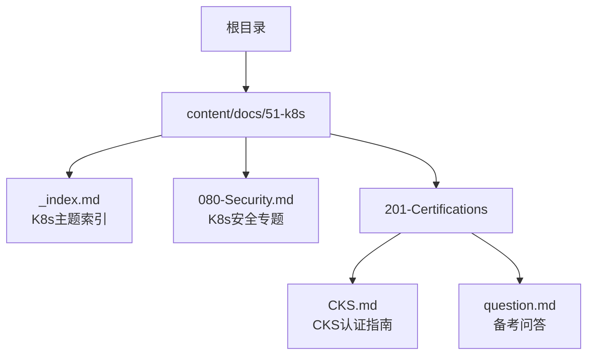
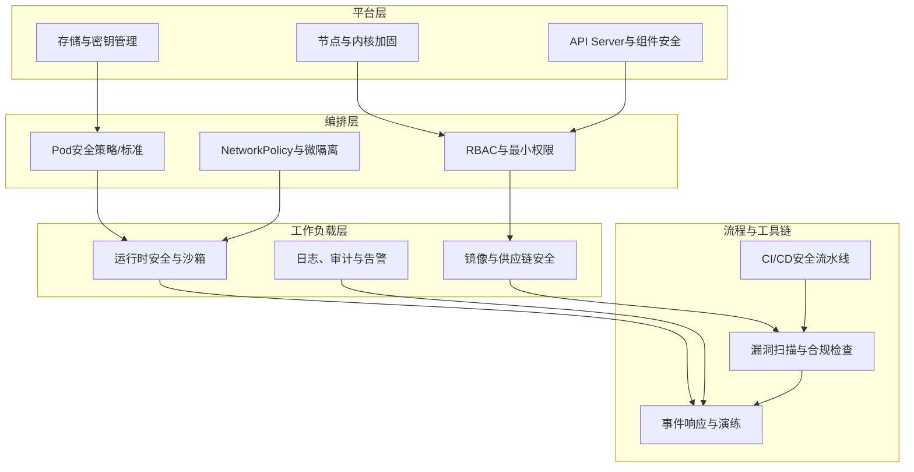
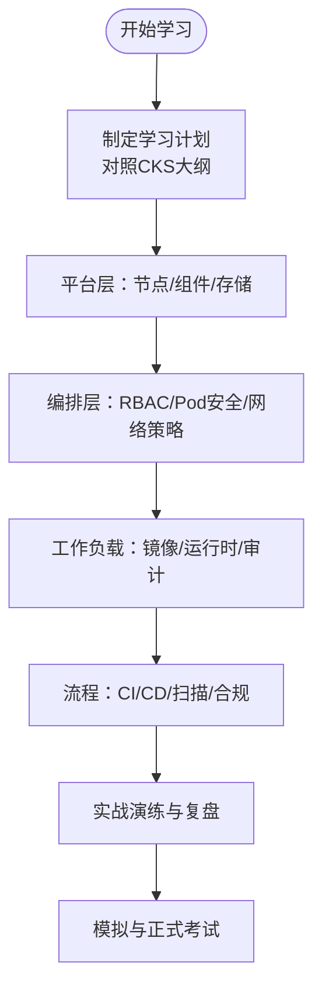
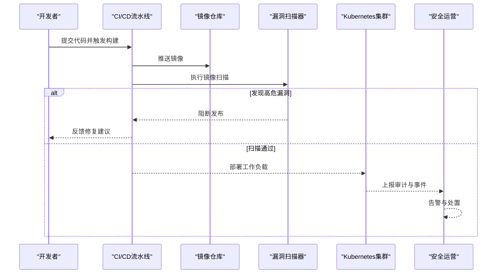
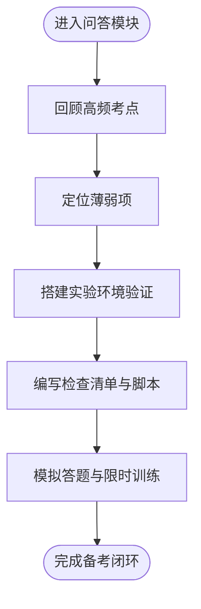
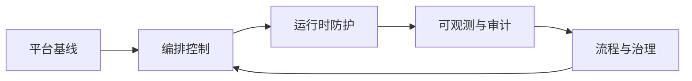

# CKS安全认证学习路径

<cite>
**本文引用的文件**   
- [CKS.md](file://content/docs/51-k8s/201-Certifications/CKS.md)
- [Security.md](file://content/docs/51-k8s/080-Security.md)
- [index.md](file://content/docs/51-k8s/_index.md)
- [question.md](file://content/docs/51-k8s/201-Certifications/question.md)
</cite>

## 目录
1. [简介](#简介)
2. [项目结构](#项目结构)
3. [核心组件](#核心组件)
4. [架构总览](#架构总览)
5. [详细组件分析](#详细组件分析)
6. [依赖分析](#依赖分析)
7. [性能考虑](#性能考虑)
8. [故障排查指南](#故障排查指南)
9. [结论](#结论)
10. [附录](#附录)

## 简介
本指南面向准备参加CKS（Certified Kubernetes Security Specialist）认证的工程师，围绕Kubernetes安全的核心概念与实践，提供从基础到进阶的系统化学习路径。内容覆盖集群加固、最小权限原则、网络安全策略、镜像与供应链安全、运行时安全、事件监控与响应、CI/CD安全流水线以及企业级安全部署案例等关键领域，帮助读者构建可落地的安全能力体系。

## 项目结构
仓库采用Hugo静态站点组织文档，CKS相关内容位于“k8s”主题下的“认证”与“安全”章节中。整体结构以“主题-子主题-页面”的层级方式组织，便于按知识域检索与学习。

图示来源
- [index.md](file://content/docs/51-k8s/_index.md)
- [Security.md](file://content/docs/51-k8s/080-Security.md)
- [CKS.md](file://content/docs/51-k8s/201-Certifications/CKS.md)
- [question.md](file://content/docs/51-k8s/201-Certifications/question.md)

章节来源
- [index.md](file://content/docs/51-k8s/_index.md)
- [Security.md](file://content/docs/51-k8s/080-Security.md)
- [CKS.md](file://content/docs/51-k8s/201-Certifications/CKS.md)
- [question.md](file://content/docs/51-k8s/201-Certifications/question.md)

## 核心组件
- 认证路径与大纲：CKS认证的学习目标、考试范围与技能点映射，帮助制定学习计划与复习清单。
- 安全专题：涵盖Kubernetes安全的关键主题，包括身份与访问控制、网络隔离、镜像与供应链安全、运行时防护、审计与合规等。
- 备考问答：针对常见考点与易错点的问答式梳理，辅助快速定位薄弱环节。

章节来源
- [CKS.md](file://content/docs/51-k8s/201-Certifications/CKS.md)
- [Security.md](file://content/docs/51-k8s/080-Security.md)
- [question.md](file://content/docs/51-k8s/201-Certifications/question.md)

## 架构总览
下图展示了CKS学习路径的知识域关系与相互依赖，强调从“平台基线”到“应用与数据”的全栈安全视角。

[此图为概念性架构图，不直接对应具体源码文件]

## 详细组件分析

### 组件A：认证与学习路径（CKS）
- 学习目标与范围：明确CKS考试的技能域，如集群加固、最小权限、网络策略、镜像与供应链安全、运行时安全、监控与响应等。
- 学习建议：按“平台→编排→工作负载→流程”的顺序推进，结合实操练习巩固知识点。
- 资源导航：通过认证页与安全专题页建立知识索引，配合问答进行查漏补缺。

图示来源
- [CKS.md](file://content/docs/51-k8s/201-Certifications/CKS.md)

章节来源
- [CKS.md](file://content/docs/51-k8s/201-Certifications/CKS.md)

### 组件B：Kubernetes安全专题
- 身份与访问控制：基于角色的访问控制（RBAC）、ServiceAccount、Token管理、Secret与外部密钥集成。
- 网络安全：NetworkPolicy默认拒绝、命名空间隔离、Ingress/网关安全、服务网格零信任。
- 镜像与供应链：镜像签名与验证、漏洞扫描、白名单与私有仓库、SBOM生成与追踪。
- 运行时安全：只读根文件系统、非root运行、Seccomp/AppArmor、容器沙箱、eBPF观测。
- 审计与合规：API Server审计日志、事件采集、告警规则、合规基线与持续评估。

图示来源
- [Security.md](file://content/docs/51-k8s/080-Security.md)

章节来源
- [Security.md](file://content/docs/51-k8s/080-Security.md)

### 组件C：备考问答与要点速查
- 高频考点：RBAC最小权限设计、NetworkPolicy典型场景、Pod安全标准与限制、镜像签名与校验、审计日志采集与分析。
- 易错点：过度宽泛的ClusterRole、未启用审计、忽略节点内核参数、未配置默认Deny策略、未对敏感数据进行加密与轮换。
- 实战建议：在测试集群逐项验证策略生效；使用脚本自动化巡检；建立回归用例与基线快照。

图示来源
- [question.md](file://content/docs/51-k8s/201-Certifications/question.md)

章节来源
- [question.md](file://content/docs/51-k8s/201-Certifications/question.md)

## 依赖分析
- 知识依赖：平台层为编排层提供安全基线；编排层约束工作负载的安全边界；工作负载输出可观测数据供流程层治理。
- 工具依赖：镜像扫描、运行时检测、审计与日志聚合、合规评估工具需与CI/CD和集群组件集成。
- 风险耦合：任一环节缺失都会形成短板效应，例如仅做镜像扫描而忽略运行时防护，或仅配置NetworkPolicy而未实施RBAC最小权限。

[此图为概念性依赖图，不直接对应具体源码文件]

## 性能考虑
- 扫描与审计的开销：镜像扫描与运行时检测应合理设置阈值与采样率，避免影响业务峰值。
- 策略粒度与性能：过细的NetworkPolicy与RBAC会增加控制面压力，需权衡安全与性能。
- 资源隔离：为安全组件（如审计、监控、扫描）分配独立资源与优先级，确保关键路径稳定。

[本节为通用指导，无需特定文件引用]

## 故障排查指南
- 常见问题定位：
  - RBAC拒绝：检查Role/ClusterRole绑定、Subject与Resource匹配、命名空间上下文。
  - NetworkPolicy失效：确认默认Deny策略、入站/出站规则顺序、Selector与端口匹配。
  - 镜像拉取失败：核对仓库凭证、镜像签名校验、网络连通性与DNS解析。
  - 审计日志缺失：验证API Server审计策略、日志采集Agent状态与磁盘配额。
- 排障步骤建议：
  - 复现最小用例，逐步放宽策略定位问题。
  - 查看组件日志与事件，结合kubectl describe与kubectl get events。
  - 使用工具进行基线检查与差异对比，快速识别漂移。

章节来源
- [Security.md](file://content/docs/51-k8s/080-Security.md)
- [question.md](file://content/docs/51-k8s/201-Certifications/question.md)

## 结论
CKS认证不仅是对Kubernetes安全知识的检验，更是推动企业安全落地的重要抓手。通过系统化的学习路径、严格的实践演练与持续的流程治理，可以显著提升集群与应用的整体安全水位。建议将安全左移，贯穿设计、开发、交付与运维全生命周期，并以度量与合规驱动持续改进。

[本节为总结性内容，无需特定文件引用]

## 附录
- 推荐实践清单：
  - 启用并配置API Server审计策略，集中收集与分析。
  - 实施RBAC最小权限，定期清理过期与冗余绑定。
  - 默认拒绝所有流量，按需开放最小网络面。
  - 强制镜像签名与漏洞扫描，阻断高危发布。
  - 配置Pod安全标准与运行时限制，禁止特权模式。
  - 建立事件告警与应急响应流程，定期演练。
- 参考资源导航：
  - 认证页：用于了解考试大纲与学习重点。
  - 安全专题：用于深入理解各安全域的最佳实践。
  - 问答集：用于考前冲刺与查漏补缺。

章节来源
- [CKS.md](file://content/docs/51-k8s/201-Certifications/CKS.md)
- [Security.md](file://content/docs/51-k8s/080-Security.md)
- [question.md](file://content/docs/51-k8s/201-Certifications/question.md)