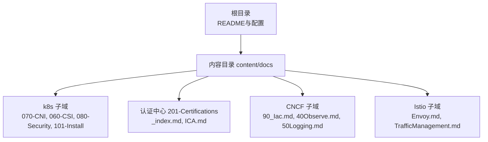
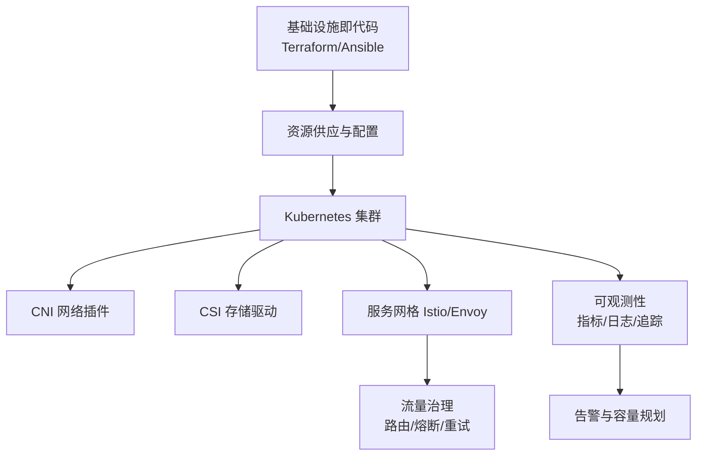
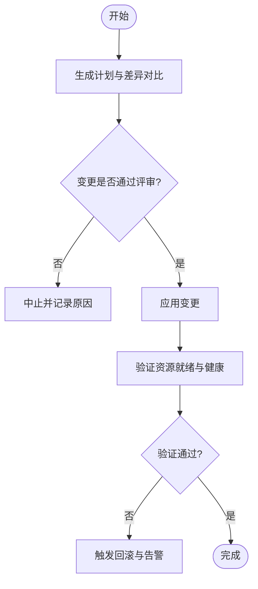
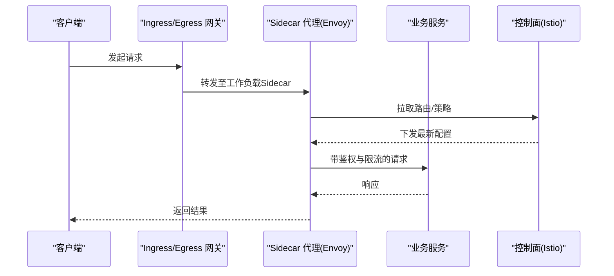
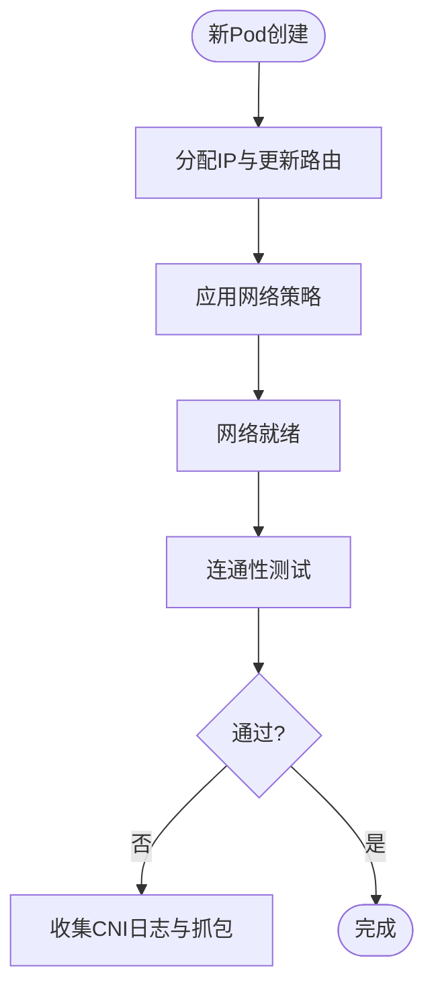
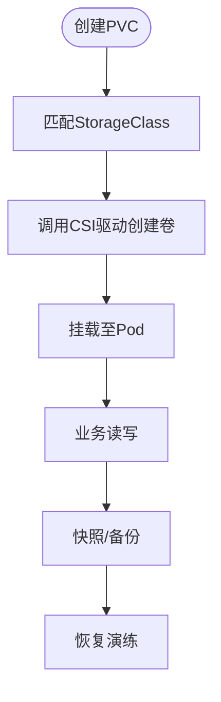
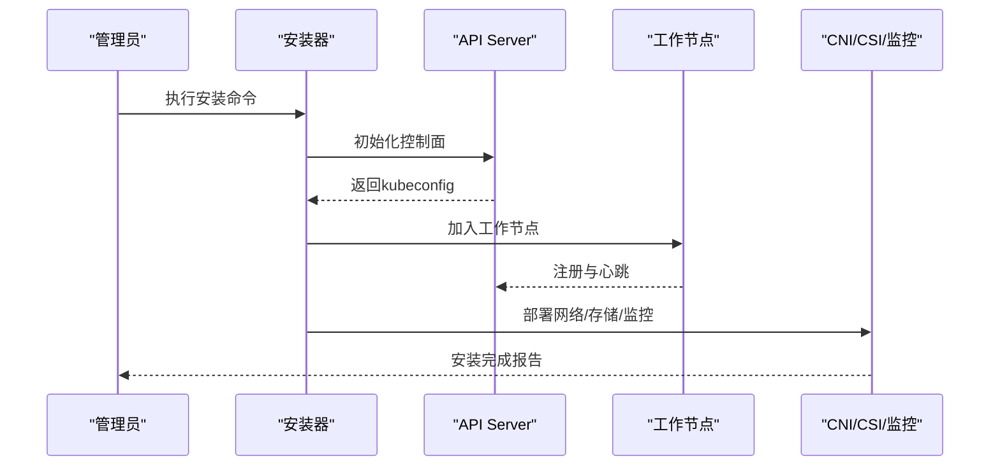
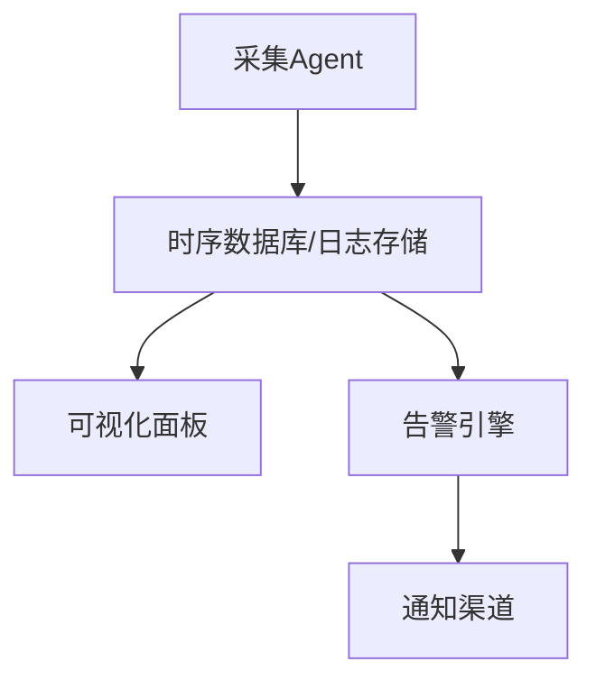
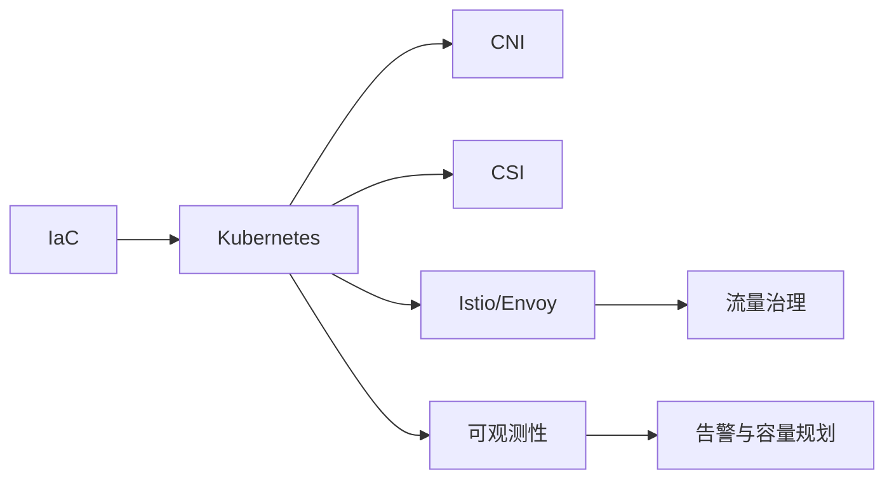

# ICA基础设施认证学习路径

<cite>
**本文引用的文件**   
- [ICA.md](file://content/docs/51-k8s/201-Certifications/ICA.md)
- [_index.md](file://content/docs/51-k8s/201-Certifications/_index.md)
- [90_Iac.md](file://content/docs/70-CNCF/90_Iac.md)
- [40Observe.md](file://content/docs/70-CNCF/40Observe.md)
- [50Logging.md](file://content/docs/70-CNCF/50Logging.md)
- [Envoy.md](file://content/docs/52-istio/Envoy.md)
- [TrafficManagement.md](file://content/docs/52-istio/TrafficManagement.md)
- [070-CNI.md](file://content/docs/51-k8s/070-CNI.md)
- [060-CSI.md](file://content/docs/51-k8s/060-CSI.md)
- [080-Security.md](file://content/docs/51-k8s/080-Security.md)
- [101-Install.md](file://content/docs/51-k8s/101-Install.md)
</cite>

## 目录
1. [引言](#引言)
2. [项目结构](#项目结构)
3. [核心组件](#核心组件)
4. [架构总览](#架构总览)
5. [详细组件分析](#详细组件分析)
6. [依赖关系分析](#依赖关系分析)
7. [性能与容量规划](#性能与容量规划)
8. [故障排查指南](#故障排查指南)
9. [结论](#结论)
10. [附录](#附录)

## 引言
本学习指南面向准备参加ICA（Infrastructure and Cloud Associate）认证的工程师，围绕云原生基础设施的核心能力展开：容器编排、网络虚拟化、存储抽象、服务网格、基础设施即代码（IaC）、多云管理、可观测性、安全基线与合规、高可用与灾难恢复、成本优化与传统IT集成。内容以仓库中现有文档为依据，提供循序渐进的学习路径与实践建议，帮助读者构建系统化的知识体系并落地到真实场景。

## 项目结构
仓库采用Hugo静态站点组织内容，按主题分目录存放文档。与ICA相关的核心内容分布在以下位置：
- 认证概览与导航：certifications索引页
- ICA专题：ICA.md
- 基础设施即代码：CNCF/IaC
- 可观测性与日志：CNCF/观察与日志
- 服务网格与流量治理：Istio系列
- 容器网络与存储：CNI、CSI
- 集群安装与安全：安装与安全

图表来源
- [ICA.md](file://content/docs/51-k8s/201-Certifications/ICA.md)
- [_index.md](file://content/docs/51-k8s/201-Certifications/_index.md)
- [90_Iac.md](file://content/docs/70-CNCF/90_Iac.md)
- [40Observe.md](file://content/docs/70-CNCF/40Observe.md)
- [50Logging.md](file://content/docs/70-CNCF/50Logging.md)
- [Envoy.md](file://content/docs/52-istio/Envoy.md)
- [TrafficManagement.md](file://content/docs/52-istio/TrafficManagement.md)
- [070-CNI.md](file://content/docs/51-k8s/070-CNI.md)
- [060-CSI.md](file://content/docs/51-k8s/060-CSI.md)
- [080-Security.md](file://content/docs/51-k8s/080-Security.md)
- [101-Install.md](file://content/docs/51-k8s/101-Install.md)

章节来源
- [ICA.md](file://content/docs/51-k8s/201-Certifications/ICA.md)
- [_index.md](file://content/docs/51-k8s/201-Certifications/_index.md)

## 核心组件
本节梳理ICA认证所需的关键技术栈与对应文档入口，便于按需深入阅读与练习。

- 容器编排与集群生命周期
  - 集群安装与初始化流程参考：[101-Install.md](file://content/docs/51-k8s/101-Install.md)
  - 安全加固与访问控制参考：[080-Security.md](file://content/docs/51-k8s/080-Security.md)

- 网络虚拟化（CNI）
  - 概念、插件生态与排错要点参考：[070-CNI.md](file://content/docs/51-k8s/070-CNI.md)

- 存储抽象（CSI）
  - 存储驱动、卷生命周期与多后端策略参考：[060-CSI.md](file://content/docs/51-k8s/060-CSI.md)

- 服务网格与流量治理（Istio/Envoy）
  - 数据面代理与流量管理策略参考：
    - [Envoy.md](file://content/docs/52-istio/Envoy.md)
    - [TrafficManagement.md](file://content/docs/52-istio/TrafficManagement.md)

- 基础设施即代码（IaC）
  - 资源声明式管理与流水线集成参考：[90_Iac.md](file://content/docs/70-CNCF/90_Iac.md)

- 可观测性与日志
  - 指标、追踪与日志采集治理参考：
    - [40Observe.md](file://content/docs/70-CNCF/40Observe.md)
    - [50Logging.md](file://content/docs/70-CNCF/50Logging.md)

章节来源
- [101-Install.md](file://content/docs/51-k8s/101-Install.md)
- [080-Security.md](file://content/docs/51-k8s/080-Security.md)
- [070-CNI.md](file://content/docs/51-k8s/070-CNI.md)
- [060-CSI.md](file://content/docs/51-k8s/060-CSI.md)
- [Envoy.md](file://content/docs/52-istio/Envoy.md)
- [TrafficManagement.md](file://content/docs/52-istio/TrafficManagement.md)
- [90_Iac.md](file://content/docs/70-CNCF/90_Iac.md)
- [40Observe.md](file://content/docs/70-CNCF/40Observe.md)
- [50Logging.md](file://content/docs/70-CNCF/50Logging.md)

## 架构总览
下图展示从“基础设施即代码”到“运行期可观测性”的端到端链路，覆盖IaC、集群、网络、存储、服务网格与监控告警等关键节点。

图表来源
- [90_Iac.md](file://content/docs/70-CNCF/90_Iac.md)
- [101-Install.md](file://content/docs/51-k8s/101-Install.md)
- [070-CNI.md](file://content/docs/51-k8s/070-CNI.md)
- [060-CSI.md](file://content/docs/51-k8s/060-CSI.md)
- [Envoy.md](file://content/docs/52-istio/Envoy.md)
- [TrafficManagement.md](file://content/docs/52-istio/TrafficManagement.md)
- [40Observe.md](file://content/docs/70-CNCF/40Observe.md)
- [50Logging.md](file://content/docs/70-CNCF/50Logging.md)

## 详细组件分析

### 组件A：基础设施即代码（IaC）实践
- 目标
  - 使用声明式模板定义计算、网络、存储与平台资源
  - 将IaC纳入CI/CD，实现可重复、可审计的基础设施交付
- 关键要点
  - 模块化管理：将通用能力封装为可复用模块
  - 环境隔离：通过变量与环境区分dev/stage/prod
  - 变更评审：结合PR与审批流程保障变更质量
  - 状态管理：集中化状态存储与并发控制
- 推荐实践
  - 最小权限原则：为IaC执行主体分配必要的最小权限
  - 敏感信息保护：使用密钥管理服务或加密存储
  - 回滚策略：版本化与快照机制确保可回滚

图表来源
- [90_Iac.md](file://content/docs/70-CNCF/90_Iac.md)

章节来源
- [90_Iac.md](file://content/docs/70-CNCF/90_Iac.md)

### 组件B：服务网格与流量治理（Istio/Envoy）
- 目标
  - 在微服务间实现细粒度流量控制、可观测性与安全通信
- 关键要点
  - 数据面代理：基于Envoy的高性能转发与协议支持
  - 控制面策略：路由规则、熔断、重试、超时与灰度发布
  - 安全：mTLS、授权策略与审计
- 典型流程
  - 定义虚拟服务与网关
  - 配置流量权重与镜像流量
  - 启用遥测与指标导出

图表来源
- [Envoy.md](file://content/docs/52-istio/Envoy.md)
- [TrafficManagement.md](file://content/docs/52-istio/TrafficManagement.md)

章节来源
- [Envoy.md](file://content/docs/52-istio/Envoy.md)
- [TrafficManagement.md](file://content/docs/52-istio/TrafficManagement.md)

### 组件C：容器网络（CNI）
- 目标
  - 为Pod提供跨节点的稳定网络连通性与高级能力（如网络策略、带宽限制）
- 关键要点
  - Pod IP分配与路由表维护
  - 网络策略与隔离
  - 与云平台VPC/CNI插件集成
- 排错思路
  - 检查节点网络接口与路由
  - 验证CNI插件日志与配置
  - 使用抓包与连通性测试定位问题

图表来源
- [070-CNI.md](file://content/docs/51-k8s/070-CNI.md)

章节来源
- [070-CNI.md](file://content/docs/51-k8s/070-CNI.md)

### 组件D：存储抽象（CSI）
- 目标
  - 统一存储后端接入，提供动态供给、快照与克隆能力
- 关键要点
  - StorageClass与VolumeClaim绑定
  - 多后端兼容与数据迁移
  - 备份与恢复策略
- 最佳实践
  - 选择合适的数据持久化级别
  - 设置合理的IOPS与容量配额
  - 定期演练恢复流程

图表来源
- [060-CSI.md](file://content/docs/51-k8s/060-CSI.md)

章节来源
- [060-CSI.md](file://content/docs/51-k8s/060-CSI.md)

### 组件E：集群安装与安全基线
- 目标
  - 快速搭建生产可用的Kubernetes集群，并落实安全基线
- 关键要点
  - 控制面高可用与节点池规划
  - RBAC、网络策略、镜像签名与漏洞扫描
  - 审计日志与合规检查
- 推荐步骤
  - 预检环境与依赖
  - 安装控制面与工作节点
  - 部署CNI/CSI与基础组件
  - 配置安全策略与监控

图表来源
- [101-Install.md](file://content/docs/51-k8s/101-Install.md)
- [080-Security.md](file://content/docs/51-k8s/080-Security.md)

章节来源
- [101-Install.md](file://content/docs/51-k8s/101-Install.md)
- [080-Security.md](file://content/docs/51-k8s/080-Security.md)

### 组件F：可观测性与日志
- 目标
  - 建立统一的指标、日志与追踪采集与可视化，支撑排障与容量规划
- 关键要点
  - 指标采集：节点/容器/应用层多维指标
  - 日志采集：结构化日志与集中存储
  - 追踪：分布式请求链路追踪
  - 告警：阈值与复合告警策略
- 实践建议
  - 合理采样与保留策略
  - 标签规范化与维度治理
  - 与IaC联动，确保采集组件随基础设施交付

图表来源
- [40Observe.md](file://content/docs/70-CNCF/40Observe.md)
- [50Logging.md](file://content/docs/70-CNCF/50Logging.md)

章节来源
- [40Observe.md](file://content/docs/70-CNCF/40Observe.md)
- [50Logging.md](file://content/docs/70-CNCF/50Logging.md)

## 依赖关系分析
各组件之间的耦合关系如下：IaC负责资源供应；集群作为运行时载体；CNI/CSI提供网络与存储能力；服务网格增强流量治理；可观测性贯穿全链路。

图表来源
- [90_Iac.md](file://content/docs/70-CNCF/90_Iac.md)
- [101-Install.md](file://content/docs/51-k8s/101-Install.md)
- [070-CNI.md](file://content/docs/51-k8s/070-CNI.md)
- [060-CSI.md](file://content/docs/51-k8s/060-CSI.md)
- [Envoy.md](file://content/docs/52-istio/Envoy.md)
- [TrafficManagement.md](file://content/docs/52-istio/TrafficManagement.md)
- [40Observe.md](file://content/docs/70-CNCF/40Observe.md)
- [50Logging.md](file://content/docs/70-CNCF/50Logging.md)

## 性能与容量规划
- 容量规划
  - 基于历史峰值与增长趋势进行资源预估
  - 利用HPA/VPA与集群自动扩缩容提升弹性
- 性能调优
  - 调整调度器评分与亲和/反亲和策略
  - 优化CNI/CSI参数与I/O路径
  - 对服务网格启用连接复用与缓存
- 成本优化
  - 使用Spot/抢占实例承载非关键负载
  - 资源配额与命名空间级预算
  - 闲置资源回收与镜像瘦身

## 故障排查指南
- 常见问题定位
  - 网络不通：检查CNI插件日志、节点路由与防火墙策略
  - 存储不可用：核对StorageClass、CSI驱动与后端健康
  - 服务异常：查看Sidecar与业务日志，结合追踪定位瓶颈
- 排错工具与流程
  - 使用kubectl描述资源与事件
  - 抓取网络包与Sidecar配置
  - 基于可观测性面板进行关联分析
- 回滚与恢复
  - IaC变更失败时执行回滚
  - 存储快照与备份用于数据恢复

章节来源
- [070-CNI.md](file://content/docs/51-k8s/070-CNI.md)
- [060-CSI.md](file://content/docs/51-k8s/060-CSI.md)
- [Envoy.md](file://content/docs/52-istio/Envoy.md)
- [TrafficManagement.md](file://content/docs/52-istio/TrafficManagement.md)
- [40Observe.md](file://content/docs/70-CNCF/40Observe.md)
- [50Logging.md](file://content/docs/70-CNCF/50Logging.md)

## 结论
ICA认证强调“以代码为中心”的基础设施工程能力。通过IaC、CNI/CSI、服务网格与可观测性的协同，构建可重复、可观测、可扩展的云原生基础设施。建议以本学习路径为主线，结合仓库中的专题文档进行系统化学习与实战演练，逐步掌握多云管理与高可用架构设计方法。

## 附录
- 学习路线建议
  - 入门：集群安装与安全基线
  - 进阶：CNI/CSI与服务网格
  - 高阶：IaC与可观测性闭环
  - 实战：多云与混合云集成、灾备演练与成本优化