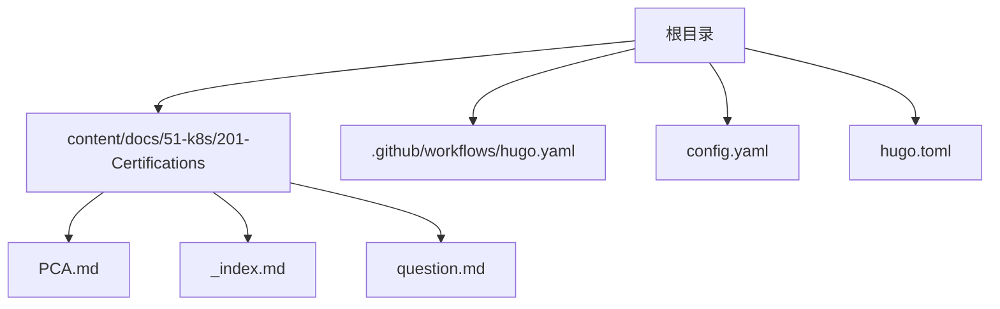
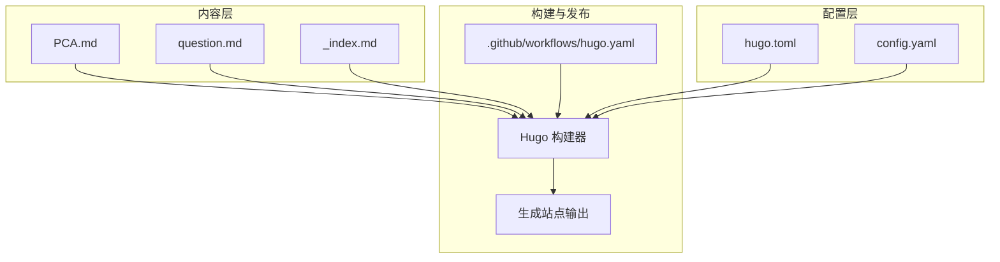
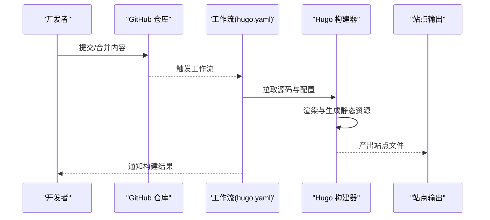
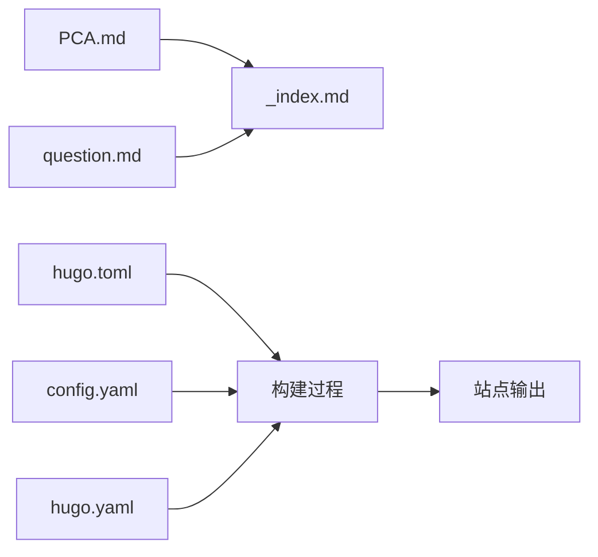

# PCA产品认证学习路径

<cite>
**本文引用的文件**   
- [PCA.md](file://content/docs/51-k8s/201-Certifications/PCA.md)
- [_index.md](file://content/docs/51-k8s/201-Certifications/_index.md)
- [question.md](file://content/docs/51-k8s/201-Certifications/question.md)
- [hugo.yaml](file://.github/workflows/hugo.yaml)
- [config.yaml](file://config.yaml)
- [hugo.toml](file://hugo.toml)
</cite>

## 目录
1. [简介](#简介)
2. [项目结构](#项目结构)
3. [核心组件](#核心组件)
4. [架构总览](#架构总览)
5. [详细组件分析](#详细组件分析)
6. [依赖关系分析](#依赖关系分析)
7. [性能与质量考量](#性能与质量考量)
8. [故障排查指南](#故障排查指南)
9. [结论](#结论)
10. [附录](#附录)

## 简介
本学习指南面向希望获得或巩固PCA（Product and Certification Associate）能力模型的读者，围绕云原生产品的全生命周期管理展开，覆盖从需求分析、技术设计、版本与发布策略，到测试体系、文档与支持、商业化与市场定位、迭代优化与反馈闭环，以及合规与标准化等关键主题。同时结合仓库中已有的认证资料与问题集，提供可操作的学习路径与实践建议。

## 项目结构
仓库采用Hugo静态站点组织内容，认证相关内容集中在“k8s/201-Certifications”目录下，其中PCA专题包含主页面与配套问题集；站点构建通过GitHub Actions执行。

图示来源
- [PCA.md](file://content/docs/51-k8s/201-Certifications/PCA.md)
- [_index.md](file://content/docs/51-k8s/201-Certifications/_index.md)
- [question.md](file://content/docs/51-k8s/201-Certifications/question.md)
- [hugo.yaml](file://.github/workflows/hugo.yaml)
- [config.yaml](file://config.yaml)
- [hugo.toml](file://hugo.toml)

章节来源
- [PCA.md](file://content/docs/51-k8s/201-Certifications/PCA.md)
- [_index.md](file://content/docs/51-k8s/201-Certifications/_index.md)
- [question.md](file://content/docs/51-k8s/201-Certifications/question.md)
- [hugo.yaml](file://.github/workflows/hugo.yaml)
- [config.yaml](file://config.yaml)
- [hugo.toml](file://hugo.toml)

## 核心组件
- 认证知识入口：PCA专题页作为学习与导航的起点，串联相关知识点与资源。
- 问题集与自测：question.md提供典型问题与练习，帮助检验对PCA各模块的理解。
- 站点配置与构建：hugo.toml与config.yaml定义站点元数据与渲染选项；hugo.yaml驱动CI构建与部署。

章节来源
- [PCA.md](file://content/docs/51-k8s/201-Certifications/PCA.md)
- [question.md](file://content/docs/51-k8s/201-Certifications/question.md)
- [hugo.toml](file://hugo.toml)
- [config.yaml](file://config.yaml)
- [hugo.yaml](file://.github/workflows/hugo.yaml)

## 架构总览
下图展示PCA学习路径在站点中的组织方式与构建流程，便于理解内容如何被编排与发布。

图示来源
- [PCA.md](file://content/docs/51-k8s/201-Certifications/PCA.md)
- [question.md](file://content/docs/51-k8s/201-Certifications/question.md)
- [_index.md](file://content/docs/51-k8s/201-Certifications/_index.md)
- [hugo.toml](file://hugo.toml)
- [config.yaml](file://config.yaml)
- [hugo.yaml](file://.github/workflows/hugo.yaml)

## 详细组件分析

### PCA认证知识体系与学习路径
- 目标与范围：围绕云原生产品从规划到运营的全链路能力模型，强调方法论、流程化实践与工具链协同。
- 学习阶段建议：
  - 基础认知：产品角色职责、生命周期阶段划分、关键里程碑与交付物。
  - 需求与设计：需求分析方法论、技术方案设计原则、架构权衡与约束。
  - 开发与版本：分支策略、语义化版本、变更管理与基线控制。
  - 发布与运维：灰度/金丝雀/蓝绿发布、回滚策略、监控与告警。
  - 测试与质量：单元/集成/性能/安全测试矩阵与准入标准。
  - 文档与支持：用户手册、API文档、FAQ与工单处理SOP。
  - 商业化与市场：价值主张、定价与打包、渠道与生态合作。
  - 迭代与反馈：指标体系、A/B实验、用户反馈闭环与路线图治理。
  - 合规与标准：数据安全、隐私保护、行业规范与审计要求。

章节来源
- [PCA.md](file://content/docs/51-k8s/201-Certifications/PCA.md)

### 问题集与自测方法
- 使用建议：按模块抽取典型问题，形成“概念—场景—决策—复盘”的闭环训练。
- 自测流程：
  - 先独立作答，再对照解析与参考答案进行差距分析。
  - 将错题归类至知识图谱，制定补强计划。
  - 定期滚动复习，结合实战案例加深理解。

章节来源
- [question.md](file://content/docs/51-k8s/201-Certifications/question.md)

### 站点构建与持续集成
- 构建触发：代码推送或合并后由工作流自动触发构建。
- 构建产物：Hugo根据配置生成静态站点并部署至托管平台。
- 配置要点：站点语言、主题、菜单与SEO信息需保持一致性。

图示来源
- [hugo.yaml](file://.github/workflows/hugo.yaml)
- [hugo.toml](file://hugo.toml)
- [config.yaml](file://config.yaml)

章节来源
- [hugo.yaml](file://.github/workflows/hugo.yaml)
- [hugo.toml](file://hugo.toml)
- [config.yaml](file://config.yaml)

## 依赖关系分析
- 内容依赖：PCA主页面与问题集共同构成学习材料，索引页提供导航聚合。
- 配置依赖：站点主题与元数据由配置文件集中管理，确保多环境一致性。
- 构建依赖：工作流依赖Hugo运行时与缓存策略，影响构建速度与稳定性。

图示来源
- [PCA.md](file://content/docs/51-k8s/201-Certifications/PCA.md)
- [_index.md](file://content/docs/51-k8s/201-Certifications/_index.md)
- [question.md](file://content/docs/51-k8s/201-Certifications/question.md)
- [hugo.toml](file://hugo.toml)
- [config.yaml](file://config.yaml)
- [hugo.yaml](file://.github/workflows/hugo.yaml)

章节来源
- [PCA.md](file://content/docs/51-k8s/201-Certifications/PCA.md)
- [_index.md](file://content/docs/51-k8s/201-Certifications/_index.md)
- [question.md](file://content/docs/51-k8s/201-Certifications/question.md)
- [hugo.toml](file://hugo.toml)
- [config.yaml](file://config.yaml)
- [hugo.yaml](file://.github/workflows/hugo.yaml)

## 性能与质量考量
- 内容质量：术语一致、示例真实、图表清晰，避免过度堆砌概念。
- 构建性能：合理拆分页面与资源，启用缓存与增量构建，减少无效渲染。
- 可维护性：统一模板与样式变量，建立内容审查清单与回归检查。

[本节为通用指导，不直接分析具体文件]

## 故障排查指南
- 构建失败：检查工作流日志，确认Hugo版本、主题与依赖是否匹配。
- 渲染异常：核对配置项与Front Matter字段，检查图片与链接路径。
- 部署问题：验证权限与域名配置，检查CDN缓存刷新策略。

章节来源
- [hugo.yaml](file://.github/workflows/hugo.yaml)
- [hugo.toml](file://hugo.toml)
- [config.yaml](file://config.yaml)

## 结论
通过将PCA能力模型与站点内容、构建流程有机结合，学习者可以沿着“知识—练习—构建—发布”的闭环稳步提升。建议在掌握基础框架后，结合真实产品案例开展端到端演练，逐步沉淀团队级最佳实践与资产。

[本节为总结性内容，不直接分析具体文件]

## 附录
- 推荐学习顺序：先通读PCA主页面，再按模块精读问题集，最后参与一次完整的站点构建与发布演练。
- 扩展阅读：结合仓库中其他认证与工程实践文章，拓展DevSecOps、可观测性与AI工程化等前沿主题。

[本节为补充说明，不直接分析具体文件]