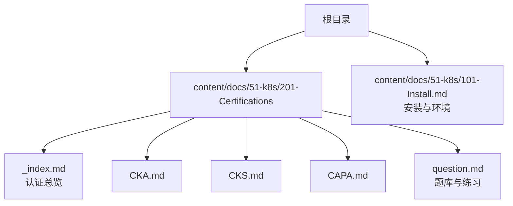
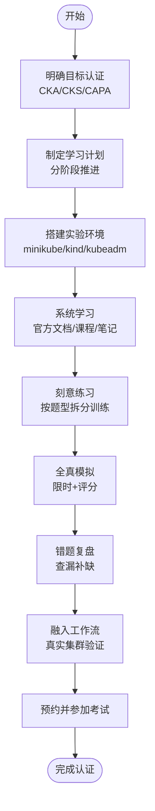
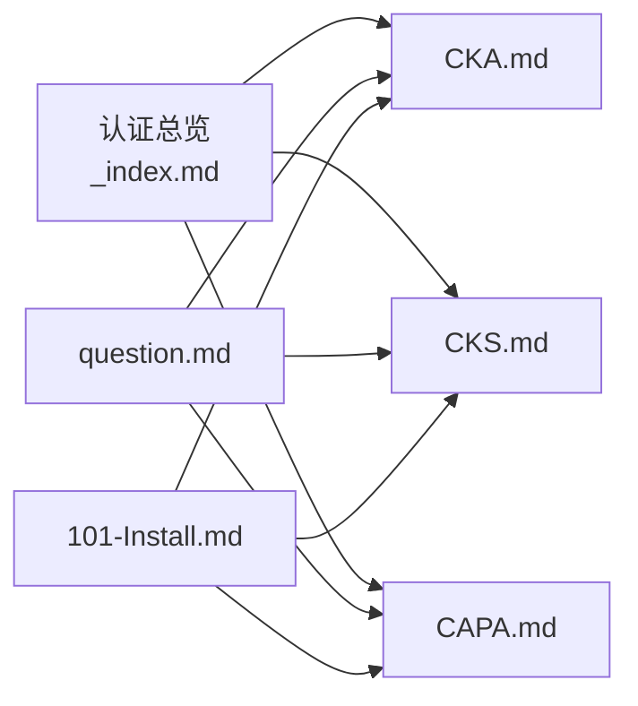

# 认证学习路径

<cite>
**本文引用的文件**
- [content/docs/51-k8s/201-Certifications/_index.md](file://content/docs/51-k8s/201-Certifications/_index.md)
- [content/docs/51-k8s/201-Certifications/CKA.md](file://content/docs/51-k8s/201-Certifications/CKA.md)
- [content/docs/51-k8s/201-Certifications/CKS.md](file://content/docs/51-k8s/201-Certifications/CKS.md)
- [content/docs/51-k8s/201-Certifications/CAPA.md](file://content/docs/51-k8s/201-Certifications/CAPA.md)
- [content/docs/51-k8s/201-Certifications/question.md](file://content/docs/51-k8s/201-Certifications/question.md)
- [content/docs/51-k8s/101-Install.md](file://content/docs/51-k8s/101-Install.md)
</cite>

## 目录
1. [简介](#简介)
2. [项目结构](#项目结构)
3. [核心组件](#核心组件)
4. [架构总览](#架构总览)
5. [详细组件分析](#详细组件分析)
6. [依赖分析](#依赖分析)
7. [性能考虑](#性能考虑)
8. [故障排查指南](#故障排查指南)
9. [结论](#结论)
10. [附录](#附录)

## 简介
本学习路径面向希望系统掌握Kubernetes相关云原生认证的工程师，聚焦以下三大认证：
- CKA（Certified Kubernetes Administrator）：侧重集群运维、排障与日常管理能力。
- CKS（Certified Kubernetes Security Specialist）：在CKA基础上强化安全能力，覆盖镜像、工作负载、网络、存储等安全面。
- CAPA（Certified Application Platform Associate）：关注应用平台化与多云/混合云场景下的平台工程实践。

文档提供每个认证的学习目标、考试内容概览、分阶段学习计划（基础知识准备、实验环境搭建、练习题练习、模拟考试）、题型特点与时间管理策略、实战结合建议、工具与环境配置要点（minikube/kind/kubeadm），以及资源推荐与社区支持渠道。

## 项目结构
仓库采用Hugo静态站点组织内容，认证相关内容位于“Kubernetes”主题下的“认证”子目录，配套安装与环境章节用于支撑实验环境搭建。

图表来源
- [content/docs/51-k8s/201-Certifications/_index.md](file://content/docs/51-k8s/201-Certifications/_index.md)
- [content/docs/51-k8s/201-Certifications/CKA.md](file://content/docs/51-k8s/201-Certifications/CKA.md)
- [content/docs/51-k8s/201-Certifications/CKS.md](file://content/docs/51-k8s/201-Certifications/CKS.md)
- [content/docs/51-k8s/201-Certifications/CAPA.md](file://content/docs/51-k8s/201-Certifications/CAPA.md)
- [content/docs/51-k8s/201-Certifications/question.md](file://content/docs/51-k8s/201-Certifications/question.md)
- [content/docs/51-k8s/101-Install.md](file://content/docs/51-k8s/101-Install.md)

章节来源
- [content/docs/51-k8s/201-Certifications/_index.md](file://content/docs/51-k8s/201-Certifications/_index.md)
- [content/docs/51-k8s/101-Install.md](file://content/docs/51-k8s/101-Install.md)

## 核心组件
- 认证总览页：提供各认证定位、前置要求与关联关系，帮助学员选择合适起点。
- CKA/CKS/CAPA专题页：分别阐述学习目标、考试范围、备考重点与实操建议。
- 题库与练习：汇总常见题型、解题思路与时间分配策略。
- 安装与环境：提供本地或云端实验环境的快速搭建指引，为实操打基础。

章节来源
- [content/docs/51-k8s/201-Certifications/_index.md](file://content/docs/51-k8s/201-Certifications/_index.md)
- [content/docs/51-k8s/201-Certifications/CKA.md](file://content/docs/51-k8s/201-Certifications/CKA.md)
- [content/docs/51-k8s/201-Certifications/CKS.md](file://content/docs/51-k8s/201-Certifications/CKS.md)
- [content/docs/51-k8s/201-Certifications/CAPA.md](file://content/docs/51-k8s/201-Certifications/CAPA.md)
- [content/docs/51-k8s/201-Certifications/question.md](file://content/docs/51-k8s/201-Certifications/question.md)
- [content/docs/51-k8s/101-Install.md](file://content/docs/51-k8s/101-Install.md)

## 架构总览
下图展示从“知识输入—环境搭建—刻意练习—模拟测评—实战迁移”的端到端学习闭环，并与仓库中的具体页面形成映射。

[此图为概念性流程图，不直接映射具体源码文件]

## 详细组件分析

### CKA（Certified Kubernetes Administrator）
- 学习目标：掌握集群部署、升级、备份恢复；服务发现与负载均衡；存储编排；监控日志；故障诊断与排错；网络与安全基线。
- 考试内容要点：节点与Pod生命周期、调度与亲和/反亲和、Service/Ingress、ConfigMap/Secret、PV/PVC、RBAC、NetworkPolicy、日志与指标采集、集群升级与备份恢复、故障定位。
- 题型与时间：以实操题为主，强调命令熟练度与效率；合理分配每道题时间，先易后难，善用搜索与过滤。
- 学习计划建议：
  - 基础准备：Linux与容器基础、kubectl常用操作、YAML规范。
  - 环境搭建：使用minikube或kind快速创建单/多节点集群，熟悉kubeadm构建生产风格集群。
  - 刻意练习：按模块刷题，记录高频命令与模板。
  - 模拟测评：限时完成整套题目，统计正确率与耗时。
  - 实战迁移：将练习脚本沉淀为可复用模板，应用于日常工作。

章节来源
- [content/docs/51-k8s/201-Certifications/CKA.md](file://content/docs/51-k8s/201-Certifications/CKA.md)
- [content/docs/51-k8s/101-Install.md](file://content/docs/51-k8s/101-Install.md)

### CKS（Certified Kubernetes Security Specialist）
- 学习目标：在CKA基础上深化安全能力，覆盖镜像安全、工作负载加固、网络安全、存储加密、身份与访问控制、审计与合规。
- 考试内容要点：镜像扫描与签名、最小权限原则、RBAC精细化、NetworkPolicy、PodSecurityAdmission/PSA、Secret与外部密钥管理、审计日志、运行时安全、漏洞管理与补丁流程。
- 题型与时间：同样为实操题，但更强调“安全基线”和“最小暴露面”思维；注意命令顺序与影响评估。
- 学习计划建议：
  - 前置条件：通过CKA或具备同等运维能力。
  - 安全专项：逐项补齐镜像、网络、存储、身份、审计等安全域。
  - 演练设计：构造典型攻击面与加固方案，反复验证。
  - 模拟测评：在限定时长内完成安全加固任务，注重细节与规范性。
  - 实战迁移：推动团队落地安全基线与自动化检查。

章节来源
- [content/docs/51-k8s/201-Certifications/CKS.md](file://content/docs/51-k8s/201-Certifications/CKS.md)
- [content/docs/51-k8s/101-Install.md](file://content/docs/51-k8s/101-Install.md)

### CAPA（Certified Application Platform Associate）
- 学习目标：理解应用平台化理念，掌握多云/混合云下平台工程方法，包括基础设施即代码、GitOps、可观测性与稳定性治理。
- 考试内容要点：平台抽象与API化、IaC与配置管理、CI/CD流水线、发布与回滚策略、可观测性体系、容量与弹性、成本与治理。
- 题型与时间：偏重设计与决策类问题，需结合场景权衡取舍；强调方法论与最佳实践。
- 学习计划建议：
  - 平台思维：梳理业务需求到平台能力的映射关系。
  - 工具链整合：IaC、CI/CD、GitOps、可观测性一体化。
  - 场景演练：基于真实业务进行端到端交付演练。
  - 模拟测评：以案例驱动，输出方案与复盘报告。
  - 实战迁移：在团队中推行平台工程实践，沉淀标准与规范。

章节来源
- [content/docs/51-k8s/201-Certifications/CAPA.md](file://content/docs/51-k8s/201-Certifications/CAPA.md)

### 题库与练习（question.md）
- 题型特点：以实操为主，部分涉及方案设计；强调命令熟练度、YAML编写与排错能力。
- 时间管理：先浏览全部题目，标记难度与分值；优先完成把握大的题目；对复杂题建立“最小可行解”，再逐步完善。
- 练习策略：按知识点拆题，建立个人命令库与模板库；定期复盘错误点，形成“错题本”。

章节来源
- [content/docs/51-k8s/201-Certifications/question.md](file://content/docs/51-k8s/201-Certifications/question.md)

### 环境与工具（101-Install.md）
- minikube：适合单机快速体验与入门练习。
- kind：基于容器的轻量集群，适合CI与本地多集群测试。
- kubeadm：贴近生产风格的集群构建方式，适合进阶与面试/实战衔接。
- 建议：先从minikube/kind上手，再过渡到kubeadm；在本地复现考题场景，逐步提升复杂度。

章节来源
- [content/docs/51-k8s/101-Install.md](file://content/docs/51-k8s/101-Install.md)

## 依赖分析
- 内容依赖关系：认证总览页作为入口，链接至CKA/CKS/CAPA专题；question.md为通用练习入口；101-Install.md为所有认证的环境前置。
- 学习路径依赖：CKS依赖CKA能力；CAPA需要平台工程与DevSecOps背景；question.md贯穿所有认证练习。

图表来源
- [content/docs/51-k8s/201-Certifications/_index.md](file://content/docs/51-k8s/201-Certifications/_index.md)
- [content/docs/51-k8s/201-Certifications/CKA.md](file://content/docs/51-k8s/201-Certifications/CKA.md)
- [content/docs/51-k8s/201-Certifications/CKS.md](file://content/docs/51-k8s/201-Certifications/CKS.md)
- [content/docs/51-k8s/201-Certifications/CAPA.md](file://content/docs/51-k8s/201-Certifications/CAPA.md)
- [content/docs/51-k8s/201-Certifications/question.md](file://content/docs/51-k8s/201-Certifications/question.md)
- [content/docs/51-k8s/101-Install.md](file://content/docs/51-k8s/101-Install.md)

章节来源
- [content/docs/51-k8s/201-Certifications/_index.md](file://content/docs/51-k8s/201-Certifications/_index.md)
- [content/docs/51-k8s/201-Certifications/question.md](file://content/docs/51-k8s/201-Certifications/question.md)
- [content/docs/51-k8s/101-Install.md](file://content/docs/51-k8s/101-Install.md)

## 性能考虑
- 学习效率：采用“小步快跑”的刻意练习法，每次聚焦一个知识点，完成后立即复盘。
- 环境性能：优先使用kind/minikube在本地快速迭代；在资源受限环境下减少不必要的副本与资源请求。
- 模拟测评：严格计时，避免过度优化单一题目而忽略整体得分。

[本节为通用指导，不直接分析具体文件]

## 故障排查指南
- 常见问题定位：
  - 集群无法启动：检查节点状态、kubelet日志、网络插件与证书。
  - Pod异常：查看事件、日志、资源配额与限制、存储挂载与网络策略。
  - 权限问题：核对RBAC规则、ServiceAccount与Token。
- 排障步骤：
  - 收集信息：kubectl get/describe/logs/events，systemd/journalctl。
  - 缩小范围：隔离变更、复现实例、对比正常与异常差异。
  - 修复验证：最小化修复，逐步回归验证。

章节来源
- [content/docs/51-k8s/201-Certifications/question.md](file://content/docs/51-k8s/201-Certifications/question.md)

## 结论
通过“目标明确—计划清晰—环境就绪—刻意练习—模拟测评—实战迁移”的闭环路径，学员可以高效达成CKA/CKS/CAPA认证目标，并将所学转化为实际工作能力。建议以CKA为起点，CKS为进阶，CAPA为平台工程方向拓展，配合题库与安装指南持续精进。

[本节为总结性内容，不直接分析具体文件]

## 附录
- 个性化学习路径建议：
  - 运维背景：优先CKA→CKS，辅以CAPA的平台工程视角。
  - 开发背景：先补CKA基础，再进入CKS安全专项，最后用CAPA打通平台化能力。
  - SRE/平台团队：CKA→CAPA→CKS，强化稳定性与安全性双轮驱动。
- 资源与社区：
  - 官方文档与课程、开源社区、技术博客与论坛、学习小组与打卡群。
- 工具清单：
  - kubectl、minikube、kind、kubeadm、helm、gitops工具链、可观测性栈。

[本节为补充信息，不直接分析具体文件]