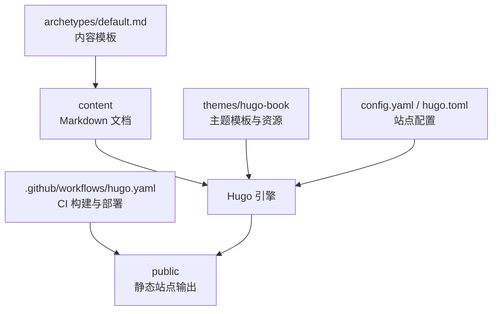
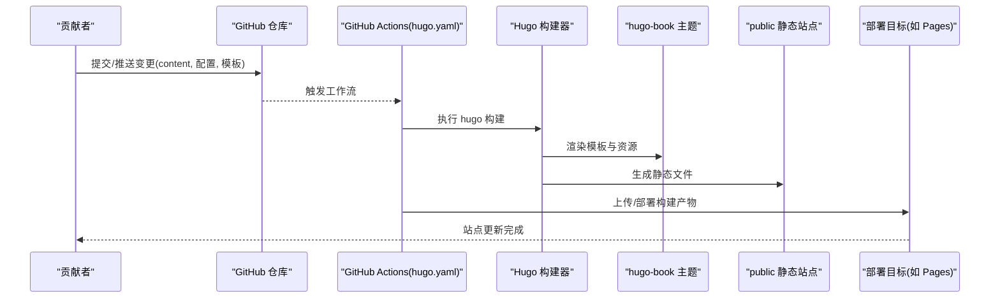
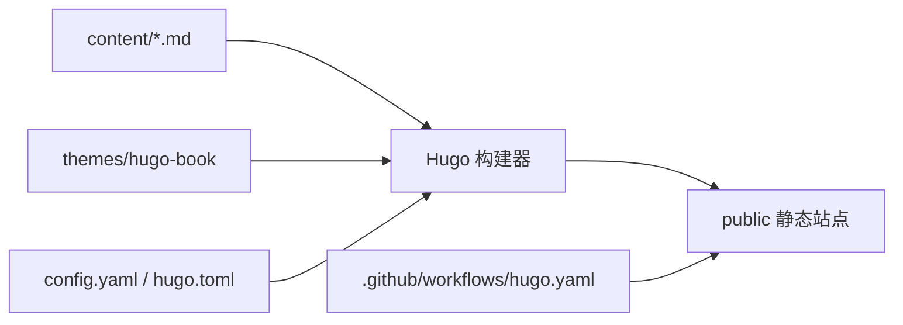

# 贡献指南

<cite>
**本文引用的文件**   
- [README.md](file://README.md)
- [config.yaml](file://config.yaml)
- [hugo.toml](file://hugo.toml)
- [.github/workflows/hugo.yaml](file://.github/workflows/hugo.yaml)
- [.gitee/ISSUE_TEMPLATE.en.md](file://.gitee/ISSUE_TEMPLATE.en.md)
- [.gitee/PULL_REQUEST_TEMPLATE.en.md](file://.gitee/PULL_REQUEST_TEMPLATE.en.md)
- [archetypes/default.md](file://archetypes/default.md)
</cite>

## 目录
1. [简介](#简介)
2. [项目结构](#项目结构)
3. [核心组件](#核心组件)
4. [架构总览](#架构总览)
5. [详细组件分析](#详细组件分析)
6. [依赖分析](#依赖分析)
7. [性能考虑](#性能考虑)
8. [故障排查指南](#故障排查指南)
9. [结论](#结论)
10. [附录](#附录)

## 简介
本仓库是一个基于 Hugo + hugo-book 主题的技术文档站点，内容以 Markdown 为主，通过 GitHub Actions 自动构建与部署。为便于社区开发者参与改进，本文提供完整的贡献流程、协作规范、代码与写作风格指南、Git 工作流、新功能开发流程、本地开发与调试方法、文档贡献要求、沟通渠道与行为准则等说明。

## 项目结构
仓库采用“内容即源码”的静态站点组织方式：
- content：所有文档与文章（Markdown）存放位置，按主题分目录管理
- themes/hugo-book：Hugo 主题（子模块），包含模板、样式、国际化资源等
- .github/workflows：GitHub Actions 自动化构建与部署流水线
- .gitee：Issue 与 Pull Request 模板（英文）
- archetypes：Hugo 内容模板，用于快速生成新页面
- config.yaml / hugo.toml：站点配置（语言、菜单、SEO、插件等）
- public：构建产物（通常不提交到版本库）

图表来源
- [README.md](file://README.md)
- [config.yaml](file://config.yaml)
- [hugo.toml](file://hugo.toml)
- [.github/workflows/hugo.yaml](file://.github/workflows/hugo.yaml)
- [archetypes/default.md](file://archetypes/default.md)

章节来源
- [README.md](file://README.md)
- [config.yaml](file://config.yaml)
- [hugo.toml](file://hugo.toml)
- [.github/workflows/hugo.yaml](file://.github/workflows/hugo.yaml)
- [archetypes/default.md](file://archetypes/default.md)

## 核心组件
- 内容层：Markdown 文档位于 content 下，按主题划分目录；使用 archetypes 模板统一元数据与格式
- 主题层：hugo-book 主题提供导航、搜索、暗色模式、Mermaid 图表、短代码等能力
- 构建与发布：GitHub Actions 在推送或合并时触发构建，生成 public 并部署至托管平台
- 配置层：config.yaml 与 hugo.toml 控制站点语言、菜单、SEO、插件与主题参数

章节来源
- [config.yaml](file://config.yaml)
- [hugo.toml](file://hugo.toml)
- [.github/workflows/hugo.yaml](file://.github/workflows/hugo.yaml)
- [archetypes/default.md](file://archetypes/default.md)

## 架构总览
下图展示了从内容修改到站点发布的端到端流程，以及各组件之间的交互关系。

图表来源
- [.github/workflows/hugo.yaml](file://.github/workflows/hugo.yaml)

## 详细组件分析

### Issue 提交规范
- 使用仓库提供的 Issue 模板，确保问题描述完整、可复现
- 标题应简洁明确，正文包含环境信息、复现步骤、期望与实际结果、截图或日志
- 若涉及多语言或跨平台，请标注相关环境

章节来源
- [.gitee/ISSUE_TEMPLATE.en.md](file://.gitee/ISSUE_TEMPLATE.en.md)

### Pull Request 创建与审查
- 遵循 PR 模板填写变更背景、影响范围、测试验证情况
- 小步提交、清晰提交信息，避免无关改动混入
- 保持 PR 聚焦单一主题，必要时拆分为多个 PR
- 审查关注点：技术准确性、可读性、一致性、兼容性、安全性

章节来源
- [.gitee/PULL_REQUEST_TEMPLATE.en.md](file://.gitee/PULL_REQUEST_TEMPLATE.en.md)

### 代码与写作规范
- Go 代码规范
  - 遵循官方 gofmt 与 golint 建议
  - 包与函数命名遵循驼峰与首字母大小写约定
  - 错误处理显式且一致，避免吞掉错误
  - 注释覆盖关键逻辑与边界条件
- Markdown 写作规范
  - 标题层级清晰，段落简短，列表有序
  - 图片路径相对化，避免绝对路径
  - 链接有效，外部链接注明来源
  - 表格与代码块保持一致的缩进与语法高亮
- 命名约定
  - 文件与目录使用小写加连字符或下划线，语义清晰
  - 标签与分类统一大小写与拼写

[本节为通用规范说明，未直接分析具体文件]

### Git 工作流与分支策略
- 主分支保护
  - main/master 受保护，禁止直接推送
  - 所有变更通过 PR 合并，至少一名维护者审查通过
- 功能分支开发
  - 从最新主分支拉取 feature/* 分支进行开发
  - 分支命名体现功能或修复类型，如 feature/add-k8s-cni-docs、fix/typo-in-install-guide
- 版本发布流程
  - 预发布在 release/* 分支进行回归与文档校验
  - 打 tag 后由 CI 自动构建并发布
- 提交信息规范
  - 使用动词开头，简要说明变更目的
  - 复杂变更在正文补充动机与影响面

[本节为通用流程说明，未直接分析具体文件]

### 内容贡献标准与要求
- 技术准确性
  - 命令与示例需可复现，依赖版本明确
  - 架构图与流程图使用 Mermaid 或图片，保持清晰
- 语言表达
  - 术语前后一致，避免歧义
  - 中英混排时注意标点与空格
- 格式规范
  - 使用统一的 front matter 字段（参考 archetypes）
  - 图片与附件集中管理，路径稳定

章节来源
- [archetypes/default.md](file://archetypes/default.md)

### 新功能开发流程
- 需求讨论
  - 先开 Issue 讨论需求与范围，确认优先级与方案
- 方案设计
  - 产出设计要点：目录结构、模板改动、配置项、兼容性与风险
- 代码实现
  - 在 feature 分支实现，附带必要文档与示例
- 测试验证
  - 本地构建通过，检查链接、图片、索引与搜索
- 合并与发布
  - 提交 PR，等待审查通过后合并，进入发布流程

[本节为通用流程说明，未直接分析具体文件]

### 开发环境搭建与调试
- 安装 Hugo（推荐 Extended 版本）
- 克隆仓库并初始化子模块（主题）
- 本地预览：运行 hugo server，访问本地站点
- 常用调试
  - 启用详细日志定位渲染问题
  - 清理缓存与临时文件后重试
  - 检查主题与插件版本兼容性

章节来源
- [README.md](file://README.md)
- [config.yaml](file://config.yaml)
- [hugo.toml](file://hugo.toml)

### 文档贡献方式与质量要求
- 新增文档
  - 在 content 对应主题目录下新建 Markdown，使用 archetypes 模板填充元数据
  - 更新目录页 _index.md，确保导航可见
- 修订文档
  - 仅改必要内容，保留变更记录
  - 对重大变更在 PR 中说明影响范围
- 质量要求
  - 自检：链接、图片、拼写、语法、排版
  - 交叉审阅：邀请领域同事复核技术细节

章节来源
- [archetypes/default.md](file://archetypes/default.md)

### 社区沟通渠道与协作工具
- 沟通渠道
  - Issue 用于问题反馈与需求讨论
  - Discussions（如有）用于开放话题与技术交流
- 协作工具
  - GitHub 仓库管理与 CI/CD
  - 标签与里程碑用于任务追踪与版本规划

[本节为通用说明，未直接分析具体文件]

### 贡献者行为准则与社区文化
- 尊重与包容：对不同背景与水平的贡献者保持友好
- 建设性反馈：就事论事，聚焦问题本身
- 透明与协作：公开讨论决策过程，鼓励知识共享
- 持续改进：欢迎提出流程优化建议

[本节为通用说明，未直接分析具体文件]

## 依赖分析
- 运行时依赖
  - Hugo 构建器（决定渲染能力与插件支持）
  - hugo-book 主题（提供 UI 与短代码）
- 构建期依赖
  - Node.js（部分主题资源可能需要）
  - GitHub Actions 环境（Go/Hugo 工具链）
- 外部集成
  - 部署目标（如 GitHub Pages、Cloudflare Pages 等）

图表来源
- [config.yaml](file://config.yaml)
- [hugo.toml](file://hugo.toml)
- [.github/workflows/hugo.yaml](file://.github/workflows/hugo.yaml)

章节来源
- [config.yaml](file://config.yaml)
- [hugo.toml](file://hugo.toml)
- [.github/workflows/hugo.yaml](file://.github/workflows/hugo.yaml)

## 性能考虑
- 构建优化
  - 增量构建：利用 Hugo 缓存减少重复编译
  - 资源压缩：图片与脚本按需压缩与懒加载
- 渲染优化
  - 减少不必要的短代码与重计算
  - 合理使用目录与分页，避免单页过大
- 部署优化
  - 开启 CDN 与浏览器缓存
  - 合理设置 HTTP 头与缓存策略

[本节为通用指导，未直接分析具体文件]

## 故障排查指南
- 构建失败
  - 检查 Hugo 版本与主题兼容性
  - 查看 Actions 日志定位错误行
- 页面缺失或链接失效
  - 核对 front matter 与目录结构
  - 使用本地预览逐项验证
- 主题样式异常
  - 确认 SCSS 与字体资源路径正确
  - 清理缓存后重新构建
- 搜索与索引问题
  - 检查搜索配置与语言包
  - 重建索引并验证搜索结果

章节来源
- [.github/workflows/hugo.yaml](file://.github/workflows/hugo.yaml)
- [config.yaml](file://config.yaml)
- [hugo.toml](file://hugo.toml)

## 结论
通过明确的贡献流程、规范的代码与写作标准、稳定的 Git 工作流与自动化构建，本项目能够高效吸纳社区贡献并保持高质量输出。建议贡献者在提交前完成本地构建与自检，并在 PR 中充分说明变更背景与影响面，以便维护者快速评审与合并。

## 附录
- 常见问题
  - 如何添加新主题文档？在 content 对应目录创建 Markdown，更新 _index.md 并本地预览
  - 如何更换主题配置？编辑 config.yaml 或 hugo.toml 中的相关字段
  - 如何在本地调试主题样式？修改 themes/hugo-book 下的 SCSS 并观察变化
- 参考资源
  - Hugo 官方文档
  - hugo-book 主题文档
  - GitHub Actions 文档

[本节为通用说明，未直接分析具体文件]