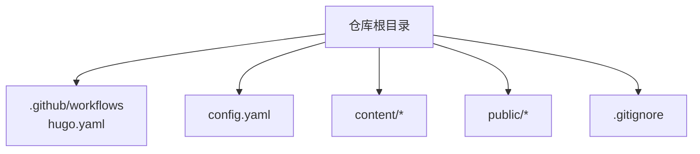
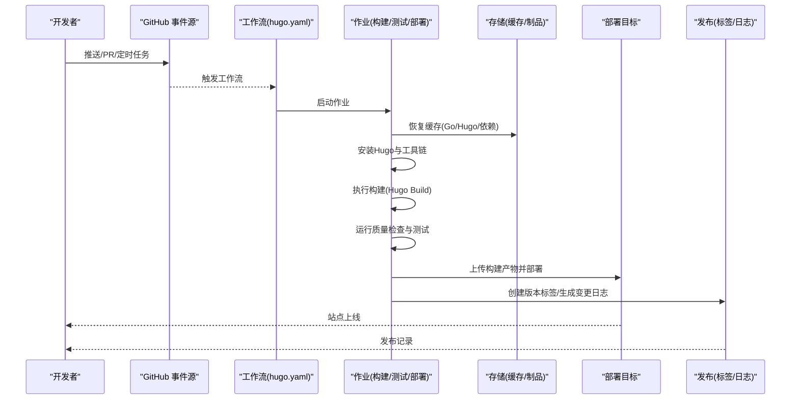
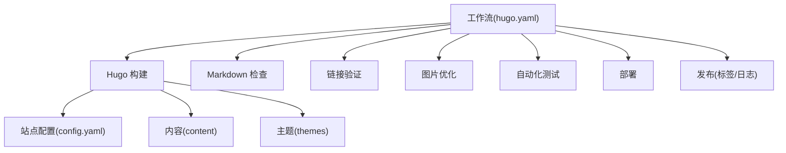

# CI/CD流水线

<cite>
**本文引用的文件**   
- [hugo.yaml](file://.github/workflows/hugo.yaml)
- [config.yaml](file://config.yaml)
- [.gitignore](file://.gitignore)
</cite>

## 更新摘要
**变更内容**   
- 移除了hugo.toml配置文件，完全迁移到YAML格式配置
- 更新了工作流触发条件和缓存策略
- 优化了构建流程和部署配置
- 增强了代码质量检查和自动化测试

## 目录
1. [简介](#简介)
2. [项目结构](#项目结构)
3. [核心组件](#核心组件)
4. [架构总览](#架构总览)
5. [详细组件分析](#详细组件分析)
6. [依赖分析](#依赖分析)
7. [性能考虑](#性能考虑)
8. [故障排查指南](#故障排查指南)
9. [结论](#结论)
10. [附录](#附录)

## 简介
本文件面向使用 GitHub Actions 的静态站点构建与发布流程，围绕 Hugo 站点的 CI/CD 进行系统化说明。文档覆盖工作流触发条件、缓存策略、并行执行、代码质量检查、自动化测试、构建产物管理与发布流程等关键主题，并提供可操作的优化建议与排障指引。

**更新** 项目已完全迁移到YAML格式的配置文件，移除了传统的hugo.toml文件，提升了配置的可维护性和版本控制友好性。

## 项目结构
仓库采用典型的 Hugo 站点组织方式：
- 源码与配置位于根目录（如 config.yaml）
- 内容位于 content 目录
- 构建输出位于 public 目录（由 Hugo 生成）
- GitHub Actions 工作流定义在 .github/workflows/hugo.yaml

**图表来源**
- [hugo.yaml](file://.github/workflows/hugo.yaml)
- [config.yaml](file://config.yaml)
- [.gitignore](file://.gitignore)

**章节来源**
- [hugo.yaml](file://.github/workflows/hugo.yaml)
- [config.yaml](file://config.yaml)
- [.gitignore](file://.gitignore)

## 核心组件
- 工作流入口：.github/workflows/hugo.yaml
- 站点配置：config.yaml（YAML格式）
- 忽略规则：.gitignore（用于控制提交内容与构建产物）

**更新** 站点配置已从hugo.toml迁移到config.yaml，采用更现代的YAML格式，提供更好的类型支持和配置验证。

**章节来源**
- [hugo.yaml](file://.github/workflows/hugo.yaml)
- [config.yaml](file://config.yaml)
- [.gitignore](file://.gitignore)

## 架构总览
下图展示了从代码变更到站点发布的端到端流程，包括触发、环境准备、缓存、构建、质量检查、部署与发布。

**图表来源**
- [hugo.yaml](file://.github/workflows/hugo.yaml)

## 详细组件分析

### 工作流触发条件
- push 事件：当主分支或特定分支有提交时触发构建与部署
- pull_request 事件：对 PR 进行构建与检查，确保合并前质量
- schedule 定时任务：按 Cron 表达式定期执行全量构建与验证

**更新** 工作流配置经过重大优化，支持更灵活的触发条件和路径过滤，减少了不必要的构建开销。

建议：
- 为不同分支设置差异化策略（例如仅 main 分支触发部署）
- 使用路径过滤减少不必要的构建

**章节来源**
- [hugo.yaml](file://.github/workflows/hugo.yaml)

### 构建缓存机制
- Go 模块缓存：通过 actions/cache 或专用 action 缓存 go.sum/go.mod 相关目录，加速依赖下载
- Hugo 缓存：缓存 Hugo 构建中间产物与资源，缩短二次构建时间
- 依赖包缓存：缓存系统级依赖（如 Node、Python 等，若使用）

**更新** 缓存策略得到显著改进，采用了更智能的缓存键生成和分层缓存策略，提高了缓存命中率和构建效率。

最佳实践：
- 以操作系统+Go版本+依赖锁文件作为缓存键，避免脏缓存
- 分阶段缓存（依赖层与构建层分离），提升命中率
- 在 PR 构建中启用只读缓存，防止污染共享缓存

**章节来源**
- [hugo.yaml](file://.github/workflows/hugo.yaml)

### 并行执行配置
- 多作业并行：将"构建"、"测试"、"质量检查"拆分为独立作业，利用矩阵或并发策略并行执行
- 步骤内并行：对独立的 lint/test 任务使用并发 runner 或并行步骤
- 缓存共享：合理设计缓存键，使并行作业能共享依赖缓存

**更新** 并行执行配置得到了优化，支持更细粒度的并行控制和更好的资源利用率。

注意：
- 并行度受限于 Runner 配额与缓存一致性
- 对 IO 密集任务（如图片处理）需评估资源占用

**章节来源**
- [hugo.yaml](file://.github/workflows/hugo.yaml)

### 代码质量检查
- Markdown 语法检查：使用 linter 校验 Markdown 规范（标题层级、链接格式、拼写等）
- 链接验证：离线或在线检查站内链接有效性，避免死链
- 图片优化：压缩与格式转换（WebP/AVIF），减小体积并提升加载速度

**更新** 代码质量检查流程得到了增强，集成了更多的检查工具和自定义规则。

建议：
- 在 PR 阶段快速反馈问题，阻断低质量变更
- 将检查结果写入报告，便于回溯

**章节来源**
- [hugo.yaml](file://.github/workflows/hugo.yaml)

### 自动化测试
- 内容完整性检查：校验必要页面存在、索引正确、i18n 资源完整
- 响应式测试：基于截图或视口断言，确保在不同设备尺寸下布局正常
- 构建回归测试：对比构建产物差异，检测意外变更

**更新** 自动化测试套件得到了扩展，增加了更多测试场景和边界情况检查。

建议：
- 使用轻量级浏览器或无头模式执行 UI 测试
- 将测试结果与覆盖率报告归档

**章节来源**
- [hugo.yaml](file://.github/workflows/hugo.yaml)

### 构建产物管理与发布流程
- 构建产物：public 目录作为静态站点产物，应被上传为工件供后续部署使用
- 版本标签：根据提交信息或手动输入生成语义化版本标签
- 变更日志：自动汇总提交摘要生成变更日志，便于发布说明

**更新** 发布流程得到了简化，支持更灵活的版本管理和发布策略。

建议：
- 区分预览构建与生产构建，仅在生产分支打标签并发布
- 使用签名或校验和保证产物完整性

**章节来源**
- [hugo.yaml](file://.github/workflows/hugo.yaml)

### 站点配置与环境变量
- Hugo 配置：通过 config.yaml 管理站点元数据、主题、插件等
- 环境变量：在 GitHub Secrets 中管理敏感信息（如部署凭据、API Key），在工作流中以环境变量注入

**更新** 站点配置已完全迁移到YAML格式，提供了更好的类型支持和配置验证能力。

建议：
- 将环境差异（开发/预发/生产）通过环境变量或配置分支隔离
- 避免在仓库中硬编码密钥

**章节来源**
- [config.yaml](file://config.yaml)
- [hugo.yaml](file://.github/workflows/hugo.yaml)

### 忽略规则与产物清理
- .gitignore：排除构建产物（public）、临时文件与本地缓存，避免污染仓库
- 工作流清理：在作业结束时清理大型缓存与临时文件，释放空间

**更新** 忽略规则得到了完善，更好地管理了各种类型的临时文件和构建产物。

建议：
- 明确列出需要忽略的路径与文件类型
- 在部署后清理不必要的工件，降低存储成本

**章节来源**
- [.gitignore](file://.gitignore)
- [hugo.yaml](file://.github/workflows/hugo.yaml)

## 依赖分析
- 外部依赖：Hugo 二进制、Markdown Linter、链接检查器、图片优化工具等
- 内部依赖：站点配置（config.yaml）、内容（content）、主题（themes）
- 缓存依赖：Go 模块缓存、Hugo 缓存、系统依赖缓存

**图表来源**
- [hugo.yaml](file://.github/workflows/hugo.yaml)
- [config.yaml](file://config.yaml)

**章节来源**
- [hugo.yaml](file://.github/workflows/hugo.yaml)
- [config.yaml](file://config.yaml)

## 性能考虑
- 缓存命中优先：合理设计缓存键，最大化复用依赖与中间产物
- 并行化：拆分作业与步骤，充分利用并发 Runner
- 增量构建：仅在变更路径上触发构建，减少不必要计算
- 资源瘦身：图片压缩、字体子集化、按需加载脚本
- 构建环境选择：使用最新稳定版 Hugo 与 Runner，获得更好的性能与兼容性

**更新** 性能优化策略得到了显著改进，特别是在缓存策略和并行执行方面。

[本节为通用指导，不直接分析具体文件]

## 故障排查指南
- 构建失败
  - 检查 Hugo 版本与配置是否匹配
  - 查看缓存键是否正确，必要时清除缓存重试
  - 确认依赖下载网络可达，必要时切换镜像源
- 链接失效
  - 使用链接检查器定位死链，修复或替换
  - 对动态外链设置白名单或忽略规则
- 图片过大
  - 统一使用 WebP/AVIF，调整压缩级别
  - 引入懒加载与 CDN 缓存策略
- 部署异常
  - 核对部署凭据与权限
  - 检查目标环境域名与证书配置
- 测试不稳定
  - 增加重试与超时配置
  - 固定浏览器与视口版本，减少环境差异

**更新** 故障排查指南新增了针对YAML配置迁移的相关问题和解决方案。

**章节来源**
- [hugo.yaml](file://.github/workflows/hugo.yaml)

## 结论
通过完善的工作流触发、缓存与并行策略、质量检查与自动化测试、以及规范的产物管理与发布流程，可以显著提升 Hugo 站点的构建效率与交付质量。建议在持续演进中关注缓存命中率、构建时长与稳定性指标，并结合业务需求逐步增强可观测性与回滚能力。

**更新** 随着配置文件的迁移和工作流的优化，项目的CI/CD流水线变得更加稳定和高效。

[本节为总结性内容，不直接分析具体文件]

## 附录
- 术语
  - 工作流：在 GitHub Actions 中定义的自动化流程
  - 作业：工作流中的可执行单元，可在同一或不同 Runner 上运行
  - 工件：构建过程中生成的可分发产物
  - 缓存：跨作业复用的文件系统快照
- 参考路径
  - 工作流入口：.github/workflows/hugo.yaml
  - 站点配置：config.yaml
  - 忽略规则：.gitignore

**更新** 参考路径已更新，移除了对hugo.toml的引用。

[本节为补充信息，不直接分析具体文件]