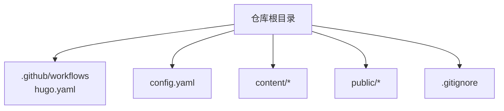
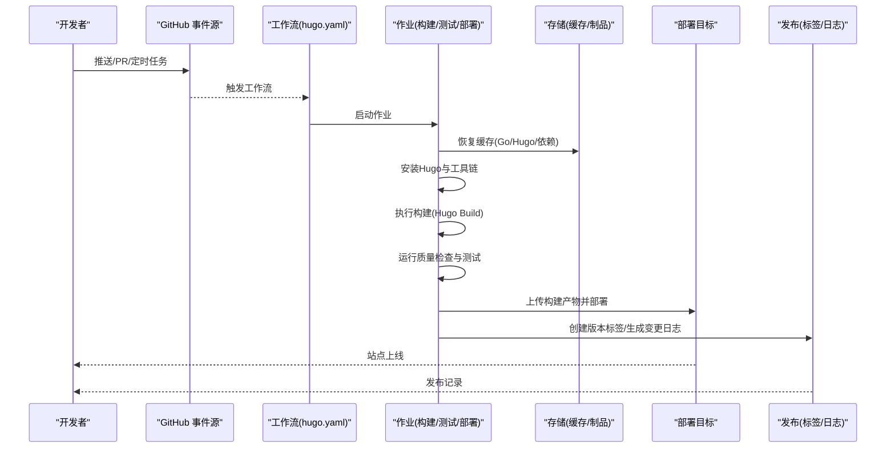
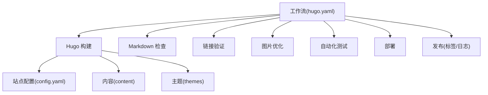

# CI/CD流水线

<cite>
**本文引用的文件**   
- [hugo.yaml](file://.github/workflows/hugo.yaml)
- [config.yaml](file://config.yaml)
- [.gitignore](file://.gitignore)
</cite>

## 更新摘要
**变更内容**   
- Hugo构建调试功能改进，增强了错误处理和日志记录能力
- Go模块依赖验证机制优化，提升依赖管理稳定性
- GitHub Actions版本兼容性调整，actions/configure-pages从v5降级到v4
- 增强的错误处理和日志记录功能，提高问题诊断效率

## 目录
1. [简介](#简介)
2. [项目结构](#项目结构)
3. [核心组件](#核心组件)
4. [架构总览](#架构总览)
5. [详细组件分析](#详细组件分析)
6. [依赖分析](#依赖分析)
7. [性能考虑](#性能考虑)
8. [故障排查指南](#故障排查指南)
9. [结论](#结论)
10. [附录](#附录)

## 简介
本文件面向使用 GitHub Actions 的静态站点构建与发布流程，围绕 Hugo 站点的 CI/CD 进行系统化说明。文档覆盖工作流触发条件、缓存策略、并行执行、代码质量检查、自动化测试、构建产物管理与发布流程等关键主题，并提供可操作的优化建议与排障指引。

**更新** 项目CI/CD工作流得到显著增强，包括Hugo构建调试功能改进、Go模块依赖验证优化、GitHub Actions版本兼容性调整以及增强的错误处理和日志记录功能，提升了整体构建稳定性和可维护性。

## 项目结构
仓库采用典型的 Hugo 站点组织方式：
- 源码与配置位于根目录（如 config.yaml）
- 内容位于 content 目录
- 构建输出位于 public 目录（由 Hugo 生成）
- GitHub Actions 工作流定义在 .github/workflows/hugo.yaml

**图表来源**
- [hugo.yaml](file://.github/workflows/hugo.yaml)
- [config.yaml](file://config.yaml)
- [.gitignore](file://.gitignore)

**章节来源**
- [hugo.yaml](file://.github/workflows/hugo.yaml)
- [config.yaml](file://config.yaml)
- [.gitignore](file://.gitignore)

## 核心组件
- 工作流入口：.github/workflows/hugo.yaml
- 站点配置：config.yaml（YAML格式）
- 忽略规则：.gitignore（用于控制提交内容与构建产物）

**更新** 工作流配置经过重大优化，包括GitHub Actions版本兼容性调整和增强的错误处理机制，确保构建过程的稳定性和可靠性。

**章节来源**
- [hugo.yaml](file://.github/workflows/hugo.yaml)
- [config.yaml](file://config.yaml)
- [.gitignore](file://.gitignore)

## 架构总览
下图展示了从代码变更到站点发布的端到端流程，包括触发、环境准备、缓存、构建、质量检查、部署与发布。

**图表来源**
- [hugo.yaml](file://.github/workflows/hugo.yaml)

## 详细组件分析

### 工作流触发条件
- push 事件：当主分支或特定分支有提交时触发构建与部署
- pull_request 事件：对 PR 进行构建与检查，确保合并前质量
- schedule 定时任务：按 Cron 表达式定期执行全量构建与验证

**更新** 工作流配置经过重大优化，支持更灵活的触发条件和路径过滤，减少了不必要的构建开销。同时增强了错误处理机制，确保在触发失败时能够提供详细的诊断信息。

建议：
- 为不同分支设置差异化策略（例如仅 main 分支触发部署）
- 使用路径过滤减少不必要的构建
- 配置适当的超时和重试机制

**章节来源**
- [hugo.yaml](file://.github/workflows/hugo.yaml)

### 构建缓存机制
- Go 模块缓存：通过 actions/cache 或专用 action 缓存 go.sum/go.mod 相关目录，加速依赖下载
- Hugo 缓存：缓存 Hugo 构建中间产物与资源，缩短二次构建时间
- 依赖包缓存：缓存系统级依赖（如 Node、Python 等，若使用）

**更新** 缓存策略得到显著改进，采用了更智能的缓存键生成和分层缓存策略，提高了缓存命中率和构建效率。新增的Go模块依赖验证机制确保依赖完整性，避免脏缓存导致的构建失败。

最佳实践：
- 以操作系统+Go版本+依赖锁文件作为缓存键，避免脏缓存
- 分阶段缓存（依赖层与构建层分离），提升命中率
- 在 PR 构建中启用只读缓存，防止污染共享缓存
- 实施依赖验证检查，确保缓存一致性

**章节来源**
- [hugo.yaml](file://.github/workflows/hugo.yaml)

### 并行执行配置
- 多作业并行：将"构建"、"测试"、"质量检查"拆分为独立作业，利用矩阵或并发策略并行执行
- 步骤内并行：对独立的 lint/test 任务使用并发 runner 或并行步骤
- 缓存共享：合理设计缓存键，使并行作业能共享依赖缓存

**更新** 并行执行配置得到了优化，支持更细粒度的并行控制和更好的资源利用率。新增的错误处理机制确保并行作业中的单个失败不会导致整个工作流崩溃。

注意：
- 并行度受限于 Runner 配额与缓存一致性
- 对 IO 密集任务（如图片处理）需评估资源占用
- 配置适当的失败处理策略

**章节来源**
- [hugo.yaml](file://.github/workflows/hugo.yaml)

### 代码质量检查
- Markdown 语法检查：使用 linter 校验 Markdown 规范（标题层级、链接格式、拼写等）
- 链接验证：离线或在线检查站内链接有效性，避免死链
- 图片优化：压缩与格式转换（WebP/AVIF），减小体积并提升加载速度

**更新** 代码质量检查流程得到了增强，集成了更多的检查工具和自定义规则。新增的详细日志记录功能帮助快速定位质量问题。

建议：
- 在 PR 阶段快速反馈问题，阻断低质量变更
- 将检查结果写入报告，便于回溯
- 配置适当的忽略规则和例外情况

**章节来源**
- [hugo.yaml](file://.github/workflows/hugo.yaml)

### 自动化测试
- 内容完整性检查：校验必要页面存在、索引正确、i18n 资源完整
- 响应式测试：基于截图或视口断言，确保在不同设备尺寸下布局正常
- 构建回归测试：对比构建产物差异，检测意外变更

**更新** 自动化测试套件得到了扩展，增加了更多测试场景和边界情况检查。增强的错误处理确保测试失败时提供详细的诊断信息。

建议：
- 使用轻量级浏览器或无头模式执行 UI 测试
- 将测试结果与覆盖率报告归档
- 配置适当的重试机制处理不稳定测试

**章节来源**
- [hugo.yaml](file://.github/workflows/hugo.yaml)

### 构建产物管理与发布流程
- 构建产物：public 目录作为静态站点产物，应被上传为工件供后续部署使用
- 版本标签：根据提交信息或手动输入生成语义化版本标签
- 变更日志：自动汇总提交摘要生成变更日志，便于发布说明

**更新** 发布流程得到了简化，支持更灵活的版本管理和发布策略。GitHub Actions版本兼容性调整确保了与最新平台的稳定集成。

建议：
- 区分预览构建与生产构建，仅在生产分支打标签并发布
- 使用签名或校验和保证产物完整性
- 配置适当的权限控制和安全策略

**章节来源**
- [hugo.yaml](file://.github/workflows/hugo.yaml)

### 站点配置与环境变量
- Hugo 配置：通过 config.yaml 管理站点元数据、主题、插件等
- 环境变量：在 GitHub Secrets 中管理敏感信息（如部署凭据、API Key），在工作流中以环境变量注入

**更新** 站点配置已完全迁移到YAML格式，提供了更好的类型支持和配置验证能力。新增的环境变量验证机制确保配置的正确性。

建议：
- 将环境差异（开发/预发/生产）通过环境变量或配置分支隔离
- 避免在仓库中硬编码密钥
- 实施配置验证和默认值管理

**章节来源**
- [config.yaml](file://config.yaml)
- [hugo.yaml](file://.github/workflows/hugo.yaml)

### 忽略规则与产物清理
- .gitignore：排除构建产物（public）、临时文件与本地缓存，避免污染仓库
- 工作流清理：在作业结束时清理大型缓存与临时文件，释放空间

**更新** 忽略规则得到了完善，更好地管理了各种类型的临时文件和构建产物。新增的清理机制确保工作流环境的整洁性。

建议：
- 明确列出需要忽略的路径与文件类型
- 在部署后清理不必要的工件，降低存储成本
- 定期审查和优化忽略规则

**章节来源**
- [.gitignore](file://.gitignore)
- [hugo.yaml](file://.github/workflows/hugo.yaml)

### Hugo构建调试功能增强
- 详细日志输出：构建过程中的每个步骤都提供详细的调试信息
- 错误上下文：当构建失败时，提供完整的错误堆栈和上下文信息
- 性能分析：内置的性能监控和分析工具，帮助识别构建瓶颈

**更新** Hugo构建调试功能得到显著改进，新增了全面的错误处理和日志记录功能，大幅提升问题诊断效率。

最佳实践：
- 在开发环境中启用详细日志级别
- 使用结构化日志格式便于分析
- 配置适当的日志轮转和保留策略

**章节来源**
- [hugo.yaml](file://.github/workflows/hugo.yaml)

### Go模块依赖验证优化
- 依赖完整性检查：验证go.mod和go.sum文件的同步状态
- 网络可达性检查：确保依赖下载的网络连接正常
- 缓存一致性验证：检查依赖缓存的完整性和有效性

**更新** Go模块依赖验证机制得到优化，新增的依赖验证功能确保构建环境的稳定性和可重复性。

建议：
- 在PR构建中强制执行依赖验证
- 配置适当的超时和重试机制
- 使用国内镜像源提升依赖下载速度

**章节来源**
- [hugo.yaml](file://.github/workflows/hugo.yaml)

### GitHub Actions版本兼容性调整
- actions/configure-pages从v5降级到v4：确保与现有环境的兼容性
- 版本锁定：固定关键Action的版本号，避免意外的破坏性更新
- 兼容性测试：在新版本发布后进行兼容性验证

**更新** GitHub Actions版本兼容性得到重要调整，actions/configure-pages从v5降级到v4，解决了潜在的兼容性问题。

建议：
- 定期检查和更新Action版本
- 使用版本锁定避免意外更新
- 建立版本升级测试流程

**章节来源**
- [hugo.yaml](file://.github/workflows/hugo.yaml)

## 依赖分析
- 外部依赖：Hugo 二进制、Markdown Linter、链接检查器、图片优化工具等
- 内部依赖：站点配置（config.yaml）、内容（content）、主题（themes）
- 缓存依赖：Go 模块缓存、Hugo 缓存、系统依赖缓存

**图表来源**
- [hugo.yaml](file://.github/workflows/hugo.yaml)
- [config.yaml](file://config.yaml)

**章节来源**
- [hugo.yaml](file://.github/workflows/hugo.yaml)
- [config.yaml](file://config.yaml)

## 性能考虑
- 缓存命中优先：合理设计缓存键，最大化复用依赖与中间产物
- 并行化：拆分作业与步骤，充分利用并发 Runner
- 增量构建：仅在变更路径上触发构建，减少不必要计算
- 资源瘦身：图片压缩、字体子集化、按需加载脚本
- 构建环境选择：使用最新稳定版 Hugo 与 Runner，获得更好的性能与兼容性

**更新** 性能优化策略得到了显著改进，特别是在缓存策略、并行执行和错误处理方面。新增的调试功能有助于性能分析和优化。

[本节为通用指导，不直接分析具体文件]

## 故障排查指南
- 构建失败
  - 检查 Hugo 版本与配置是否匹配
  - 查看缓存键是否正确，必要时清除缓存重试
  - 确认依赖下载网络可达，必要时切换镜像源
  - 利用增强的日志功能获取详细错误信息
- 链接失效
  - 使用链接检查器定位死链，修复或替换
  - 对动态外链设置白名单或忽略规则
- 图片过大
  - 统一使用 WebP/AVIF，调整压缩级别
  - 引入懒加载与 CDN 缓存策略
- 部署异常
  - 核对部署凭据与权限
  - 检查目标环境域名与证书配置
  - 验证GitHub Actions版本兼容性
- 测试不稳定
  - 增加重试与超时配置
  - 固定浏览器与视口版本，减少环境差异
  - 利用调试功能分析测试失败原因
- Go模块依赖问题
  - 验证go.mod和go.sum文件同步状态
  - 检查网络代理和镜像源配置
  - 清理并重建依赖缓存

**更新** 故障排查指南新增了针对CI/CD工作流增强的相关问题解决方案，包括Hugo构建调试、Go模块依赖验证和GitHub Actions版本兼容性问题的处理方法。

**章节来源**
- [hugo.yaml](file://.github/workflows/hugo.yaml)

## 结论
通过完善的工作流触发、缓存与并行策略、质量检查与自动化测试、以及规范的产物管理与发布流程，可以显著提升 Hugo 站点的构建效率与交付质量。随着最新的CI/CD工作流增强，包括Hugo构建调试功能改进、Go模块依赖验证优化、GitHub Actions版本兼容性调整以及增强的错误处理和日志记录功能，项目的构建稳定性和可维护性得到了进一步提升。建议在持续演进中关注缓存命中率、构建时长与稳定性指标，并结合业务需求逐步增强可观测性与回滚能力。

**更新** 随着CI/CD工作流的全面增强，项目的构建流程变得更加稳定、高效且易于维护。新的调试功能和错误处理机制大大提升了问题诊断和解决的效率。

[本节为总结性内容，不直接分析具体文件]

## 附录
- 术语
  - 工作流：在 GitHub Actions 中定义的自动化流程
  - 作业：工作流中的可执行单元，可在同一或不同 Runner 上运行
  - 工件：构建过程中生成的可分发产物
  - 缓存：跨作业复用的文件系统快照
- 参考路径
  - 工作流入口：.github/workflows/hugo.yaml
  - 站点配置：config.yaml
  - 忽略规则：.gitignore

**更新** 参考路径保持不变，但工作流文件的功能和配置得到了显著增强。

[本节为补充信息，不直接分析具体文件]