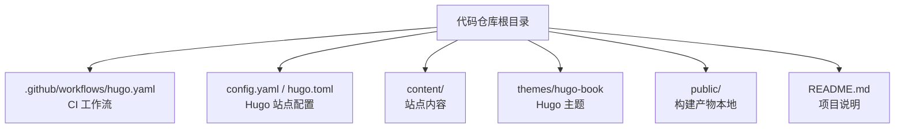
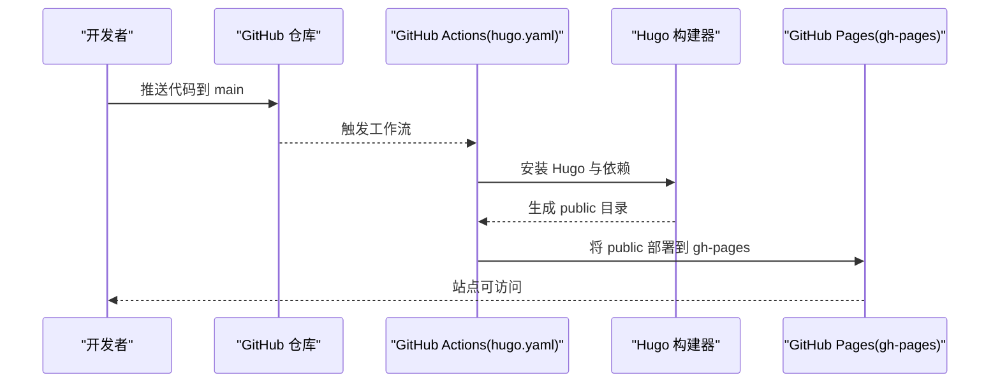
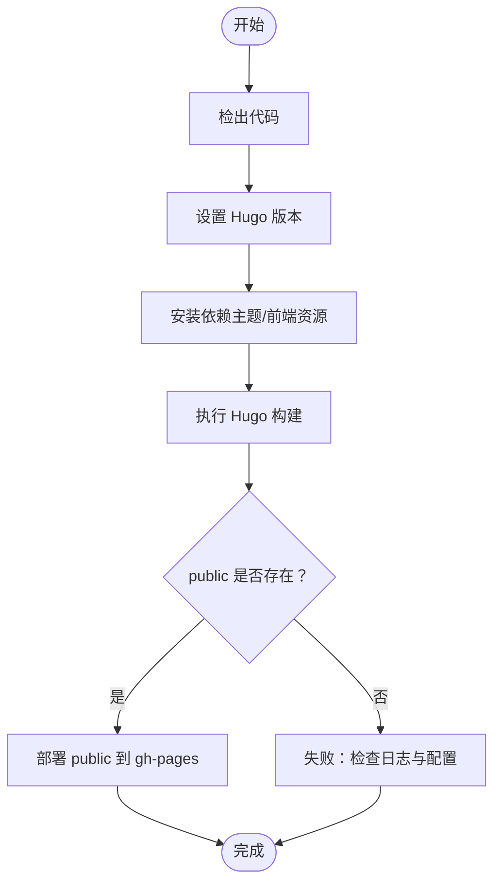
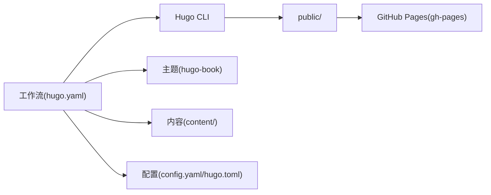

# GitHub Pages部署

<cite>
**本文引用的文件**   
- [hugo.yaml](file://.github/workflows/hugo.yaml)
- [config.yaml](file://config.yaml)
- [hugo.toml](file://hugo.toml)
- [README.md](file://README.md)
</cite>

## 目录
1. [简介](#简介)
2. [项目结构](#项目结构)
3. [核心组件](#核心组件)
4. [架构总览](#架构总览)
5. [详细组件分析](#详细组件分析)
6. [依赖分析](#依赖分析)
7. [性能考虑](#性能考虑)
8. [故障排查指南](#故障排查指南)
9. [结论](#结论)
10. [附录](#附录)

## 简介
本指南面向使用 Hugo + GitHub Pages 的静态站点，提供从仓库设置、分支策略、自定义域名绑定到 GitHub Actions 工作流配置与本地验证的全流程说明。重点覆盖：
- 以 main 为源分支的 Pages 发布策略
- 通过 GitHub Actions 自动构建与部署
- 环境变量与构建参数（如 Hugo 版本）的配置方式
- 本地预览与测试方法
- 常见问题定位与修复建议

## 项目结构
该仓库采用典型的 Hugo 主题化结构，关键目录与文件包括：
- .github/workflows/hugo.yaml：GitHub Actions 工作流定义，负责在推送或手动触发时执行构建与部署
- config.yaml / hugo.toml：Hugo 站点配置（站点元信息、主题、输出格式等）
- content/：站点内容（Markdown 文档与文章）
- themes/hugo-book：使用的 Hugo 主题（book）
- public/：本地构建产物目录（通常由 .gitignore 忽略，CI 中生成并部署）
- README.md：项目说明与使用说明

图表来源
- [hugo.yaml](file://.github/workflows/hugo.yaml)
- [config.yaml](file://config.yaml)
- [hugo.toml](file://hugo.toml)
- [README.md](file://README.md)

章节来源
- [README.md](file://README.md)

## 核心组件
- GitHub Actions 工作流（hugo.yaml）
  - 作用：在 push 或手动触发时，拉取代码、安装 Hugo、安装主题依赖、构建站点并将 public 目录部署到 GitHub Pages。
  - 关键点：指定运行环境（通常为 ubuntu-latest）、选择 Hugo 版本、设置部署目标分支（通常为 gh-pages）与源目录（public）。
- Hugo 站点配置（config.yaml / hugo.toml）
  - 作用：定义站点标题、基础 URL、主题、语言、菜单、SEO 与输出格式等。
  - 关键点：确保 baseURL 与 GitHub Pages 地址一致；启用必要的模块或资源压缩选项。
- 内容与主题（content/ 与 themes/hugo-book）
  - 作用：站点内容与页面模板、样式、脚本均由主题提供。
  - 关键点：主题版本与 Hugo 版本兼容性需匹配。

章节来源
- [hugo.yaml](file://.github/workflows/hugo.yaml)
- [config.yaml](file://config.yaml)
- [hugo.toml](file://hugo.toml)

## 架构总览
下图展示了从代码提交到站点上线的整体流程，以及各组件之间的交互关系。

图表来源
- [hugo.yaml](file://.github/workflows/hugo.yaml)

## 详细组件分析

### GitHub Actions 工作流（hugo.yaml）
- 触发条件
  - 默认监听 main 分支的 push 事件，也可支持手动触发（workflow_dispatch）。
- 运行环境
  - 使用 ubuntu-latest 作为运行容器。
- 步骤概览
  - 检出代码（actions/checkout）
  - 设置 Hugo 版本（如 actions/setup-hugo 或缓存策略）
  - 安装主题依赖（如 npm/yarn 用于前端资源）
  - 执行 Hugo 构建（hugo --minify 等参数）
  - 部署到 GitHub Pages（peaceiris/actions-gh-pages 或内置 Pages 支持）
- 环境变量与密钥
  - 可在仓库 Settings > Secrets and variables > Actions 中配置 HUGO_VERSION、DEPLOY_TOKEN 等。
  - 若使用自定义域名，需在 Pages 设置中绑定 CNAME，并在 Hugo 配置中设置 baseURL。

图表来源
- [hugo.yaml](file://.github/workflows/hugo.yaml)

章节来源
- [hugo.yaml](file://.github/workflows/hugo.yaml)

### Hugo 站点配置（config.yaml / hugo.toml）
- 站点基础信息
  - 标题、描述、作者、语言等
- 主题与模块
  - 指定主题名称（如 hugo-book），必要时启用模块系统
- 输出与 SEO
  - 启用 sitemap、RSS、搜索索引等
- 基础 URL（baseURL）
  - 必须与 GitHub Pages 实际地址一致（例如 https://username.github.io 或自定义域名）
- 构建参数
  - 可通过命令行传入（如 --minify、--gc），或在配置中声明默认值

章节来源
- [config.yaml](file://config.yaml)
- [hugo.toml](file://hugo.toml)

### 分支策略与 Pages 源
- 推荐策略
  - 主开发分支：main
  - 发布分支：gh-pages（仅存放构建产物 public）
- 工作流职责
  - 从 main 构建，将 public 推送到 gh-pages，GitHub Pages 服务 gh-pages 分支的内容
- 注意事项
  - 避免在 gh-pages 上直接编辑内容，防止冲突
  - 如需回滚，可回退 gh-pages 的历史提交

章节来源
- [hugo.yaml](file://.github/workflows/hugo.yaml)

### 自定义域名绑定
- 在 GitHub Pages 设置中绑定 CNAME 记录指向仓库域名
- 在 Hugo 配置中将 baseURL 设置为自定义域名
- 等待 DNS 生效后，通过 HTTPS 访问站点

章节来源
- [hugo.yaml](file://.github/workflows/hugo.yaml)
- [config.yaml](file://config.yaml)
- [hugo.toml](file://hugo.toml)

## 依赖分析
- 外部依赖
  - GitHub Actions 官方 Action（checkout、setup-hugo、gh-pages 部署）
  - Hugo CLI 及其插件/模块（按需）
  - 主题 hugo-book 的前端资源（可能依赖 npm/yarn）
- 内部依赖
  - 工作流依赖站点配置（config.yaml/hugo.toml）
  - 构建产物依赖主题与内容完整性

图表来源
- [hugo.yaml](file://.github/workflows/hugo.yaml)
- [config.yaml](file://config.yaml)
- [hugo.toml](file://hugo.toml)

章节来源
- [hugo.yaml](file://.github/workflows/hugo.yaml)
- [config.yaml](file://config.yaml)
- [hugo.toml](file://hugo.toml)

## 性能考虑
- 构建优化
  - 启用 Hugo 的 --minify 与资源缓存
  - 使用 Actions 缓存 Hugo 二进制与依赖，缩短构建时间
- 资源优化
  - 图片压缩、懒加载、CDN 加速
  - 合理划分主题模块，减少不必要的资源加载
- 部署效率
  - 增量构建（按主题与内容变更情况）
  - 控制 gh-pages 分支体积，避免历史污染

[本节为通用指导，不直接分析具体文件]

## 故障排查指南
- 构建失败
  - 检查 Hugo 版本与主题兼容性
  - 查看 Actions 日志中的错误堆栈与提示
  - 确认依赖是否完整安装（npm/yarn 包、Go 模块等）
- 资源加载错误
  - 核对 baseURL 是否与部署域名一致
  - 检查相对路径与绝对路径引用是否正确
  - 清理浏览器缓存或使用无痕模式验证
- 部署未生效
  - 确认 gh-pages 分支已更新且包含 public 目录
  - 检查 Pages 设置中的源分支与根目录
  - 自定义域名需确认 CNAME 记录正确且已生效
- 权限问题
  - 确认 Actions 对仓库具有写入权限
  - 若使用私有仓库，检查 Secret 配置与访问令牌

章节来源
- [hugo.yaml](file://.github/workflows/hugo.yaml)
- [config.yaml](file://config.yaml)
- [hugo.toml](file://hugo.toml)

## 结论
通过将 main 分支作为开发源、gh-pages 作为 Pages 源，并结合 GitHub Actions 自动化构建与部署，可实现稳定高效的静态站点发布流程。配合合理的本地验证与问题排查策略，可显著降低上线风险并提升迭代效率。

[本节为总结性内容，不直接分析具体文件]

## 附录
- 本地预览与测试
  - 安装 Hugo 后，在项目根目录执行本地构建命令，打开生成的 public 目录进行验证
  - 使用 Hugo 的 serve 功能进行热重载预览
- 常用环境变量与参数
  - HUGO_VERSION：指定 Hugo 版本
  - DEPLOY_TOKEN：部署所需的访问令牌（视工作流实现而定）
  - 构建参数：--minify、--gc、--quiet 等

[本节为补充说明，不直接分析具体文件]