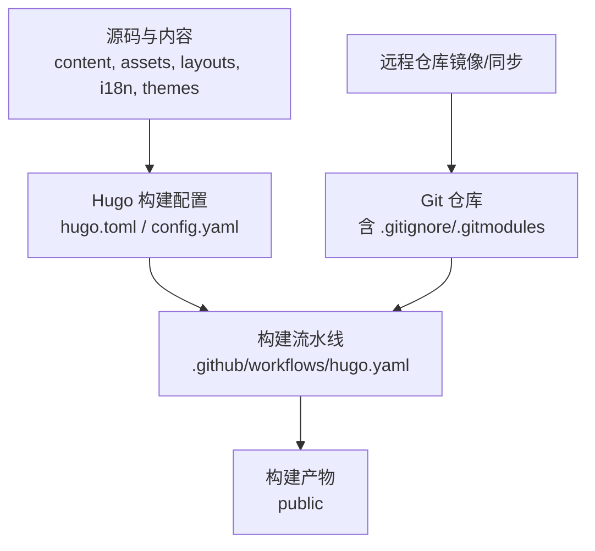
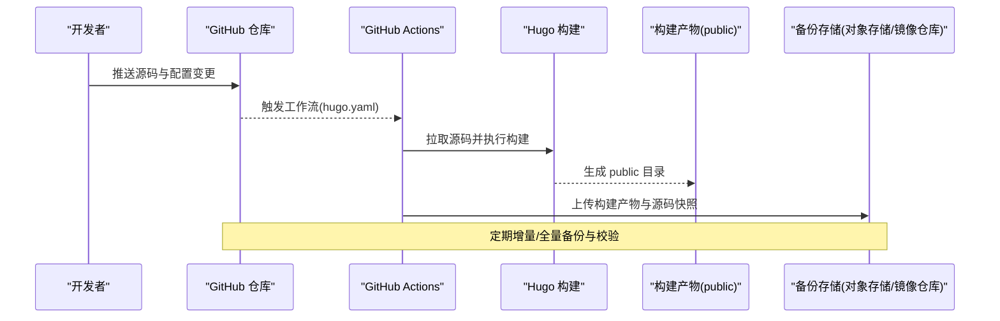
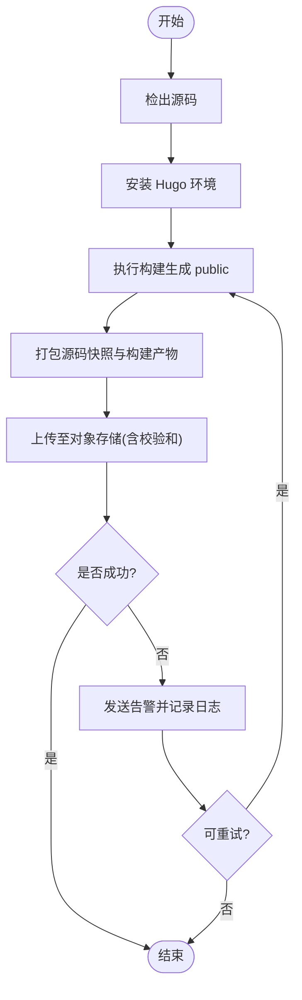
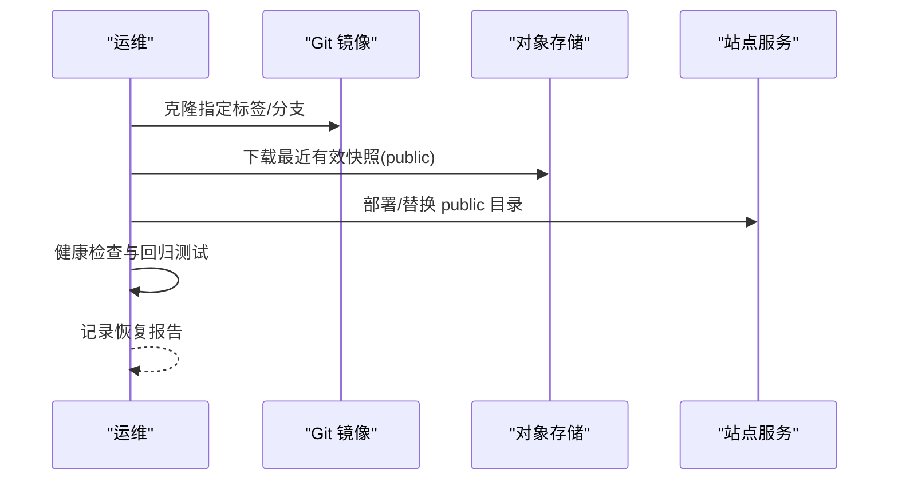
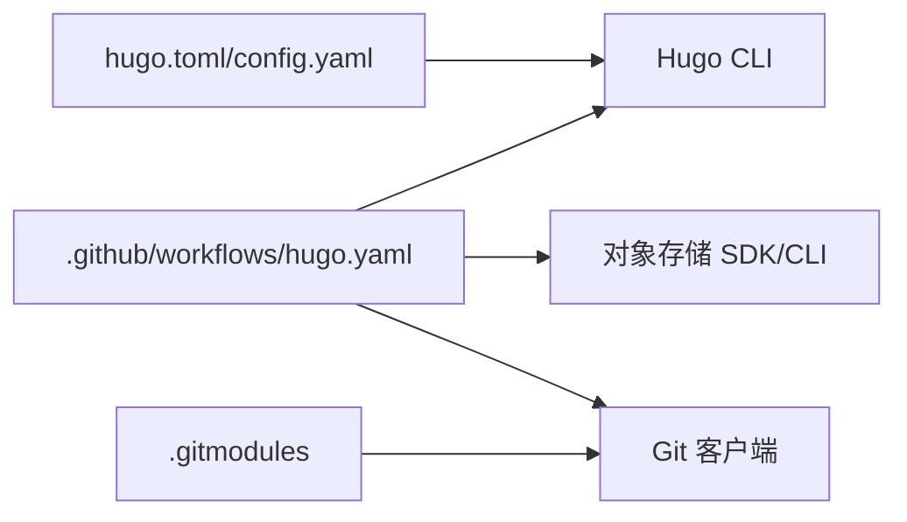

# 备份与恢复

<cite>
**本文引用的文件**   
- [hugo.yaml](file://.github/workflows/hugo.yaml)
- [config.yaml](file://config.yaml)
- [hugo.toml](file://hugo.toml)
- [.gitignore](file://.gitignore)
- [.gitmodules](file://.gitmodules)
</cite>

## 目录
1. [简介](#简介)
2. [项目结构](#项目结构)
3. [核心组件](#核心组件)
4. [架构总览](#架构总览)
5. [详细组件分析](#详细组件分析)
6. [依赖关系分析](#依赖关系分析)
7. [性能考虑](#性能考虑)
8. [故障排查指南](#故障排查指南)
9. [结论](#结论)
10. [附录](#附录)

## 简介
本文件为项目的数据保护与灾难恢复方案，覆盖内容备份策略、Git仓库备份机制、自动化备份任务设计、恢复流程与演练、多区域部署与故障转移等高级策略，以及备份数据的存储位置与访问权限管理。目标是确保站点源码、静态资源与构建产物在各类故障场景下可快速恢复，满足业务连续性与合规要求。

## 项目结构
本项目为基于 Hugo 的静态站点，关键目录与文件包括：
- 源码与内容：content、assets、layouts、i18n、themes（主题）
- 构建配置：hugo.toml、config.yaml
- 构建产物：public（由构建生成）
- 工作流：.github/workflows/hugo.yaml（GitHub Actions）
- Git 相关：.gitignore、.gitmodules（子模块）

图表来源
- [hugo.yaml](file://.github/workflows/hugo.yaml)
- [hugo.toml](file://hugo.toml)
- [config.yaml](file://config.yaml)
- [.gitignore](file://.gitignore)
- [.gitmodules](file://.gitmodules)

章节来源
- [hugo.yaml](file://.github/workflows/hugo.yaml)
- [hugo.toml](file://hugo.toml)
- [config.yaml](file://config.yaml)
- [.gitignore](file://.gitignore)
- [.gitmodules](file://.gitmodules)

## 核心组件
- 内容源与资源
  - Markdown 文档与图片等资源位于 content、assets、static 等目录，是站点内容的权威来源。
- 构建配置
  - hugo.toml 与 config.yaml 控制构建行为与站点元信息，需纳入版本控制与备份范围。
- 构建流水线
  - GitHub Actions 工作流负责拉取源码、执行构建并产出 public 目录。
- Git 仓库
  - 通过 .gitignore 排除构建产物与敏感文件；通过 .gitmodules 管理子模块依赖。
- 构建产物
  - public 为只读静态输出，通常不纳入版本控制，但可作为归档或灾备快照。

章节来源
- [hugo.toml](file://hugo.toml)
- [config.yaml](file://config.yaml)
- [.gitignore](file://.gitignore)
- [.gitmodules](file://.gitmodules)

## 架构总览
下图展示从源码到构建产物的端到端流程，以及备份与恢复的关键节点。

图表来源
- [hugo.yaml](file://.github/workflows/hugo.yaml)

## 详细组件分析

### 内容备份策略
- 备份范围
  - 源码与内容：content、assets、layouts、i18n、themes、hugo.toml、config.yaml、.gitignore、.gitmodules 等。
  - 构建产物：public（作为快照归档）。
  - 外部资源：若使用第三方图床或 CDN，需单独备份其对象存储桶或导出清单。
- 备份频率
  - 源码与配置：每次提交即有版本化副本；建议每日一次全量快照。
  - 构建产物：每次成功构建后归档；保留最近 N 个版本。
- 存储位置
  - 主存储：对象存储（如 S3/OSS/COS），开启版本控制与生命周期策略。
  - 异地容灾：跨地域复制至另一对象存储或冷归档层。
- 完整性校验
  - 对归档包计算哈希值并记录于索引；定期抽样校验。
- 访问权限
  - 最小权限原则：仅 CI 与运维账号具备写入权限；只读用于审计与恢复。
  - 加密：传输中 TLS，静态时服务端加密；密钥由 KMS/Secrets 管理。

章节来源
- [hugo.toml](file://hugo.toml)
- [config.yaml](file://config.yaml)
- [.gitignore](file://.gitignore)
- [.gitmodules](file://.gitmodules)

### Git 仓库备份机制
- 远程镜像
  - 将主仓库镜像至第二平台（如 Gitee/GitLab），实现跨平台冗余。
- 分支与标签
  - 发布标签对应稳定快照；按标签进行归档与恢复。
- 子模块
  - 通过 .gitmodules 管理的子模块需随主仓库一并备份，避免缺失依赖。
- 大文件与 LFS
  - 若使用 Git LFS，需同时备份 LFS 对象（或迁移至对象存储）。

章节来源
- [.gitignore](file://.gitignore)
- [.gitmodules](file://.gitmodules)

### 自动备份任务（GitHub Actions）
- 触发条件
  - 推送事件、定时调度（cron）、手动触发。
- 任务步骤
  - 检出源码、安装 Hugo、执行构建、打包产物、上传至对象存储、生成校验和、通知结果。
- 安全与凭据
  - 使用 Secrets 管理访问令牌与密钥；限制作用域与有效期。
- 失败重试与告警
  - 设置重试策略；失败时发送通知（邮件/IM）。

图表来源
- [hugo.yaml](file://.github/workflows/hugo.yaml)

章节来源
- [hugo.yaml](file://.github/workflows/hugo.yaml)

### 恢复流程
- 场景一：源码丢失
  - 从 Git 镜像仓库克隆最新或指定标签版本；验证完整性；重新构建。
- 场景二：构建产物损坏
  - 从对象存储回滚至最近可用快照；替换 public 目录并验证站点可用性。
- 场景三：配置错误导致构建失败
  - 回滚至上一稳定标签；必要时对比差异定位问题；修复后重建。
- 场景四：外部资源不可用
  - 切换至本地缓存或备用图床；更新配置并重建。

[本节为概念性流程图，无需图表来源]

### 灾难恢复预案
- 多区域部署
  - 站点静态资源与入口在不同区域部署，结合 DNS 全局负载均衡与健康探测。
- 故障转移
  - 当主区域不可用时，自动或半自动切换到备用区域；RTO/RPO 目标明确。
- 演练与评估
  - 定期开展桌面推演与实战演练；复盘改进 RTO/RPO 指标。

[本节为通用策略说明，无需图表来源]

### 备份数据存储与访问权限
- 存储分层
  - 热数据：近期快照，快速恢复。
  - 温数据：中期保留，成本与速度平衡。
  - 冷数据：长期归档，低成本高延迟。
- 访问控制
  - 基于角色的最小权限；操作留痕与审计；定期轮换密钥。
- 合规与留存
  - 遵循法规与企业策略设定保留周期；支持法律保全与取证。

[本节为通用策略说明，无需图表来源]

## 依赖关系分析
- 构建依赖
  - Hugo 版本与主题依赖需在构建环境中固定，避免漂移。
- 外部依赖
  - 第三方图床/CDN、子模块仓库需纳入备份与恢复范围。
- 工作流依赖
  - GitHub Actions 工作流依赖 Secrets 与网络连通性，需监控与降级策略。

图表来源
- [hugo.yaml](file://.github/workflows/hugo.yaml)
- [hugo.toml](file://hugo.toml)
- [config.yaml](file://config.yaml)
- [.gitmodules](file://.gitmodules)

章节来源
- [hugo.yaml](file://.github/workflows/hugo.yaml)
- [hugo.toml](file://hugo.toml)
- [config.yaml](file://config.yaml)
- [.gitmodules](file://.gitmodules)

## 性能考虑
- 构建优化
  - 缓存依赖与中间产物；并行构建；按需构建（增量）。
- 传输优化
  - 压缩归档、断点续传、分片上传；选择就近区域对象存储。
- 存储优化
  - 启用对象存储版本控制与生命周期策略；冷热分层降低长期成本。

[本节提供通用指导，无需特定文件分析]

## 故障排查指南
- 常见问题
  - 构建失败：检查 Hugo 版本、依赖与配置文件语法。
  - 上传失败：核对 Secret 权限、网络连通与配额。
  - 恢复异常：校验快照完整性、比对哈希、确认部署路径。
- 日志与追踪
  - 集中收集构建与上传日志；关联任务 ID 与时间戳。
- 回滚策略
  - 以标签为锚点回滚；先灰度再全量切换。

章节来源
- [hugo.yaml](file://.github/workflows/hugo.yaml)
- [hugo.toml](file://hugo.toml)
- [config.yaml](file://config.yaml)

## 结论
通过“源码版本化 + 构建产物快照 + 多区域对象存储 + 自动化流水线”的组合策略，可实现高效、可靠的数据保护与灾难恢复。配合严格的权限管控、完整性校验与定期演练，可在保障业务连续性的同时控制总体拥有成本。

## 附录
- 术语
  - RTO：恢复时间目标；RPO：恢复点目标。
- 参考实践
  - 对象存储版本控制与跨区域复制；CI/CD 中的密钥管理与最小权限原则。

[本节为补充说明，无需特定文件分析]