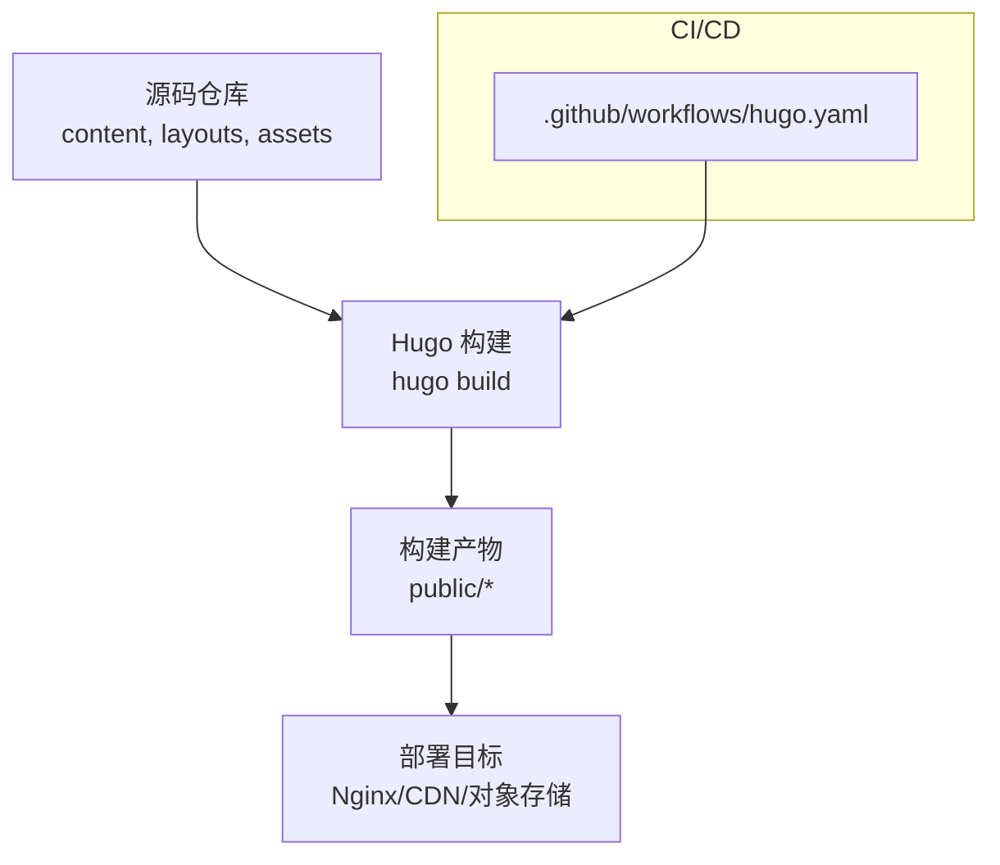
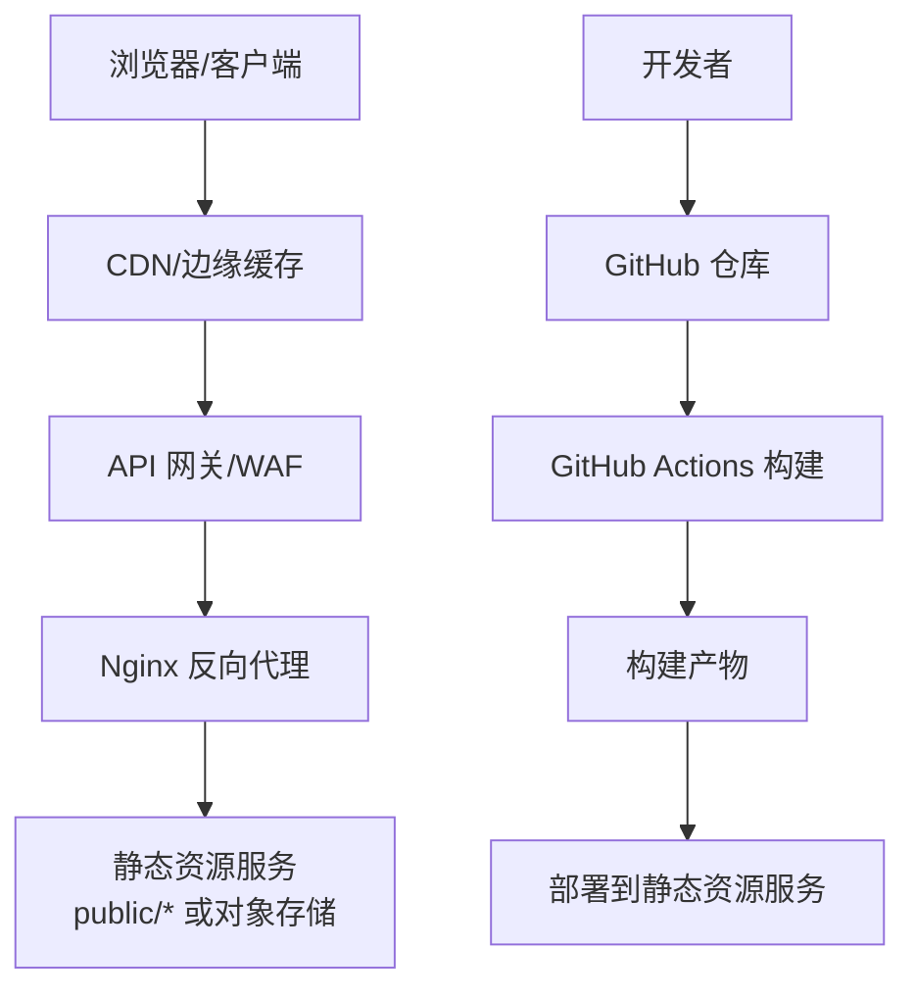
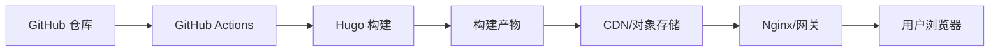

# 安全加固

<cite>
**本文引用的文件**   
- [hugo.yaml](file://.github/workflows/hugo.yaml)
- [config.yaml](file://config.yaml)
- [hugo.toml](file://hugo.toml)
- [README.md](file://README.md)
</cite>

## 目录
1. [简介](#简介)
2. [项目结构](#项目结构)
3. [核心组件](#核心组件)
4. [架构总览](#架构总览)
5. [详细组件分析](#详细组件分析)
6. [依赖分析](#依赖分析)
7. [性能考虑](#性能考虑)
8. [故障排查指南](#故障排查指南)
9. [结论](#结论)
10. [附录](#附录)

## 简介
本指南面向使用 Hugo 构建的静态网站，提供从部署到运行期的全链路安全加固方案。内容涵盖：
- HTTPS 证书配置与自动续期（Let's Encrypt）
- 安全 HTTP 响应头（CSP、HSTS、X-Frame-Options 等）
- 内容完整性校验（SRI/子资源完整性）
- 访问控制（IP 白名单、请求频率限制）
- GitHub 仓库安全（分支保护、代码审查、敏感信息扫描）
- 安全扫描（依赖漏洞、代码安全）
- 安全事件响应流程（漏洞处理、入侵检测与应急）

本指南既适用于在自有服务器或容器平台部署的场景，也适用于托管于云厂商对象存储 + CDN 的前端站点。

## 项目结构
该仓库为基于 Hugo 的文档型静态站点，包含主题、内容与构建产物。关键目录与文件：
- .github/workflows/hugo.yaml：GitHub Actions 构建与发布流水线
- config.yaml / hugo.toml：Hugo 站点配置
- content/*：站点内容源
- themes/hugo-book：使用的主题
- public/*：构建产物（通常由 CI 生成并部署）

图示来源
- [hugo.yaml](file://.github/workflows/hugo.yaml)
- [hugo.toml](file://hugo.toml)
- [config.yaml](file://config.yaml)

章节来源
- [README.md](file://README.md)

## 核心组件
- 构建与发布流水线：通过 GitHub Actions 执行 Hugo 构建与部署，确保构建环境一致性与可追溯性。
- 站点配置：Hugo 配置文件用于定义站点元数据、输出格式、主题与扩展插件等。
- 主题与模板：基于 hugo-book 主题，负责页面渲染与前端资源组织。
- 构建产物：生成的静态 HTML/CSS/JS 与媒体资源，供 Web 服务器或 CDN 分发。

章节来源
- [hugo.yaml](file://.github/workflows/hugo.yaml)
- [hugo.toml](file://hugo.toml)
- [config.yaml](file://config.yaml)

## 架构总览
下图展示典型的安全加固前后端交互关系：客户端经 CDN/网关进入 Nginx，再由 Nginx 反向代理至静态资源或对象存储；GitHub 仓库作为唯一可信源码来源，通过 CI 构建并推送产物。

图示来源
- [hugo.yaml](file://.github/workflows/hugo.yaml)
- [hugo.toml](file://hugo.toml)
- [config.yaml](file://config.yaml)

## 详细组件分析

### HTTPS 证书与自动续期（Let's Encrypt）
- 推荐方案
  - 自有服务器/Nginx：使用 certbot 申请与自动续期，配合系统定时任务或 systemd timer 完成续期后重载 Nginx。
  - 云托管/CDN：优先启用托管证书（如 Cloudflare Origin CA、CloudFront/Aliyun CDN 内置证书），减少运维复杂度。
- 关键要点
  - 强制 HTTPS，禁用旧版 TLS 协议与弱加密套件。
  - 启用 HSTS，设置合理的 max-age 与 includeSubDomains。
  - 定期验证证书链与过期时间，建立告警。
- 参考实现位置
  - 若采用 Nginx 管理证书，可在 Nginx 配置中引入证书路径与 HSTS 头。
  - 若采用 CDN 托管证书，请在对应控制台开启“强制 HTTPS”和“自动续期”。

章节来源
- [hugo.yaml](file://.github/workflows/hugo.yaml)
- [hugo.toml](file://hugo.toml)
- [config.yaml](file://config.yaml)

### 安全 HTTP 响应头
- 建议启用的头部
  - Content-Security-Policy（CSP）：限制脚本、样式、图片、字体等加载来源，避免内联脚本与 eval。
  - Strict-Transport-Security（HSTS）：强制浏览器仅通过 HTTPS 访问。
  - X-Frame-Options 或 Frame-Options：防止点击劫持。
  - X-Content-Type-Options: nosniff：禁止 MIME 嗅探。
  - Referrer-Policy：控制 Referer 泄露范围。
  - Permissions-Policy：限制浏览器特性（如摄像头、麦克风）。
  - Cross-Origin-*：跨域隔离策略（COOP/COEP）按需启用。
- 实施位置
  - Nginx：在 server/location 块中添加上述响应头。
  - CDN：在边缘规则中统一注入响应头。
  - 对象存储：在返回头中设置或通过前置网关注入。

章节来源
- [hugo.toml](file://hugo.toml)
- [config.yaml](file://config.yaml)

### 内容完整性检查（SRI）
- 目的
  - 防止第三方资源被篡改，确保浏览器加载的资源与预期一致。
- 实践建议
  - 对关键外部 JS/CSS 启用 SRI，并在构建阶段计算哈希值。
  - 将 SRI 哈希写入页面引用，避免内联脚本。
  - 对自托管资源进行签名与校验（例如通过构建时生成清单与校验脚本）。
- 集成点
  - 在 Hugo 模板中为外链资源添加 integrity 与 crossorigin 属性。
  - 在 CI 中校验资源指纹一致性，失败则阻断发布。

章节来源
- [hugo.yaml](file://.github/workflows/hugo.yaml)
- [hugo.toml](file://hugo.toml)
- [config.yaml](file://config.yaml)

### 访问控制（IP 白名单与速率限制）
- IP 白名单
  - 在 WAF/网关层对管理后台、API 入口实施来源 IP 白名单。
  - 对静态站点本身一般不限制，但可对敏感路径（如 /admin、/api）做来源限制。
- 请求频率限制
  - 在 Nginx/网关层针对登录、搜索、上传等接口设置限流策略。
  - 结合 CDN 的速率限制与突发流量防护。
- 身份与权限
  - 对需要鉴权的页面，使用最小权限原则与短期令牌。
  - 避免在 URL 或日志中暴露敏感参数。

章节来源
- [hugo.yaml](file://.github/workflows/hugo.yaml)
- [hugo.toml](file://hugo.toml)
- [config.yaml](file://config.yaml)

### GitHub 仓库安全
- 分支保护
  - 主分支启用保护规则：要求至少一名审查者批准、状态检查通过后方可合并。
  - 禁止直接推送，所有变更通过 Pull Request 提交。
- 代码审查
  - 强制代码审查与自动化检查（lint、测试、安全扫描）。
  - 使用预提交钩子在本地提前发现常见问题。
- 敏感信息扫描
  - 在 CI 中加入密钥/凭据扫描，阻止含敏感信息的提交。
  - 使用环境变量与 Secrets 管理工具，不在仓库中存放任何凭据。
- 审计与合规
  - 开启审计日志与通知，记录重要操作。
  - 定期审查协作者权限与外部依赖。

章节来源
- [hugo.yaml](file://.github/workflows/hugo.yaml)

### 安全扫描（依赖漏洞与代码安全）
- 依赖漏洞扫描
  - 对前端依赖（npm/yarn/pnpm）与 Hugo 模块进行漏洞扫描。
  - 在 PR 中阻断存在高危漏洞的依赖更新。
- 代码安全检查
  - 静态分析（SAST）：识别常见安全问题（硬编码密钥、不安全函数调用等）。
  - 模板与脚本安全：避免在模板中执行不受信任的数据。
- 制品安全
  - 对构建产物进行完整性校验与签名。
  - 在部署前进行镜像/包扫描（如适用）。

章节来源
- [hugo.yaml](file://.github/workflows/hugo.yaml)
- [hugo.toml](file://hugo.toml)
- [config.yaml](file://config.yaml)

### 安全事件响应流程
- 预防与监测
  - 启用 WAF 与异常访问告警（4xx/5xx 突增、异常 UA、频繁错误）。
  - 监控证书到期、磁盘/内存异常、进程崩溃等指标。
- 处置步骤
  - 确认影响范围与根因，快速回滚到已知安全版本。
  - 临时缓解措施：封禁恶意 IP、关闭受影响功能、降级模式。
  - 修复与验证：修复漏洞、回归测试、灰度发布。
- 复盘与改进
  - 记录事件时间线、影响面、处置过程与改进项。
  - 完善自动化检查与演练预案，提升响应效率。

章节来源
- [hugo.yaml](file://.github/workflows/hugo.yaml)
- [hugo.toml](file://hugo.toml)
- [config.yaml](file://config.yaml)

## 依赖分析
- 构建依赖
  - Hugo CLI 与主题依赖在 CI 环境中固定版本，确保可重复构建。
- 运行时依赖
  - 静态站点无后端运行时依赖，主要依赖 Web 服务器/CDN 能力。
- 外部服务
  - Let's Encrypt（证书）、WAF/CDN（安全与加速）、对象存储（静态资源）。

图示来源
- [hugo.yaml](file://.github/workflows/hugo.yaml)
- [hugo.toml](file://hugo.toml)
- [config.yaml](file://config.yaml)

章节来源
- [hugo.yaml](file://.github/workflows/hugo.yaml)
- [hugo.toml](file://hugo.toml)
- [config.yaml](file://config.yaml)

## 性能考虑
- 启用 Gzip/Brotli 压缩与 HTTP/2 或 HTTP/3。
- 合理设置缓存头（Cache-Control、ETag/Last-Modified）。
- 使用 CDN 缓存热点资源，减少源站压力。
- 对大体积资源启用懒加载与分片传输。
- 避免不必要的重定向与跨域请求。

[本节为通用指导，无需特定文件来源]

## 故障排查指南
- 证书问题
  - 症状：浏览器提示证书无效或即将过期。
  - 排查：检查证书链、域名匹配、自动续期任务是否成功。
- 安全头缺失
  - 症状：安全扫描报告缺少 CSP/HSTS 等。
  - 排查：确认 Nginx/CDN 规则是否正确注入，是否存在覆盖。
- 资源加载失败
  - 症状：控制台报错跨域或 SRI 校验失败。
  - 排查：核对资源地址、CSP 白名单、SRI 哈希是否一致。
- 访问受限
  - 症状：特定 IP 无法访问或被限流。
  - 排查：检查 WAF/网关白名单与限流阈值，查看访问日志。
- 构建失败
  - 症状：CI 构建中断或产物不完整。
  - 排查：查看构建日志、依赖版本与环境变量，复现本地构建。

章节来源
- [hugo.yaml](file://.github/workflows/hugo.yaml)
- [hugo.toml](file://hugo.toml)
- [config.yaml](file://config.yaml)

## 结论
通过对 HTTPS、HTTP 安全头、内容完整性、访问控制、仓库与扫描、事件响应的系统化加固，可显著提升静态站点的安全性、可用性与可维护性。建议在 CI 中固化安全策略，持续监控与演练，形成闭环的安全运营体系。

[本节为总结，无需特定文件来源]

## 附录
- 常用安全头清单（示例字段名）
  - Content-Security-Policy
  - Strict-Transport-Security
  - X-Frame-Options
  - X-Content-Type-Options
  - Referrer-Policy
  - Permissions-Policy
  - Cross-Origin-Opener-Policy
  - Cross-Origin-Embedder-Policy
- 建议的 CI 检查项
  - 依赖漏洞扫描
  - 敏感信息扫描
  - 构建产物完整性校验
  - 安全头注入验证
  - 证书有效期检查

[本节为补充清单，无需特定文件来源]