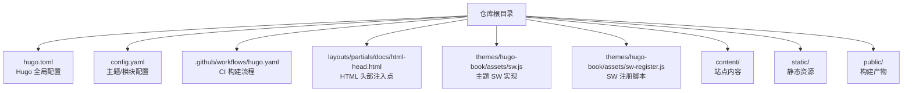
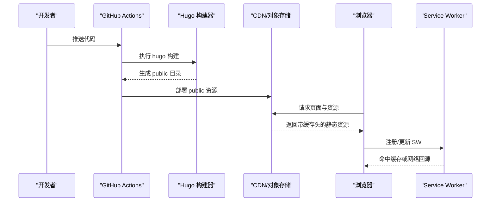
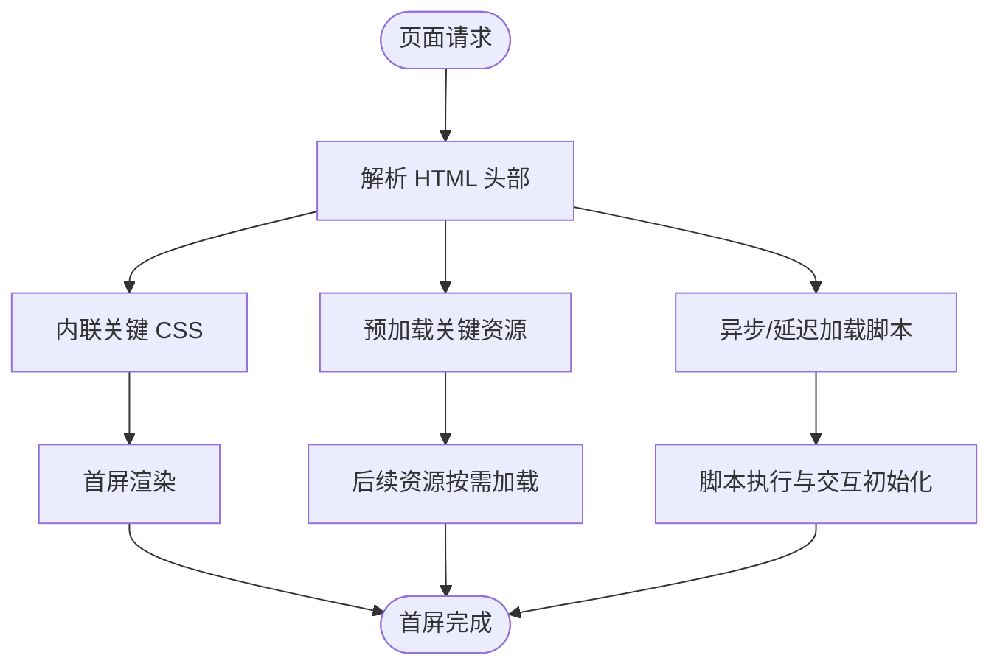
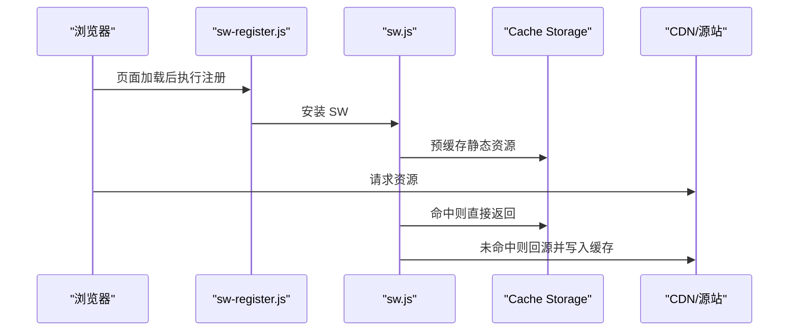

# 性能优化

<cite>
**本文引用的文件**   
- [hugo.toml](file://hugo.toml)
- [config.yaml](file://config.yaml)
- [.github/workflows/hugo.yaml](file://.github/workflows/hugo.yaml)
- [themes/hugo-book/assets/sw.js](file://themes/hugo-book/assets/sw.js)
- [themes/hugo-book/assets/sw-register.js](file://themes/hugo-book/assets/sw-register.js)
- [layouts/partials/docs/html-head.html](file://layouts/partials/docs/html-head.html)
</cite>

## 目录
1. [简介](#简介)
2. [项目结构](#项目结构)
3. [核心组件](#核心组件)
4. [架构总览](#架构总览)
5. [详细组件分析](#详细组件分析)
6. [依赖关系分析](#依赖关系分析)
7. [性能考量](#性能考量)
8. [故障排查指南](#故障排查指南)
9. [结论](#结论)
10. [附录](#附录)

## 简介
本指南面向使用 Hugo + hugo-book 主题构建的静态站点，提供从构建期到运行期的全链路性能优化方案。内容覆盖：
- Hugo 构建优化（增量构建、资源压缩、CSS/JS 合并与缓存）
- 前端资源优化（图片、字体、懒加载）
- 浏览器缓存策略（缓存头、版本化、失效策略）
- CDN 集成（CloudFlare 等）
- 页面加载性能（关键渲染路径、预加载、Service Worker）
- 性能监控与分析（Lighthouse、WebPageTest）

## 项目结构
本项目采用 Hugo 标准目录组织，主题使用 hugo-book。关键目录与文件：
- 配置：根目录下的 hugo.toml 与 config.yaml
- 工作流：.github/workflows/hugo.yaml
- 主题资源：themes/hugo-book/assets 下包含 Service Worker 与注册脚本
- 布局扩展：layouts/partials/docs/html-head.html 用于注入头部资源与缓存控制

图表来源
- [hugo.toml](file://hugo.toml)
- [config.yaml](file://config.yaml)
- [.github/workflows/hugo.yaml](file://.github/workflows/hugo.yaml)
- [layouts/partials/docs/html-head.html](file://layouts/partials/docs/html-head.html)
- [themes/hugo-book/assets/sw.js](file://themes/hugo-book/assets/sw.js)
- [themes/hugo-book/assets/sw-register.js](file://themes/hugo-book/assets/sw-register.js)

章节来源
- [hugo.toml](file://hugo.toml)
- [config.yaml](file://config.yaml)
- [.github/workflows/hugo.yaml](file://.github/workflows/hugo.yaml)
- [layouts/partials/docs/html-head.html](file://layouts/partials/docs/html-head.html)
- [themes/hugo-book/assets/sw.js](file://themes/hugo-book/assets/sw.js)
- [themes/hugo-book/assets/sw-register.js](file://themes/hugo-book/assets/sw-register.js)

## 核心组件
- Hugo 构建配置：通过 hugo.toml 与 config.yaml 控制构建行为、输出格式、资源处理等
- CI 构建流水线：GitHub Actions 中执行 hugo 构建并产出 public 目录
- 主题资源：hugo-book 主题提供的 Service Worker 与注册脚本，便于离线与缓存能力
- HTML 头部注入：在 html-head.html 中注入缓存头、预加载、内联关键 CSS 等

章节来源
- [hugo.toml](file://hugo.toml)
- [config.yaml](file://config.yaml)
- [.github/workflows/hugo.yaml](file://.github/workflows/hugo.yaml)
- [themes/hugo-book/assets/sw.js](file://themes/hugo-book/assets/sw.js)
- [themes/hugo-book/assets/sw-register.js](file://themes/hugo-book/assets/sw-register.js)
- [layouts/partials/docs/html-head.html](file://layouts/partials/docs/html-head.html)

## 架构总览
下图展示从源码到用户浏览器的完整构建与交付链路，以及各层可优化的关键点。

图表来源
- [.github/workflows/hugo.yaml](file://.github/workflows/hugo.yaml)
- [hugo.toml](file://hugo.toml)
- [themes/hugo-book/assets/sw.js](file://themes/hugo-book/assets/sw.js)
- [themes/hugo-book/assets/sw-register.js](file://themes/hugo-book/assets/sw-register.js)

## 详细组件分析

### Hugo 构建优化
目标：缩短构建时间、减小产物体积、提升缓存命中率。

- 增量构建
  - 本地开发启用增量构建以减少冷启动时间
  - CI 中可选择性开启增量构建以加速流水线
- 资源压缩与合并
  - 启用 CSS/JS 压缩与合并，减少请求数与体积
  - 对 SVG/图片进行无损或有损压缩
- 资源版本化与指纹
  - 为静态资源添加哈希后缀，配合长缓存实现强缓存
- 输出优化
  - 按需生成 sitemap、RSS、分类页等，避免冗余
  - 关闭不必要的调试信息

章节来源
- [hugo.toml](file://hugo.toml)
- [config.yaml](file://config.yaml)

### 前端资源优化
- 图片优化
  - 优先使用现代格式（WebP/AVIF），按需生成多尺寸
  - 使用 srcset/picture 响应式加载，结合 loading="lazy"
- 字体优化
  - 仅加载必要字重与字符集，使用 font-display: swap
  - 将字体放入独立缓存友好的目录，设置长缓存
- 懒加载与预加载
  - 非首屏图片与第三方脚本延迟加载
  - 对关键资源使用 rel="preload" 提示浏览器提前获取
- 搜索与脚本
  - 主题内置搜索脚本已按版本化命名，利于缓存；确保仅引入必要功能

章节来源
- [themes/hugo-book/assets/sw.js](file://themes/hugo-book/assets/sw.js)
- [themes/hugo-book/assets/sw-register.js](file://themes/hugo-book/assets/sw-register.js)

### 浏览器缓存策略
- 缓存头设置
  - 静态资源（CSS/JS/图片/字体）设置长期缓存（如一年）
  - HTML 文档设置短缓存或 no-cache，确保更新及时生效
- 版本管理
  - 通过文件名哈希或查询参数实现版本化，变更即新 URL
- 失效策略
  - 发布新版本时清理旧资源或保留历史版本供过渡期访问
  - 使用 CDN 边缘缓存刷新接口快速失效

章节来源
- [layouts/partials/docs/html-head.html](file://layouts/partials/docs/html-head.html)

### CDN 集成（CloudFlare 示例）
- 域名与 DNS
  - 将站点托管至支持 CDN 的对象存储或服务器，并在 CloudFlare 中代理
- 缓存规则
  - 为静态资源设置长缓存，HTML 短缓存或强制校验
  - 开启自动压缩（Brotli/Gzip）、HTTP/2、HTTP/3
- 图像优化
  - 启用 CloudFlare Image Optimization 自动转换与压缩
- 安全与性能
  - 开启最小 TLS 版本、禁用不安全的协议
  - 使用 Page Rules 或 Cache Rules 精细化控制缓存键与 TTL

章节来源
- [.github/workflows/hugo.yaml](file://.github/workflows/hugo.yaml)

### 页面加载性能（关键渲染路径）
- 关键 CSS 内联
  - 将首屏必需样式内联，减少阻塞
- 脚本优化
  - 异步/延迟加载非关键脚本，避免阻塞解析
- 预连接与预取
  - 对第三方域名使用 rel="preconnect"，对关键资源使用 rel="prefetch"
- 服务工作者
  - 利用主题提供的 sw.js 与 sw-register.js 实现缓存与离线体验

图表来源
- [layouts/partials/docs/html-head.html](file://layouts/partials/docs/html-head.html)
- [themes/hugo-book/assets/sw.js](file://themes/hugo-book/assets/sw.js)
- [themes/hugo-book/assets/sw-register.js](file://themes/hugo-book/assets/sw-register.js)

### 服务工作者（SW）配置
- 注册时机
  - 在页面加载后尽早注册，避免阻塞首屏
- 缓存策略
  - 对静态资源采用 Cache First，对 HTML 采用 Network First
- 更新机制
  - 监听更新事件，清理旧缓存，确保新版本及时生效

图表来源
- [themes/hugo-book/assets/sw-register.js](file://themes/hugo-book/assets/sw-register.js)
- [themes/hugo-book/assets/sw.js](file://themes/hugo-book/assets/sw.js)

## 依赖关系分析
- 构建阶段
  - GitHub Actions 触发 Hugo 构建，生成 public 目录
  - Hugo 根据 hugo.toml/config.yaml 决定资源处理与输出
- 运行阶段
  - 浏览器请求由 CDN 分发，依据缓存头决定是否命中
  - Service Worker 接管资源请求，提高二次访问速度

图表来源
- [.github/workflows/hugo.yaml](file://.github/workflows/hugo.yaml)
- [hugo.toml](file://hugo.toml)
- [themes/hugo-book/assets/sw.js](file://themes/hugo-book/assets/sw.js)

章节来源
- [.github/workflows/hugo.yaml](file://.github/workflows/hugo.yaml)
- [hugo.toml](file://hugo.toml)
- [themes/hugo-book/assets/sw.js](file://themes/hugo-book/assets/sw.js)

## 性能考量
- 构建性能
  - 合理划分内容模块，避免一次性构建过多无关页面
  - 在 CI 中使用缓存目录复用依赖与中间产物
- 传输性能
  - 启用 HTTP/2 与 Brotli 压缩，减少 RTT 与带宽占用
  - 使用 CDN 就近分发，降低延迟
- 渲染性能
  - 减少主线程阻塞，拆分大脚本，按需加载
  - 优化字体与图片，避免布局抖动
- 缓存命中率
  - 统一资源命名规范，确保版本化与长缓存协同
  - 针对频繁更新的资源使用短缓存或校验头

## 故障排查指南
- 构建失败
  - 检查 Hugo 版本与插件兼容性
  - 查看 CI 日志定位具体错误行
- 缓存未生效
  - 确认 CDN 缓存规则与缓存键是否包含版本号
  - 验证浏览器是否忽略缓存头（如开发模式）
- SW 异常
  - 检查 sw.js 作用域与跨域限制
  - 在控制台查看 SW 状态与缓存条目
- 首屏慢
  - 使用 Lighthouse 定位阻塞资源
  - 分析关键渲染路径，内联必要样式与预加载关键资源

章节来源
- [.github/workflows/hugo.yaml](file://.github/workflows/hugo.yaml)
- [layouts/partials/docs/html-head.html](file://layouts/partials/docs/html-head.html)
- [themes/hugo-book/assets/sw.js](file://themes/hugo-book/assets/sw.js)

## 结论
通过对构建、资源、缓存、CDN 与运行时（SW）的系统性优化，可显著提升静态站点的加载速度与用户体验。建议持续使用性能工具进行度量与回归测试，确保优化效果稳定可靠。

## 附录
- 常用工具
  - Lighthouse：评估性能指标与改进建议
  - WebPageTest：深入分析关键渲染路径与瀑布图
  - Chrome DevTools：网络面板、性能面板、应用面板（缓存与 SW）
- 最佳实践清单
  - 资源版本化与长缓存
  - 关键 CSS 内联与脚本异步
  - 图片与字体按需加载与压缩
  - CDN 缓存规则与边缘优化
  - Service Worker 缓存策略与更新机制