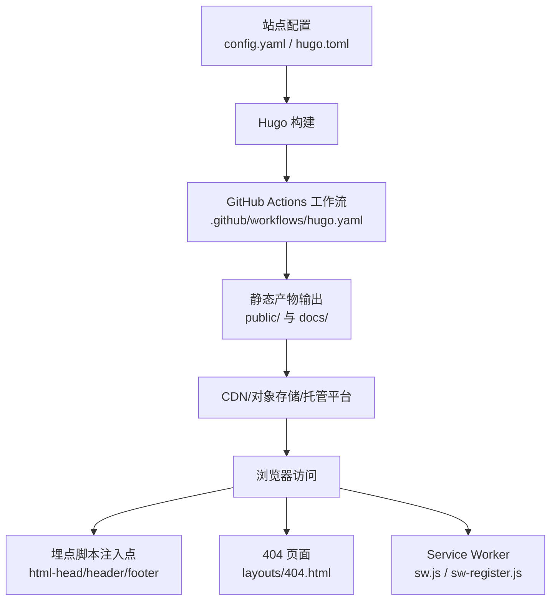
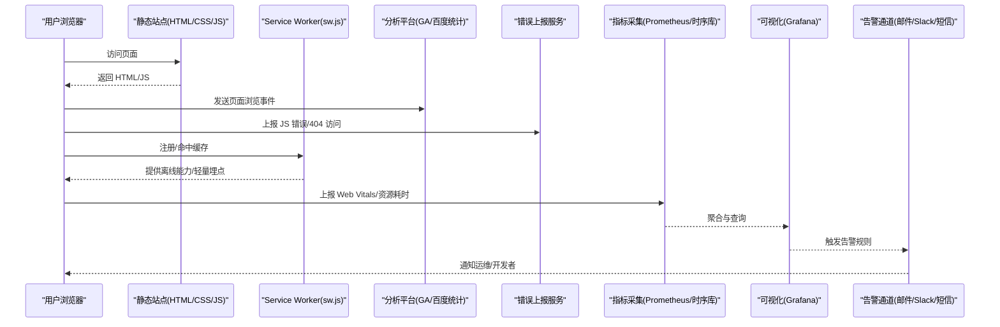
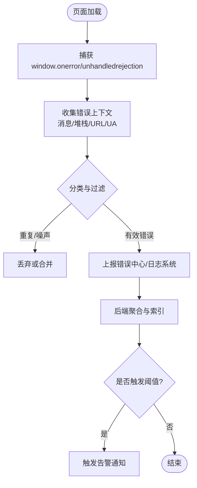
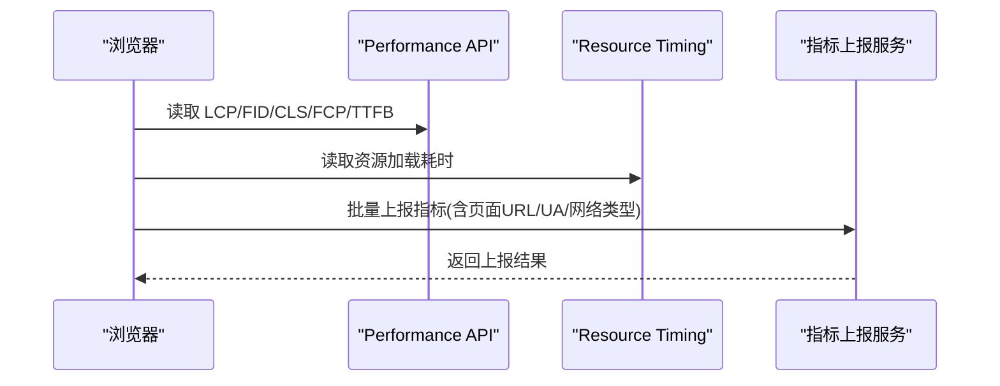
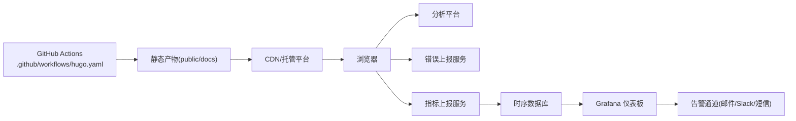

# 监控与告警

<cite>
**本文引用的文件**   
- [config.yaml](file://config.yaml)
- [hugo.toml](file://hugo.toml)
- [.github/workflows/hugo.yaml](file://.github/workflows/hugo.yaml)
- [layouts/partials/docs/html-head.html](file://themes/hugo-book/layouts/partials/docs/html-head.html)
- [layouts/partials/docs/header.html](file://themes/hugo-book/layouts/partials/docs/header.html)
- [layouts/partials/docs/footer.html](file://themes/hugo-book/layouts/partials/docs/footer.html)
- [layouts/404.html](file://themes/hugo-book/layouts/404.html)
- [assets/sw.js](file://themes/hugo-book/assets/sw.js)
- [assets/sw-register.js](file://themes/hugo-book/assets/sw-register.js)
</cite>

## 目录
1. [简介](#简介)
2. [项目结构](#项目结构)
3. [核心组件](#核心组件)
4. [架构总览](#架构总览)
5. [详细组件分析](#详细组件分析)
6. [依赖关系分析](#依赖关系分析)
7. [性能考虑](#性能考虑)
8. [故障排查指南](#故障排查指南)
9. [结论](#结论)
10. [附录](#附录)

## 简介
本指南面向使用 Hugo + hugo-book 主题构建的静态站点，提供一套端到端的“可观测性体系”落地方案。内容覆盖：
- 访问统计：Google Analytics、百度统计等集成方法
- 错误监控：404 页面追踪、前端 JavaScript 错误捕获、API 错误上报（适用于站点内嵌 API 或第三方服务）
- 性能监控：页面加载时间、资源加载性能、用户行为分析
- 健康检查：站点可用性监控、依赖服务状态检查
- 告警规则：邮件、Slack、短信等多通道通知
- 可视化仪表板：基于 Grafana 等工具展示关键指标

本指南既给出概念性流程，也结合仓库中的实际模板与配置位置，帮助你在不侵入业务逻辑的前提下快速落地。

## 项目结构
该仓库采用 Hugo 静态站点生成器，主题使用 hugo-book。与监控相关的关键位置包括：
- 站点配置：根目录下的 config.yaml 与 hugo.toml
- 构建与部署：GitHub Actions 工作流 .github/workflows/hugo.yaml
- 页面注入点：主题 layouts 下的 html-head、header、footer 等 partials
- 404 页面：主题 layouts/404.html
- Service Worker：主题 assets 下的 sw.js 与 sw-register.js（可用于离线缓存与轻量埋点）

图表来源
- [config.yaml](file://config.yaml)
- [hugo.toml](file://hugo.toml)
- [.github/workflows/hugo.yaml](file://.github/workflows/hugo.yaml)
- [layouts/partials/docs/html-head.html](file://themes/hugo-book/layouts/partials/docs/html-head.html)
- [layouts/partials/docs/header.html](file://themes/hugo-book/layouts/partials/docs/header.html)
- [layouts/partials/docs/footer.html](file://themes/hugo-book/layouts/partials/docs/footer.html)
- [layouts/404.html](file://themes/hugo-book/layouts/404.html)
- [assets/sw.js](file://themes/hugo-book/assets/sw.js)
- [assets/sw-register.js](file://themes/hugo-book/assets/sw-register.js)

章节来源
- [config.yaml](file://config.yaml)
- [hugo.toml](file://hugo.toml)
- [.github/workflows/hugo.yaml](file://.github/workflows/hugo.yaml)

## 核心组件
- 访问统计组件
  - 在 html-head 中注入 Google Analytics 或百度统计脚本，实现 PV/UV、来源、页面停留时长等基础指标采集。
  - 在 header/footer 中补充自定义事件埋点（如按钮点击、搜索关键词）。
- 错误监控组件
  - 404 页面：在 404.html 中上报缺失路径、Referer、UA 等上下文信息。
  - JS 错误：在全局 window.onerror/unhandledrejection 中收集堆栈并上报到日志系统或错误中心。
  - API 错误：对站点内嵌的 fetch/XHR 请求进行拦截，记录失败率与耗时。
- 性能监控组件
  - 使用 Performance API 采集 LCP、FID、CLS、FCP、TTFB 等 Web Vitals。
  - 通过 Resource Timing API 分析关键资源加载耗时。
- 健康检查组件
  - 对外暴露 /healthz 或 /readyz 端点（由 CDN/网关/反向代理提供），用于存活探测与就绪检查。
  - 依赖服务状态检查：对数据库、对象存储、第三方 API 进行周期性探测。
- 告警与通知组件
  - 将指标汇聚至 Prometheus/Grafana，定义阈值与静默策略，触发邮件、Slack、短信等通知。
- 可视化仪表板
  - 在 Grafana 中创建站点概览、错误分布、性能趋势、健康检查面板。

章节来源
- [layouts/partials/docs/html-head.html](file://themes/hugo-book/layouts/partials/docs/html-head.html)
- [layouts/partials/docs/header.html](file://themes/hugo-book/layouts/partials/docs/header.html)
- [layouts/partials/docs/footer.html](file://themes/hugo-book/layouts/partials/docs/footer.html)
- [layouts/404.html](file://themes/hugo-book/layouts/404.html)
- [assets/sw.js](file://themes/hugo-book/assets/sw.js)
- [assets/sw-register.js](file://themes/hugo-book/assets/sw-register.js)

## 架构总览
下图展示了从浏览器到监控系统的整体数据流：

图表来源
- [layouts/partials/docs/html-head.html](file://themes/hugo-book/layouts/partials/docs/html-head.html)
- [layouts/partials/docs/footer.html](file://themes/hugo-book/layouts/partials/docs/footer.html)
- [layouts/404.html](file://themes/hugo-book/layouts/404.html)
- [assets/sw.js](file://themes/hugo-book/assets/sw.js)
- [assets/sw-register.js](file://themes/hugo-book/assets/sw-register.js)

## 详细组件分析

### 访问统计配置（Google Analytics、百度统计）
- 集成位置
  - 在 html-head 中插入分析平台提供的初始化脚本，确保在首屏渲染前完成 SDK 初始化。
  - 在 header/footer 中追加自定义事件埋点，例如导航点击、搜索提交、下载行为等。
- 关键指标
  - 页面浏览量（PV）、独立访客（UV）、平均停留时长、跳出率、热门页面、来源渠道。
- 隐私与合规
  - 根据目标受众选择是否启用 IP 匿名化、Cookie 同意弹窗等。
- 验证方式
  - 使用分析平台实时视图或调试工具确认事件上报正常。

章节来源
- [layouts/partials/docs/html-head.html](file://themes/hugo-book/layouts/partials/docs/html-head.html)
- [layouts/partials/docs/header.html](file://themes/hugo-book/layouts/partials/docs/header.html)
- [layouts/partials/docs/footer.html](file://themes/hugo-book/layouts/partials/docs/footer.html)

### 错误监控（404、JavaScript、API）
- 404 错误追踪
  - 在 404.html 中记录缺失 URL、Referer、User-Agent、时间戳等上下文，上报到日志或错误中心。
  - 建议按路径维度聚合，识别高频死链与外链失效。
- JavaScript 错误捕获
  - 全局捕获 window.onerror 与 unhandledrejection，收集错误消息、文件名、行号、调用栈。
  - 对 Promise 未捕获异常进行专项处理，避免漏报。
- API 错误监控
  - 若站点包含 API 调用，统一拦截 fetch/XHR，记录状态码、耗时、错误类型与重试次数。
  - 对超时、网络错误、服务端错误进行分类统计。

图表来源
- [layouts/404.html](file://themes/hugo-book/layouts/404.html)

章节来源
- [layouts/404.html](file://themes/hugo-book/layouts/404.html)

### 性能监控（Web Vitals、资源加载、用户行为）
- 指标采集
  - 使用 Performance API 采集 LCP、FID、CLS、FCP、TTFB 等核心体验指标。
  - 使用 Resource Timing API 分析 CSS/JS/图片/字体等关键资源的加载耗时与缓存命中率。
- 用户行为分析
  - 在 footer 中追加交互埋点，如滚动深度、按钮点击、表单提交成功率。
- 上报策略
  - 批量上报、去重、采样，避免影响首屏性能。
  - 在网络空闲时上报，或使用 Beacon API 保证可靠传输。

章节来源
- [layouts/partials/docs/footer.html](file://themes/hugo-book/layouts/partials/docs/footer.html)

### 健康检查（站点可用性与依赖服务）
- 站点可用性
  - 通过 CDN/网关暴露 /healthz 或 /readyz 端点，返回 200 表示健康。
  - 定期从多地域发起 HTTP 探测，检测连通性与响应时间。
- 依赖服务状态
  - 对数据库、对象存储、第三方 API 进行周期性探测，记录成功/失败与延迟。
- 告警联动
  - 当连续失败超过阈值或延迟升高时，触发告警并自动降级或切换备用源。

章节来源
- [.github/workflows/hugo.yaml](file://.github/workflows/hugo.yaml)

### 告警规则与通知（邮件、Slack、短信）
- 规则设计
  - 错误率：单位时间内 5xx 比例、JS 错误数、404 数量超过阈值。
  - 性能：LCP/FCP/TTFB 分位数超过基线。
  - 可用性：健康检查连续失败次数。
- 通知通道
  - 邮件：适合详细报告与归档。
  - Slack：适合即时协作与快速响应。
  - 短信：适合紧急场景与值班轮转。
- 降噪与抑制
  - 设置静默窗口、分组聚合、升级策略，避免告警风暴。

章节来源
- [.github/workflows/hugo.yaml](file://.github/workflows/hugo.yaml)

### 监控仪表板（Grafana 等可视化工具）
- 面板建议
  - 站点概览：PV/UV、活跃会话、来源分布。
  - 错误分布：404/5xx/JS 错误 Top N 页面与错误类型。
  - 性能趋势：LCP/FCP/TTFB 分位线与资源加载热力图。
  - 健康检查：成功率、延迟、失败原因。
- 数据源
  - 将指标写入时序数据库（如 Prometheus/InfluxDB），在 Grafana 中连接并绘制面板。
- 权限与分享
  - 为团队开放只读权限，导出关键面板供复盘与汇报。

[本节为通用指导，不直接分析具体文件]

## 依赖关系分析
- 构建与部署
  - GitHub Actions 工作流负责构建与发布，产出静态资源后推送到托管平台。
- 运行时依赖
  - 浏览器侧依赖分析 SDK、错误上报 SDK、指标上报 SDK。
  - 可选 Service Worker 提供离线能力与轻量埋点。
- 外部系统
  - 分析平台（GA/百度统计）、错误中心、日志系统、时序数据库、可视化平台、通知通道。

图表来源
- [.github/workflows/hugo.yaml](file://.github/workflows/hugo.yaml)

章节来源
- [.github/workflows/hugo.yaml](file://.github/workflows/hugo.yaml)

## 性能考虑
- 最小化埋点开销
  - 使用按需加载与懒执行，避免阻塞首屏。
  - 对上报数据进行压缩与批量合并。
- 缓存与离线
  - 利用 Service Worker 缓存静态资源与分析 SDK，减少重复请求。
- 采样与去重
  - 在高流量场景下开启采样与去重，降低上报成本。
- 资源优化
  - 优先保障关键资源（CSS/JS/字体）的预加载与优先级设置。

[本节为通用指导，不直接分析具体文件]

## 故障排查指南
- 404 问题定位
  - 查看 404 上报中的 Referer 与 UA，定位外链失效或内部链接变更。
  - 对比历史 404 趋势，判断是否为突发问题。
- JS 错误排查
  - 依据错误堆栈定位文件与行号，结合版本标签与构建哈希回溯代码变更。
  - 关注 Promise 未捕获异常与跨域脚本错误。
- 性能退化排查
  - 对比 LCP/FCP/TTFB 分位线，定位慢资源与网络抖动。
  - 检查 CDN 缓存命中率与回源延迟。
- 健康检查失败
  - 检查 /healthz 端点返回码与响应体，确认依赖服务状态。
  - 观察多地域探测结果，排除局部网络问题。

章节来源
- [layouts/404.html](file://themes/hugo-book/layouts/404.html)
- [.github/workflows/hugo.yaml](file://.github/workflows/hugo.yaml)

## 结论
通过在 html-head/header/footer 等注入点整合分析、错误与性能上报，并结合健康检查与告警机制，可在不侵入业务逻辑的前提下建立完善的可观测性体系。配合 Grafana 仪表板，团队能够持续掌握站点质量与用户体验，快速定位与解决问题。

[本节为总结性内容，不直接分析具体文件]

## 附录
- 实施清单
  - 在 html-head 中接入分析平台 SDK
  - 在 footer 中追加自定义事件埋点
  - 在 404.html 中完善错误上下文上报
  - 引入全局错误捕获与上报逻辑
  - 采集 Web Vitals 与资源加载指标
  - 配置健康检查端点与探测任务
  - 定义告警规则并接入通知通道
  - 搭建 Grafana 仪表板并共享给团队
- 参考位置
  - 站点配置：config.yaml、hugo.toml
  - 构建与部署：.github/workflows/hugo.yaml
  - 注入点：layouts/partials/docs/html-head.html、header.html、footer.html
  - 404 页面：layouts/404.html
  - Service Worker：assets/sw.js、assets/sw-register.js

章节来源
- [config.yaml](file://config.yaml)
- [hugo.toml](file://hugo.toml)
- [.github/workflows/hugo.yaml](file://.github/workflows/hugo.yaml)
- [layouts/partials/docs/html-head.html](file://themes/hugo-book/layouts/partials/docs/html-head.html)
- [layouts/partials/docs/header.html](file://themes/hugo-book/layouts/partials/docs/header.html)
- [layouts/partials/docs/footer.html](file://themes/hugo-book/layouts/partials/docs/footer.html)
- [layouts/404.html](file://themes/hugo-book/layouts/404.html)
- [assets/sw.js](file://themes/hugo-book/assets/sw.js)
- [assets/sw-register.js](file://themes/hugo-book/assets/sw-register.js)