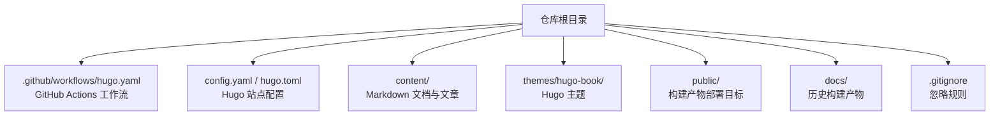
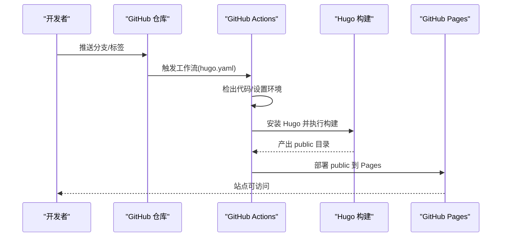
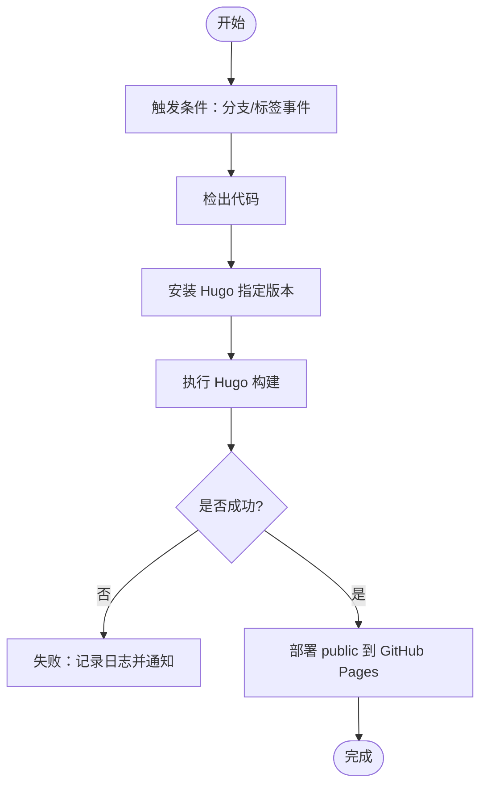
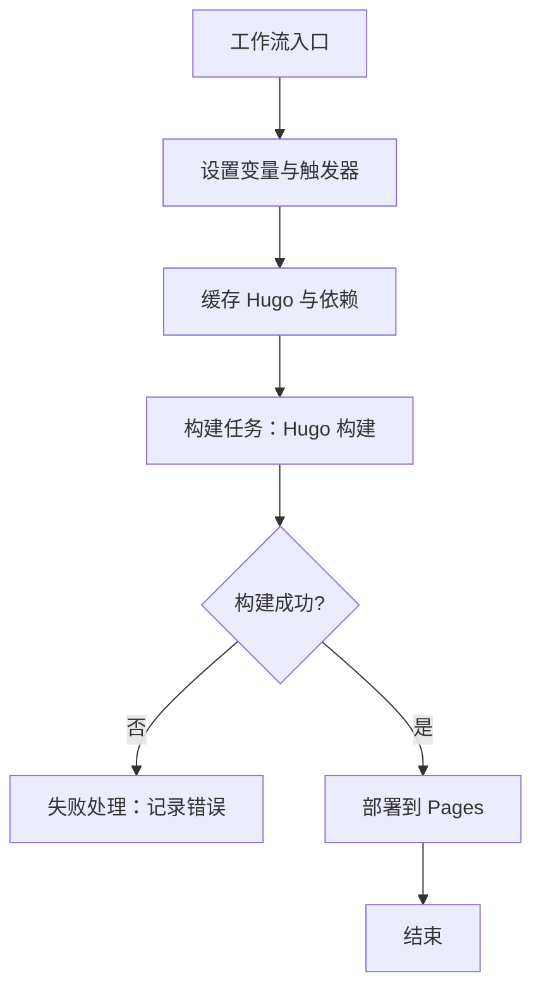
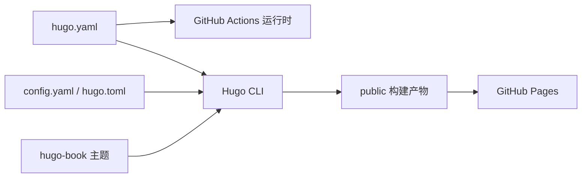

# 部署与维护

<cite>
**本文引用的文件**   
- [hugo.yaml](file://.github/workflows/hugo.yaml)
- [config.yaml](file://config.yaml)
- [hugo.toml](file://hugo.toml)
- [.gitignore](file://.gitignore)
- [README.md](file://README.md)
</cite>

## 目录
1. [简介](#简介)
2. [项目结构](#项目结构)
3. [核心组件](#核心组件)
4. [架构总览](#架构总览)
5. [详细组件分析](#详细组件分析)
6. [依赖关系分析](#依赖关系分析)
7. [性能考虑](#性能考虑)
8. [故障排查指南](#故障排查指南)
9. [结论](#结论)
10. [附录](#附录)

## 简介
本指南面向生产环境的部署与日常维护，覆盖 GitHub Pages 的完整部署流程、CI/CD 流水线配置与优化、静态站点性能优化策略、备份与恢复机制、监控与告警、版本管理与发布流程，以及安全加固与故障诊断方法。项目基于 Hugo 构建静态站点，并通过 GitHub Actions 自动化构建与发布到 GitHub Pages。

## 项目结构
仓库采用典型的 Hugo 主题化结构：内容位于 content，主题通过子模块或本地 themes 引入，构建产物输出至 public（同时存在 docs 作为历史产物）。根目录包含站点配置与 CI 工作流定义。

图示来源
- [hugo.yaml](file://.github/workflows/hugo.yaml)
- [config.yaml](file://config.yaml)
- [hugo.toml](file://hugo.toml)
- [.gitignore](file://.gitignore)

章节来源
- [README.md](file://README.md)

## 核心组件
- 构建与发布流水线：由 GitHub Actions 工作流驱动，拉取代码、安装 Hugo、执行构建并部署到 GitHub Pages。
- 站点配置：Hugo 站点参数、主题、国际化、URL 模式等集中在配置文件。
- 内容与主题：Markdown 内容配合 Hugo Book 主题生成页面、索引与搜索资源。
- 构建产物：public 为最终部署目录；docs 为历史产物，建议从版本控制中排除以避免体积膨胀。

章节来源
- [hugo.yaml](file://.github/workflows/hugo.yaml)
- [config.yaml](file://config.yaml)
- [hugo.toml](file://hugo.toml)
- [.gitignore](file://.gitignore)

## 架构总览
下图展示了从代码提交到站点上线的整体流程，包括触发条件、缓存、构建与部署步骤。

图示来源
- [hugo.yaml](file://.github/workflows/hugo.yaml)

## 详细组件分析

### GitHub Pages 部署流程
- 触发方式：推荐对 main/master 分支推送或创建标签时触发，确保稳定分支自动发布。
- 构建环境：在 Actions 中安装指定版本的 Hugo，使用缓存加速依赖下载。
- 构建命令：执行 Hugo 构建，将输出写入 public 目录。
- 部署目标：将 public 目录发布到 GitHub Pages。

图示来源
- [hugo.yaml](file://.github/workflows/hugo.yaml)

章节来源
- [hugo.yaml](file://.github/workflows/hugo.yaml)

### CI/CD 流水线配置与优化
- 工作流定义：在 .github/workflows/hugo.yaml 中定义触发器、环境变量、步骤与部署动作。
- 构建缓存：缓存 Hugo 二进制与模块依赖，减少重复安装时间。
- 并行执行：若后续扩展多语言或多主题构建，可在矩阵策略下并行运行多个作业。
- 失败处理：在关键步骤添加错误捕获与日志输出，便于快速定位问题。

图示来源
- [hugo.yaml](file://.github/workflows/hugo.yaml)

章节来源
- [hugo.yaml](file://.github/workflows/hugo.yaml)

### 静态站点性能优化策略
- 资源压缩：启用 Hugo 的资源管道压缩（CSS/JS），减少传输体积。
- CDN 配置：通过 GitHub Pages 的内置 CDN 提升全球访问速度；如需自定义域名，建议在 DNS 层接入 CDN。
- 缓存策略：利用浏览器缓存与 ETag/Last-Modified 头，结合版本号化的文件名提高命中率。
- 图片优化：使用现代格式（WebP/AVIF）、按需加载与懒加载，降低首屏负载。
- 搜索与脚本：合并与最小化前端脚本，按需加载搜索功能，避免阻塞渲染。

章节来源
- [config.yaml](file://config.yaml)
- [hugo.toml](file://hugo.toml)

### 备份与恢复机制
- 内容备份：定期导出 content 目录与主题配置，纳入版本控制与外部存储（如对象存储）。
- 配置备份：保存 config.yaml/hugo.toml 与工作流文件，确保重建环境一致。
- 灾难恢复：当 Pages 不可用或仓库损坏时，可从备份恢复内容、重新配置 Actions 并重建站点。
- 增量备份：结合 Git 标签与构建产物快照，实现按版本回滚与快速恢复。

章节来源
- [config.yaml](file://config.yaml)
- [hugo.toml](file://hugo.toml)
- [hugo.yaml](file://.github/workflows/hugo.yaml)

### 监控与告警
- 访问统计：集成第三方统计服务（如 Umami、Plausible），在模板注入统计脚本。
- 错误监控：通过 404 页面与日志收集工具上报缺失资源与异常请求。
- 性能监控：使用 Web Vitals 指标采集与上报，关注 LCP、FID、CLS 等关键指标。
- 可用性监控：配置外部健康检查与告警通道（邮件/IM），在 Pages 异常时及时通知。

章节来源
- [config.yaml](file://config.yaml)
- [hugo.toml](file://hugo.toml)

### 版本管理与发布流程
- 语义化版本：遵循 SemVer，通过 Git 标签管理版本（vX.Y.Z）。
- 变更日志：在发布前生成 CHANGELOG，记录新增、修复与破坏性变更。
- 发布流程：打标签触发构建与部署，确保生产环境与测试环境一致性。
- 回滚策略：支持按标签回滚到历史版本，保证业务连续性。

章节来源
- [hugo.yaml](file://.github/workflows/hugo.yaml)

### 安全加固措施
- HTTPS 强制：GitHub Pages 默认提供 HTTPS，建议启用强制跳转与 HSTS。
- 安全头：设置 Content-Security-Policy、Referrer-Policy、X-Content-Type-Options 等响应头。
- 内容完整性：对关键资源启用 SRI（Subresource Integrity），防止篡改。
- 依赖安全：定期更新 Hugo 与主题版本，扫描已知漏洞。
- 访问控制：限制仓库写权限，启用双因素认证与分支保护规则。

章节来源
- [config.yaml](file://config.yaml)
- [hugo.toml](file://hugo.toml)

## 依赖关系分析
- 工作流与构建：hugo.yaml 依赖 GitHub Actions 运行时与 Hugo CLI。
- 站点与主题：Hugo 读取 config.yaml/hugo.toml 并加载主题（hugo-book）。
- 产物与部署：构建产物 public 被 Actions 推送到 GitHub Pages。

图示来源
- [hugo.yaml](file://.github/workflows/hugo.yaml)
- [config.yaml](file://config.yaml)
- [hugo.toml](file://hugo.toml)

章节来源
- [hugo.yaml](file://.github/workflows/hugo.yaml)
- [config.yaml](file://config.yaml)
- [hugo.toml](file://hugo.toml)

## 性能考虑
- 构建阶段：启用缓存与增量构建，减少冷启动时间。
- 资源阶段：压缩与合并 CSS/JS，启用 Brotli/Gzip 压缩。
- 网络阶段：利用 CDN 与 HTTP/2，合理设置缓存头与版本号。
- 客户端阶段：懒加载图片与脚本，预连接关键域名，减少主线程阻塞。

[本节为通用指导，不直接分析具体文件]

## 故障排查指南
- 构建失败：检查工作流日志，确认 Hugo 版本与依赖是否匹配；验证配置文件语法。
- 部署失败：检查 Pages 设置与分支策略；确认 public 目录是否存在且非空。
- 页面空白或样式丢失：检查资源路径与 CDN 配置；清理浏览器缓存后重试。
- 搜索不可用：确认搜索脚本已正确生成与加载；检查控制台错误。
- 性能退化：使用浏览器开发者工具与 Web Vitals 报告定位瓶颈；对比历史版本差异。

章节来源
- [hugo.yaml](file://.github/workflows/hugo.yaml)
- [config.yaml](file://config.yaml)
- [hugo.toml](file://hugo.toml)

## 结论
通过标准化的 GitHub Actions 流水线与完善的站点配置，本项目实现了高效的自动化构建与发布。在生产环境中，应持续优化性能、强化安全、完善监控与备份，建立稳定的版本管理与发布流程，以保障站点的可用性与用户体验。

[本节为总结性内容，不直接分析具体文件]

## 附录
- 常用命令参考：本地构建、预览、清理产物等。
- 最佳实践清单：分支策略、PR 审查、标签规范、回滚演练。
- 参考链接：Hugo 官方文档、GitHub Pages 文档、Hugo Book 主题文档。

[本节为补充信息，不直接分析具体文件]