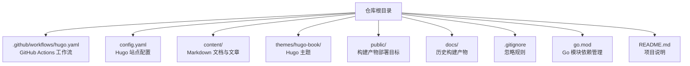
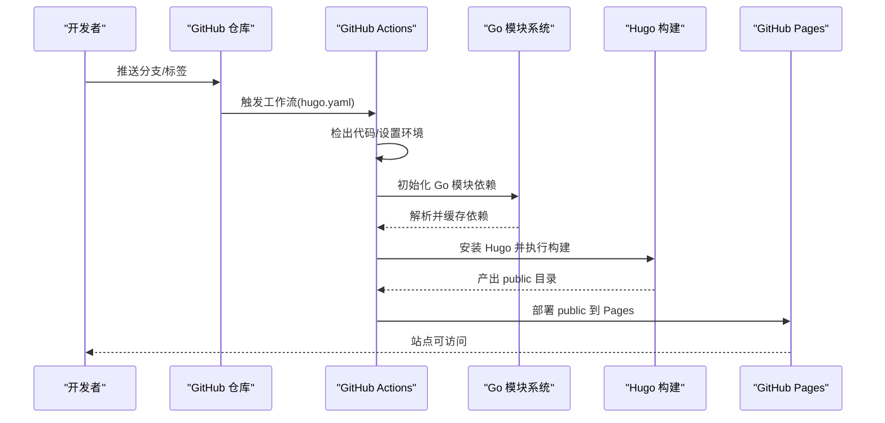
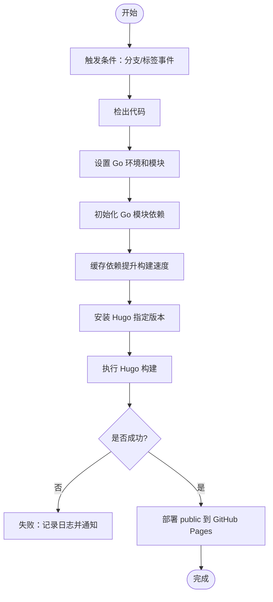
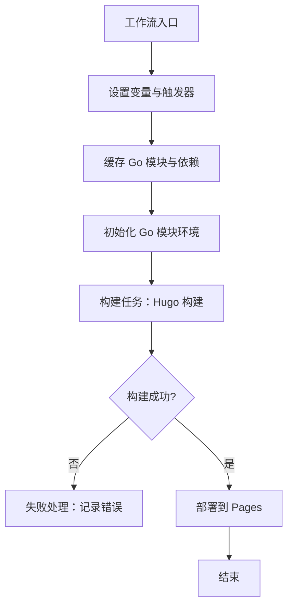
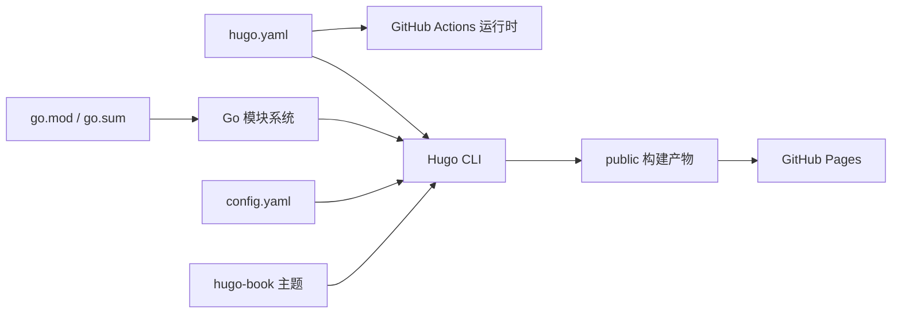

# 部署与维护

<cite>
**本文引用的文件**   
- [hugo.yaml](file://.github/workflows/hugo.yaml)
- [config.yaml](file://config.yaml)
- [.gitignore](file://.gitignore)
- [README.md](file://README.md)
- [go.mod](file://go.mod)
</cite>

## 更新摘要
**变更内容**   
- 新增 Go 模块依赖管理系统相关内容
- 更新构建系统改进说明，强调可重现性和依赖解析效率
- 增强开发环境一致性配置指导
- 完善 CI/CD 流水线中的依赖管理最佳实践

## 目录
1. [简介](#简介)
2. [项目结构](#项目结构)
3. [核心组件](#核心组件)
4. [架构总览](#架构总览)
5. [详细组件分析](#详细组件分析)
6. [依赖关系分析](#依赖关系分析)
7. [性能考虑](#性能考虑)
8. [故障排查指南](#故障排查指南)
9. [结论](#结论)
10. [附录](#附录)

## 简介
本指南面向生产环境的部署与日常维护，覆盖 GitHub Pages 的完整部署流程、CI/CD 流水线配置与优化、静态站点性能优化策略、备份与恢复机制、监控与告警、版本管理与发布流程，以及安全加固与故障诊断方法。项目基于 Hugo 构建静态站点，并通过 GitHub Actions 自动化构建与发布到 GitHub Pages。**最新更新**：引入新的 Go 模块依赖管理系统，显著增强了构建的可重现性和依赖解析效率，确保在不同开发环境中获得一致的构建体验。

## 项目结构
仓库采用典型的 Hugo 主题化结构：内容位于 content，主题通过子模块或本地 themes 引入，构建产物输出至 public（同时存在 docs 作为历史产物）。根目录包含站点配置、CI 工作流定义以及新的 Go 模块配置文件。

**图示来源**
- [hugo.yaml](file://.github/workflows/hugo.yaml)
- [config.yaml](file://config.yaml)
- [.gitignore](file://.gitignore)
- [go.mod](file://go.mod)

**章节来源**
- [README.md](file://README.md)

## 核心组件
- **构建与发布流水线**：由 GitHub Actions 工作流驱动，拉取代码、安装 Hugo、执行构建并部署到 GitHub Pages。
- **Go 模块依赖管理**：新的 go.mod 文件提供精确的版本控制和依赖锁定，确保构建可重现性。
- **站点配置**：Hugo 站点参数、主题、国际化、URL 模式等集中在配置文件。
- **内容与主题**：Markdown 内容配合 Hugo Book 主题生成页面、索引与搜索资源。
- **构建产物**：public 为最终部署目录；docs 为历史产物，建议从版本控制中排除以避免体积膨胀。

**章节来源**
- [hugo.yaml](file://.github/workflows/hugo.yaml)
- [config.yaml](file://config.yaml)
- [.gitignore](file://.gitignore)
- [go.mod](file://go.mod)

## 架构总览
下图展示了从代码提交到站点上线的整体流程，包括触发条件、缓存、构建与部署步骤，以及新增的 Go 模块依赖管理环节。

**图示来源**
- [hugo.yaml](file://.github/workflows/hugo.yaml)
- [go.mod](file://go.mod)

## 详细组件分析

### GitHub Pages 部署流程
- **触发方式**：推荐对 main/master 分支推送或创建标签时触发，确保稳定分支自动发布。
- **构建环境**：在 Actions 中安装指定版本的 Hugo，使用缓存加速依赖下载。
- **依赖管理**：集成 Go 模块系统，自动处理 Hugo 扩展和主题的依赖解析。
- **构建命令**：执行 Hugo 构建，将输出写入 public 目录。
- **部署目标**：将 public 目录发布到 GitHub Pages。

**图示来源**
- [hugo.yaml](file://.github/workflows/hugo.yaml)
- [go.mod](file://go.mod)

**章节来源**
- [hugo.yaml](file://.github/workflows/hugo.yaml)
- [go.mod](file://go.mod)

### CI/CD 流水线配置与优化
- **工作流定义**：在 .github/workflows/hugo.yaml 中定义触发器、环境变量、步骤与部署动作。
- **构建缓存**：缓存 Hugo 二进制与模块依赖，减少重复安装时间。
- **Go 模块缓存**：利用 GitHub Actions 的缓存功能存储 go.sum 和模块缓存，显著提升构建速度。
- **并行执行**：若后续扩展多语言或多主题构建，可在矩阵策略下并行运行多个作业。
- **失败处理**：在关键步骤添加错误捕获与日志输出，便于快速定位问题。

**图示来源**
- [hugo.yaml](file://.github/workflows/hugo.yaml)
- [go.mod](file://go.mod)

**章节来源**
- [hugo.yaml](file://.github/workflows/hugo.yaml)
- [go.mod](file://go.mod)

### Go 模块依赖管理系统
**新增** 项目现已采用 Go 模块系统进行依赖管理，带来以下优势：

- **版本锁定**：go.mod 文件精确定义所有依赖版本，确保构建可重现性。
- **依赖解析优化**：智能依赖解析算法提升构建效率，减少不必要的网络请求。
- **环境一致性**：不同开发者和 CI 环境获得完全相同的依赖版本。
- **安全更新**：支持安全漏洞扫描和依赖更新检查。

**最佳实践**：
- 定期更新 go.mod 中的依赖版本
- 使用 `go mod tidy` 清理未使用的依赖
- 在 PR 中验证依赖变更的影响
- 利用 GitHub Dependabot 自动检测安全更新

**章节来源**
- [go.mod](file://go.mod)

### 静态站点性能优化策略
- **资源压缩**：启用 Hugo 的资源管道压缩（CSS/JS），减少传输体积。
- **CDN 配置**：通过 GitHub Pages 的内置 CDN 提升全球访问速度；如需自定义域名，建议在 DNS 层接入 CDN。
- **缓存策略**：利用浏览器缓存与 ETag/Last-Modified 头，结合版本号化的文件名提高命中率。
- **图片优化**：使用现代格式（WebP/AVIF）、按需加载与懒加载，降低首屏负载。
- **搜索与脚本**：合并与最小化前端脚本，按需加载搜索功能，避免阻塞渲染。
- **依赖优化**：通过 Go 模块缓存减少构建时的网络开销。

**章节来源**
- [config.yaml](file://config.yaml)
- [go.mod](file://go.mod)

### 备份与恢复机制
- **内容备份**：定期导出 content 目录与主题配置，纳入版本控制与外部存储（如对象存储）。
- **配置备份**：保存 config.yaml、go.mod 与工作流文件，确保重建环境一致。
- **依赖快照**：备份 go.sum 文件以锁定依赖版本，确保灾难恢复后的构建一致性。
- **灾难恢复**：当 Pages 不可用或仓库损坏时，可从备份恢复内容、重新配置 Actions 并重建站点。
- **增量备份**：结合 Git 标签与构建产物快照，实现按版本回滚与快速恢复。

**章节来源**
- [config.yaml](file://config.yaml)
- [go.mod](file://go.mod)
- [hugo.yaml](file://.github/workflows/hugo.yaml)

### 监控与告警
- **访问统计**：集成第三方统计服务（如 Umami、Plausible），在模板注入统计脚本。
- **错误监控**：通过 404 页面与日志收集工具上报缺失资源与异常请求。
- **性能监控**：使用 Web Vitals 指标采集与上报，关注 LCP、FID、CLS 等关键指标。
- **可用性监控**：配置外部健康检查与告警通道（邮件/IM），在 Pages 异常时及时通知。
- **依赖监控**：监控 Go 模块依赖的安全状态和更新可用性。

**章节来源**
- [config.yaml](file://config.yaml)
- [go.mod](file://go.mod)

### 版本管理与发布流程
- **语义化版本**：遵循 SemVer，通过 Git 标签管理版本（vX.Y.Z）。
- **变更日志**：在发布前生成 CHANGELOG，记录新增、修复与破坏性变更。
- **依赖版本管理**：在发布前更新 go.mod 中的依赖版本，确保生产环境稳定性。
- **发布流程**：打标签触发构建与部署，确保生产环境与测试环境一致性。
- **回滚策略**：支持按标签回滚到历史版本，保证业务连续性。

**章节来源**
- [hugo.yaml](file://.github/workflows/hugo.yaml)
- [go.mod](file://go.mod)

### 安全加固措施
- **HTTPS 强制**：GitHub Pages 默认提供 HTTPS，建议启用强制跳转与 HSTS。
- **安全头**：设置 Content-Security-Policy、Referrer-Policy、X-Content-Type-Options 等响应头。
- **内容完整性**：对关键资源启用 SRI（Subresource Integrity），防止篡改。
- **依赖安全**：定期更新 Hugo 与主题版本，扫描已知漏洞；利用 Go 模块的安全检查功能。
- **访问控制**：限制仓库写权限，启用双因素认证与分支保护规则。
- **依赖审计**：使用 `go audit` 和第三方工具检查依赖包的安全性。

**章节来源**
- [config.yaml](file://config.yaml)
- [go.mod](file://go.mod)

## 依赖关系分析
- **工作流与构建**：hugo.yaml 依赖 GitHub Actions 运行时与 Hugo CLI。
- **Go 模块系统**：go.mod 定义项目依赖，go.sum 锁定具体版本。
- **站点与主题**：Hugo 读取 config.yaml 并加载主题（hugo-book）。
- **产物与部署**：构建产物 public 被 Actions 推送到 GitHub Pages。

**图示来源**
- [hugo.yaml](file://.github/workflows/hugo.yaml)
- [config.yaml](file://config.yaml)
- [go.mod](file://go.mod)

**章节来源**
- [hugo.yaml](file://.github/workflows/hugo.yaml)
- [config.yaml](file://config.yaml)
- [go.mod](file://go.mod)

## 性能考虑
- **构建阶段**：启用缓存与增量构建，减少冷启动时间；利用 Go 模块缓存提升依赖解析速度。
- **依赖管理**：通过 go.mod 和 go.sum 实现依赖锁定，避免重复下载和解析。
- **资源阶段**：压缩与合并 CSS/JS，启用 Brotli/Gzip 压缩。
- **网络阶段**：利用 CDN 与 HTTP/2，合理设置缓存头与版本号。
- **客户端阶段**：懒加载图片与脚本，预连接关键域名，减少主线程阻塞。

## 故障排查指南
- **构建失败**：检查工作流日志，确认 Hugo 版本与依赖是否匹配；验证配置文件语法。
- **依赖问题**：使用 `go mod tidy` 清理依赖，检查 go.mod 版本冲突；验证网络连接和代理设置。
- **部署失败**：检查 Pages 设置与分支策略；确认 public 目录是否存在且非空。
- **页面空白或样式丢失**：检查资源路径与 CDN 配置；清理浏览器缓存后重试。
- **搜索不可用**：确认搜索脚本已正确生成与加载；检查控制台错误。
- **性能退化**：使用浏览器开发者工具与 Web Vitals 报告定位瓶颈；对比历史版本差异。
- **环境不一致**：验证本地 Go 版本与 CI 环境一致；检查 go.mod 锁定文件是否正确提交。

**章节来源**
- [hugo.yaml](file://.github/workflows/hugo.yaml)
- [config.yaml](file://config.yaml)
- [go.mod](file://go.mod)

## 结论
通过标准化的 GitHub Actions 流水线、完善的站点配置以及新的 Go 模块依赖管理系统，本项目实现了高效的自动化构建与发布。**新增的 Go 模块系统**显著提升了构建的可重现性和依赖解析效率，确保在不同环境中获得一致的构建体验。在生产环境中，应持续优化性能、强化安全、完善监控与备份，建立稳定的版本管理与发布流程，以保障站点的可用性与用户体验。

## 附录
- **常用命令参考**：本地构建、预览、清理产物、依赖管理等。
- **最佳实践清单**：分支策略、PR 审查、标签规范、回滚演练、依赖更新流程。
- **Go 模块管理**：依赖版本控制、安全更新、性能优化的最佳实践。
- **参考链接**：Hugo 官方文档、GitHub Pages 文档、Hugo Book 主题文档、Go 模块官方指南。