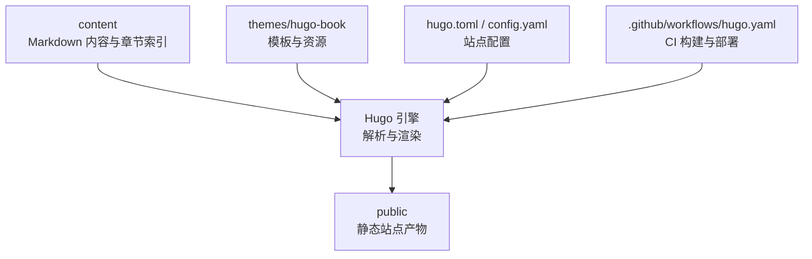
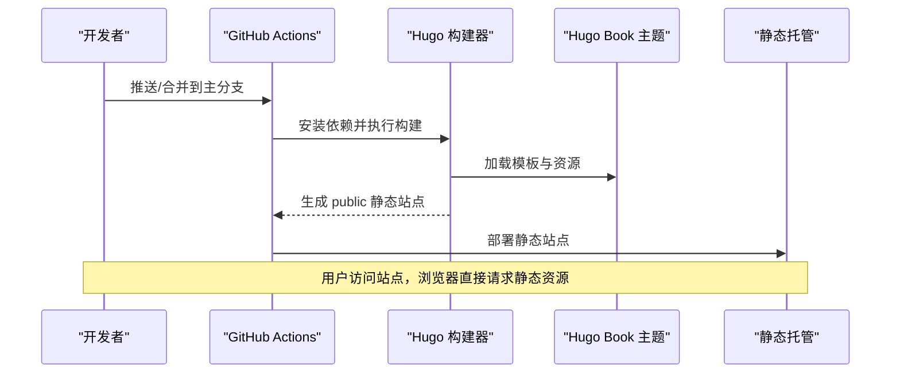
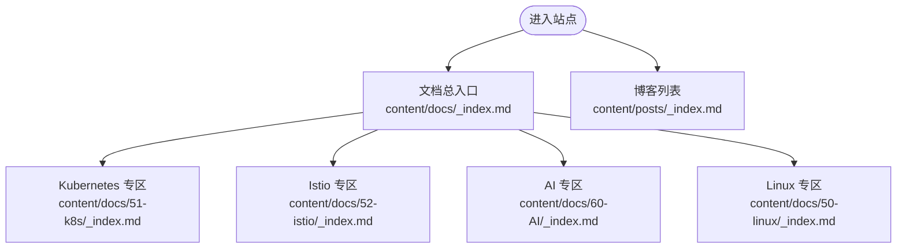
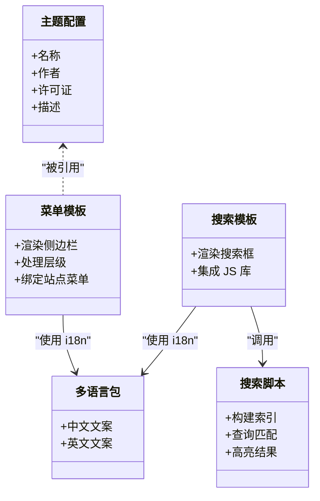
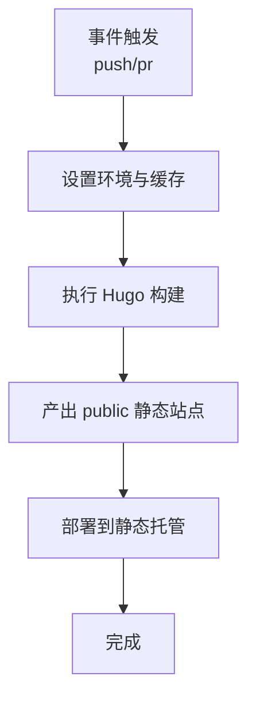
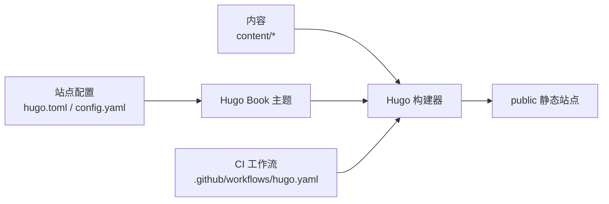

# 项目概述

<cite>
**本文引用的文件**   
- [README.md](file://README.md)
- [hugo.toml](file://hugo.toml)
- [config.yaml](file://config.yaml)
- [.github/workflows/hugo.yaml](file://.github/workflows/hugo.yaml)
- [content/_index.md](file://content/_index.md)
- [content/docs/_index.md](file://content/docs/_index.md)
- [content/posts/_index.md](file://content/posts/_index.md)
- [themes/hugo-book/theme.toml](file://themes/hugo-book/theme.toml)
- [themes/hugo-book/layouts/partials/docs/menu.html](file://themes/hugo-book/layouts/partials/docs/menu.html)
- [themes/hugo-book/layouts/partials/docs/search.html](file://themes/hugo-book/layouts/partials/docs/search.html)
- [themes/hugo-book/assets/search.js](file://themes/hugo-book/assets/search.js)
- [themes/hugo-book/i18n/zh.yaml](file://themes/hugo-book/i18n/zh.yaml)
- [themes/hugo-book/i18n/en.yaml](file://themes/hugo-book/i18n/en.yaml)
</cite>

## 目录
1. [简介](#简介)
2. [项目结构](#项目结构)
3. [核心组件](#核心组件)
4. [架构总览](#架构总览)
5. [详细组件分析](#详细组件分析)
6. [依赖关系分析](#依赖关系分析)
7. [性能与构建优化](#性能与构建优化)
8. [故障排查指南](#故障排查指南)
9. [结论](#结论)
10. [附录：快速开始](#附录快速开始)

## 简介
本项目是一个基于 Hugo 的静态站点，定位为云计算、容器技术、人工智能与编程技术的知识分享平台。内容覆盖 Kubernetes 认证学习路径、Linux 内核与 eBPF、Istio 服务网格、AI/LLM 实践等方向，采用模块化内容组织与主题分离架构，提供全文搜索、国际化支持、响应式设计与 PWA 能力，适合个人博客与技术知识库场景。

## 项目结构
仓库采用“源码即内容”的静态站点模式：
- content：Markdown 文档与文章，按领域分目录（如 docs、posts），并包含各专题的 _index.md 作为章节入口。
- themes/hugo-book：Hugo Book 主题，提供菜单、搜索、多语言、短代码、PWA 等能力。
- .github/workflows/hugo.yaml：CI 流水线，负责在推送或发布时执行构建与部署。
- hugo.toml / config.yaml：Hugo 站点配置（站点元信息、主题、输出格式、i18n、菜单等）。
- public：构建产物目录（由 Hugo 生成，通常不纳入版本控制）。

图表来源
- [hugo.toml](file://hugo.toml)
- [config.yaml](file://config.yaml)
- [.github/workflows/hugo.yaml](file://.github/workflows/hugo.yaml)
- [content/_index.md](file://content/_index.md)
- [content/docs/_index.md](file://content/docs/_index.md)
- [content/posts/_index.md](file://content/posts/_index.md)
- [themes/hugo-book/theme.toml](file://themes/hugo-book/theme.toml)

章节来源
- [README.md](file://README.md)
- [hugo.toml](file://hugo.toml)
- [config.yaml](file://config.yaml)
- [.github/workflows/hugo.yaml](file://.github/workflows/hugo.yaml)
- [content/_index.md](file://content/_index.md)
- [content/docs/_index.md](file://content/docs/_index.md)
- [content/posts/_index.md](file://content/posts/_index.md)
- [themes/hugo-book/theme.toml](file://themes/hugo-book/theme.toml)

## 核心组件
- 内容层
  - content/docs：技术文档与教程，按领域划分（如 Linux、Kubernetes、Istio、AI、CNCF、编程、工具等），每个子目录含 _index.md 作为导航入口。
  - content/posts：博客文章集合，_index.md 为文章列表页。
- 主题层
  - themes/hugo-book：提供侧边栏菜单、面包屑、目录、搜索、多语言切换、短代码（Mermaid/KaTeX/Tab 等）、PWA 注册脚本等。
- 配置层
  - hugo.toml / config.yaml：定义站点标题、描述、主题、默认语言、输出格式、菜单项、SEO 与社交信息等。
- 自动化层
  - .github/workflows/hugo.yaml：触发条件、Hugo 版本、缓存策略、构建命令与部署目标。

章节来源
- [content/docs/_index.md](file://content/docs/_index.md)
- [content/posts/_index.md](file://content/posts/_index.md)
- [themes/hugo-book/theme.toml](file://themes/hugo-book/theme.toml)
- [hugo.toml](file://hugo.toml)
- [config.yaml](file://config.yaml)
- [.github/workflows/hugo.yaml](file://.github/workflows/hugo.yaml)

## 架构总览
整体采用“内容 + 主题 + 配置 + CI”的分层设计：
- 内容以 Markdown 为主，通过 Hugo 编译为静态 HTML/CSS/JS。
- 主题负责页面布局、交互与样式，支持多语言与搜索。
- 配置集中管理站点行为与外观。
- CI 保证每次变更可重复构建与稳定发布。

图表来源
- [.github/workflows/hugo.yaml](file://.github/workflows/hugo.yaml)
- [hugo.toml](file://hugo.toml)
- [themes/hugo-book/theme.toml](file://themes/hugo-book/theme.toml)

## 详细组件分析

### 内容组织与导航
- 章节入口：content/docs/_index.md 作为文档总入口；各子目录（如 50-linux、51-k8s、52-istio、60-AI 等）均提供 _index.md 作为二级入口。
- 文章入口：content/posts/_index.md 作为博客列表页。
- 主题菜单：通过主题的菜单模板渲染，结合站点配置的菜单项，形成左侧导航树。

图表来源
- [content/docs/_index.md](file://content/docs/_index.md)
- [content/posts/_index.md](file://content/posts/_index.md)

章节来源
- [content/docs/_index.md](file://content/docs/_index.md)
- [content/posts/_index.md](file://content/posts/_index.md)
- [themes/hugo-book/layouts/partials/docs/menu.html](file://themes/hugo-book/layouts/partials/docs/menu.html)

### 主题与界面
- 主题标识与元数据：themes/hugo-book/theme.toml 声明主题名称、作者、许可证等。
- 菜单与布局：layouts/partials/docs/menu.html 负责渲染侧边栏菜单与层级结构。
- 搜索功能：layouts/partials/docs/search.html 与 assets/search.js 配合实现前端搜索（支持中文分词与 Fuse/FlexSearch 方案）。
- 多语言：i18n/zh.yaml、i18n/en.yaml 提供界面文案翻译，站点可通过配置切换默认语言。

图表来源
- [themes/hugo-book/theme.toml](file://themes/hugo-book/theme.toml)
- [themes/hugo-book/layouts/partials/docs/menu.html](file://themes/hugo-book/layouts/partials/docs/menu.html)
- [themes/hugo-book/layouts/partials/docs/search.html](file://themes/hugo-book/layouts/partials/docs/search.html)
- [themes/hugo-book/assets/search.js](file://themes/hugo-book/assets/search.js)
- [themes/hugo-book/i18n/zh.yaml](file://themes/hugo-book/i18n/zh.yaml)
- [themes/hugo-book/i18n/en.yaml](file://themes/hugo-book/i18n/en.yaml)

章节来源
- [themes/hugo-book/theme.toml](file://themes/hugo-book/theme.toml)
- [themes/hugo-book/layouts/partials/docs/menu.html](file://themes/hugo-book/layouts/partials/docs/menu.html)
- [themes/hugo-book/layouts/partials/docs/search.html](file://themes/hugo-book/layouts/partials/docs/search.html)
- [themes/hugo-book/assets/search.js](file://themes/hugo-book/assets/search.js)
- [themes/hugo-book/i18n/zh.yaml](file://themes/hugo-book/i18n/zh.yaml)
- [themes/hugo-book/i18n/en.yaml](file://themes/hugo-book/i18n/en.yaml)

### 构建与部署（CI）
- 触发条件：根据工作流定义，在 push 或 pull_request 事件触发构建。
- 环境准备：设置 Node/Hugo 版本，缓存依赖以提升构建速度。
- 构建步骤：执行 hugo 命令生成 public 目录。
- 部署步骤：将 public 内容上传至静态托管平台（例如 GitHub Pages 或其他对象存储）。

图表来源
- [.github/workflows/hugo.yaml](file://.github/workflows/hugo.yaml)

章节来源
- [.github/workflows/hugo.yaml](file://.github/workflows/hugo.yaml)

## 依赖关系分析
- Hugo 与主题：站点通过 hugo.toml/config.yaml 指定主题为 hugo-book，所有页面渲染依赖该主题的模板与资源。
- 搜索与多语言：主题内 search.js 与 i18n 文案共同支撑前端搜索与界面本地化。
- CI 与构建：工作流文件驱动构建流程，确保每次提交均可复现相同产物。

图表来源
- [hugo.toml](file://hugo.toml)
- [config.yaml](file://config.yaml)
- [.github/workflows/hugo.yaml](file://.github/workflows/hugo.yaml)

章节来源
- [hugo.toml](file://hugo.toml)
- [config.yaml](file://config.yaml)
- [.github/workflows/hugo.yaml](file://.github/workflows/hugo.yaml)

## 性能与构建优化
- 增量构建：利用 Hugo 的增量构建特性，减少不必要的重编译时间。
- 资源压缩：主题已内置 CSS/JS 压缩与按需加载，建议保持默认配置以获得最佳效果。
- 搜索索引：前端搜索会在首次加载时构建索引，建议在内容规模较大时启用分页或限制索引范围。
- 缓存策略：CI 中启用依赖缓存，避免重复下载与安装耗时。

[本节为通用指导，无需特定文件来源]

## 故障排查指南
- 构建失败
  - 检查 Hugo 版本与工作流中指定的版本是否一致。
  - 确认主题路径与 theme.toml 声明一致。
  - 查看 CI 日志中的错误堆栈，定位具体报错位置。
- 搜索不可用
  - 确认 search.js 与搜索模板正确引入。
  - 检查浏览器控制台是否有资源加载错误或跨域问题。
- 多语言未生效
  - 确认 i18n 文件存在且键名与模板中使用的一致。
  - 检查站点配置中的默认语言与语言列表。

章节来源
- [.github/workflows/hugo.yaml](file://.github/workflows/hugo.yaml)
- [themes/hugo-book/theme.toml](file://themes/hugo-book/theme.toml)
- [themes/hugo-book/layouts/partials/docs/search.html](file://themes/hugo-book/layouts/partials/docs/search.html)
- [themes/hugo-book/assets/search.js](file://themes/hugo-book/assets/search.js)
- [themes/hugo-book/i18n/zh.yaml](file://themes/hugo-book/i18n/zh.yaml)
- [themes/hugo-book/i18n/en.yaml](file://themes/hugo-book/i18n/en.yaml)

## 结论
本项目以 Hugo 为核心，结合 Hugo Book 主题，构建了面向云计算与 AI 领域的结构化知识库与博客平台。其优势在于：
- 内容即源码，便于协作与版本管理。
- 主题与内容解耦，易于定制与扩展。
- 具备搜索、多语言、PWA 等现代 Web 能力。
- CI 驱动的构建与部署保障一致性。

[本节为总结性内容，无需特定文件来源]

## 附录：快速开始
- 前置要求
  - 安装 Hugo（建议使用扩展版）。
  - 安装 Git。
- 克隆与初始化
  - 克隆仓库到本地。
  - 若使用子模块，先执行子模块初始化。
- 本地预览
  - 运行 hugo server 启动本地开发服务器。
  - 打开浏览器访问 http://localhost:1313 预览站点。
- 添加内容
  - 在 content/docs 或 content/posts 下新增 Markdown 文件。
  - 如需新增章节，创建对应目录并在目录下添加 _index.md。
- 构建与部署
  - 运行 hugo 生成 public 目录。
  - 将 public 部署至静态托管平台（如 GitHub Pages、Vercel、Netlify 等）。
- 自定义主题
  - 在 layouts 目录覆写主题模板，或在 assets 中添加自定义样式。
- 启用搜索与多语言
  - 确认主题搜索模板与脚本已引入。
  - 在 i18n 目录添加语言文件，并在站点配置中启用相应语言。

[本节为概念性指引，无需特定文件来源]