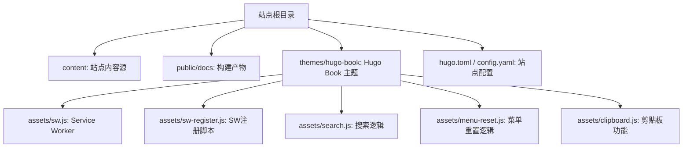
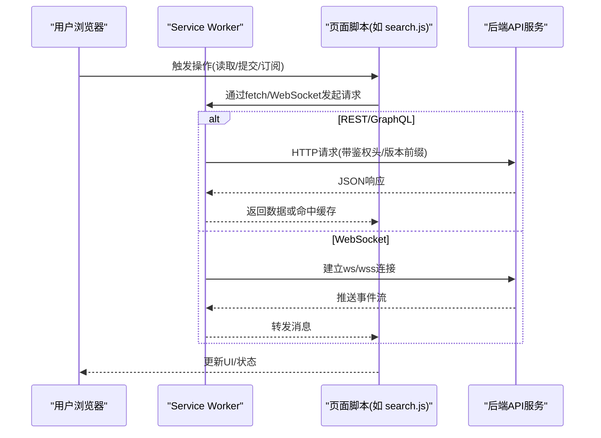
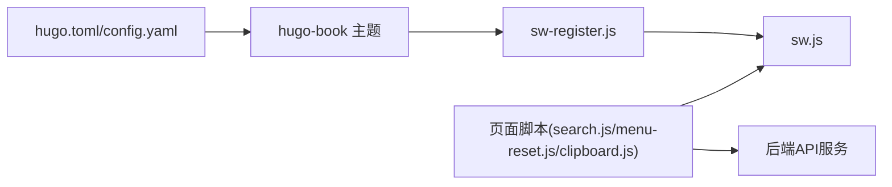

# API集成

<cite>
**本文引用的文件**   
- [hugo.toml](file://hugo.toml)
- [config.yaml](file://config.yaml)
- [README.md](file://README.md)
- [sw.js](file://themes/hugo-book/assets/sw.js)
- [sw-register.js](file://themes/hugo-book/assets/sw-register.js)
- [search.js](file://themes/hugo-book/assets/search.js)
- [menu-reset.js](file://themes/hugo-book/assets/menu-reset.js)
- [clipboard.js](file://themes/hugo-book/assets/clipboard.js)
</cite>

## 目录
1. [简介](#简介)
2. [项目结构](#项目结构)
3. [核心组件](#核心组件)
4. [架构总览](#架构总览)
5. [详细组件分析](#详细组件分析)
6. [依赖分析](#依赖分析)
7. [性能考虑](#性能考虑)
8. [故障排查指南](#故障排查指南)
9. [结论](#结论)
10. [附录](#附录)

## 简介
本技术文档面向静态网站与后端API的集成实践，围绕RESTful API调用、GraphQL查询、WebSocket实时通信等场景，给出前端JavaScript侧的实现要点：请求拦截器、错误处理、重试机制；数据获取与状态管理最佳实践（缓存策略、数据同步、离线支持）；安全与认证授权（JWT令牌管理、CORS配置、HTTPS强制）；以及API版本管理与向后兼容方案。

本项目为基于Hugo的静态站点，主题采用hugo-book。站点本身不包含业务前端应用代码，但包含Service Worker与搜索脚本等资源，可用于离线能力与本地交互增强。本文将结合仓库中现有资源，提供可落地的集成建议与参考路径。

## 项目结构
仓库主体由内容源（content）、构建产物（public/docs）、主题（themes/hugo-book）及站点配置组成。与API集成相关的前端资源主要位于主题assets目录下的JavaScript与Service Worker文件。

图表来源
- [hugo.toml](file://hugo.toml)
- [config.yaml](file://config.yaml)
- [sw.js](file://themes/hugo-book/assets/sw.js)
- [sw-register.js](file://themes/hugo-book/assets/sw-register.js)
- [search.js](file://themes/hugo-book/assets/search.js)
- [menu-reset.js](file://themes/hugo-book/assets/menu-reset.js)
- [clipboard.js](file://themes/hugo-book/assets/clipboard.js)

章节来源
- [README.md](file://README.md)
- [hugo.toml](file://hugo.toml)
- [config.yaml](file://config.yaml)

## 核心组件
- 站点配置
  - hugo.toml与config.yaml用于站点元信息、主题与插件配置。这些配置通常不涉及运行时API调用，但可作为环境变量或构建期常量注入到前端资源中，以统一API基础地址、版本前缀等。
- Service Worker与注册脚本
  - sw.js与sw-register.js提供离线缓存与网络代理能力，适合在静态站点中实现离线访问、请求拦截与缓存策略。
- 前端脚本
  - search.js、menu-reset.js、clipboard.js展示了如何在浏览器环境中发起网络请求、处理响应与错误，可作为封装HTTP客户端与错误处理的参考。

章节来源
- [hugo.toml](file://hugo.toml)
- [config.yaml](file://config.yaml)
- [sw.js](file://themes/hugo-book/assets/sw.js)
- [sw-register.js](file://themes/hugo-book/assets/sw-register.js)
- [search.js](file://themes/hugo-book/assets/search.js)
- [menu-reset.js](file://themes/hugo-book/assets/menu-reset.js)
- [clipboard.js](file://themes/hugo-book/assets/clipboard.js)

## 架构总览
下图展示静态站点与后端API的典型交互流程，包括REST/GraphQL/WebSocket三种通道，并体现Service Worker在网络层的作用。

图表来源
- [sw.js](file://themes/hugo-book/assets/sw.js)
- [sw-register.js](file://themes/hugo-book/assets/sw-register.js)
- [search.js](file://themes/hugo-book/assets/search.js)

## 详细组件分析

### 请求拦截器与统一客户端
- 目标
  - 集中处理请求头（如Authorization、Content-Type、X-API-Version）、URL前缀、超时与取消、日志与埋点。
- 建议实现位置
  - 页面脚本（例如在新增的api-client.js中），或在Service Worker中统一拦截fetch请求。
- 关键要点
  - 从配置中读取API基础地址与版本前缀，避免硬编码。
  - 自动附加JWT令牌（若存在），并在401时触发刷新或跳转登录。
  - 对GET请求启用缓存键（含版本号与参数哈希）。
  - 记录请求/响应时间、状态码与错误类型，便于监控。

章节来源
- [search.js](file://themes/hugo-book/assets/search.js)
- [sw.js](file://themes/hugo-book/assets/sw.js)

### 错误处理与重试机制
- 错误分类
  - 网络错误（超时、断网）、服务端错误（非2xx）、业务错误（响应体中的错误码）。
- 重试策略
  - 仅对幂等请求（GET/HEAD/OPTIONS）进行有限次重试，指数退避+抖动。
  - 针对特定状态码（如502/503/504）重试，其他错误直接失败。
- 降级与提示
  - 失败后回退到缓存数据或空状态，向用户展示友好提示。
- 参考实现位置
  - 可在页面脚本中封装重试函数，或在Service Worker中对fetch结果进行重试与缓存写入。

章节来源
- [search.js](file://themes/hugo-book/assets/search.js)
- [sw.js](file://themes/hugo-book/assets/sw.js)

### GraphQL查询封装
- 目标
  - 统一GraphQL端点、变量序列化、错误聚合与分页游标处理。
- 建议做法
  - 将GraphQL端点与查询片段集中管理，使用类型化注释或代码生成工具保证字段一致性。
  - 在请求头中携带鉴权信息与版本标识。
  - 对复杂查询进行去重与合并，减少重复请求。
- 参考实现位置
  - 页面脚本中封装统一的graphqlFetch方法，复用通用拦截器与错误处理。

章节来源
- [search.js](file://themes/hugo-book/assets/search.js)

### WebSocket实时通信
- 目标
  - 建立长连接，处理心跳、断线重连、消息路由与状态同步。
- 建议做法
  - 使用wss协议，确保传输加密。
  - 实现心跳检测与自动重连（指数退避），维护连接状态机。
  - 在Service Worker中管理连接生命周期，提升后台稳定性。
- 参考实现位置
  - 页面脚本中创建WebSocket实例，或在Service Worker中监听并转发消息。

章节来源
- [sw.js](file://themes/hugo-book/assets/sw.js)
- [sw-register.js](file://themes/hugo-book/assets/sw-register.js)

### 数据获取与状态管理
- 缓存策略
  - 强缓存：对静态资源设置合理Cache-Control。
  - 应用级缓存：按“接口+参数+版本”作为键，存储最近一次成功响应。
  - 失效策略：根据TTL或脏标记（如写操作后失效）控制缓存有效性。
- 数据同步
  - 写操作成功后主动失效相关缓存，必要时拉取最新数据。
  - 对列表类数据采用增量更新与分页游标。
- 离线支持
  - 利用Service Worker预缓存关键页面与资源，离线时返回缓存版本。
  - 队列化离线操作，网络恢复后批量提交。
- 参考实现位置
  - Service Worker负责缓存与离线策略；页面脚本负责状态更新与UI渲染。

章节来源
- [sw.js](file://themes/hugo-book/assets/sw.js)
- [sw-register.js](file://themes/hugo-book/assets/sw-register.js)

### 安全与认证授权
- JWT令牌管理
  - 优先使用HttpOnly Cookie承载令牌，避免XSS窃取；如需JS访问，注意最小权限与短过期时间。
  - 在请求拦截器中自动附加令牌，401时触发刷新或重新登录。
- CORS配置
  - 在后端明确允许的Origin、方法与头部；前端仅在可信域名下运行。
- HTTPS强制
  - 全站启用HTTPS，配合HSTS与安全头部（如Content-Security-Policy）。
- 参考实现位置
  - 页面脚本中统一添加鉴权头；Service Worker中可校验与转发安全头。

章节来源
- [search.js](file://themes/hugo-book/assets/search.js)
- [sw.js](file://themes/hugo-book/assets/sw.js)

### API版本管理与向后兼容
- 版本策略
  - URL前缀（/v1/...）或请求头（X-API-Version）声明版本。
  - 保持向后兼容：新增字段不破坏旧客户端；删除字段需灰度与弃用周期。
- 兼容性处理
  - 客户端对未知字段忽略，对缺失字段提供默认值。
  - 服务端返回版本信息，客户端据此选择分支逻辑。
- 参考实现位置
  - 在统一客户端中注入版本前缀与版本协商逻辑。

章节来源
- [hugo.toml](file://hugo.toml)
- [config.yaml](file://config.yaml)

## 依赖分析
- 前端脚本之间的耦合
  - search.js、menu-reset.js、clipboard.js彼此独立，分别承担搜索、菜单与剪贴板功能，便于按需加载与替换。
- Service Worker与页面脚本
  - sw-register.js负责注册sw.js；sw.js拦截网络请求并提供缓存与离线能力。
- 配置与资源
  - hugo.toml与config.yaml决定站点构建与主题行为，可注入API基础地址与版本前缀等常量。

图表来源
- [hugo.toml](file://hugo.toml)
- [config.yaml](file://config.yaml)
- [sw-register.js](file://themes/hugo-book/assets/sw-register.js)
- [sw.js](file://themes/hugo-book/assets/sw.js)
- [search.js](file://themes/hugo-book/assets/search.js)
- [menu-reset.js](file://themes/hugo-book/assets/menu-reset.js)
- [clipboard.js](file://themes/hugo-book/assets/clipboard.js)

章节来源
- [hugo.toml](file://hugo.toml)
- [config.yaml](file://config.yaml)
- [sw-register.js](file://themes/hugo-book/assets/sw-register.js)
- [sw.js](file://themes/hugo-book/assets/sw.js)
- [search.js](file://themes/hugo-book/assets/search.js)
- [menu-reset.js](file://themes/hugo-book/assets/menu-reset.js)
- [clipboard.js](file://themes/hugo-book/assets/clipboard.js)

## 性能考虑
- 请求优化
  - 合并请求、去重与防抖；对高频只读数据启用缓存。
  - 使用压缩与分块传输，减少首屏负载。
- 缓存与离线
  - 合理设置Cache-Control与Etag；Service Worker缓存关键资源与常用接口响应。
- 连接复用
  - 复用HTTP/2连接与WebSocket连接，降低握手开销。
- 监控与度量
  - 采集关键指标（请求耗时、失败率、缓存命中率），持续优化。

[本节为通用指导，无需引用具体文件]

## 故障排查指南
- 常见问题定位
  - 检查CORS是否允许当前Origin与方法。
  - 确认HTTPS与证书链是否正确，HSTS是否生效。
  - 验证JWT令牌是否过期或签名无效，刷新流程是否被正确触发。
  - 检查Service Worker是否成功注册与激活，缓存策略是否符合预期。
- 调试建议
  - 在浏览器开发者工具中查看Network与Application面板。
  - 在Service Worker中打印拦截日志，确认请求/响应路径。
  - 对重试与退避策略增加日志，观察失败次数与间隔。
- 参考实现位置
  - 页面脚本与Service Worker中的错误处理与日志输出。

章节来源
- [search.js](file://themes/hugo-book/assets/search.js)
- [sw.js](file://themes/hugo-book/assets/sw.js)

## 结论
对于静态站点的API集成，建议在页面脚本中统一封装HTTP客户端与错误处理，在Service Worker中实现缓存与离线能力，并通过配置集中管理API基础地址与版本前缀。同时，遵循安全最佳实践（HTTPS、CORS、JWT管理）与版本兼容策略，可有效提升系统的稳定性、可维护性与用户体验。

[本节为总结性内容，无需引用具体文件]

## 附录
- 术语
  - RESTful API：基于HTTP方法的资源导向接口风格。
  - GraphQL：一种查询语言，允许客户端精确请求所需数据。
  - WebSocket：全双工通信协议，适用于实时数据推送。
  - Service Worker：浏览器后台脚本，提供缓存、离线与网络拦截能力。
- 参考路径
  - 统一客户端与错误处理：参见页面脚本示例路径。
  - 缓存与离线：参见Service Worker与注册脚本路径。
  - 站点配置：参见hugo.toml与config.yaml路径。

[本节为概念性说明，无需引用具体文件]