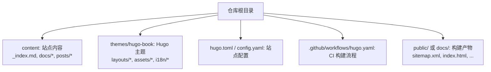
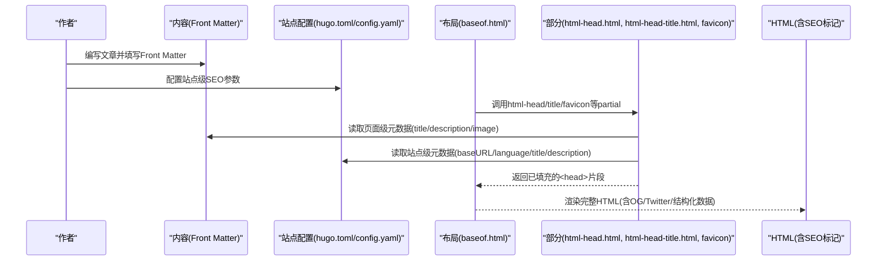
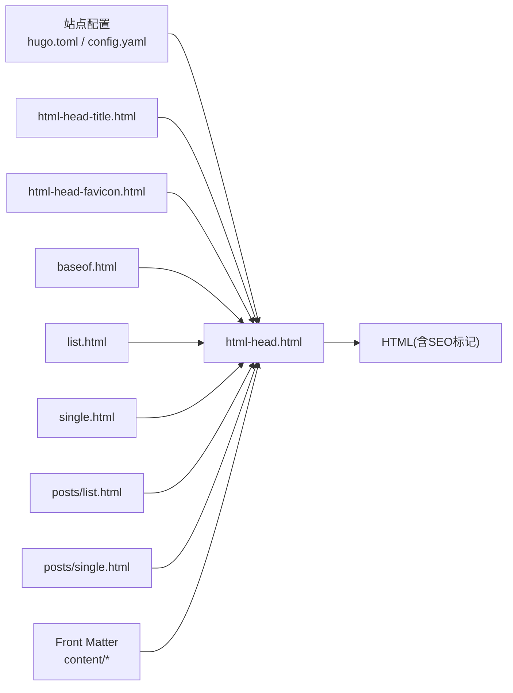

# SEO优化

<cite>
**本文引用的文件**   
- [hugo.toml](file://hugo.toml)
- [config.yaml](file://config.yaml)
- [layouts/partials/docs/html-head.html](file://themes/hugo-book/layouts/partials/docs/html-head.html)
- [layouts/partials/docs/html-head-title.html](file://themes/hugo-book/layouts/partials/docs/html-head-title.html)
- [layouts/partials/docs/html-head-favicon.html](file://themes/hugo-book/layouts/partials/docs/html-head-favicon.html)
- [layouts/_default/baseof.html](file://themes/hugo-book/layouts/_default/baseof.html)
- [layouts/_default/list.html](file://themes/hugo-book/layouts/_default/list.html)
- [layouts/_default/single.html](file://themes/hugo-book/layouts/_default/single.html)
- [layouts/posts/list.html](file://themes/hugo-book/layouts/posts/list.html)
- [layouts/posts/single.html](file://themes/hugo-book/layouts/posts/single.html)
- [content/_index.md](file://content/_index.md)
- [content/docs/_index.md](file://content/docs/_index.md)
- [content/posts/_index.md](file://content/posts/_index.md)
- [archetypes/default.md](file://archetypes/default.md)
- [.github/workflows/hugo.yaml](file://.github/workflows/hugo.yaml)
</cite>

## 目录
1. [简介](#简介)
2. [项目结构](#项目结构)
3. [核心组件](#核心组件)
4. [架构总览](#架构总览)
5. [详细组件分析](#详细组件分析)
6. [依赖分析](#依赖分析)
7. [性能考量](#性能考量)
8. [故障排查指南](#故障排查指南)
9. [结论](#结论)
10. [附录](#附录)

## 简介
本技术文档面向使用 Hugo + hugo-book 主题的静态站点，聚焦搜索引擎优化（SEO）与社交媒体分享优化。内容覆盖：
- 元数据配置：标题、描述、关键词、语言、站点标识等
- 结构化数据标记：JSON-LD 的注入位置与最佳实践
- Open Graph 与 Twitter Cards 支持策略
- Hugo 模板中的 SEO 实现路径：标题标签、描述生成、关键词设置
- 站点地图与 robots.txt 的生成与配置
- 社交媒体分享预览优化（Twitter Cards、Facebook 分享）
- 性能指标对 SEO 的影响与优化建议

## 项目结构
本项目采用 Hugo 标准目录组织方式，主题位于 themes/hugo-book，内容与资源在 content/ 与 assets/ 下，构建产物输出到 public/ 或 docs/（取决于部署脚本）。GitHub Actions 工作流负责构建与发布。

图表来源
- [hugo.toml](file://hugo.toml)
- [config.yaml](file://config.yaml)
- [.github/workflows/hugo.yaml](file://.github/workflows/hugo.yaml)

章节来源
- [hugo.toml](file://hugo.toml)
- [config.yaml](file://config.yaml)
- [.github/workflows/hugo.yaml](file://.github/workflows/hugo.yaml)

## 核心组件
- 站点配置层：hugo.toml 与 config.yaml 提供站点级 SEO 参数（如 baseURL、languageCode、title、description、params 等），用于驱动模板渲染。
- 模板层：hugo-book 主题通过 partials 与 _default 布局组合，统一注入 <head> 元信息、标题、图标、Open Graph/Twitter 卡片等。
- 内容层：Markdown Front Matter 字段（如 title、description、keywords、image、date、lang 等）为页面级 SEO 提供数据源。
- 构建与发布：CI 工作流触发构建，生成 sitemap.xml 与静态资源，便于搜索引擎抓取。

章节来源
- [hugo.toml](file://hugo.toml)
- [config.yaml](file://config.yaml)
- [layouts/_default/baseof.html](file://themes/hugo-book/layouts/_default/baseof.html)
- [layouts/partials/docs/html-head.html](file://themes/hugo-book/layouts/partials/docs/html-head.html)
- [layouts/partials/docs/html-head-title.html](file://themes/hugo-book/layouts/partials/docs/html-head-title.html)
- [layouts/partials/docs/html-head-favicon.html](file://themes/hugo-book/layouts/partials/docs/html-head-favicon.html)
- [content/_index.md](file://content/_index.md)
- [content/docs/_index.md](file://content/docs/_index.md)
- [content/posts/_index.md](file://content/posts/_index.md)
- [archetypes/default.md](file://archetypes/default.md)

## 架构总览
下图展示从内容到最终 HTML 的 SEO 相关数据流：Front Matter 与站点配置被模板读取，partials 注入 <head> 元信息，最终产出包含 SEO 标记的 HTML。

图表来源
- [layouts/_default/baseof.html](file://themes/hugo-book/layouts/_default/baseof.html)
- [layouts/partials/docs/html-head.html](file://themes/hugo-book/layouts/partials/docs/html-head.html)
- [layouts/partials/docs/html-head-title.html](file://themes/hugo-book/layouts/partials/docs/html-head-title.html)
- [layouts/partials/docs/html-head-favicon.html](file://themes/hugo-book/layouts/partials/docs/html-head-favicon.html)
- [hugo.toml](file://hugo.toml)
- [config.yaml](file://config.yaml)
- [content/_index.md](file://content/_index.md)

## 详细组件分析

### 元数据与标题标签优化
- 标题标签
  - 页面标题优先来自 Front Matter 的 title；若未设置，则回退至内容摘要或默认值。
  - 列表页（分类、标签、归档）通常以“站点标题 + 分类名”形式拼接，避免重复与过长。
  - 模板中通过 partials 统一处理标题拼接与长度限制，确保在不同设备上的显示效果。
- 描述标签
  - 页面描述优先取 Front Matter 的 description；若无，则从内容前若干字符自动截取。
  - 站点级 description 作为全局兜底，保证首页与无描述页面的可用性。
- 关键词设置
  - 可在 Front Matter 中设置 keywords；模板可选择性输出 meta name="keywords"。
  - 注意：多数搜索引擎不将 keywords 作为排名因素，但仍有助于内部检索与工具链。

章节来源
- [layouts/partials/docs/html-head-title.html](file://themes/hugo-book/layouts/partials/docs/html-head-title.html)
- [layouts/partials/docs/html-head.html](file://themes/hugo-book/layouts/partials/docs/html-head.html)
- [layouts/_default/list.html](file://themes/hugo-book/layouts/_default/list.html)
- [layouts/_default/single.html](file://themes/hugo-book/layouts/_default/single.html)
- [content/_index.md](file://content/_index.md)
- [content/docs/_index.md](file://content/docs/_index.md)
- [content/posts/_index.md](file://content/posts/_index.md)

### Open Graph 协议支持
- 关键属性
  - og:title、og:description、og:image、og:url、og:type、og:site_name、og:locale 等。
- 数据来源
  - 页面级：Front Matter 的 title、description、image、url。
  - 站点级：hugo.toml/config.yaml 中的 title、baseURL、languageCode、params.social 等。
- 模板注入点
  - 在 html-head.html 中集中注入 OG 标记，确保所有页面一致。
- 最佳实践
  - 图片尺寸建议至少 1200x630，避免裁剪失真。
  - URL 使用绝对地址，避免相对路径导致解析失败。
  - locale 与 languageCode 保持一致，利于本地化展示。

章节来源
- [layouts/partials/docs/html-head.html](file://themes/hugo-book/layouts/partials/docs/html-head.html)
- [hugo.toml](file://hugo.toml)
- [config.yaml](file://config.yaml)
- [content/_index.md](file://content/_index.md)

### Twitter Cards 支持
- 关键属性
  - twitter:card、twitter:title、twitter:description、twitter:image、twitter:site、twitter:creator。
- 数据来源
  - 复用 OG 数据，必要时在 Front Matter 中覆盖特定字段。
- 模板注入点
  - 在 html-head.html 中与 OG 标记并列注入，保持结构清晰。
- 验证方法
  - 使用 Twitter Card Validator 进行预览与调试。

章节来源
- [layouts/partials/docs/html-head.html](file://themes/hugo-book/layouts/partials/docs/html-head.html)
- [content/_index.md](file://content/_index.md)

### 结构化数据标记（JSON-LD）
- 常见类型
  - WebPage、Article、BreadcrumbList、Organization、WebSite。
- 注入位置
  - 建议在 html-head.html 中以 <script type="application/ld+json"> 注入，确保爬虫可解析。
- 数据来源
  - 页面级：title、description、datePublished、author、mainEntityOfPage 等。
  - 站点级：site URL、organization 名称、logo 等。
- 注意事项
  - 日期格式遵循 ISO 8601。
  - 图片引用使用绝对 URL。
  - 避免在 JSON-LD 中包含不可见或无关信息。

章节来源
- [layouts/partials/docs/html-head.html](file://themes/hugo-book/layouts/partials/docs/html-head.html)
- [layouts/_default/single.html](file://themes/hugo-book/layouts/_default/single.html)
- [layouts/_default/list.html](file://themes/hugo-book/layouts/_default/list.html)

### 站点地图与 robots.txt
- 站点地图
  - Hugo 内置 sitemap 生成器，默认输出 sitemap.xml。
  - 可通过配置启用/禁用、调整优先级与更改频率。
- robots.txt
  - 在 static/ 目录下放置 robots.txt，控制爬虫行为（如允许/禁止某些路径）。
- 验证
  - 使用 Google Search Console 的 Sitemaps 与 Robots 测试工具。

章节来源
- [hugo.toml](file://hugo.toml)
- [config.yaml](file://config.yaml)

### 社交媒体分享优化（Facebook 等）
- Facebook Sharing Debugger
  - 使用官方调试器检查 og:image、og:title、og:description 是否正确抓取。
- 缓存刷新
  - 修改图片后需刷新 Facebook 缓存，确保预览更新。
- 图片规范
  - 建议使用高质量、横图（1200x630），避免透明背景。

章节来源
- [layouts/partials/docs/html-head.html](file://themes/hugo-book/layouts/partials/docs/html-head.html)
- [content/_index.md](file://content/_index.md)

### Hugo 模板中的 SEO 实现路径
- baseof.html
  - 作为基础布局，引入必要的 CSS/JS 与 partials，确保 SEO 标记在 <head> 中正确加载。
- list.html / single.html
  - 列表页与单页分别处理不同的元数据逻辑（如面包屑、分页、文章详情）。
- posts 子布局
  - 针对博客文章的特殊 SEO 需求（如 author、publish date、tags）。
- partials
  - html-head.html：集中注入 OG/Twitter/JSON-LD。
  - html-head-title.html：统一标题拼接与截断。
  - html-head-favicon.html：favicon 与 Apple Touch Icon 等。

章节来源
- [layouts/_default/baseof.html](file://themes/hugo-book/layouts/_default/baseof.html)
- [layouts/_default/list.html](file://themes/hugo-book/layouts/_default/list.html)
- [layouts/_default/single.html](file://themes/hugo-book/layouts/_default/single.html)
- [layouts/posts/list.html](file://themes/hugo-book/layouts/posts/list.html)
- [layouts/posts/single.html](file://themes/hugo-book/layouts/posts/single.html)
- [layouts/partials/docs/html-head.html](file://themes/hugo-book/layouts/partials/docs/html-head.html)
- [layouts/partials/docs/html-head-title.html](file://themes/hugo-book/layouts/partials/docs/html-head-title.html)
- [layouts/partials/docs/html-head-favicon.html](file://themes/hugo-book/layouts/partials/docs/html-head-favicon.html)

### 内容层 Front Matter 与 SEO
- 推荐字段
  - title、description、keywords、image、date、lang、draft。
- 自动生成
  - archetypes/default.md 可作为新内容的默认模板，减少遗漏。
- 一致性
  - 全站统一 Front Matter 规范，便于模板稳定读取。

章节来源
- [content/_index.md](file://content/_index.md)
- [content/docs/_index.md](file://content/docs/_index.md)
- [content/posts/_index.md](file://content/posts/_index.md)
- [archetypes/default.md](file://archetypes/default.md)

### 构建与发布（CI）
- GitHub Actions
  - .github/workflows/hugo.yaml 定义构建步骤，安装 Hugo、执行 hugo 命令、输出 public/ 或 docs/。
- 产物校验
  - 确认 sitemap.xml 存在且可访问，robots.txt 未被屏蔽。

章节来源
- [.github/workflows/hugo.yaml](file://.github/workflows/hugo.yaml)

## 依赖分析
- 主题依赖
  - hugo-book 主题提供统一的 SEO 注入点与布局结构，降低自定义成本。
- 配置依赖
  - hugo.toml 与 config.yaml 共同决定站点级 SEO 参数，需保持一致性。
- 内容依赖
  - Markdown Front Matter 是页面级 SEO 的主要数据源，缺失会导致回退逻辑。

图表来源
- [hugo.toml](file://hugo.toml)
- [config.yaml](file://config.yaml)
- [layouts/_default/baseof.html](file://themes/hugo-book/layouts/_default/baseof.html)
- [layouts/_default/list.html](file://themes/hugo-book/layouts/_default/list.html)
- [layouts/_default/single.html](file://themes/hugo-book/layouts/_default/single.html)
- [layouts/posts/list.html](file://themes/hugo-book/layouts/posts/list.html)
- [layouts/posts/single.html](file://themes/hugo-book/layouts/posts/single.html)
- [layouts/partials/docs/html-head.html](file://themes/hugo-book/layouts/partials/docs/html-head.html)
- [layouts/partials/docs/html-head-title.html](file://themes/hugo-book/layouts/partials/docs/html-head-title.html)
- [layouts/partials/docs/html-head-favicon.html](file://themes/hugo-book/layouts/partials/docs/html-head-favicon.html)

章节来源
- [hugo.toml](file://hugo.toml)
- [config.yaml](file://config.yaml)
- [layouts/_default/baseof.html](file://themes/hugo-book/layouts/_default/baseof.html)
- [layouts/partials/docs/html-head.html](file://themes/hugo-book/layouts/partials/docs/html-head.html)

## 性能考量
- 首屏渲染时间
  - 减少不必要的 JS/CSS 加载，按需引入第三方库。
- 图片优化
  - 使用现代格式（WebP/AVIF）、合理压缩、指定宽高，提升 LCP。
- 缓存与 CDN
  - 开启浏览器缓存与 CDN 加速，缩短 TTFB。
- 移动端体验
  - 响应式设计与触摸友好交互，改善 Core Web Vitals。
- 监控与回归
  - 定期使用 PageSpeed Insights、Lighthouse 评估，建立回归基线。

[本节为通用指导，无需代码来源]

## 故障排查指南
- 标题或描述为空
  - 检查 Front Matter 是否缺失 title/description；确认模板回退逻辑是否生效。
- OG/Twitter 卡片不显示
  - 使用 Twitter Card Validator 与 Facebook Sharing Debugger 验证；确认图片 URL 可公开访问。
- 结构化数据报错
  - 使用 Google Rich Results Test 检测 JSON-LD 语法与必填字段。
- sitemap.xml 缺失
  - 确认构建流程是否成功生成；检查 robots.txt 是否屏蔽了 sitemap 路径。
- 多语言问题
  - 核对 languageCode 与 og:locale 一致；确保各语言版本独立 URL。

章节来源
- [layouts/partials/docs/html-head.html](file://themes/hugo-book/layouts/partials/docs/html-head.html)
- [layouts/partials/docs/html-head-title.html](file://themes/hugo-book/layouts/partials/docs/html-head-title.html)
- [layouts/_default/single.html](file://themes/hugo-book/layouts/_default/single.html)
- [layouts/_default/list.html](file://themes/hugo-book/layouts/_default/list.html)
- [hugo.toml](file://hugo.toml)
- [config.yaml](file://config.yaml)

## 结论
通过在站点配置、模板与内容三层协同完善 SEO 元数据、结构化数据与社交分享标记，并结合 CI 自动化构建与性能优化，可显著提升搜索引擎可见性与用户分享体验。建议持续监控与迭代，确保 SEO 策略与平台规范同步演进。

[本节为总结，无需代码来源]

## 附录
- 常用工具
  - Google Search Console、Rich Results Test、Twitter Card Validator、Facebook Sharing Debugger、PageSpeed Insights、Lighthouse。
- 参考清单
  - 标题长度建议：50–60 字符
  - 描述长度建议：150–160 字符
  - OG 图片尺寸：1200x630 像素
  - 结构化数据类型：WebPage、Article、BreadcrumbList、Organization、WebSite

[本节为补充信息，无需代码来源]